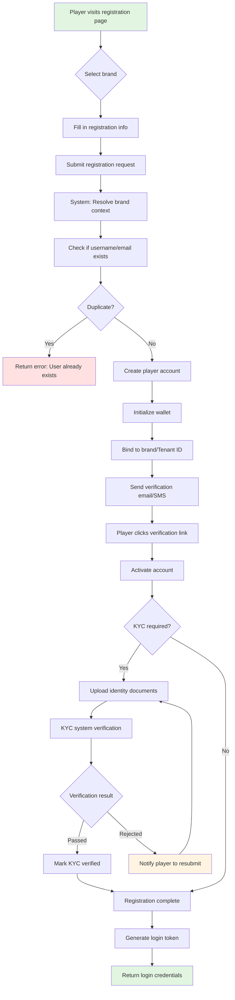
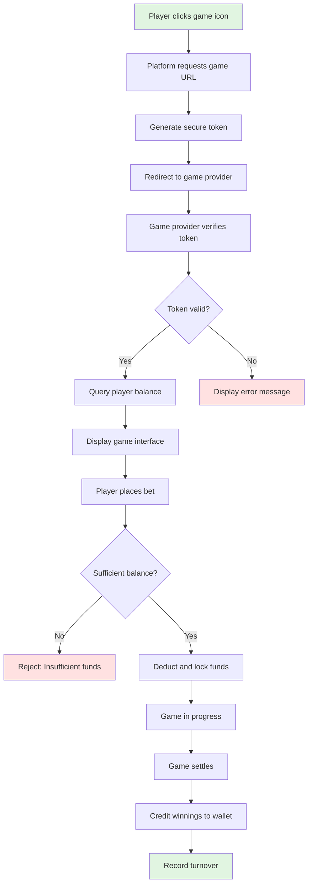
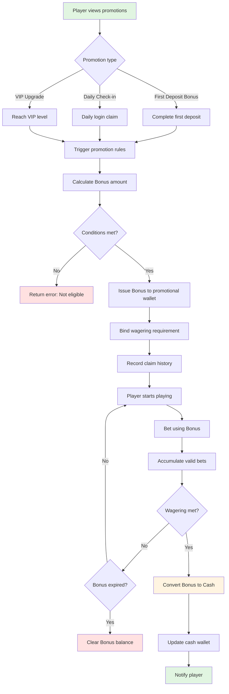
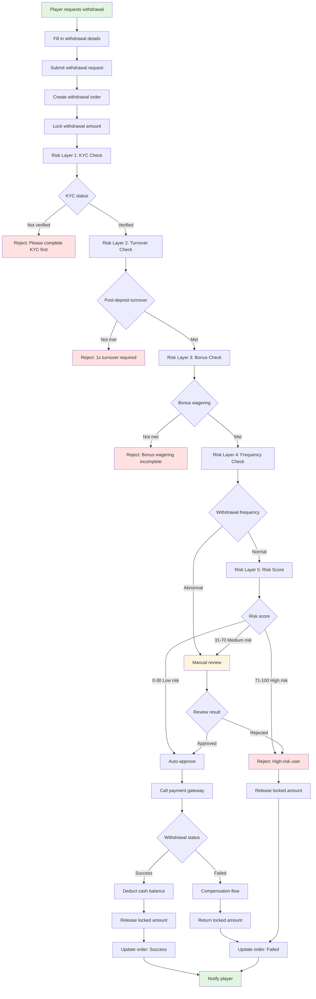
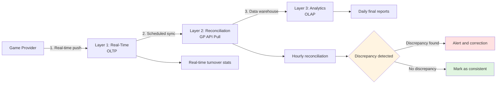
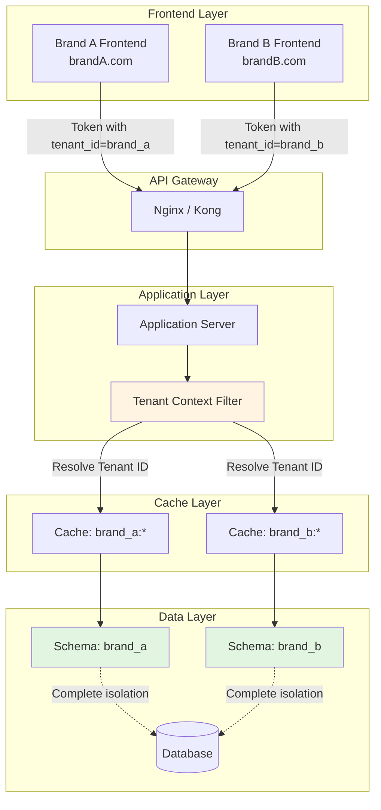

# iGaming Business Flows

> **Canonical Source**: [source/00_Foundation/00-02_Business_Flows.md](../../source-archive/00_Foundation/00-02_Business_Flows.md)
> **Audience**: Executives, Product Managers, Compliance Officers, QA Teams
> **Related Doc**: [Business_Logic_Flows.md](../../architecture/00_Overview/Business_Logic_Flows.md)
> **Last Synced**: 2026-02-08

---

## Document Purpose

This document provides **6 end-to-end business flows** that describe the complete iGaming platform operations from a business perspective. Each flow covers the user journey, business rules, compliance requirements, and exception handling -- without technical implementation details.

**How to Use**:
1. Select the business flow relevant to your role
2. Review the flow diagram to understand the overall process
3. Use the related document links to explore technical implementation details

**Five Core Business Concepts**:
- **Wallet**: Playable balance calculation, fund locking mechanisms
- **Turnover**: Valid bet calculation, wagering accumulation rules
- **Token**: API security verification, idempotency guarantees
- **Multi-Tenancy**: Data isolation between brands, tenant assignment
- **Risk Control**: Rule engine decisions, risk scoring

---

## Flow Navigation

| Flow | Involved Areas | Key Challenges | Reading Time |
|------|---------------|----------------|-------------|
| [1. Player Registration and KYC](#1-player-registration-and-kyc) | Player, Risk | Multi-tenant assignment, KYC verification | 5 min |
| [2. Game Launch and Token Verification](#2-game-launch-and-token-verification) | Finance, Games | Token security, idempotency | 10 min |
| [3. Bonus Distribution and Wagering Requirements](#3-bonus-distribution-and-wagering-requirements) | Promotions, Finance | Bonus calculation, wagering tracking | 8 min |
| [4. Withdrawal Review and Risk Control](#4-withdrawal-review-and-risk-control) | Player, Risk, Finance | Multi-layer review, compensation flow | 12 min |
| [5. Turnover Calculation and Reconciliation](#5-turnover-calculation-and-reconciliation) | Finance, Games | Three-layer verification, data consistency | 10 min |
| [6. Multi-Tenant Data Isolation](#6-multi-tenant-data-isolation) | Platform, Security | Schema isolation, context injection | 8 min |

---

## 1. Player Registration and KYC

### 1.1 Flow Overview

**Business Goal**: Players complete registration and pass identity verification to become legitimate platform users.

**Key Business Concepts Involved**:
- **Multi-Tenancy**: Each registration is bound to a specific brand (Tenant ID)
- **Token**: JWT Token is generated upon successful registration
- **Risk Control**: KYC verification and anti-fraud checks

### 1.2 Registration Flow

### 1.3 Key Business Rules

#### Brand Context Resolution
- Each player registration must be associated with a specific brand
- Brand identity is determined from the domain name or URL path at registration time
- This ensures player data is correctly segmented by brand

#### Wallet Initialization
When a new player account is created, the system initializes a wallet with the following state:

| Attribute | Initial Value |
|-----------|--------------|
| Cash Balance | 0 |
| Promotional Balance | 0 |
| Locked Amount | 0 |
| Playable Balance | 0 |

#### KYC Verification Levels

| Level | Requirements | Withdrawal Limit |
|-------|-------------|-----------------|
| L0 | No KYC | Withdrawals prohibited |
| L1 | Basic KYC (Name + ID Number) | Up to $1,000/day |
| L2 | Enhanced KYC (+ Address Proof) | Up to $10,000/day |
| L3 | Full KYC (+ Bank Verification) | Unlimited |

**Verification Methods**:
- Automatic: OCR identification document recognition
- Manual Review: For high-risk users
- Third-Party Services: Jumio, Onfido

### 1.4 Exception Handling

| Exception | Resolution | Error Code |
|-----------|-----------|------------|
| Duplicate username | Prompt player to choose a different username | `PLAYER_EXISTS` |
| Duplicate email/phone | Suggest password recovery | `EMAIL_EXISTS` |
| KYC verification failed | Allow resubmission (max 3 attempts) | `KYC_FAILED` |
| Tenant not found | Return 404 | `TENANT_NOT_FOUND` |

---

## 2. Game Launch and Token Verification

### 2.1 Flow Overview

**Business Goal**: Players launch games from the platform securely, with verified identity and synchronized funds.

**Key Business Concepts Involved**:
- **Token**: HMAC signature, expiry validation, anti-replay
- **Wallet**: Balance query, fund locking
- **Turnover**: Bet amount recording

### 2.2 Game Launch Flow

### 2.3 Key Business Rules

#### Token Security Requirements
- **Validity Period**: 5 minutes (prevents expired token reuse)
- **One-Time Use**: Token is consumed after first use
- **IP Binding**: Optional, prevents token theft
- **HMAC Signature**: Ensures token integrity and authenticity

#### Idempotency Protection
The system must handle network retries and duplicate requests gracefully:
- Same bet request must never result in double deduction
- Three-tier protection: cache check, database check, distributed lock
- Duplicate requests return the original result without re-processing

#### Playable Balance Formula

The most important formula in the system:

> **Playable Balance = Cash Balance - Locked Amount - In-Progress Bets**

| Item | Amount |
|------|--------|
| Cash Balance | $1,000 |
| Locked Amount (withdrawal in progress) | $200 |
| In-Progress Bets (sports bets) | $100 |
| **Playable Balance** | **$700** |

### 2.4 API Interaction Pattern

The game provider integration follows a three-step API pattern:

1. **GetBalance**: Game provider queries player balance via secure token
2. **Debit**: Game provider requests fund deduction when player places a bet (with idempotent request ID)
3. **Credit**: Game provider requests fund addition when game settles (with idempotent request ID)

Each API call includes request ID for idempotency and HMAC signature for security.

---

## 3. Bonus Distribution and Wagering Requirements

### 3.1 Flow Overview

**Business Goal**: Players claim promotional bonuses and convert them to cash after meeting wagering requirements.

**Key Business Concepts Involved**:
- **Bonus**: Promotional wallet, wagering requirements
- **Turnover**: Valid bet accumulation, completion checking
- **Wallet**: Bonus-to-Cash conversion

### 3.2 Bonus Lifecycle Flow

### 3.3 Key Business Rules

#### Bonus Calculation Example: First Deposit Bonus

| Parameter | Value |
|-----------|-------|
| Eligibility | First deposit >= $100 |
| Bonus Rate | 50% of deposit amount |
| Maximum Bonus | $500 |
| Wagering Multiplier | 20x (deposit + bonus) |

**Example Calculation**:
- Deposit: $200
- Bonus: $200 x 50% = $100
- Wagering Requirement: ($200 + $100) x 20 = $6,000

#### Wagering Accumulation Rules

Valid bet toward wagering is calculated as:

> **Valid Bet = Bet Amount x Game Weight**

Different game types contribute at different rates:

| Game Type | Bet Amount | Game Weight | Valid Bet | Cumulative Turnover |
|-----------|-----------|-------------|----------|-------------------|
| Slots | $100 | 100% | $100 | $100 |
| Baccarat | $500 | 10% | $50 | $150 |
| Sports Betting | $200 | 50% | $100 | $250 |

> For detailed game weight tables and the three-layer validation architecture, see [Turnover Business Rules](../../requirements/03_Gaming_Operations/Turnover_Business_Rules.md).

#### Bonus-to-Cash Conversion Rules
- Conversion happens automatically when wagering requirement is met
- Maximum conversion amount = Bonus amount (winnings excluded from conversion)
- Expired bonuses are cleared to zero and cannot be converted

### 3.4 Exception Handling

| Exception | Resolution |
|-----------|-----------|
| Bonus expired | Automatically clear promotional balance, notify player |
| Withdrawal before wagering met | Reject withdrawal, show remaining wagering requirement |
| Excluded game (0% weight) | Does not count toward wagering, logged in risk system |
| Duplicate claim | Check claim history, reject duplicate |

---

## 4. Withdrawal Review and Risk Control

### 4.1 Flow Overview

**Business Goal**: Players request withdrawals, which pass through multiple risk control checks before processing.

**Key Business Concepts Involved**:
- **Risk Control**: Rule engine, risk scoring
- **Wallet**: Fund locking, automatic compensation policy
- **Multi-Tenancy**: Different brands have different withdrawal rules

### 4.2 Withdrawal Review Flow

### 4.3 Key Business Rules

#### Fund Locking Policy
- Funds are locked immediately when withdrawal request is created
- This prevents the player from using funds during review
- Auto-review locking period: 5-10 minutes
- Manual review locking period: 1-24 hours
- Rejected reviews: locked funds released immediately

#### Five-Layer Risk Control Checks

| Layer | Check | Pass Criteria | Rejection |
|-------|-------|--------------|-----------|
| Layer 1 | KYC Verification | KYC status is verified | "Please complete KYC first" |
| Layer 2 | Post-Deposit Turnover | Turnover >= 1x total deposits | "Need to complete 1x turnover" |
| Layer 3 | Bonus Wagering | All active bonus wagering requirements met | "Bonus wagering incomplete" |
| Layer 4 | Withdrawal Frequency | Normal frequency pattern | Escalate to manual review |
| Layer 5 | Risk Scoring | Score 0-30 auto-approve | Score 71-100 auto-reject |

#### Risk Scoring Factors

| Risk Factor | Score | Trigger Condition |
|------------|-------|-------------------|
| High-frequency withdrawals | +30 | More than 3 withdrawals per day |
| Large-amount withdrawal | +40 | Amount > 3x total deposits |
| Bonus abuse | +50 | Only plays with bonus, no self-funded play |
| New user | +20 | Registered less than 7 days ago |
| IP anomaly | +30 | Frequent IP changes |

**Decision Thresholds**:
- Score 0-30: Auto-approve
- Score 31-70: Manual review required
- Score 71-100: Auto-reject

#### Automatic Fund Release Policy

When a withdrawal payment fails at any stage, the system ensures funds are always restored to the player's account, even in distributed failure scenarios. This prevents player funds from being lost due to system failures.

**Compensation Policy**:
- If withdrawal is rejected or fails, locked funds are automatically released back to the player's available balance
- All compensation actions are logged for audit purposes
- Player receives notification of the outcome

→ **[Technical Implementation: SAGA Compensation Flow](../../architecture/02_Finance_Service/Financial_Implementation.md#saga-compensation)**

### 4.4 Manual Review Process

**Review Interface Capabilities**:
- Player profile (registration date, KYC status)
- Deposit/withdrawal history
- Game records (bet details)
- Risk score breakdown
- One-click approve/reject/request additional information

**Review SLA**:
- Business days: Complete within 4 hours
- Non-business days: Complete within 24 hours

---

## 5. Turnover Calculation and Reconciliation

### 5.1 Flow Overview

**Business Goal**: Accurately calculate player valid bets and ensure data consistency with game providers.

**Key Business Concepts Involved**:
- **Turnover**: Three-layer verification architecture
- **Wallet**: Fund movement records
- **Reconciliation**: Real-time vs batch data comparison

### 5.2 Three-Layer Verification Architecture

### 5.3 Key Business Rules

#### Layer 1: Real-Time Layer (OLTP)
- **Data Source**: Game providers push Debit/Credit requests in real time
- **Records**: bet_id, player_id, game_id, round_id, bet_amount, valid_bet, win_amount, bet_time, settle_time
- **Purpose**: Immediate turnover tracking for wagering progress

#### Layer 2: Reconciliation Layer (Hourly)

Reconciliation compares platform records against game provider data:

| Discrepancy Type | Resolution |
|-----------------|------------|
| Local record missing | Supplement from GP data |
| Amount mismatch | Correct to match GP (GP is authoritative source) |
| Extra local records | Flag as anomaly, manual investigation |

#### Layer 3: Analytics Layer (OLAP)
- Data warehouse processes finalized daily reports
- Aggregates per-player daily totals: total_bet, total_valid_bet, total_win
- Reports generated at 2:00 AM daily

#### Reconciliation Exception Policies

**Automatic Correction**:
- Amount discrepancy < $1: Auto-correct to GP value
- Time discrepancy < 5 minutes: Treated as network delay, auto-match

**Manual Intervention Required**:
- Amount discrepancy > $100: Alert notification, manual investigation
- Missing records > 10/hour: Alert notification, check GP API
- Reconciliation failure for 3 consecutive hours: Emergency alert, pause affected games

> For detailed turnover calculation flowcharts and technical implementation, see [Turnover Flowcharts](../../architecture/02_Finance_Service/Turnover_Flowcharts.md).

---

## 6. Multi-Tenant Data Isolation

### 6.1 Flow Overview

**Business Goal**: Serve multiple brands within a single system while ensuring complete data isolation between tenants.

**Key Business Concepts Involved**:
- **Multi-Tenancy**: Schema isolation, context injection
- **Security**: Token-based authentication, role-based access control (RBAC)
- **Reporting**: Independent statistics per tenant

### 6.2 Multi-Tenant Architecture Overview

### 6.3 Key Business Rules

#### Tenant Context Resolution
- Every API request must be associated with a tenant
- Tenant identity is extracted from the JWT token (for authenticated requests) or from the domain/URL path (for registration)
- The tenant context is maintained throughout the entire request lifecycle

#### Data Isolation Guarantees
- **Database Level**: Each tenant has its own database schema; queries are automatically scoped to the correct schema
- **Cache Level**: All cache keys are prefixed with the tenant identifier (e.g., `brand_a:player:wallet:12345`)
- **API Level**: Cross-tenant access is explicitly blocked; attempting to access another tenant's data returns an access denied error

#### Token Structure for Multi-Tenancy
Each JWT token includes the tenant identifier:
- `sub`: Player ID
- `tenant_id`: Tenant/Brand ID (critical field)
- `roles`: Player roles (e.g., PLAYER)
- `iat`: Issued at timestamp
- `exp`: Expiration timestamp (24 hours)

#### Cross-Tenant Access Prevention
- Every data access operation validates that the requested resource belongs to the current tenant
- Mismatched tenant IDs result in immediate access denial
- This validation is enforced at both the application layer and database layer

### 6.4 Security Verification

**Cross-Tenant Access Test Scenario**:
1. Brand A creates a player "Alice"
2. Brand B attempts to access Alice's data
3. System must deny access with "Cross-tenant access not allowed" error

This test verifies that tenant isolation is enforced at the application level, not just the database level.

---

## Related Documentation

→ **[Business Logic Flows - Technical Implementation](../../architecture/00_Overview/Business_Logic_Flows.md)** - Complete technical implementation details, API specifications, database schemas, and architectural patterns for all 6 business flows

---

## Extended Reading

### By Difficulty Level

| Difficulty | Flow | Recommended For |
|-----------|------|----------------|
| Beginner | 1. Player Registration and KYC | Product Managers, QA Engineers |
| Intermediate | 3. Bonus Distribution and Wagering | Backend Developers, Product Managers |
| Intermediate | 6. Multi-Tenant Data Isolation | Backend Developers, Architects |
| Advanced | 2. Game Launch and Token Verification | Backend Developers, Architects |
| Advanced | 4. Withdrawal Review and Risk Control | Backend Developers, Risk Specialists |
| Expert | 5. Turnover Calculation and Reconciliation | Backend Developers, Data Engineers |

### Related Documentation

- [Business Logic Flows (Architecture View)](../../architecture/00_Overview/Business_Logic_Flows.md) -- Technical implementation details for all 6 flows
- [Turnover Business Rules](../../requirements/03_Gaming_Operations/Turnover_Business_Rules.md) -- Detailed wagering and turnover policies
- [Turnover Flowcharts](../../architecture/02_Finance_Service/Turnover_Flowcharts.md) -- Technical turnover calculation diagrams

---

**Document Version**: 4.0.0
**Created**: 2026-02-03
**Maintained by**: Architecture Team
