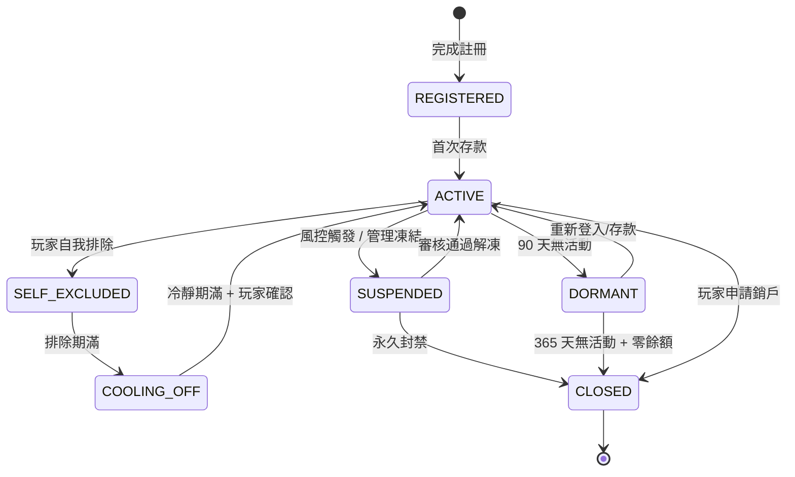
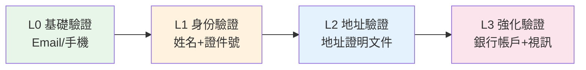

# 第 1 章：玩家管理

---

## 1.1 模組概述

玩家管理模組負責玩家從註冊到離開的完整生命週期，涵蓋帳戶建立、身份驗證、VIP 分級、風險分群四大子領域。本模組是所有業務流程的入口，下游模組（錢包、遊戲、促銷、風控）皆依賴玩家資料作為決策基礎。

**核心職責**: 註冊、KYC 四級驗證、VIP 管理、生命週期追蹤、RFM 分群、問題博彩預警

---

## 1.2 玩家生命週期

### 生命週期階段

### 帳戶狀態定義

| 狀態 | 定義 | 允許操作 | 限制操作 |
|------|------|---------|---------|
| **REGISTERED** | 已註冊但未首存 | 瀏覽遊戲、修改資料 | 存款（需完成 KYC L0）、投注、提款 |
| **ACTIVE** | 正常使用中 | 所有操作 | 依 KYC 等級限制提款額度 |
| **DORMANT** | 90 天無登入/投注 | 登入、存款 | 提款需重新驗證身份 |
| **SELF_EXCLUDED** | 玩家主動排除 | 無 | 所有操作禁止，包括登入 |
| **SUSPENDED** | 風控/管理凍結 | 查看餘額 | 存款、投注、提款均禁止 |
| **CLOSED** | 永久關閉 | 無 | 無法恢復 |
| **COOLING_OFF** | 自我排除期滿後冷靜期 | 查看資料 | 投注、存款禁止，需主動確認恢復 |

### 生命週期轉化漏斗

| 階段 | 目標轉化率 | 關鍵指標 |
|------|----------|---------|
| 訪客 → 註冊 | 15–25% | 註冊完成率 |
| 註冊 → 首存 | 30–40% | 首存轉化率 (FDC) |
| 首存 → D7 活躍 | 50–60% | 7 日留存率 |
| 首存 → D30 活躍 | 40–50% | 30 日留存率 |
| 活躍 → VIP | 10–15% | VIP 轉化率 |
| 全週期留存 (12 個月) | 20–30% | 年度留存率 |

---

## 1.3 註冊需求

### 註冊方式

| 方式 | 必填欄位 | 驗證要求 | 備註 |
|------|---------|---------|------|
| Email 註冊 | Email、密碼、使用者名稱、出生日期 | Email 驗證碼 (10 分鐘有效) | 最常見方式 |
| 手機號註冊 | 手機號、密碼、使用者名稱、出生日期 | SMS OTP (5 分鐘有效) | 亞太市場偏好 |
| 社交帳號 | OAuth 授權 (Google/Facebook/Line) | OAuth Token | 需補填出生日期 |
| 一鍵註冊 | 僅手機號 | SMS OTP | 快速註冊，後續補資料 |

### 註冊初始化規則

- 帳戶狀態初始為 `REGISTERED`
- 自動建立 CASH 錢包（餘額 = 0）
- 自動指派 VIP 等級為 Bronze (最低)
- 綁定所屬品牌/租戶 (不可變更)
- 記錄註冊來源 (Landing Page URL、推廣碼、代理碼)
- 記錄 IP 與設備指紋 (用於防重複註冊)

### 防重複註冊

| 規則 | 處理方式 |
|------|---------|
| 相同 Email | 拒絕註冊，提示「Email 已註冊」 |
| 相同手機號 | 拒絕註冊，提示「手機號已註冊」 |
| 相同設備指紋 + 不同 Email | 允許但標記風控旗標 |
| 同一 IP 24 小時內 ≥ 3 次註冊 | 觸發 CAPTCHA / 人工審核 |

### 年齡限制

- 全球最低年齡: **18 歲**
- 特定司法管轄區: 美國部分州 21 歲
- 系統須在註冊時驗證出生日期，拒絕未達年齡要求者
- KYC L1 須交叉驗證證件上的出生日期

---

## 1.4 KYC 分級驗證

### 四級驗證體系

### 各級要求與權限

| 級別 | 驗證要求 | 提款限額 | 存款限額 | 觸發條件 |
|------|---------|---------|---------|---------|
| **L0** | Email 或手機驗證 | 禁止提款 | $500/日 | 註冊即觸發 |
| **L1** | 姓名 + 政府證件號碼 + 出生日期 | $1,000/日 | $5,000/日 | 首次存款或首次提款申請 |
| **L2** | L1 + 地址證明 (3 個月內) + 證件照片 | $10,000/日 | $50,000/日 | 累計存款 > $2,000 或提款 > $1,000 |
| **L3** | L2 + 銀行帳戶驗證 + 資金來源聲明 | 無限制 | 無限制 | 累計存款 > $10,000 或 VIP Gold 以上 |

### 可接受的驗證文件

**L1 身份文件** (任一):
- 護照 (有效期內)
- 國民身分證 (正反面)
- 駕駛執照 (含照片)

**L2 地址證明** (任一，3 個月內):
- 銀行對帳單
- 水電瓦斯帳單
- 政府發出的稅務通知
- 信用卡帳單

**L3 資金來源** (任一):
- 薪資證明
- 銀行帳戶交易紀錄 (3 個月)
- 投資帳戶證明
- 房產/資產證明

### 自動審批規則

| 條件 | 審批方式 | 處理時限 |
|------|---------|---------|
| L0: Email/手機 OTP 驗證成功 | 自動通過 | 即時 |
| L1: OCR 自動識別 + 姓名/生日匹配 | 自動通過 | < 30 秒 |
| L1: OCR 識別失敗或資料不匹配 | 人工審核 | ≤ 24 小時 |
| L2: 地址文件 OCR 識別成功 | 自動通過 | < 1 分鐘 |
| L2: OCR 失敗 | 人工審核 | ≤ 48 小時 |
| L3: 銀行帳戶驗證 (微額轉帳) | 自動通過 | 1-3 工作天 |
| L3: 資金來源審查 | 人工審核 | ≤ 72 小時 |

### KYC 司法管轄區差異

| 牌照/管轄區 | 額外要求 | 提款觸發 KYC |
|------------|---------|------------|
| UKGC (英國) | L1 必須在**首存前**完成；72 小時內完成 L2 否則凍結 | 任何金額 |
| MGA (馬爾他) | L1 可延後至首次提款；90 天內完成 L2 | > €2,000 累計 |
| PAGCOR (菲律賓) | 接受菲律賓政府 ID；支援 GCash 驗證 | > ₱50,000 累計 |
| Curaçao | L1 最低要求；L2 於大額提款時 | > $2,000 單筆 |

---

## 1.5 VIP 分級系統

### VIP 等級結構

| 等級 | 升級門檻 (月有效投注額) | 維持門檻 | 積分倍率 | 專屬福利 |
|------|----------------------|---------|---------|---------|
| **Bronze** | 預設 | — | 1× | 基礎紅利 |
| **Silver** | $10,000 | $5,000/月 | 1.5× | 週返水 0.3%、專屬客服 |
| **Gold** | $50,000 | $25,000/月 | 2× | 週返水 0.5%、提款優先、生日禮金 |
| **Platinum** | $200,000 | $100,000/月 | 3× | 週返水 0.8%、VIP 專屬活動、免費旅遊 |
| **Diamond** | $500,000 | $250,000/月 | 5× | 個人客戶經理、客製化限額、返水 1.2% |

### VIP 積分規則

**積分獲取**:
- 每 $1 有效投注 = 1 基礎積分 × VIP 倍率
- Slots: 100% 積分率、Table Games: 50% 積分率、Sports: 75% 積分率
- 積分有效期: 365 天 (滾動計算)

**積分用途**:
- 兌換現金紅利 (100 積分 = $1)
- 兌換免費旋轉
- VIP 商城禮品兌換

### 升降級規則

**升級**:
- 評估週期: 每月 1 日凌晨計算上月數據
- 達到門檻即時升級 (不等待月結)
- 升級後立即生效所有新等級福利

**降級**:
- 連續 **2 個月** 未達維持門檻 → 降一級
- 降級保護期: Diamond 享 **3 個月** 寬限期，Platinum 享 **2 個月**，其餘等級 **1 個月**（均為可配置參數）
- 降級通知: 第 1 個月未達標時發送預警通知

**特殊規則**:
- VIP 等級不因帳戶狀態 (DORMANT) 而降級，僅根據投注額
- SUSPENDED 帳戶凍結 VIP 評估，解凍後繼續計算
- 人工升級: VIP 經理可手動調整等級 (需填寫原因，留審計記錄)

---

## 1.6 RFM 玩家分群

### RFM 模型定義

| 維度 | 定義 | 評分標準 (1-5) |
|------|------|--------------|
| **R (Recency)** | 最近一次活動距今天數 | 5: ≤7天 / 4: 8-14天 / 3: 15-30天 / 2: 31-60天 / 1: >60天 |
| **F (Frequency)** | 過去 30 天投注次數 | 5: ≥100次 / 4: 50-99 / 3: 20-49 / 2: 5-19 / 1: <5 |
| **M (Monetary)** | 過去 30 天有效投注額 | 5: ≥$10,000 / 4: $5,000-$9,999 / 3: $1,000-$4,999 / 2: $100-$999 / 1: <$100 |

### 分群矩陣

| 分群名稱 | RFM 範圍 | 特徵 | 建議策略 |
|---------|----------|------|---------|
| **Champions** | R5F5M5 – R4F4M4 | 高頻高額近期活躍 | VIP 維護、專屬活動 |
| **Loyal** | R3F4M4 – R3F3M3 | 穩定高頻 | 忠誠獎勵、積分加碼 |
| **Potential** | R5F2M2 – R4F2M2 | 近期回歸但低頻 | 個人化推薦、首充紅利 |
| **At Risk** | R2F3M3 – R2F2M2 | 曾活躍但漸不活躍 | 召回活動、限時優惠 |
| **Hibernating** | R1F1M1 – R1F2M1 | 長期沉睡 | 大額召回紅利、調查流失原因 |
| **New Players** | R5F1M1 | 新註冊低活躍 | 新手引導、首存獎勵 |

### 分群更新頻率

- 每日凌晨 (02:00 UTC) 重新計算所有玩家 RFM 分數
- 分群變動自動觸發對應行銷自動化流程
- 異常跳級 (例: Champions → Hibernating 一次跳多級) 觸發警示

---

## 1.7 玩家標籤系統

### 系統自動標籤

| 標籤類別 | 標籤名稱 | 觸發條件 | 用途 |
|---------|---------|---------|------|
| 風控 | `HIGH_RISK` | 風險評分 ≥ 70 | 提款自動拒絕 |
| 風控 | `BONUS_ABUSER` | 紅利濫用偵測命中 | 禁止領取紅利 |
| 風控 | `MULTI_ACCOUNT` | 多帳戶偵測命中 | 帳戶凍結審查 |
| 行為 | `WHALE` | 月有效投注 > $100,000 | VIP 通知、個人服務 |
| 行為 | `SLOTS_LOVER` | Slots 投注佔比 > 80% | 遊戲推薦偏好 |
| 行為 | `PROBLEM_GAMBLER` | 問題博彩指標觸發 | 觸發負責任博彩介入 |
| 生命週期 | `CHURN_RISK` | RFM 降至 At Risk | 觸發召回流程 |
| 合規 | `PEP` | 政治公眾人物篩查命中 | 強化盡職調查 (EDD) |
| 合規 | `SANCTION_HIT` | 制裁名單篩查命中 | 立即凍結帳戶 |

### 人工標籤

- VIP 經理、客服主管可手動新增/移除標籤
- 人工標籤必須附帶原因說明
- 所有標籤變更留審計記錄 (操作者、時間、原因)

### 標籤優先級

- `SANCTION_HIT` 最高優先: 立即凍結，無需其他判斷
- `HIGH_RISK` + `WHALE` 同時存在: 人工審核決定處理方式
- 矛盾標籤由風控經理人工裁決

---

## 1.8 問題博彩預警

### 風險指標

| 指標 | 閾值 | 風險等級 | 觸發動作 |
|------|------|---------|---------|
| 單日存款次數 | ≥ 5 次 | 中 | 彈出提醒訊息 |
| 單日存款金額 | 超過月均 3 倍 | 高 | 彈出冷靜期建議 |
| 連續遊戲時長 | > 4 小時 | 中 | 強制彈出休息提醒 |
| 追損行為 (Loss Chasing) | 連續 3 次加碼投注 | 高 | 彈出自我排除選項 |
| 深夜投注頻率 | 00:00–06:00 投注 > 日均 200% | 中 | 記錄但不干預 |
| 借貸行為信號 | 多次小額存款 (快速連續) | 高 | 標記 + 客服介入 |

### 自我排除選項

| 排除期限 | 冷靜期 | 恢復方式 |
|---------|--------|---------|
| 24 小時 | 無 | 自動恢復 |
| 7 天 | 24 小時 | 自動恢復 + 確認 |
| 30 天 | 7 天 | 主動申請 + 確認 |
| 6 個月 | 30 天 | 主動申請 + 確認 |
| 永久 | — | 不可恢復 |

### 合規要求

- UKGC: 必須提供自我排除選項，且排除期間禁止發送任何行銷訊息
- MGA: 必須在登入頁面顯示負責任博彩連結
- 所有管轄區: 玩家可隨時查看自己的投注歷史、存款歷史

---

## 1.9 AML / 反洗錢需求

### CDD (客戶盡職調查) 要求

| 階段 | 觸發條件 | 要求 |
|------|---------|------|
| **簡化 CDD** | 低風險玩家，小額交易 | 基本身份資訊 (KYC L1) |
| **標準 CDD** | 所有玩家預設 | KYC L1 + L2，交易監控 |
| **強化 CDD (EDD)** | 高風險觸發 | KYC L3 + 資金來源 + 定期審查 |

### EDD 觸發條件

- 玩家來自高風險國家/地區 (FATF 灰名單)
- PEP (政治公眾人物) 或其親屬
- 單筆交易超過 $10,000
- 30 天內累計交易超過 $25,000
- 異常交易模式 (快速存提、無遊戲活動)
- 風險評分 ≥ 70

### SAR (可疑活動報告) 流程

| 步驟 | 時限 | 負責人 |
|------|------|--------|
| 偵測可疑活動 | 即時 | 系統自動 / 員工舉報 |
| 初步評估 | 24 小時內 | 合規團隊 |
| MLRO 審核 | 48 小時內 | MLRO (反洗錢報告官) |
| 提交 SAR | 法定期限內 (通常 15-30 天) | MLRO |
| 持續監控 | 提交後 90 天 | 合規團隊 |

### MLRO 職責

- 擁有獨立權力凍結任何可疑帳戶
- 不得向玩家透露 SAR 已提交 (Tipping Off 禁止)
- 定期向董事會報告 AML 統計數據
- 負責年度 AML 風險評估更新

---

## 1.10 多管轄區合規矩陣

| 需求項目 | UKGC | MGA | PAGCOR | Curaçao |
|---------|------|-----|--------|---------|
| 註冊前 KYC | ✅ L1 必須 | ❌ 可延後 | ❌ 可延後 | ❌ 可延後 |
| 72 小時 KYC 完成 | ✅ 強制 | ❌ 90 天 | ❌ 無期限 | ❌ 無期限 |
| 自我排除資料庫 | ✅ GAMSTOP | ✅ 內部 | ❌ 非強制 | ❌ 非強制 |
| 年齡驗證 | ✅ 嚴格 (第三方) | ✅ 標準 | ✅ 標準 | ✅ 基本 |
| 可負擔性評估 | ✅ 強制 (2024+) | ❌ 建議 | ❌ 非要求 | ❌ 非要求 |
| 廣告限制 | ✅ 極嚴格 | ✅ 嚴格 | ✅ 中等 | ✅ 寬鬆 |
| 交易監控 | ✅ 即時 | ✅ 即時 | ✅ 日報 | ✅ 月報 |

---

## 1.11 數據保留政策

| 數據類別 | 保留期限 | 法規依據 |
|---------|---------|---------|
| 玩家身份資訊 | 帳戶關閉後 5 年 | AML 第四指令 |
| KYC 驗證文件 | 驗證後 5 年 | 各管轄區 AML 法規 |
| 交易記錄 | 7 年 | 稅務與審計要求 |
| 自我排除記錄 | 永久 | UKGC 要求 |
| 登入/操作日誌 | 2 年 | GDPR 最小化原則 |
| 行銷同意記錄 | 同意撤回後 3 年 | GDPR |

---

## 1.12 MFA 恢復流程

| 場景 | 恢復方式 | 驗證要求 |
|------|---------|---------|
| MFA 設備遺失 | 備用驗證碼恢復 | 註冊時生成 10 組一次性備用碼 |
| 備用碼亦遺失 | 客服人工恢復 | KYC L2 身份驗證 + 視訊通話確認 |
| Email MFA | 重設至新設備 | 原 Email + 48 小時冷靜期 |
| TOTP MFA | 重新綁定 | 客服人工 + KYC L2 + 24 小時冷靜期 |
| WebAuthn (硬體金鑰) | 註冊備用金鑰 | 註冊時須設定至少 2 組認證方式 |

**安全限制**: MFA 重設後 24 小時內禁止提款。

---

## 1.13 成功指標

| 指標 | 目標 | 計算方式 |
|------|------|---------|
| 註冊完成率 | ≥ 85% | 完成註冊 / 開始註冊 |
| KYC L1 自動通過率 | ≥ 70% | 自動通過 / 總 L1 申請 |
| KYC 平均處理時間 (自動) | < 30 秒 | — |
| KYC 平均處理時間 (人工) | < 24 小時 | — |
| VIP 玩家留存率 (年) | ≥ 60% | Gold 以上年度留存 |
| 問題博彩偵測準確率 | ≥ 80% | 真陽性 / (真陽性 + 假陽性) |
| SAR 提交及時率 | 100% | 在法定期限內完成 |

---

## 1.14 對應技術文檔

> 🔧 **技術實作**: 詳見 [Part 2 Ch1: 玩家管理技術架構](../technical/01_Player_Management_玩家管理.md)
