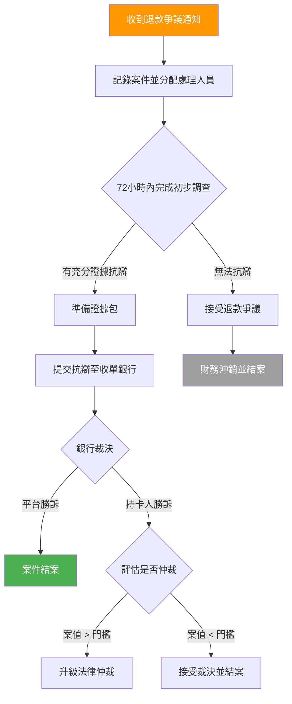

# 退款爭議處理 (Chargeback Dispute Resolution)

> **規範來源**: MGA Financial Requirements Art. 8、Visa/Mastercard Chargeback Rules
> **目標讀者**: PM、合規專員
> **相關架構**: [Payment Gateway Architecture](../../architecture/02_Finance_Service/06_Payment_Gateway_Architecture.md)
> **最後更新**: 2026-04-02

---

## 1. 概述

退款爭議 (Chargeback Dispute) 是指持卡人向發卡銀行提出交易異議，要求強制撤銷付款的流程。對於線上博彩平台而言，退款爭議不僅涉及財務損失，更可能觸發監管機構的合規審查，因此需要建立一套完整的處理機制。

本規範定義了從收到退款爭議通知起，至案件最終解決的完整流程，包括內部調查、證據收集、向收單銀行提交抗辯，以及必要時升級至法律程序的各項標準與時限要求。所有時限須符合 Visa/Mastercard 的退款規則（120 天爭議窗口期）及 MGA Financial Requirements Art. 8 的規定。

---

## 2. 功能需求

### 2.1 退款爭議處理流程

### 2.2 調查時限要求

| 階段 | 時限 | 責任部門 |
|------|------|---------|
| 收到通知至案件登記 | 4 小時 | 財務部門 |
| 內部初步調查完成 | 72 小時 | 風險合規部門 |
| 抗辯材料提交至銀行 | 根據卡組織規定（最長 45 天）| 財務部門 |
| 案件超過 30 天未解決 | 自動升級至法律部門 | 法律部門 |

### 2.3 證據包 (Evidence Package) 內容

提交抗辯時，需收集以下證據材料：

| 證據類型 | 說明 | 來源系統 |
|---------|------|---------|
| 遊戲記錄 (Game Logs) | 爭議交易對應的完整遊戲紀錄 | 遊戲整合系統 |
| 登入會話資料 | 交易時間點前後的 Session 記錄（IP、設備指紋、位置） | 玩家帳戶系統 |
| KYC 驗證記錄 | 玩家身份驗證 (KYC) 文件與審核時間戳 | KYC 管理系統 |
| 付款確認通知 | 發送給玩家的付款確認電子郵件記錄 | 通知系統 |
| 使用條款同意記錄 | 玩家同意服務條款的時間戳與 IP | 玩家帳戶系統 |
| 存提款歷史 | 玩家過往的交易紀錄，顯示正常使用模式 | 財務系統 |

### 2.4 Visa/Mastercard 退款爭議時間窗口

| 卡組織 | 持卡人爭議窗口 | 商戶抗辯窗口 | 仲裁申請窗口 |
|-------|-------------|------------|------------|
| Visa | 120 天（自交易日起）| 收到通知後 30 天 | 仲裁費約 USD 500 |
| Mastercard | 120 天（自交易日起）| 收到通知後 45 天 | 仲裁費約 USD 250 |

---

## 3. 業務規則

1. **72 小時 SLA**: 內部調查必須在收到退款爭議通知後 72 小時內完成，逾期視為放棄抗辯權利。
2. **證據完整性**: 提交的抗辯材料必須包含遊戲記錄、Session 資料及 KYC 記錄三項核心證據，缺一不可。
3. **30 天升級規則**: 任何案件若在 30 天內未能解決，必須自動升級至法律部門處理。
4. **帳戶風險標記**: 提出退款爭議的玩家帳戶，調查期間自動標記為高風險，限制大額提款。
5. **多次爭議閾值**: 同一玩家在 6 個月內提出 2 次以上退款爭議，自動觸發帳戶審查流程。
6. **欺詐性退款爭議**: 若調查發現退款爭議為惡意欺詐（玩家已使用服務卻聲稱未授權），須向執法機構提交報告並封鎖帳戶。
7. **財務沖銷時機**: 僅在所有抗辯管道耗盡後，才進行財務沖銷 (Write-off)，不得提前認輸。

---

## 4. 監管合規

| 法規 | 條款 | 要求 |
|------|------|------|
| MGA Financial Requirements | Art. 8（爭議處理） | 所有退款爭議須在規定時限內回應；保留完整的處理記錄至少 5 年 |
| Visa Chargeback Rules | Core Rules 11.3 | 商戶必須在 30 天內提交抗辯；逾期視為自動認輸 |
| Mastercard Chargeback Rules | Dispute Resolution Rules | 45 天抗辯窗口；二次抗辯 (Pre-Arbitration) 規則 |
| GDPR | Art. 6（處理合法性） | 收集用於抗辯的個人資料須基於「法律義務」合法基礎 |
| AML 反洗錢 | FATF R.10 | 可疑的退款爭議模式須納入反洗錢 (AML) 監測範圍 |

---

## 5. 驗收標準

- [ ] 系統在收到退款爭議通知後 4 小時內自動登記案件並發送內部警報
- [ ] 案件管理介面可顯示每個案件的當前狀態、距離截止日期的剩餘時間
- [ ] 系統可自動從遊戲記錄、Session 資料、KYC 系統彙整證據包，並生成 PDF 報告
- [ ] 案件超過 30 天未解決時，自動通知法律部門並在系統中標記為升級狀態
- [ ] 同一玩家 6 個月內 2 次以上退款爭議，自動觸發帳戶審查並通知風控部門
- [ ] 所有退款爭議處理記錄（包括時間戳、處理人員、決策理由）保存期限 ≥ 5 年
- [ ] 月度合規報告可匯出退款爭議率 (Chargeback Ratio)、勝訴率、平均處理時間等指標
- [ ] 退款爭議率超過卡組織閾值（Visa 1%、Mastercard 1.5%）時，系統自動發出警報
