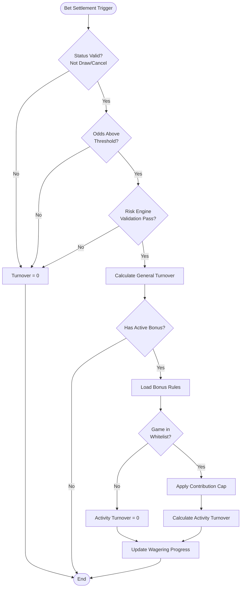

# Turnover & Game Reconciliation Requirements

> **Canonical Source**: [source/02_Finance_Center/02-04_Turnover_and_Game_Reconciliation_Analysis.md](../../source/02_Finance_Center/02-04_Turnover_and_Game_Reconciliation_Analysis.md)
> **Audience**: Executives, Compliance Officers, Product Managers, Finance Team
> **Related Doc**: [Turnover_Calculation_Architecture.md](../../architecture/02_Finance_Service/Turnover_Calculation_Architecture.md)
> **Last Synced**: 2026-02-08

---

## 1. Valid Turnover Business Rules

### 1.1 Valid Turnover Definition

**Core Principle**: Only bets that produce a win/loss outcome, carry risk, and pass risk control validation are counted as valid turnover.

**Formula**: `ValidTurnover = BetAmount x GameWeight x OddsFactor x StatusFactor x RiskFactor`

- **RiskFactor**: `1` (Pass) or `0` (Reject, e.g., Hedge/Arbitrage detected)

### 1.2 Bet Status Determination (Status Factor)

**Pre-condition**: Bets must pass Layer 1 risk validation before status factor is applied.

Not all bets count as turnover. Each bet must be filtered based on the game outcome:

| Status | Description | Turnover Calculation | Notes |
|--------|-------------|---------------------|-------|
| **WIN** | Player wins | 100% | Normal calculation |
| **LOSS** | Player loses | 100% | Normal calculation |
| **DRAW / TIE** | Draw / Push | **0%** | No risk, does not count as turnover |
| **CANCEL / VOID** | Cancelled / Voided | **0%** | Bet is invalid |
| **HALF WIN** | Half win | **100%** | Standard principal method (v2.0.0 recommended) |
| **HALF LOSS** | Half loss | **100%** | Standard principal method (v2.0.0 recommended) |
| **RUNNING** | In progress | 0% | Must wait for settlement before calculation |

**v2.0.0 Important Change**:
- HALF_WIN/HALF_LOSS now count as 100% turnover (standard principal method)
- The "Actual Risk Method" (50% calculation) has been deprecated -- it violates fairness principles
- Rationale: Identical betting behavior should produce identical turnover contribution, consistent with risk locking logic

### 1.3 Odds Threshold (Odds Factor)

To prevent players from exploiting low-risk betting (Low Risk Betting) to wash turnover:

- **Sports Betting Requirements**:
    - **European (Decimal)**: >= 1.5 (or 1.7, configurable)
    - **Hong Kong (HK)**: >= 0.5 (or 0.7)
    - **Malay (MY)**: Absolute value > 0.5 (negative odds fully counted)
    - **Indonesian (ID)**: <= -1.2 (higher loss) or >= 1.2

### 1.4 Game Contribution Weight

Different game types have different "turnover washing difficulty" and require weighted contributions:

| Game Type | Weight | Rationale |
|-----------|--------|-----------|
| **Slots** | 100% | Pure chance, suitable for turnover washing |
| **Live Casino** | 10-50% | Depends on operations strategy; Baccarat typically lower |
| **Sports** | 100% | High risk |
| **Lottery** | 10-20% | Two-sided bets (big/small, odd/even) easy to hedge |
| **PVP (Card/Battle)** | 0% | Generally not counted due to player-to-player transfers |

### 1.5 Activity Wagering Calculation (Bonus Turnover)

Activity wagering requirements are distinct from general valid turnover and have stricter rules:

**Key Differences**:
- **General Turnover**: Platform-wide, lower threshold (e.g., odds 0.5+ counted)
- **Activity Wagering**: Specific to bonus activities, higher threshold (e.g., specific games only, odds 0.7+, maximum contribution cap)

**Formula**: `ActivityTurnover = Min(BetAmount, MaxContribution) x GameContribution%`

**Critical Business Logic**:
1. **Game Whitelist**: If the game is not in the activity's allowed list, contribution is forced to 0% (or gameplay may be blocked entirely)
2. **Per-Bet Contribution Cap**: e.g., "Each bet contributes a maximum of $5 turnover" -- prevents players from placing a single $1,000 bet to quickly unlock bonuses
3. **Multiple Bonus Priority (FIFO Principle)**: When a player participates in multiple bonuses simultaneously, turnover fills the earliest-claimed bonus first; alternatively, the bonus tied to the locked cash wallet is unlocked first

**State Transitions**:
- `Pending` (In progress) -> `Completed` (Turnover target met, balance unlocked to Cash)
- `Pending` -> `Expired` (Expired, bonus and winnings deducted)

---

## 1.6 Free Spins Turnover Rules

### 1.6.1 Core Principle

Free spins **Turnover** and **Valid Bet** must be handled separately as they serve completely different purposes:

| Metric | Definition | Calculation Method | Purpose |
|--------|-----------|-------------------|---------|
| **Turnover** | Total amount flowing through games | **Sum of free spin face values** | Financial reports, GGR calculation |
| **Valid Bet** | Amount counted toward wagering requirements | **0 (not counted)** | Bonus activities, cashback calculation |

**Why Turnover is not 0**: If free spin turnover is recorded as $0, GGR calculations become inaccurate. For example, granting 10 free spins at $1 each where the player wins $8.50 would show a GGR of -$8.50 (apparent loss) instead of the correct $1.50 (actual promotional net cost).

### 1.6.2 Industry Standard

All major game providers adopt this logic:

| Provider | Turnover | Valid Bet | Basis |
|----------|----------|-----------|-------|
| **Evolution Gaming** | Face value sum | 0 | Official API documentation |
| **Pragmatic Play** | Face value sum | 0 | Official API documentation |
| **Hub88 (Aggregator)** | Face value sum | 0 | Technical whitepaper |

**Public Company Reporting Standard** (Evolution Gaming Annual Report 2023): Free spins are recorded as turnover at face value, payout at actual win amount, and the net cost (face value minus payout) as marketing expense.

### 1.6.3 Decision Summary

**Recommended Approach**: Turnover = Face Value Sum, Valid Bet = 0

**Rationale**:
1. **Financial Accuracy**: Correctly reflects promotional costs
2. **GGR Calculation**: Complies with accounting standards
3. **Industry Standard**: All major game providers adopt this logic
4. **Listing Compliance**: Meets financial report disclosure requirements

---

## 1.7 Turnover Validation Integration

The `valid_turnover_finance` calculated by this module is an incremental value that ultimately serves the **Approach A: Deposit/Withdrawal Snapshot Method**.

- **Data Flow**: `valid_turnover_finance` -> `t_player_statistics.total_valid_turnover` (cumulative)
- **Validation Timing**: When a player requests withdrawal
- **Validation Logic**: Read `total_valid_turnover`, subtract `Last_Snapshot`, compare against target value

---

## 1.8 Cross-Module Turnover Consistency

To ensure consistency between the Finance System and the Activity System, both must share unified base validation logic.

### Three-Layer Validation Architecture Responsibilities

**Key Principle**: Each layer is only responsible for its own duties. Rejection decisions are handled exclusively by Layer 1; subsequent layers only perform numerical adjustments.

| Responsibility | Layer 1 (Risk Engine) | Layer 2 (Finance) | Layer 3 (Activity) |
|---------------|----------------------|-------------------|-------------------|
| **Rejection Decision** | Solely responsible | Not involved | Not involved |
| **Status Factor Adjustment** | Not involved | Solely responsible | Not involved |
| **Game Weight Application** | Not involved | Not involved | Solely responsible |
| **Short-circuit Return** | is_valid=false returns 0 directly | Trusts Layer 1 result | Trusts Layer 2 result |
| **Performance Impact** | Executes for all bets | Only bets passing Layer 1 (~95%) | Only bets with active bonuses |

### Finance Layer Processing Flow

The finance module must strictly follow these steps:

1. **Step 1 - Layer 1 Risk Validation**: Call Risk Engine to validate bet (Hedge/Arbitrage/Low Odds checks). BLOCK rules return turnover = 0 immediately (short-circuit). FLAG rules mark for review but allow normal calculation.
2. **Step 2 - Layer 2 Status Factor Adjustment**: Apply status factor based on bet outcome (WIN/LOSS/DRAW/CANCEL). This layer does NOT make rejection decisions -- it trusts the Layer 1 result.
3. **Step 3 - Record All Layers**: Record each layer's calculation result for audit and reconciliation purposes.

### Performance Optimization (v2.0.0)

- **Before (v1.x)**: Layer 2 still executed even after Layer 1 rejection -- 100% of bets hit Layer 2
- **After (v2.0.0)**: Layer 1 rejection causes immediate short-circuit return -- only ~95% of bets reach Layer 2
- **Savings**: ~5% CPU and database query reduction

### Data Exchange with Activity System

After finance module calculation, `valid_turnover_finance` is published to an event bus for the Activity System to consume. The Activity System then applies game weight on top of this value:

`activity_valid_turnover = valid_turnover_finance x GAME_WEIGHTS[game_type]`

### Configuration Synchronization Requirements

The Finance and Activity modules must read the following parameters from a **Unified Config Service** -- local hardcoding is prohibited:

1. **Odds Thresholds**: Defined by Risk Engine (EUR: 1.5, HK: 0.5, MY: 0.5, ID: 1.2)
2. **Game Weights**: Defined by Activity module (SLOTS: 1.0, SPORTS: 1.0, BACCARAT: 0.15, BLACKJACK: 0.10, ROULETTE: 0.20, VIDEO_POKER: 0.15, LOTTERY: 0.10, PVP: 0.0)
3. **Status Factors**: Defined and maintained by Finance module (WIN: 1.0, LOSS: 1.0, DRAW: 0.0, TIE: 0.0, VOID: 0.0, CANCEL: 0.0, HALF_WIN: 1.0, HALF_LOSS: 1.0, RUNNING: 0.0)

---

## 2. Game Reconciliation Business Rules

Game reconciliation addresses inconsistencies between the platform database and game provider (GP) records.

### 2.1 Three-Layer Reconciliation System

#### Layer 1: Real-time Stream Check
- **Timing**: 1-5 minutes after receiving each `GameEnd` or `Settlement` webhook
- **Mechanism**: Query single transaction details via GP API (`GetTransactionStatus`); compare `Amount`, `Status`, `WinLoss`
- **Purpose**: Rapidly fix real-time dropped transactions (latency issues)

#### Layer 2: Near Real-time Batch Reconciliation
- **Timing**: Execute every 10-30 minutes
- **Mechanism**: Call GP's `FetchHistory` API (by time range); pull all bets from the past 30 minutes; perform `Anti-Join` against DB (find records GP has but DB does not)
- **Purpose**: Recover lost callback bets (self-healing)

#### Layer 3: T+1 Daily Final Settlement
- **Timing**: Daily at dawn (e.g., 02:00), after GP produces complete previous-day report
- **Mechanism**: Download GP settlement files (CSV/XML/JSON); load into staging table; execute `Full Outer Join` comparison:
    1. **GP has, DB does not** -> Recover (create missing transaction)
    2. **GP does not have, DB does** -> Mark as anomalous (Invalid/Rollback); requires manual confirmation
    3. **Amount mismatch** -> Generate `DiffReport`; adjust based on GP's final settlement amount

### 2.2 Exception Handling Matrix

| Exception Scenario | System Behavior | Resolution |
|--------------------|----------------|------------|
| **Recover (Missing Bet)** | GP has record but DB does not | Auto-create bet, supplement deduction/payout, record Source="Reconciliation" |
| **Amount Difference** | Both sides' amounts do not match | If difference < tolerance (e.g., 0.01), auto-balance; otherwise Alert |
| **Status Conflict** | DB=Win, GP=Loss | Use **GP report** as authority, execute `Reverse + Re-settle` |
| **Ghost Bet** | DB has record, GP does not | Extremely dangerous (possible hacker injection). **Freeze account**, manual investigation required. |

---

## 3. Daily Reconciliation Verification

### Execution Schedule
- **Time**: Daily at 03:00 (UTC+8)

### Exception Handling Thresholds

| Deviation Range | Threshold Setting | Business Impact | Rationale |
|----------------|-------------------|-----------------|-----------|
| **< 0.01%** | Acceptable range | Almost no impact (player daily turnover $1,000 -> deviation $0.10) | Floating point precision errors, timezone conversion errors, game weight micro-adjustments |
| **0.01% - 1%** | Warning zone | Medium impact (likely configuration error) | Game weight misconfiguration, status factor mapping errors, reconciliation time window inconsistencies |
| **> 1%** | Emergency zone | Severe impact (financial risk) | System bugs, data loss, malicious attacks, double deductions |

### Escalation Process
- **Deviation < 0.01%**: Auto-marked as verified
- **Deviation 0.01% - 1%**: Alert sent to Slack #finance-ops channel
- **Deviation > 1%**: PagerDuty emergency alert triggered; immediate manual intervention required

### Auto-Correction Rules

**Trigger Conditions**: Deviation between 0.01%-1% AND one of the following:
- Game weight configuration changed during reconciliation period
- Status factor mapping error (HALF_WIN/HALF_LOSS calculation error)
- Timezone conversion causing boundary bet discrepancies

**Auto-Correction Limitations**:
- Only for low-risk deviations (0.01%-1%)
- Single-day single-player deviation amount < $100
- Maximum 3 auto-corrections per player per day; exceeding this escalates to manual review
- All auto-corrections must be recorded in a complete audit log

### Compensation Mechanism

When reconciliation finds deviations that cannot be auto-corrected, the compensation mechanism is activated:

| Deviation Type | Compensation Method | Trigger Condition | Executor | SLA |
|---------------|--------------------|--------------------|----------|-----|
| **Finance < Activity** | Increase Finance Turnover | Activity calculation too high | Auto compensation | 1 hour |
| **Finance > Activity** | Increase Activity Turnover | Activity calculation too low | Auto compensation | 1 hour |
| **GP vs Platform Mismatch** | Adjust platform records using GP as authority | GP report inconsistent with platform | Requires manual approval | 24 hours |
| **Negative Deviation (Platform over-deducted)** | Refund to player wallet | Platform deducted too much | Requires manual approval | 12 hours |
| **Positive Deviation (Platform under-deducted)** | Deduct from player wallet | Platform deducted too little | Requires manual approval + risk control review | 48 hours |

### Compensation Monitoring KPIs

- **Compensation Trigger Rate**: `(compensations_count / total_reconciliations) x 100%` -- Target: < 0.1%
- **Auto-Compensation Success Rate**: >= 95%
- **Manual Approval Response Time**: P50 < 2 hours, P95 < 12 hours

---

## 4. Monitoring Metrics & SLA

### Key Monitoring Metrics

| Metric | Target | Description |
|--------|--------|-------------|
| Turnover Calculation Latency (P99) | < 100ms | End-to-end calculation time per bet |
| Risk Engine Call Success Rate | > 99.9% | Layer 1 validation availability |
| Daily Reconciliation Deviation Rate | < 0.01% | Acceptable deviation threshold |
| Event Publish Success Rate | > 99.99% | Kafka message delivery reliability |

### Alert Rules

| Alert Name | Condition | Severity | Notification |
|-----------|-----------|----------|-------------|
| Turnover Calculation Latency High | P99 > 500ms | WARNING | Slack: #finance-ops |
| Risk Engine Call Failure | Success rate < 99% | CRITICAL | PagerDuty: finance-oncall |
| Daily Reconciliation Deviation | Deviation rate > 0.01% | WARNING | Slack + Email: finance-team |
| Event Publish Failure | Success rate < 99.9% | CRITICAL | PagerDuty: finance-oncall |

---

## 5. Turnover Calculation Business Flow

The following simplified flow shows how a single bet simultaneously calculates general turnover and activity turnover:

---

## 6. Change Log

### v2.1.0 (2026-02-02)

**Major Changes**:
1. Updated Layer 1 processing to support configuration-driven risk control
   - Added action_type (BLOCK/FLAG/PASS) support
   - BLOCK rules block in real-time (turnover = 0)
   - FLAG rules mark but allow (normal turnover calculation + risk proposal generated)

2. Integration with risk control system v2.1.0 configuration-driven architecture

### v2.0.0 (2026-01-29)

**Major Changes**:
1. Clarified three-layer validation architecture responsibilities
   - Layer 1 rejection causes immediate short-circuit return (does not enter Layer 2/3)
   - Clear responsibility matrix defined

2. HALF_WIN/HALF_LOSS standardized to 100% turnover (standard principal method)

### v1.0.0 (2026-01-28)

**Initial Version**:
- Turnover calculation logic (Sections 1.1-1.6)
- Game reconciliation logic (Sections 2.1-2.2)
- Free spins turnover rules

---

**Document Version**: 4.0.0
**Last Updated**: 2026-02-08
**Maintenance Team**: Finance Team & Product Team
