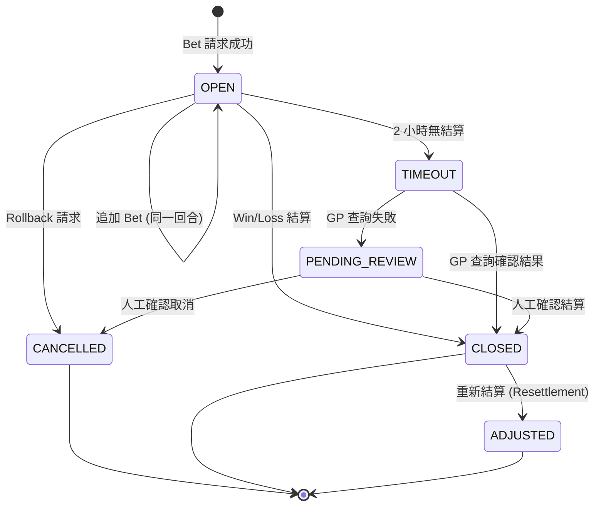

# 第 2 章：錢包系統

---

## 2.1 模組概述

錢包系統是平台的資金核心，負責管理玩家餘額、處理所有遊戲交易、確保資金準確性。本模組與遊戲供應商 (GP) 透過 Seamless Wallet 協議即時互動，必須在高併發場景下保證**原子性**、**冪等性**和**資料一致性**。

**核心職責**: 三類錢包管理、可下注餘額計算、回合生命週期追蹤、九大交易情境處理、GP 對帳

---

## 2.2 錢包類型與定義

### 三類錢包

| 錢包類型 | 英文 | 定義 | 提款規則 | 適用場景 |
|---------|------|------|---------|---------|
| **現金錢包** | CASH | 玩家自有資金 | 自由提款 (依 KYC 限額) | 所有遊戲、存提款 |
| **紅利錢包** | BONUS | 促銷活動獲得的獎金 | 須完成流水要求後轉為現金 | 支援紅利的遊戲 |
| **信用錢包** | CREDIT | 代理授信額度 (負債) | 不可提款，僅可用於投注 | 信用模式代理玩家 |

### 錢包初始化

新玩家帳戶建立時自動初始化:

| 欄位 | 初始值 | 說明 |
|------|--------|------|
| CASH 餘額 | 0 | 等待首次存款 |
| BONUS 餘額 | 0 | 等待促銷活動發放 |
| CREDIT 額度 | 0 | 等待代理設定 (僅信用模式) |
| 鎖定金額 | 0 | 無進行中交易 |
| 可下注餘額 | 0 | 計算得出 |

---

## 2.3 可下注餘額

### 計算公式

```
可下注餘額 (Playable Balance) = (CASH 餘額 + BONUS 餘額) - 鎖定金額 - 進行中投注
```

**信用模式變體**:
```
可下注餘額 = 可用信用 (信用額度 - 已使用額度)
```

**混合模式** (極少見但須支援):
```
可下注餘額 = CASH + BONUS + 可用信用 - 鎖定金額
```

### 鎖定與解鎖規則

| 事件 | 鎖定動作 | 解鎖動作 |
|------|---------|---------|
| 投注 (Bet/Debit) | 鎖定投注金額 | — |
| 結算 (Win/Credit) | — | 解鎖投注金額 + 派彩入帳 |
| 回滾 (Rollback) | — | 解鎖投注金額 + 退還本金 |
| 超時 (Timeout) | 維持鎖定 | 查詢 GP 後根據結果解鎖 |
| 提款申請 | 鎖定提款金額 | 提款完成或拒絕後解鎖 |

**關鍵約束**: 可下注餘額計算必須達到 **99.99%** 準確率。多扣導致玩家投訴，少扣導致平台虧損。

---

## 2.4 錢包扣款優先序

### 預設扣款順序

```
BONUS → CASH → CREDIT
```

### 優先序覆蓋層級 (由高到低)

| 層級 | 說明 | 範例 |
|------|------|------|
| Layer 1: 玩家級別 | VIP 特殊規則、活動指定 | Diamond 玩家優先用 CASH |
| Layer 2: GP 合約 | GP 合約要求 | 某 GP 不接受 BONUS 資金 |
| Layer 3: 遊戲級別 | 特定遊戲規則 | Live Casino 僅限 CASH |
| Layer 4: 系統預設 | 全局預設 | BONUS → CASH → CREDIT |

**扣款執行規則**:
- 按層級由高到低查找第一個適用規則
- 主錢包餘額不足時，自動使用下一優先序錢包補足
- 每筆交易記錄實際使用的扣款層級 (審計用途)

---

## 2.5 交易模型

### 四種交易處理模型

| 模型 | 說明 | 風險等級 | 推薦度 |
|------|------|---------|--------|
| **Transaction-Based** | 每次請求獨立 (Debit/Credit)，TransactionId 全局唯一 | 低 | ⭐⭐⭐ 推薦 |
| **Round-Based** | 請求以 RoundId 關聯，Bet 開啟回合、Win 關閉回合 | 中 | ⭐⭐⭐ 推薦 |
| **Transfer-Based** | 模擬 TransferIn/TransferOut (舊架構) | 高 | ⚠️ 已棄用 |
| **Result-Only** | 僅發送遊戲結果，無 Bet/Win 區分 | 極高 | ❌ 不建議 |

### Round-Based 模型詳細規則

此為最常見的 GP 整合模型。

**核心概念**:
- 每個遊戲回合 (Round) 由一個 `roundId` 標識
- Bet 請求開啟回合，Win 請求關閉回合
- 一個回合可包含多次 Bet (如 21 點的加注) 和多次 Win (如分注結算)

---

## 2.6 回合生命週期



### 回合狀態定義

| 狀態 | 觸發條件 | 系統動作 | 人工介入 |
|------|---------|---------|---------|
| **OPEN** | Bet 請求成功 | 扣除餘額、建立回合記錄 | 無 |
| **CLOSED** | Win 請求成功 | 派彩入帳、關閉回合 | 無 |
| **TIMEOUT** | 開啟超過 2 小時未收到結算 | 主動查詢 GP API | GP 查詢失敗時升級 |
| **PENDING_REVIEW** | GP 狀態無法確認 | 建立客服工單 | 客服人工關閉或取消 |
| **CANCELLED** | Rollback 請求 | 退還金額、標記取消 | 無 |
| **ADJUSTED** | Resettlement 請求 | 調整餘額 (可為負值) | 負餘額觸發風控鎖定 |

### 孤兒回合處理

| 項目 | 規則 |
|------|------|
| 偵測頻率 | 每 15 分鐘掃描一次 |
| 判定條件 | 回合狀態 = OPEN 且已超過 2 小時 |
| 處理流程 | 查詢 GP API → 有結果則自動關閉 → 無結果則升級人工 |
| SLA | 高優先 ($1,000+): 24 小時內解決 / 一般: 24 小時 |

---

## 2.7 九大交易情境

### 情境 A: 餘額不足

| 條件 | 處理方式 |
|------|---------|
| 可下注餘額 < 投注金額 | 回傳 `INSUFFICIENT_FUNDS` 錯誤碼 |
| 有 BONUS 但遊戲不支援 | 回傳 `INSUFFICIENT_FUNDS` (忽略 BONUS) |
| 有 BONUS 且遊戲支援 | 執行雙錢包扣款 (CASH 優先) |

### 情境 B: 併發投注

| 條件 | 處理方式 |
|------|---------|
| 同一玩家同時發起多筆投注 | 序列化處理，防止超額扣款 |
| 重試次數超限 | 回傳「系統繁忙」錯誤 |
| 併發偵測 | 同一玩家同一秒內多筆 → 排隊處理 |

### 情境 C: 超時與重試

| 條件 | 處理方式 |
|------|---------|
| GP 用相同 transactionId 重試 | 回傳原始執行結果 (不重複執行) |
| 無 transactionId 的請求 | 拒絕，回傳「缺少必填欄位」 |
| 回應快取有效期 | 1 小時 |

### 情境 D: 亂序請求

Win 請求先於對應的 Bet 到達 (網路亂序)。

| 策略 | 說明 | 適用條件 |
|------|------|---------|
| **策略 3 (推薦)** | 暫存 Win，等 Bet 到達後處理 | 正常負載 |
| 暫存過期 | 30 分鐘 | — |
| 策略 1 (降級) | 直接拒絕亂序 Win | 高負載時自動降級 |
| 策略 2 (緊急) | 允許孤兒 Win 直接入帳 | GP 重試率 < 80% |

### 情境 E: 回滾 / 退款

| 條件 | 處理方式 |
|------|---------|
| 遊戲回合取消 | 執行反向交易，退還投注金額 |
| 原始投注不存在 | 回傳 Success (目標已達成：無扣款發生) |

### 情境 F: 重新結算

| 條件 | 處理方式 |
|------|---------|
| GP 發送調整 (多付/少付) | 執行差額調整 |
| 同一回合多次調整 | 支援，包括負向調整 |
| 調整導致負餘額 | 允許負餘額，立即鎖定帳戶，觸發風控 |

### 情境 G: 免費旋轉

| 條件 | 處理方式 |
|------|---------|
| GP 發送 Bet Amount = 0 | 接受，但須驗證免費旋轉配額 |
| 配額已用完 | 拒絕，回傳「免費旋轉配額已耗盡」 |
| Win > 0 且 Bet = 0 | 正常入帳 CASH 錢包 |

### 情境 H: 紅利錢包投注

| 條件 | 處理方式 |
|------|---------|
| 遊戲支援紅利 + 玩家有 BONUS | 雙錢包扣款: CASH 先扣，不足部分扣 BONUS |
| 遊戲僅限 CASH | 忽略 BONUS 餘額 |
| CASH 不足 (但 BONUS 充足) + 遊戲僅限 CASH | 拒絕，回傳 `INSUFFICIENT_FUNDS` |

### 情境 I: 大獎 / 巨額派彩

| 條件 | 處理方式 |
|------|---------|
| Win > $10,000 | 觸發特殊處理流程 |
| **人工審批模式** | 通知 GP 暫緩，等待人工審核後入帳 |
| **自動入帳模式** | 立即入帳，凍結帳戶，觸發風控審查 |
| 模式選擇依據 | GP 合約約定 |

---

> 📎 **SSOT**: 本段為引用。權威定義請見 [Ch4 §4.3](./04_Game_Integration_遊戲整合.md)。變更請至 SSOT 來源。

## 2.8 Seamless Wallet 協議

### 五個核心端點

| # | 端點 | 功能 | 是否修改餘額 |
|---|------|------|------------|
| 1 | **GetBalance** | 查詢玩家餘額 | ❌ 唯讀 |
| 2 | **Debit (Bet)** | 扣除投注金額 | ✅ 減少 |
| 3 | **Credit (Win)** | 派彩入帳 | ✅ 增加 |
| 4 | **Rollback** | 回滾交易 (退款) | ✅ 增加 (退還) |
| 5 | **Adjust** | 重新結算調整 | ✅ 增加或減少 |

### 協議業務規則

**原子性要求**:
- 所有錢包更新必須是原子操作 (全部成功或全部失敗)
- 不允許出現「玩家看到餘額已扣但交易未記錄」的中間狀態
- 每次請求為單一 ACID 交易

**冪等性要求**:
- 所有 GP 整合必須在請求中提供全局唯一的 `transactionId`
- 缺少 `transactionId` 的請求直接拒絕
- 重複的 `transactionId` 回傳原始結果 (不重複執行)
- 回應快取保留 1 小時

**Token 驗證**:
- GP 調用前須攜帶有效的玩家 Token
- Token 有效期: 由認證模組控制
- **所有金額相關操作（Debit / Credit / Rollback / Adjust）一律嚴格驗證 Token**，過期即拒絕
- GetBalance 為唯讀操作，允許寬鬆驗證
- **重要**: 若 Token 過期導致 Win/Credit 被拒絕，GP 應使用 Resettlement 端點或客服工單流程補發派彩，確保玩家資金最終一致性

---

## 2.9 紅利錢包規則

### 流水要求

- 紅利須累積足夠的有效投注額 (Valid Bet) 才能轉為現金
- 公式: `流水要求 = 紅利金額 × 倍率` (倍率由促銷活動定義，通常 20×–40×)
- 有效投注額計算套用遊戲權重 (見 Ch0 § 0.8)

### 紅利轉現金規則

| 條件 | 處理方式 |
|------|---------|
| 流水達標 | 自動轉入 CASH 錢包 |
| 轉入上限 | = 原始紅利金額 (超額利潤不轉) |
| 紅利過期 | 全額沒收，不可轉換 |
| 過期通知 | 到期前 24 小時通知玩家 |

### 紅利遊戲權重

| 遊戲類型 | 流水貢獻率 | 說明 |
|---------|----------|------|
| Slots | 100% | 完全貢獻 |
| Sports | 50% | 部分貢獻 |
| Baccarat | 可配置（預設 10%） | 低貢獻。SSOT 見 Ch5 §5.3 |
| Blackjack | 10% | 低貢獻 |
| 其他桌遊 | 5%–20% | 依活動定義 |

---

## 2.10 信用錢包規則

### 信用額度管理

| 項目 | 規則 |
|------|------|
| 額度設定者 | 代理 (Agent) |
| 已使用額度 | = 信用額度 - 可用額度 (負債金額) |
| 可用額度 | = 信用額度 - 已使用額度 |
| 額度調整 | 代理可隨時調整，但不可低於已使用額度 |

### 結算規則

| 項目 | 規則 |
|------|------|
| 結算週期 | 由代理定義 (通常每週一 12:00 UTC) |
| 結算計算 | 計算週期內淨盈虧 |
| 玩家淨盈利 | 代理支付給玩家 |
| 玩家淨虧損 | 玩家支付給代理 |
| 結算後重置 | 已使用額度歸零 |

### 信用限制

- 信用餘額**不可提款** (負債，非資產)
- 僅信用資金產生的盈利部分可提取
- 信用模式玩家不適用紅利活動

---

## 2.11 負餘額處理

### 政策: 受控允許負餘額

**與可下注餘額的關係**: §2.3 定義可下注餘額不可為負（玩家主動操作場景），本節定義系統強制扣款場景下的例外處理。兩者並不矛盾。

**觸發場景**（僅限系統強制扣款，玩家主動投注**絕不允許**負餘額）:
- GP Rollback 退回金額超過當前餘額
- GP Resettlement 追回多付的派彩

**負餘額容忍窗口**: 瞬時負餘額應在 **≤ 5 秒** 內完成帳戶鎖定。負餘額自動補償順序: BONUS → CASH → 人工介入。

**告警閾值**: 單帳戶負餘額 > -$100 或全平台負餘額總和 > -$10,000 時觸發即時告警。

**處理流程**:

| 步驟 | 動作 |
|------|------|
| 1 | 執行扣款，餘額變為負值 |
| 2 | 帳戶狀態變更為 `SUSPENDED` |
| 3 | 封鎖所有登入、投注、提款 |
| 4 | 發送高優先級警報給風控團隊 |
| 5 | 僅 RISK_MANAGER 可解鎖 |
| 6 | 解鎖前須安排還款計畫 |

---

## 2.12 對帳機制

### 三層對帳模型

| 層級 | 頻率 | 數據源 | 目的 |
|------|------|--------|------|
| **即時層** | 即時 | GP Debit/Credit 請求 | 即時餘額與流水追蹤 |
| **對帳層** | 每小時 | 平台記錄 vs GP 交易報告 | 差異偵測與修正 |
| **分析層** | 每日 02:00 UTC | 數據倉庫彙總 | 每日玩家彙總報表 |

### 差異處理規則

| 差異類型 | 閾值 | 處理方式 |
|---------|------|---------|
| 金額差異 < $1 | 自動修正 | 視為四捨五入差異 |
| 時間差異 < 5 分鐘 | 自動匹配 | 視為網路延遲 |
| 金額差異 > $100 | 人工警報 | 啟動調查 |
| 缺失記錄 > 10 筆/小時 | 警報 | 檢查 GP API 連線 |
| 連續 3+ 小時對帳失敗 | 嚴重警報 | 暫停受影響的遊戲 |

### 權威數據源

- 金額爭議: **GP 為權威** (平台補充 GP 數據)
- 缺失平台記錄: 從 GP 報告補入
- 多餘平台記錄: 標記異常，人工調查

---

## 2.13 貨幣與精度

| 規則 | 說明 |
|------|------|
| 精度 | 所有金額支援 4 位小數 (0.0001) |
| 累積誤差 | 不允許四捨五入誤差累積超過 0.0001 |
| 錢包幣種 | 每位玩家的錢包幣種 = 商戶定義的結算法幣（一錢包一幣種） |

### 多幣種外匯核算規則

**策略: 存款即兌換**

```
玩家存款（任意幣種）→ 按即時匯率兌換 → 入帳至商戶定義的結算法幣錢包
投注 / 結算 / 流水計算 → 統一以結算法幣進行
玩家提款 → 從結算法幣錢包扣款 → 按即時匯率兌換為玩家指定的出金幣種
```

**匯率管理**

| 項目 | 規則 |
|------|------|
| 匯率來源 | 第三方 FX Rate Provider（如 Open Exchange Rates / CurrencyLayer） |
| 更新頻率 | 每 5 分鐘自動更新，高波動幣種（加密貨幣）每 30 秒 |
| 匯率快取 | 本地快取 + 失效降級（使用最近有效匯率，標記為降級模式） |
| 匯率凍結 | 存款：從玩家確認到 PSP 回調，匯率凍結 15 分鐘 |
| 匯差損益歸屬 | 存款匯差 → 平台承擔；提款匯差 → 平台承擔 |
| 匯率展示 | 存款/提款頁面須顯示即時匯率與預估金額 |

### FX 波動風險分攤矩陣

> v2.2 新增 — F-04（FX 風險分攤矩陣）。**此為 SSOT**，Ch3/Ch8 引用此定義。
> ✅ **已決策 (2026-03-25)** — Ron 確認預設值，所有數值透過 DB 配置，不硬編碼。
> 📎 配置 param_key: `ch2.fx.fiat_absorption_pct`, `ch2.fx.crypto_absorption_pct`（見 [可配置參數註冊表](./PRD_Configurable_Parameters_Registry_可配置參數註冊表.md)）

| 幣種類型 | 平台吸收範圍 | 超出部分處理 | 說明 |
|---------|------------|------------|------|
| **法幣** | ≤ 0.5% 匯率波動 | 超出 0.5% 部分由平台與玩家各承擔 50% | 適用存款/提款 |
| **加密貨幣** | ≤ 2% 匯率波動 | 超出 2% 由玩家承擔（需重新確認 UI） | 加密波動性高，平台無法全額吸收 |
| **代理結算** | 0%（代理承擔） | 結算日匯率為準 | 代理承擔投注日到結算日之間的 FX 風險 |

**玩家端 UI 規則**:
- 超過吸收範圍時，存款/提款頁面須顯示匯率波動警告
- 加密貨幣超出 2% 時，彈出確認對話框要求玩家重新確認金額
- 歷史交易頁面須顯示適用匯率與匯差明細

**FX 損益報表**:
- 每日按幣種對 × 品牌生成 FX 損益報表
- 月度匯差超過 GGR 1% 時觸發財務警報

**加密貨幣特殊規則**

| 項目 | 規則 |
|------|------|
| 兌換時機 | 區塊鏈確認完成時的即時匯率 |
| 滑價保護 | 匯率變動 > 2% 需玩家重新確認 |
| 最小精度 | BTC 8 位 / ETH 18 位 / USDT 6 位 |

**報表幣種統一**

| 報表層級 | 幣種 | 說明 |
|---------|------|------|
| 玩家級 | 結算法幣 | 玩家看到的均為錢包幣種 |
| 商戶級 | 商戶結算幣種 | 所有下線匯總 |
| 平台級 | USD | 跨商戶匯總均以 USD 計算 |

---

## 2.14 監控 KPI

| KPI | 計算公式 | 目標 | 警報閾值 |
|-----|---------|------|---------|
| 亂序請求頻率 | 暫存 Win / 總 Win × 100% | < 0.1% | > 0.5% |
| 待處理交易數 | 即時計數 | — | > 100 |
| 超時升級率 | 升級人工 / 暫存 Win × 100% | < 1% | > 5% |
| 餘額不足拒絕率 | 拒絕 / 總投注 × 100% | — | > 30% |
| 負餘額累計 | 負餘額總額 | $0 | < -$10,000 |
| 大獎頻率 | 每小時次數 | — | > 5/小時 |
| 對帳準確率 | 匹配交易 / 總交易 × 100% | > 99.9% | < 99.5% |

### 效能目標

| 場景 | 回應時間 | 自動化率 |
|------|---------|---------|
| 餘額查詢 (GetBalance) | < 50ms | 100% |
| 餘額不足檢查 | < 100ms | 100% |
| 併發鎖定處理 | < 200ms | 100% |
| 超時重試偵測 | 2 小時 | 90% (主動查詢) |
| 亂序請求處理 | < 2 小時 | 95% (佇列) |
| 負餘額偵測 | 即時 | 100% |

---

## 2.15 成功指標

| 指標 | 目標 | 說明 |
|------|------|------|
| 可下注餘額準確率 | 99.99% | 計算零誤差 |
| 交易處理成功率 | ≥ 99.95% | 排除餘額不足的正常拒絕 |
| 冪等性覆蓋率 | 100% | 所有端點支援冪等 |
| 對帳匹配率 (日) | ≥ 99.9% | 平台 vs GP 記錄 |
| 孤兒回合解決率 (24h) | ≥ 95% | 24 小時內關閉 |
| 併發處理零超額扣款 | 100% | 不允許任何超額扣款 |

---

## 2.16 出金流水驗證時序

> v2.2 新增 — GAP-1（出金時流水驗證時序定義）

**問題**: Ch5 §5.3 定義「流水驗證發生在提款時」，但未定義具體時序：系統是同步阻斷等待流水計算？還是先排隊後驗證？

### 驗證流程

| 步驟 | 動作 | SLA | 失敗處理 |
|------|------|-----|---------|
| 1 | 玩家提交出金請求 | — | — |
| 2 | 即時鎖定出金金額（防止併發提款） | < 50ms | 鎖定失敗 → 拒絕請求，提示「系統繁忙」 |
| 3 | **同步查詢**流水進度（Ch5 §5.3 三層驗證 Layer 3） | < 200ms | 見下方降級策略 |
| 4a | 流水已達標 → BONUS 自動轉 CASH → 進入 Ch3 出金流程 | — | — |
| 4b | 流水未達標 → 拒絕出金 + 顯示剩餘流水金額 | — | — |

### 降級策略（流水服務不可用時）

| 條件 | 處理方式 |
|------|---------|
| 流水查詢超時 > 500ms | 排入待審核佇列，狀態 = `WAGERING_CHECK_PENDING` |
| 玩家端提示 | 「您的出金請求正在審核中，預計 15 分鐘內完成」 |
| 後台處理 | 流水服務恢復後自動批次驗證佇列中的請求 |
| **禁止自動放行** | 流水服務不可用時**絕不可**自動批准出金 |
| 佇列超時 | 2 小時內未完成驗證 → 升級至客服人工處理 |

### 與 Ch5 §5.3 的 SSOT 關係

- **Ch5 §5.3** 持有流水計算邏輯（Layer 1/2/3 驗證架構）
- **本節（Ch2 §2.16）** 持有出金時的調用時序與降級策略
- 兩者互補，不重複

### 效能目標

| 指標 | 目標 |
|------|------|
| 流水查詢 P99 | < 200ms |
| 出金請求端到端（含流水驗證） | < 500ms |
| 降級佇列處理率 | 95% 在 15 分鐘內完成 |

---

## 2.17 對應技術文檔

> 🔧 **技術實作**: 詳見 [Part 2 Ch2: 錢包系統技術架構](../technical/02_Wallet_System_錢包系統.md)
