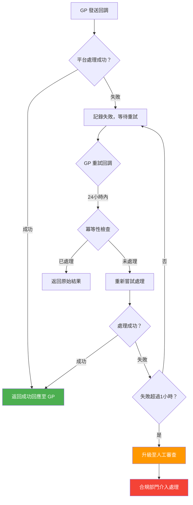

# 無縫錢包回調恢復 (Seamless Wallet Callback Recovery)

> **規範來源**: MGA Technical Standards Art. 3.1
> **目標讀者**: PM、合規專員
> **相關架構**: [Provider Error Recovery](../../architecture/03_Game_Integration/07_Provider_Error_Recovery.md)
> **最後更新**: 2026-04-02

---

## 1. 概述

無縫錢包 (Seamless Wallet) 整合模式下，遊戲供應商 (GP) 在每次下注和結算時，都會向平台的錢包系統發送回調 (Callback) 請求以扣除或增加玩家餘額。由於網路不穩定或系統故障，這些回調可能發生失敗、重複或順序錯誤等異常情況。

本規範定義了當無縫錢包回調出現異常時的完整恢復規則，包括重複回調的冪等性 (Idempotency) 處理、回調失敗後的自動重試機制，以及超過時限後需升級人工審查的流程。核心原則是：**因系統錯誤導致的任何情況，玩家餘額絕不能出現負值**。

---

## 2. 功能需求

### 2.1 冪等性處理機制

相同的回調在 24 小時冪等窗口期內重複到達時，系統的處理方式：

| 回調類型 | 重複到達的處理方式 |
|---------|-----------------|
| 下注扣款 (Debit) | 返回原始交易的結果（成功/失敗），不重複扣款 |
| 結算入帳 (Credit) | 返回原始交易的結果（成功/失敗），不重複入帳 |
| 回滾退款 (Rollback) | 返回原始退款的結果，不重複退款 |
| 超過 24 小時的重複回調 | 標記為「過期重複」，返回特定錯誤代碼，不執行任何餘額操作 |

### 2.2 回調失敗恢復流程

### 2.3 回調異常類型與處理規則

| 異常類型 | 說明 | 自動處理方式 |
|---------|------|------------|
| 網路逾時 | 平台未收到 GP 的回調 | GP 重試；若 GP 未重試，觸發主動查詢 |
| 重複回調 | 相同交易 ID 發送多次 | 冪等性攔截，返回原始結果 |
| 亂序回調 | 結算回調早於下注回調到達 | 暫存等待，依序處理 |
| 回滾失敗 | 退款操作在 1 小時內未成功 | 自動升級人工審查 |
| 餘額不足 | 扣款時玩家餘額不足 | 返回失敗，不執行扣款；GP 須取消遊戲局 |
| 負值風險 | 計算後餘額將為負值 | 強制拒絕，記錄事件，通知風控部門 |

### 2.4 人工審查升級標準

以下情況須自動升級至人工審查：

| 升級觸發條件 | 說明 |
|------------|------|
| 回滾 (Rollback) 失敗超過 1 小時 | 退款未能成功執行，可能導致玩家資金受損 |
| 同一交易重試超過 5 次仍失敗 | 系統性問題，需要技術介入 |
| 涉及金額超過設定閾值 | 高額交易失敗風險更大，需加強審查 |
| 玩家主動投訴相關交易 | 客服升級至財務調查 |

---

## 3. 業務規則

1. **冪等性窗口 24 小時**: 在交易完成後 24 小時內，相同交易 ID 的重複回調一律返回原始結果，不執行任何新的餘額操作。
2. **絕不允許負值餘額**: 任何回調處理的結果，若導致玩家帳戶餘額低於零，必須強制拒絕執行，並立即通知風控部門。
3. **回滾 1 小時升級**: 任何需要退款的回滾操作，若在 1 小時內未能成功執行，必須自動升級至人工審查，不得繼續等待。
4. **重複回調返回原始結果**: 重複回調的回應必須與原始回調完全一致，確保 GP 端的狀態與平台端保持同步。
5. **過期重複回調拒絕**: 超過 24 小時冪等窗口的重複回調，返回明確的錯誤代碼（而非靜默忽略），讓 GP 能夠識別並處理。
6. **玩家餘額保護原則**: 因平台系統錯誤導致的任何餘額損失，必須在確認後 24 小時內補償至玩家帳戶，不可要求玩家等待 GP 的確認。
7. **完整審計追蹤**: 所有回調的原始請求、處理結果及異常記錄須保存完整，用於事後對帳和監管查詢。

---

## 4. 監管合規

| 法規 | 條款 | 要求 |
|------|------|------|
| MGA Technical Standards | Art. 3.1（財務交易完整性）| 所有財務交易必須有完整的原子性保障；重複交易不得導致重複記帳；失敗交易必須有明確的退款機制 |
| MGA Remote Gaming Regulations | Reg. 7（玩家資金保護）| 玩家資金不得因平台技術故障而受損；補償須在確認問題後及時執行 |
| UKGC Technical Standards | Sec. 5（交易記錄）| 所有交易記錄（包括失敗和重試記錄）須保存至少 5 年，可供監管機構查閱 |

---

## 5. 驗收標準

- [ ] 相同交易 ID 的重複回調在 24 小時內返回原始結果，不觸發任何新的餘額操作
- [ ] 超過 24 小時的重複回調返回明確的「過期重複」錯誤代碼
- [ ] 任何情況下，回調處理結果不導致玩家帳戶餘額出現負值；若計算後將為負值，強制拒絕並記錄
- [ ] 回滾操作失敗超過 1 小時，自動在後台建立人工審查工單並通知合規人員
- [ ] 人工審查介面可顯示所有待處理的異常回調，包含原始請求內容、失敗原因及影響玩家資訊
- [ ] 所有回調記錄（成功、失敗、重複、升級）可在後台按時間、GP、交易類型查詢
- [ ] 月度對帳報告顯示回調成功率、冪等攔截次數、人工審查升級數量、補償金額
- [ ] 因平台錯誤導致的玩家餘額損失，在問題確認後 24 小時內完成自動補償或人工補償
