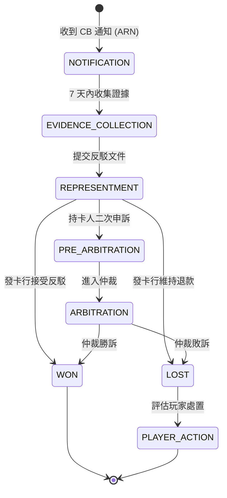

# 第 3 章：支付系統

---

## 3.1 模組概述

支付系統負責玩家資金的存入與提取，涵蓋多種支付方式的接入、智慧路由、對帳與爭議處理。系統須支援多幣種、多管轄區，並在確保合規的前提下提供最優的成功率與速度。

**核心職責**: 存提款流程、PSP 路由、對帳機制、支付方式管理、爭議處理

---

## 3.2 支援的支付方式

### 法幣支付

| 類型 | 方式 | 結算時間 | 備註 |
|------|------|---------|------|
| 銀行轉帳 | Wire / ACH / SEPA | T+1 至 T+3 | 大額首選 |
| 信用卡/借記卡 | VISA / Mastercard / AMEX | 即時 | 部分管轄區禁止信用卡 |
| 電子錢包 | LinePay / GCash / PayPal / Skrill / Momo | 即時 | 區域性可用 |
| QR Code | Alipay / WeChat Pay / PIX | 即時 | 亞洲、拉丁美洲市場 |

### 加密貨幣

| 幣種 | 網路 | 業務要求 |
|------|------|---------|
| USDT | TRC20 / ERC20 | 即時匯率轉換、錢包地址風險評分 |
| BTC | Bitcoin | 確認數 ≥ 3 (約 30 分鐘) |
| ETH | Ethereum | 確認數 ≥ 12 (約 3 分鐘) |

### 管轄區支付限制

| 管轄區 | 限制 | 生效日期 | 影響 |
|--------|------|---------|------|
| 英國 (UKGC) | 禁止信用卡博彩 | 2020-04 | 封鎖 VISA_CREDIT / MASTERCARD_CREDIT / AMEX |
| 澳洲 | 禁止線上博彩信用卡 | 2026-04 | 需提前準備封鎖機制 |
| 德國 | 完全禁止信用卡 | 2021 | 全面封鎖 |
| 瑞典 | 擴大禁止範圍 | 2025+ | 持續監控並執行限制 |

**業務規則**: 支付方式白名單須根據玩家所屬管轄區**動態載入**，不可硬編碼。

### 多幣種存提款規則

| 場景 | 規則 |
|------|------|
| 存款 | 玩家以任意支援幣種存款 → PSP 收款成功 → 按即時匯率兌換為商戶結算法幣 → 入帳錢包 |
| 提款 | 玩家申請提款 → 從結算法幣錢包扣款 → 按即時匯率兌換為玩家指定出金幣種 → PSP 出款 |
| 匯率凍結 | 存款確認後 15 分鐘內匯率凍結；提款審批通過後 15 分鐘內匯率凍結 |
| 跨幣種手續費 | 可配置（預設 0%），由商戶決定是否向玩家收取 |

> 詳細匯率管理規則見 Ch2 § 2.13。FX 風險分攤矩陣見 Ch2 § 2.13 FX 波動風險分攤矩陣（SSOT）。

---

## 3.3 區域 PSP 矩陣

| 區域 | 首選 PSP | 主要方式 | 備註 |
|------|---------|---------|------|
| 美國 | Stripe / Nuvei | 信用卡 / ACH | 需 PCI-DSS Level 1 |
| 歐盟 | Adyen / Trustly | SEPA / iDEAL / Sofort | PSD2 強認證 (3DS) |
| 中國 | Alipay / WeChat Pay | QR Code | 需商戶資質 |
| 菲律賓 | GCash / PayMaya | 電子錢包 | 高現金使用率市場 |
| 巴西 | MercadoPago / PagSeguro | Boleto / PIX | PIX 為即時轉帳標準 |
| 日本 | PayPay / Line Pay / Rakuten Pay | QR Code / 電子錢包 | 行動支付優先 |

---

## 3.4 智慧路由

### 路由權重因子

| 因子 | 權重 | 商業考量 |
|------|------|---------|
| **成功率** | 50% | 直接影響玩家體驗與平台損失 |
| **手續費** | 30% | 成本控制，大額交易影響顯著 |
| **結算速度** | 15% | 體驗提升，快速存款提高滿意度 |
| **VIP 優先** | 5% | 高價值玩家差異化服務 |

### PSP 健康狀態判定

| 狀態 | 成功率 | 路由決策 | 恢復條件 |
|------|--------|---------|---------|
| **健康** | ≥ 80% | 正常路由 | — |
| **降級** | 50–80% | 降低權重，分流至備用 | 成功率回升 ≥ 80% |
| **不可用** | < 50% | 完全切換至備用 | 連續 3 次健康檢查通過 |

### VIP 支付通道

| VIP 等級 | 通道優勢 | 費率優惠 |
|---------|---------|---------|
| Diamond / Platinum | 專屬客戶經理、最高優先 | -0.5% 費率 |
| Gold | 加速結算 (< 5 分鐘) | — |
| Silver / Bronze | 標準 PSP 通道 | — |

---

## 3.5 存款流程

### 標準流程

1. 玩家發起存款 → 系統建立訂單 (狀態: Pending) → 跳轉 PSP 支付頁
2. 玩家完成支付 → PSP 發送回調 → 系統驗證真實性
3. 驗證通過 → 入帳至玩家錢包 → 更新訂單 (狀態: Success) → 發送通知

### 存款限額

| 限額類型 | 配置層級 | 執行方式 |
|---------|---------|---------|
| 單筆最低金額 | 商戶可配置 | 即時檢查 |
| 單筆最高金額 | 商戶可配置 | 即時檢查 |
| 每日限額 | 依玩家等級 | 累計檢查 |
| 每月限額 | 依 VIP 等級 | 累計檢查 |

### 收銀台摩擦分層

> v2.2 新增 — 決策 N-05 (按風險分層收銀台摩擦)

**原則**: 低風險交易走快速通道以最大化轉化率，中高風險交易增加驗證步驟以保障安全。

| 風險等級 | 判定依據 | 存款流程步驟 | 最大點擊數 | 額外延遲 |
|---------|---------|-------------|----------|---------|
| **低風險** | 已 KYC L2+、歷史存款 ≥ 3 次、風險分數 < 30 | 選金額 → 確認 → 完成 | ≤ 3 步 | 0 |
| **中風險** | KYC L1 或風險分數 30-70 或首次使用新支付方式 | 選金額 → 確認 → 額外驗證(OTP/3DS) → 完成 | ≤ 5 步 | 5-10 秒 |
| **高風險** | KYC L0 或風險分數 ≥ 70 或管轄區要求(德國月限額) | 選金額 → 限額提醒 → 身分確認 → 3DS → 完成 | ≤ 7 步 | 10-30 秒 |

**ML 個人化推薦（Phase 3）**:
- 根據玩家歷史存款金額推薦預設金額（減少輸入摩擦）
- 根據地區偏好排序支付方式（如巴西優先 PIX、菲律賓優先 GCash）
- 目標: 存款成功率從基準 95% 提升至 ≥ 98%

---

## 3.6 提款流程

### 自動提款

- 小額提款 (< $500): 自動處理，無需人工審核
- 須通過風控評分檢查 (見 Ch6)
- 須通過 KYC 等級限額檢查 (見 Ch1)

### 提款審批層級

| 金額範圍 | 審批層級 | SLA | 所需文件 |
|---------|---------|-----|---------|
| < $100 | 客服專員 | 即時 | 玩家申請 |
| $100–$1,000 | 客服主管 | 1 小時 | 銀行驗證 |
| $1,000–$10,000 | CFO | 4 小時 | 完整銀行對帳單 |
| > $10,000 | CFO + CEO | 24 小時 | 全套文件 + 視訊驗證 |

### 提款方式

| 方式 | 說明 | 適用場景 |
|------|------|---------|
| API 自動出款 | 系統自動調用 PSP API 出款 | 小額、低風險 |
| 人工出款 | 財務人員後台操作轉帳 | 大額、需人工確認 |

### 假日期間出金 SLA 調整

> v2.2 新增 — GAP-9（假日期間出金 SLA 調整規則）

**問題**: 銀行轉帳在假日暫停，但平台 24/7 運作。未定義假日期間出金 SLA 調整規則。

**營業日曆管理**:

| 項目 | 規則 |
|------|------|
| 假日日曆 | 維護每個國家/地區的銀行假日日曆 |
| 更新頻率 | 每年自動更新 + 臨時假日人工維護 |
| 日曆來源 | 各國央行公告或第三方日曆服務 |

**SLA 調整規則**:

| 出金方式 | 假日影響 | 調整規則 |
|---------|---------|---------|
| 銀行轉帳 (Wire/SEPA/ACH) | 受影響 | SLA 計算排除銀行非營業日 |
| 電子錢包 (PayPal/GCash/PIX 等) | **不受影響** | 24/7 可用，無 SLA 調整 |
| 加密貨幣 | **不受影響** | 24/7 可用，無 SLA 調整 |

**玩家通知**:

| 場景 | 通知內容 |
|------|---------|
| 假日期間提交銀行轉帳出金 | 「您的出金正在處理中。由於 [假日名稱]，銀行處理將於 [下一個營業日] 恢復。」 |
| 提交前提示 | 若當前為銀行假日，在出金頁面顯示提示 + 建議使用電子錢包/加密貨幣即時出金 |

**營運儀表板**:

- 假日影響的出金請求以特殊標記顯示
- 假日期間出金積壓預警: 待處理銀行轉帳 > 50 筆 → 通知財務團隊
- 假日後首個營業日: 自動優先處理積壓出金

---

## 3.7 失敗交易處理

### 自動對帳

| 項目 | 規則 |
|------|------|
| 頻率 | 每 15 分鐘 |
| 目標 | 狀態 Pending 超過 30 分鐘的交易 |
| 動作 | 查詢 PSP 狀態並對帳 |

### 玩家爭議流程

1. 玩家上傳支付憑證 (銀行截圖)
2. 客服查詢 PSP API 驗證
3. PSP 確認已收款但平台未入帳 → 人工補入帳 + 審計記錄

### 嚴重等級分類

| 場景 | 優先級 | SLA | 通知對象 |
|------|--------|-----|---------|
| 大額交易未到帳 (> $1,000) | P0 嚴重 | 15 分鐘 | 財務 + CTO + 安全 |
| 掉單率 > 3% | P1 高 | 1 小時 | 財務 + 客服主管 |
| 單筆掉單 (已自動補帳) | P2 中 | 24 小時 | 每日匯總 |
| PSP Pending 狀態 | P3 低 | 僅監控 | — |

---

## 3.8 Chargeback 爭議處理

### 概述

Chargeback（爭議退款）是持卡人透過發卡行對已完成的交易提出異議並要求退款的流程。iGaming 行業 chargeback rate 通常 0.5–2%，超過卡組織閾值（VISA 0.9% / Mastercard 1.0%）將觸發監控計畫甚至 MID 凍結。

### Chargeback 生命週期

### 時限與 SLA

| 階段 | 時限 | 說明 |
|------|------|------|
| CB 通知接收 → 開始處理 | ≤ 24 小時 | 自動建立工單 |
| 證據收集 | 7 天（可配置，預設 30 天內完成反駁） | 含遊戲記錄、IP 日誌、KYC 文件 |
| Representment 提交 | 依卡組織要求（VISA 30 天 / MC 45 天） | 透過 PSP 提交 |
| 仲裁回應 | 依卡組織要求 | 費用 $250–$500/案 |

### 證據收集清單

| 證據類型 | 來源 | 說明 |
|---------|------|------|
| 玩家 KYC 文件 | Ch1 玩家管理 | 身份驗證已完過的證明 |
| 3DS 認證記錄 | PSP | 強認證成功記錄 |
| 遊戲投注記錄 | Ch2 錢包系統 | 交易明細、回合記錄 |
| IP / 設備日誌 | Ch6 風控 | 登入與投注的設備指紋 |
| 客服互動記錄 | Ch12 客服 | 玩家溝通歷史 |
| 條款同意記錄 | Ch1 | 註冊時的條款確認 |

### Chargeback 結果處理

| 結果 | 玩家帳戶影響 | 財務影響 |
|------|------------|---------|
| **反駁成功** | 無影響 | 退款撤銷，PSP 手續費可能部分返還 |
| **反駁失敗** | 記錄 CB 歷史，評估風險等級 | 承擔退款 + PSP 手續費 |
| **放棄反駁**（金額 < $25） | 記錄 CB 歷史 | 小額直接沖銷 |

### 玩家處置規則

| CB 次數 | 處置 | 說明 |
|---------|------|------|
| 第 1 次 | FLAG — 標記監控 | 可能為合法爭議 |
| 第 2 次 | 限制支付方式 — 僅允許電子錢包/加密 | 降低信用卡風險 |
| 第 3 次 | 帳戶凍結 + 人工審核 | 疑似友好詐欺 (Friendly Fraud) |
| 累計 CB 金額 > $1,000 | 永久封禁信用卡存款 | — |

### 監控與預警

| 指標 | 閾值 | 預警動作 |
|------|------|---------|
| 月度 CB Rate | ≥ 0.5% | 黃色警報 — 加強審核 |
| 月度 CB Rate | ≥ 0.8% | 橙色警報 — 限制高風險支付方式 |
| 月度 CB Rate | ≥ 1.0% | 紅色警報 — 通知 CFO + PSP 關係經理 |
| 單日 CB 筆數 | > 10 | 即時警報 — 檢查是否為批量攻擊 |
| 反駁成功率 | < 40% | 審查反駁流程品質 |

> **配置化**: CB Rate 閾值與反駁時限均為可配置參數，預設 30 天反駁窗口、1% 閾值。參數變更需 Maker-Checker 審批。

---

## 3.9 3D Secure 與安全

### 強認證要求

| 管轄區 | 要求 | 觸發條件 |
|--------|------|---------|
| 歐盟 (PSD2) | 3D Secure 2.0 強制 | 所有卡片交易 |
| 英國 | SCA (Strong Customer Authentication) | > £30 或累計 > £100 |
| 其他 | 建議啟用 | 依 PSP 支持度 |

### 加密貨幣 AML

- 所有加密存款須進行錢包地址風險評分
- 高風險地址 (混幣器、暗網相關) → 拒絕存款
- 單筆 > $10,000 等值 → 觸發 EDD

---

## 3.10 監控 KPI

| 指標 | 定義 | 目標 | 警報閾值 |
|------|------|------|---------|
| 掉單率 | 成功存款 / 總存款 × 100% | < 1% | > 3% |
| 入帳成功率 | 成功入帳 / 存款嘗試 × 100% | > 95% | < 90% |
| 平均入帳延遲 | PSP 成功 → 平台入帳 | < 30 分鐘 | > 2 小時 |
| 待處理積壓 | Pending > 2 小時的交易數 | < 10 筆 | > 50 筆 |
| 人工審核率 | 人工審核 / 總存款 × 100% | < 5% | > 15% |
| PSP API 成功率 | 成功查詢 / 總查詢 × 100% | > 99% | < 95% |

---

## 3.11 成功指標

| 指標 | 目標 | 說明 |
|------|------|------|
| 存款成功率 | ≥ 95% | 排除玩家主動取消 |
| 提款處理時間 (自動) | < 5 分鐘 | 低風險小額 |
| 提款處理時間 (人工) | 符合 SLA | 依金額層級 |
| 對帳準確率 | ≥ 99.9% | 平台 vs PSP |
| 支付路由最優率 | ≥ 85% | 選擇最優 PSP |
| 零資金損失 | 100% | 不允許資金遺失 |

---

## 3.12 對應技術文檔

> 🔧 **技術實作**: 詳見 [Part 2 Ch3: 支付系統技術架構](../technical/03_Payment_System_支付系統.md)
