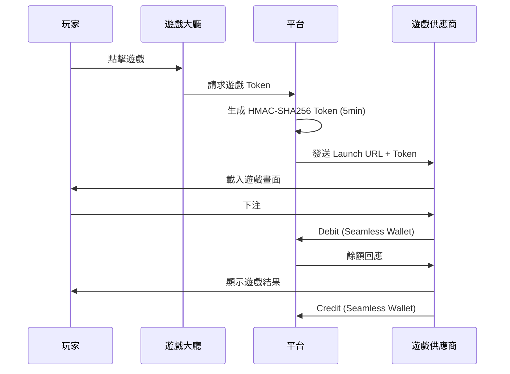

# 第 4 章：遊戲整合

---

## 4.1 模組概述

遊戲整合模組負責接入外部遊戲供應商 (Game Provider, GP)，提供統一的遊戲大廳體驗，並監控遊戲公平性。平台透過 Seamless Wallet 協議與 GP 即時互動，須確保 Token 安全、交易原子性，以及 RTP 合規。

**核心職責**: GP 接入標準、Token 驗證、遊戲大廳管理、RTP 監控、遊戲內容管理

---

## 4.2 GP 接入標準

### 接入流程

| 階段 | 時限 | 產出 |
|------|------|------|
| 商務對接 | 1–2 週 | 合約簽署、API 文件交換 |
| 技術對接 | < 5 個工作天 | Adapter 開發、測試環境聯調 |
| UAT 測試 | 2–3 天 | 測試報告、問題修復 |
| 上線審批 | 1 天 | 上線檢查表全部通過 |
| 上線監控 | 持續 | RTP 監控、交易監控 |

**目標**: GP 從簽約到上線 **< 5 個工作天** (技術對接階段)。

### GP 必備能力

| 能力 | 要求 | 優先級 |
|------|------|--------|
| Seamless Wallet 支援 | 必須支援 Debit/Credit/Rollback/GetBalance | P0 |
| Token 認證 | 接受平台簽發的 Token | P0 |
| 冪等性 | 支援 transactionId 冪等重試 | P0 |
| RTP 合規 | 提供 RTP 報告或即時 RTP 查詢 | P1 |
| 多幣種 | 支援玩家本幣操作 | P1 (Phase 5+) |
| 多語言 | 遊戲介面支援多語言 | P1 |
| 行動端適配 | 支援 Mobile Web / App 內嵌 | P1 |

### 上線檢查表

- [ ] Seamless Wallet 五端點全部聯調通過
- [ ] Token 驗證流程正確 (簽名驗證、過期檢查)
- [ ] 冪等性測試通過 (重複請求回傳相同結果)
- [ ] 餘額不足場景測試通過
- [ ] Rollback 場景測試通過
- [ ] 大額派彩場景測試通過
- [ ] 孤兒回合偵測與處理機制確認
- [ ] RTP 監控已配置並生效
- [ ] 遊戲大廳元數據已匯入

---

## 4.3 Token 驗證

### 驗證規則

| 規則 | 說明 |
|------|------|
| 簽名演算法 | HMAC-SHA256 |
| 有效期 | 5 分鐘 |
| 使用次數 | 一次性使用 (防重放) |
| 驗證失敗 | 回傳 `INVALID_TOKEN` 錯誤，拒絕操作 |
| Token 過期 | **一律拒絕**，包含 Win/Credit/Rollback。GP 須透過 Resettlement 或客服工單補發派彩（見 Ch2 § 2.8） |

### 防重放攻擊

- 每個 Token 使用後標記為已消費
- 已消費 Token 重複使用 → 拒絕
- Token 中須包含時間戳、玩家 ID、遊戲 ID

---

## 4.4 遊戲大廳

### 遊戲分類

| 主分類 | 子分類範例 | 排序規則 |
|--------|----------|---------|
| Slots (老虎機) | 經典 / 視頻 / 累積獎池 | 人氣、RTP、新上架 |
| Live Casino (真人) | 百家樂 / 輪盤 / 21 點 / 骰寶 | 人氣、真人荷官 |
| Table Games (桌遊) | 百家樂 / 輪盤 / 21 點 | 人氣 |
| Sports (體育) | 足球 / 籃球 / 棒球 / 電競 | 即時賽事、賠率 |
| Poker (撲克) | 德州 / 奧馬哈 | 桌數、獎池 |
| Fishing (捕魚) | 捕魚達人 / 海洋之星 | 人氣 |
| Lottery (彩票) | 大樂透 / 3D / 快開 | 開獎時間 |

### 遊戲元數據管理

| 欄位 | 說明 | 更新頻率 |
|------|------|---------|
| 遊戲名稱 | 多語言 | GP 推送或 4 小時同步 |
| 縮圖/封面圖 | CDN 分發 | GP 推送 |
| RTP | 理論 RTP | GP 提供 (上線時) |
| 最低/最高投注額 | 動態 | 可即時調整 |
| 支援設備 | Desktop / Mobile / Both | 上線時設定 |
| 遊戲標籤 | 多維標籤 (主題、特色、波動性) | 營運管理 |
| 上架狀態 | 啟用 / 停用 / 維護中 | 即時控制 |

### 遊戲大廳 KPI

| KPI | 目標 | 說明 |
|-----|------|------|
| 遊戲點擊率 (CTR) | ≥ 8% | 大廳展示 → 遊戲啟動 |
| 遊戲轉化率 | ≥ 12% | 遊戲啟動 → 首次投注 |
| CDN 命中率 | ≥ 98% | 遊戲素材快取效率 |
| 遊戲載入時間 | < 3 秒 | 從點擊到可玩 |

### 個人化推薦

- 根據玩家 RFM 分群推薦不同遊戲
- 根據玩家歷史偏好 (標籤: SLOTS_LOVER 等) 排序
- 新玩家展示高 RTP、低波動遊戲 (降低流失)

---

## 4.5 遊戲啟動流程

### 啟動失敗處理

| 失敗原因 | 處理方式 |
|---------|---------|
| Token 過期 | 自動重新生成 Token，重新啟動 |
| GP 服務不可用 | 顯示維護中，引導玩家至其他遊戲 |
| 餘額不足 | 顯示充值提示 |
| 管轄區限制 | 顯示該遊戲在您所在地區不可用 |

---

## 4.6 RTP 監控

### 監控規則

| 指標 | 計算 | 業務意義 |
|------|------|---------|
| 理論 RTP | GP 提供 (如 96.5%) | 遊戲設計基準 |
| 實際 RTP | 總派彩 / 總投注 × 100% | 實際返還率 |
| RTP 偏差 | 實際 RTP - 理論 RTP | 監控公平性 |

### 異常閾值與處置

| 等級 | 條件 | 處置 |
|------|------|------|
| **WARNING** | RTP > 120% 且 5 分鐘內平台虧損 > $5,000 | 發送警報，加強監控 |
| **CRITICAL** | RTP > 200% 且 5 分鐘內平台虧損 > $10,000 | 自動暫停遊戲 (Circuit Breaker) |
| **GLI-19 違規** | 實際 RTP 偏離理論 RTP > ±0.5% (長期) | 通知 GP，要求調查 |

### 英國額外規則 (UKGC)

| 規則 | 說明 |
|------|------|
| Slots 投注上限 (18–24 歲) | £2 |
| Slots 投注上限 (25 歲以上) | £5 |
| 自動旋轉間隔 | ≥ 2.5 秒 |
| 強制顯示淨盈虧 | 每次 Session 結束時 |

---

## 4.7 GP 維護與緊急關閉

### 計劃維護

| 項目 | 規則 |
|------|------|
| 提前通知 | GP 須提前 48 小時通知 |
| 玩家通知 | 維護前 1 小時在遊戲大廳顯示公告 |
| 進行中回合 | 維護前 30 分鐘停止新投注，等待所有回合結算 |
| 維護期間 | 遊戲顯示「維護中」，不可啟動 |

### 緊急關閉

| 觸發條件 | 處置 |
|---------|------|
| RTP 異常 (CRITICAL) | 自動暫停，通知 GP |
| GP API 不可達 | 自動標記為維護中 |
| 安全事件 | 管理員手動關閉 |

---

> 📎 **SSOT**: 本段為引用。權威定義請見 [Ch14 §14.4](./14_Third_Party_Integration_第三方整合.md)。變更請至 SSOT 來源。

## 4.8 GP 違約處理

| 違約等級 | 條件 | 處置 | 時限 |
|---------|------|------|------|
| **警告** | 單月 RTP 偏差 > ±1%，API 可用率 < 99% | 書面通知 GP + 加強監控 | 7 天內改善 |
| **限流** | 連續 2 月未改善，或結算延遲 > 24 小時 | 降低該 GP 在遊戲大廳的排序權重 | 14 天觀察 |
| **暫停** | 連續 3 月未改善，或嚴重 RTP 造假嫌疑 | 暫停新投注，現有回合繼續結算 | 立即生效 |
| **下架** | 嚴重安全事件或合規違規 | 完全移除 GP 所有遊戲 | 立即生效 |

**附帶處理**: 暫停/下架時，須通知受影響的活躍玩家，並處理未結算投注與未使用的免費旋轉。

### 部分結算（Partial Settlement / Partial Cashout）

| 場景 | 處理方式 |
|------|---------|
| 體育投注 Partial Cashout | 玩家可選擇提前結算部分投注金額（如 50%），剩餘繼續 |
| 計算公式 | `結算金額 = 投注金額 × 提前結算比例 × 當前賠率 / 原始賠率` |
| 流水計算 | 已結算部分按 Valid Bet 計算；未結算部分在最終結算時計算 |
| 紅利資金 | 紅利投注不允許 Partial Cashout（須完整結算） |

---

## 4.9 GP 破產時玩家餘額保護

> v2.2 新增 — GAP-10（GP 破產時玩家餘額保護）
> ⏳ 待法務確認具體條款

**問題**: GP 破產後，未結算投注與玩家餘額面臨風險，但目前無保護機制。

| 場景 | 處理方式 | 時限 |
|------|---------|------|
| 未結算投注 (OPEN rounds) | 平台自動回滾所有該 GP 的 OPEN 回合，退還投注金額至玩家錢包 | 即時 |
| GP 未付 Win (Credit) | 平台先行墊付玩家應得的 Win 金額（玩家保護優先） | 24 小時內 |
| 免費旋轉未使用 | 沒收並補償等值 CASH（⏳ 補償公式待定） | 48 小時內 |
| 玩家通知 | 通知所有受影響的活躍玩家 | ≤ 2 小時 |
| 遊戲下架 | 即時停用該 GP 所有遊戲，顯示「遊戲暫時不可用」 | 即時 |
| 監管通知 | 向所有適用牌照的監管機構報告 | ≤ 24 小時 |
| 託管考量 | 按交易量排名前 5 的 GP，考慮要求提供託管保證金 (⏳ 待法務評估) | 合約簽署時 |

**財務影響**:
- 平台墊付的金額計入「供應商應收帳款」，透過法律途徑追討
- 風險準備金: 建議按 GP 月度 GGR 的 5% 提撥風險準備金 (⏳ 待 CFO 確認)

---

## 4.10 Demo / 免費試玩

| 規則 | 說明 |
|------|------|
| 與真錢模式分離 | 完全獨立，不共享餘額 |
| 流水計算 | 不計入流水要求 |
| 可用性 | 註冊前可用 (吸引新玩家) |
| 限制 | 部分 Live Casino 不提供 Demo |

---

## 4.11 成功指標

| 指標 | 目標 | 說明 |
|------|------|------|
| GP 接入時間 | < 5 個工作天 | 技術對接階段 |
| 遊戲可用率 | ≥ 99.9% | 排除計劃維護 |
| 交易成功率 | ≥ 99.95% | Seamless Wallet 端點 |
| 遊戲啟動成功率 | ≥ 99.5% | 從點擊到可玩 |
| RTP 合規率 | 100% | 所有遊戲符合 GLI-19 |
| API 回應時間 (P95) | < 200ms | Seamless Wallet 端點 |

---

## 4.12 對應技術文檔

> 🔧 **技術實作**: 詳見 [Part 2 Ch4: 遊戲整合技術架構](../technical/04_Game_Integration_遊戲整合.md)
