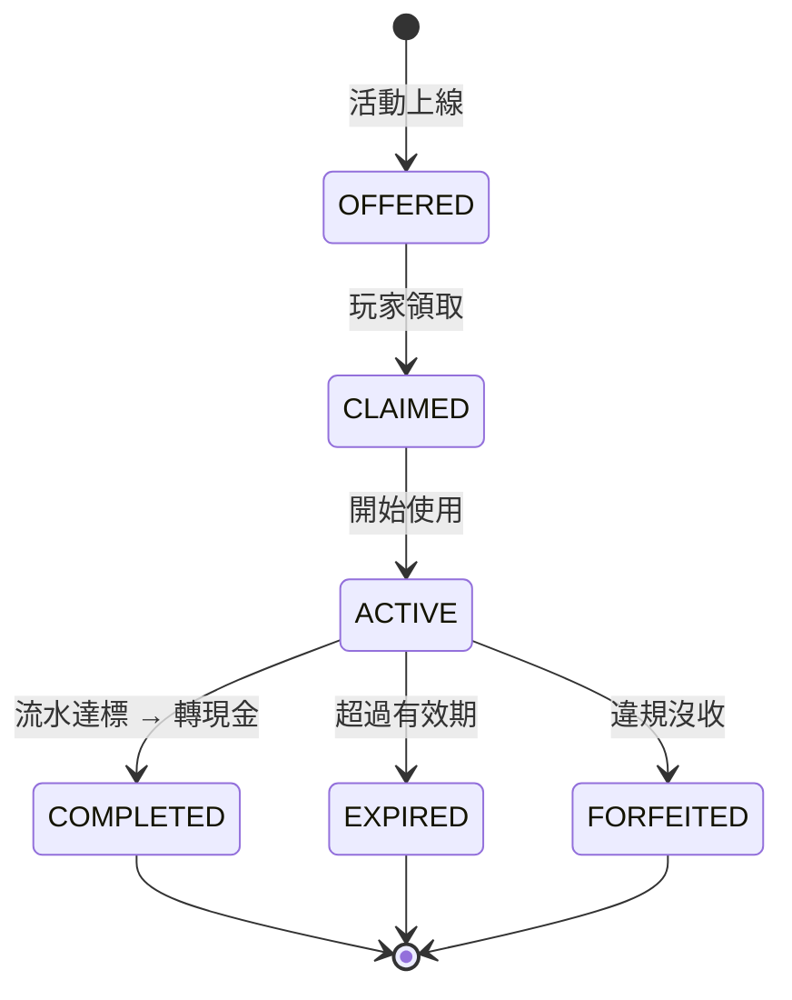

# 第 5 章：促銷與 VIP

---

## 5.1 模組概述

促銷與 VIP 模組負責管理所有紅利活動、流水要求計算、返水/回饋機制，以及防止紅利濫用。此模組與錢包系統 (BONUS 錢包) 緊密協作，是玩家留存與營收成長的核心驅動力。

**核心職責**: 紅利類型管理、流水要求計算、衝突策略、濫用偵測、區域化促銷

---

## 5.2 紅利類型

### 核心紅利類型

| 類型 | 英文 | 說明 | 典型參數 |
|------|------|------|---------|
| **歡迎紅利** | Welcome Bonus | 首存獎勵 | 100%–200% 匹配，上限 $500，25×–40× 流水 |
| **續存紅利** | Reload Bonus | 後續存款獎勵 | 50%–100% 匹配，上限 $200，20×–30× 流水 |
| **免費旋轉** | Free Spins | 指定 Slot 遊戲免費旋轉 | 10–200 次，面值 $0.10–$1.00 |
| **返水** | Cashback / Rebate | 虧損或流水回饋 | 虧損 5%–25% 或流水 0.2%–0.8% |
| **推薦紅利** | Referral Bonus | 推薦新玩家獎勵 | 固定金額 $10–$50，被推薦人首存後發放 |
| **活動紅利** | Activity Bonus | 特定活動獎勵 (錦標賽、排行榜) | 依活動規則 |
| **生日紅利** | Birthday Bonus | VIP 生日特權 | 依 VIP 等級，$10–$500 |

### 推薦紅利反欺詐要求

> v2.2 新增 — GAP-4（推薦人 KYC 驗證要求）

| 規則 | 說明 |
|------|------|
| 推薦人 KYC 要求 | 推薦人須完成 **KYC Level 1+** 後，推薦紅利方可發放 |
| 設備/IP 去重 | 推薦人與被推薦人不可共享設備指紋、IP 地址或支付方式 |
| 推薦頻率上限 | 單一推薦人每 30 天滾動窗口最多 10 筆成功推薦 |
| 推薦追回 (Clawback) | 被推薦人帳戶在 90 天內因欺詐被凍結 → 推薦人紅利自動追回 |
| 推薦鏈深度 | 僅支援一層推薦（不支援「推薦人的推薦人」獎勵） |

### 多段歡迎套餐

平台可配置多段歡迎紅利 (Multi-Deposit Welcome Package):

| 段數 | 匹配率 | 上限 | 流水要求 |
|------|--------|------|---------|
| 首存 | 200% | $500 | 35× |
| 二存 | 100% | $300 | 30× |
| 三存 | 50% | $200 | 25× |

---

## 5.3 流水要求

### 計算公式

```
流水要求 = 紅利金額 × 倍率
有效投注額 = 投注額 × 風險因子 (0/1) × 遊戲權重 (5%–100%)
```

### 有效投注額計算規則

**Standard Principal Method** (見 Ch0 § 0.8):
- WIN / LOSS / HALF_WIN / HALF_LOSS: Valid Bet = Bet Amount
- DRAW / VOID: Valid Bet = 0

**遊戲權重 (流水貢獻率)**:

| 遊戲類型 | 流水貢獻率 | 說明 |
|---------|----------|------|
| Slots | 100% | 完全貢獻 |
| Sports | 50% | 部分貢獻 |
| Baccarat | 可配置（預設 10%） | 低貢獻 (低莊家優勢)。**此為 SSOT**，Ch0 引用此值 |
| Blackjack | 10% | 低貢獻 |
| Roulette | 20% | 低貢獻 |
| Poker | 5% | 最低貢獻 |
| 其他桌遊 | 5%–20% | 依活動定義 |

### 免費旋轉流水計算

| 項目 | 規則 |
|------|------|
| 流水計算 | Turnover = 面值 (Free Spin Value) |
| 有效投注額 | Valid Bet = 0 (免費旋轉不計入 GGR) |
| 獎金歸屬 | 進入 BONUS 錢包，受流水要求約束 |

### 流水驗證時機

**關鍵業務規則**: 流水驗證發生在**提款時**，非即時解鎖。

- 玩家申請提款 → 檢查流水進度 → 未達標則拒絕提款
- 流水達標 → BONUS 自動轉入 CASH → 允許提款
- 轉入上限 = 原始紅利金額 (超額利潤不轉換)

### Token 過期對流水進度的影響 (BS-01)

> v2.2 新增 — 跨模組邊界決策 BS-01。詳見 [Appendix E](./Appendix_E_Cross_Module_Boundary_Scenarios_跨模組邊界情境矩陣.md)。

**情境**: Token 過期導致 Win/Credit 被拒（Ch4 §4.3 嚴格執行），玩家的流水進度如何處理？

| 項目 | 規則 |
|------|------|
| 流水進度 | **不回滾** — 已累計的有效投注額維持不變 |
| Win 資金 | 透過 **Resettlement（補結算）** 流程補發至 CASH 錢包 |
| 補發時機 | GP 端對帳後 24h 內自動觸發，或玩家申訴後手動觸發 |
| Rollback | Token 過期的 Rollback 同樣走 Resettlement，退回至原錢包 |

> **決策理由**: Token 過期是系統原因，非玩家行為。流水進度代表玩家已完成的投注，不應回滾。Credit 走 Resettlement 確保資金最終一致性。

### 三層驗證架構

| 層級 | 職責 | 說明 |
|------|------|------|
| Layer 1 | 投注驗證 | 即時判斷投注是否計入流水 (僅拒絕不合規投注) |
| Layer 2 | 流水累計 | 累計有效投注額，更新進度 |
| Layer 3 | 提款驗證 | 提款時檢查流水是否達標 |

---

## 5.4 紅利衝突與堆疊

### 衝突解決策略

| 策略 | 說明 | 適用場景 |
|------|------|---------|
| **MAX_REWARD** | 自動選擇金額最高的紅利 | 簡化玩家選擇 |
| **PRIORITY** | 按優先級排序，取最高優先 | 營運需精確控制 |
| **PLAYER_CHOICE** | 讓玩家自行選擇 | 最佳體驗 |
| **STACK_ALL** | 所有紅利同時生效 | 高促銷期 (慎用) |
| **TYPE_EXCLUSIVE** | 同類型互斥，不同類型可疊 | 常見做法 |
| **SEQUENTIAL** | 按順序依次完成 | 多段歡迎套餐 |

### 全局限制

| 限制 | 規則 |
|------|------|
| 最大同時生效紅利 | ≤ 5 個 |
| 紅利總額上限 | $10,000 |
| 每日領取次數 | ≤ 3 次 |
| 規則理解度 | 玩家應能在 < 5 秒內理解紅利規則 |

---

> 📎 **SSOT**: 本段為引用。權威定義請見 [Ch1 §1.5](./01_Player_Management_玩家管理.md)。變更請至 SSOT 來源。

## 5.5 紅利生命週期



### 過期處理

| 場景 | 處理方式 |
|------|---------|
| 流水未達標 → 過期 | 全額沒收 BONUS 餘額 |
| 流水已達標 → 過期 | 按規則轉入 CASH (上限 = 原始紅利額) |
| **過期時有未結算投注 (BS-02)** | **立即沒收未使用的 BONUS 餘額**。未結算投注繼續正常結算：Win 歸入 **CASH 錢包**，**免除流水要求**（不超過原始紅利額上限）；虧損正常扣除。📎 跨模組決策詳見 [Appendix E BS-02](./Appendix_E_Cross_Module_Boundary_Scenarios_跨模組邊界情境矩陣.md) |
| 過期通知 | 到期前 24 小時通知玩家 |
| 每日對帳 | 每日 03:00 (UTC+8) 掃描過期紅利 |

---

## 5.6 返水 / 回饋

### 返水類型

| 類型 | 計算公式 | 適用場景 | 典型比率 |
|------|---------|---------|---------|
| **虧損返水** | (總投注 - 總派彩) × 返水率 | 虧損玩家挽回 | 5%–25% (依 VIP) |
| **流水返水** | 有效投注額 × 返水率 | 活躍獎勵 | 0.2%–0.8% (依 VIP) |
| **VIP 返佣** | 淨虧損 × 返佣率 | Diamond/Platinum | 10%–25% |

### 返水與紅利互動規則

| 場景 | 規則 |
|------|------|
| 返水是否計入流水 | **否** — 返水入帳至 CASH 錢包，不受流水要求約束 |
| 返水是否受紅利鎖定影響 | **否** — 返水為獨立機制，不受活躍紅利的提款限制影響 |
| 返水+紅利同時存在 | 返水直接入 CASH，紅利獨立在 BONUS 錢包，互不干擾 |
| 返水計算排除紅利投注 | **可配置** — 預設包含所有投注（含紅利資金投注） |
| 衝突策略適用範圍 | §5.4 六種衝突策略**僅適用於紅利之間**，返水不受衝突策略約束 |

### VIP 等級返水率

| VIP 等級 | 虧損返水 | 流水返水 | 結算週期 |
|---------|---------|---------|---------|
| Bronze | 5% | 0.1% | 每月 |
| Silver | 10% | 0.3% | 每週 |
| Gold | 15% | 0.5% | 每週 |
| Platinum | 20% | 0.8% | 每週 |
| Diamond | 25% | 1.2% | 每日 |

---

## 5.7 紅利濫用偵測

### 常見濫用手法

| 手法 | 說明 | 偵測方式 |
|------|------|---------|
| **多帳戶** | 同一人多帳戶領取紅利 | 設備指紋 / IP / 支付方式關聯 |
| **紅利獵人** | 專門低風險刷流水 | 投注模式分析 (最低投注額 + 高流水) |
| **對沖投注** | 同一賽事下相反注 | 同一事件雙向投注偵測 |
| **套利** | 利用不同賠率差異套利 | 跨平台賠率比對 |
| **籌碼轉移** | 故意輸給特定帳戶 | Win/Loss 率異常 + 帳戶關聯 |

### 偵測閾值

| 指標 | 閾值 | 風險等級 |
|------|------|---------|
| 紅利獵人評分 | ≥ 60 | FLAG (調查) |
| 紅利獵人評分 | ≥ 90 | BLOCK (封鎖紅利) |
| 對沖投注金額 | > $1,000 同一事件 | BLOCK |
| 有效投注率 | < 20% 持續 7 天 | FLAG |
| 多帳戶 (同設備 3+) | — | URGENT (凍結) |

### 處罰措施

| 違規等級 | 處置 |
|---------|------|
| 首次 FLAG | 標記監控，暫停紅利資格 7 天 |
| 確認濫用 | 沒收所有 BONUS 餘額 + 紅利產生的盈利 |
| 嚴重濫用 | 帳戶凍結 + 永久禁止領取紅利 |
| 多帳戶確認 | 所有關聯帳戶凍結，僅保留一個 |

---

## 5.8 區域化促銷

### 東南亞市場

| 特色 | 說明 |
|------|------|
| 節慶驅動 | 農曆新年、宋干節、開齋節、中秋節 |
| 行動優先 | App 體積 < 5MB |
| 捕魚遊戲 | 高人氣，需特定促銷 |
| 幸運數字 | 8、88、888、9 (避開 4) |
| 配色 | 紅/金為主 |

### 拉丁美洲市場

| 特色 | 說明 |
|------|------|
| 足球主導 | 81% 為足球投注 |
| PIX 必備 | 81–90% 玩家使用 PIX |
| 無信用卡 | 不推廣信用卡存款 |

### 歐洲市場 (UKGC)

| 特色 | 說明 |
|------|------|
| 流水上限 | 10× 最大 |
| 混合商品禁止 | 不可將博彩紅利與非博彩優惠混合 |
| Slots 投注上限 | £5 (25+) / £2 (18–24) |
| GDPR Opt-In | 行銷訊息必須事先取得同意 |
| 廣告限制 | 德國有廣告宵禁 |

---

## 5.9 促銷管理

### 審批流程

| 操作 | 審批要求 |
|------|---------|
| 建立新活動 | Maker-Checker (製作者 + 審批者) |
| 修改活動參數 | 敏感參數修改需升級審批 |
| 緊急停止活動 | 任何管理員可執行，事後補審批 |

### 配置要求

- 所有促銷參數**不可硬編碼**，必須可配置
- 參數變更即時生效，無需部署
- 所有配置變更留審計記錄

### 每日對帳

| 項目 | 規則 |
|------|------|
| 時間 | 每日 03:00 UTC+8 |
| 內容 | 紅利發放 vs 紅利核銷 vs 流水達標 |
| 差異容忍 | ≤ 0.01% |

---

## 5.10 監控 KPI

| KPI | 目標 | 說明 |
|-----|------|------|
| 紅利成本佔 GGR | ≤ 15% | 成本控制 |
| 流水完成率 | ≥ 30% | 紅利轉化效率 |
| 紅利相關投訴率 | ≤ 2% | 規則清晰度 |
| 對帳準確率 | ≤ 0.01% 差異 | 財務準確性 |
| 濫用偵測率 | ≥ 70% | 風控有效性 |
| 紅利 ROI | ≥ 1.2× | 投資回報 |

### 效能目標

| 指標 | 目標 |
|------|------|
| 紅利發放延遲 | < 100ms (P99) |
| 流水計算更新 | < 200ms |
| 紅利查詢回應 | < 50ms |
| 系統成功率 | > 99.9% |

---

## 5.11 成功指標

| 指標 | 目標 | 說明 |
|------|------|------|
| 首存轉化率提升 | +10% | 歡迎紅利效果 |
| 30 日留存率提升 | +5% | 返水/續存紅利效果 |
| 紅利濫用率 | < 3% | 風控有效性 |
| 玩家滿意度 (紅利) | ≥ 4.0/5 | 規則清晰、發放及時 |

---

## 5.12 對應技術文檔

> 🔧 **技術實作**: 詳見 [Part 2 Ch5: 促銷與 VIP 技術架構](../technical/05_Promotions_VIP_促銷與VIP.md)
