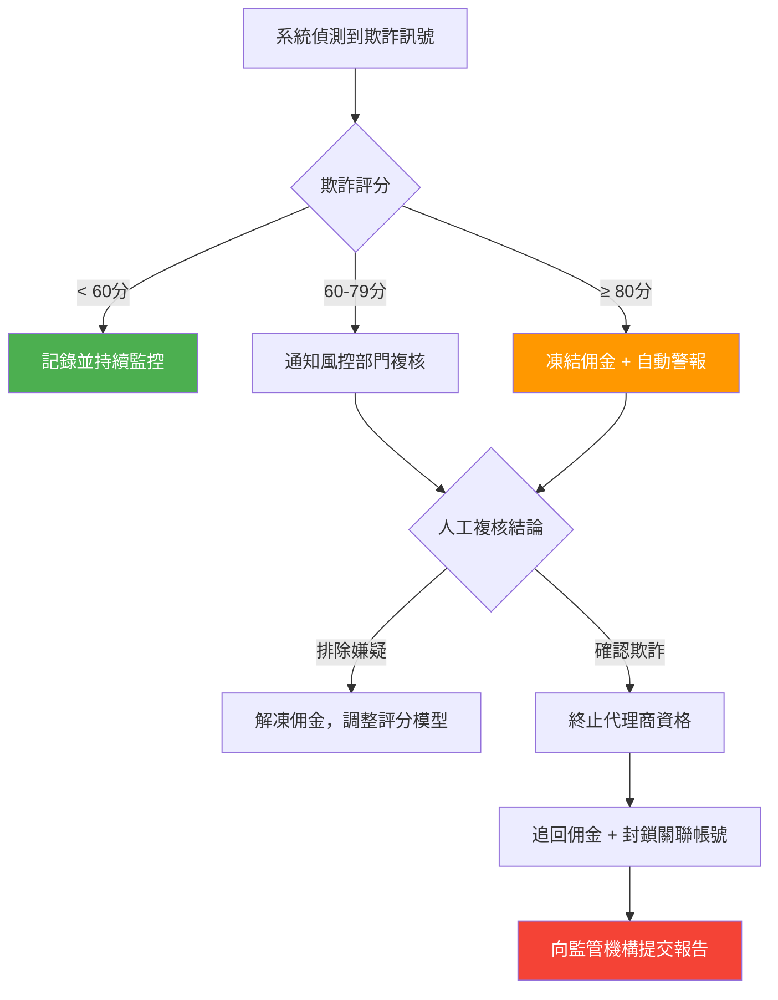

# 代理商欺詐偵測 (Affiliate Fraud Detection)

> **規範來源**: FATF R.12、MGA Affiliate Regulation Art. 6
> **目標讀者**: PM、合規專員
> **相關架構**: [Risk Engine Architecture](../../architecture/05_Risk_Engine/README.md)
> **最後更新**: 2026-04-02

---

## 1. 概述

代理商欺詐 (Affiliate Fraud) 是指代理商透過不正當手段虛增推薦轉換數量或佣金收益的行為，常見模式包括：偽造推薦玩家 (Fake Referrals)、利用多帳號濫用獎金後由代理商帳號收集佣金，以及在同一設備或 IP 地址下批量建立假玩家帳號。

本規範定義了代理商欺詐偵測的監控規則、風險評分機制、7 天新玩家觀察期，以及發現欺詐後的佣金逆轉和代理商帳號處置流程。有效的代理商欺詐偵測可保護平台免受財務損失，並確保符合 MGA 代理商監管規定及 FATF 的相關反洗錢要求。

---

## 2. 功能需求

### 2.1 新玩家推薦觀察期

每位透過代理商連結新註冊的玩家，自首次存款起進入 **7 天觀察期**：

| 觀察指標 | 監控內容 | 風險觸發閾值 |
|---------|---------|------------|
| 設備指紋 | 是否與同一代理商的其他推薦玩家共用設備 | ≥ 3 名玩家共用 |
| IP 地址 | 是否與同一代理商其他推薦玩家共用 IP | ≥ 5 名玩家共用 |
| 存提款行為 | 存款後是否立即提款，不進行真實博彩 | 存提比 > 90% |
| 獎金使用模式 | 是否集中使用歡迎獎金後即停止活動 | 首存後 7 天無第二次存款 |
| 帳號資訊相似性 | 電話、郵箱、姓名是否有規律性相似 | 系統自動比對 |

### 2.2 代理商風險評分規則

| 欺詐指標 | 評分權重 | 說明 |
|---------|---------|------|
| 同一設備多推薦 | +30 分 | ≥ 3 名推薦玩家共用設備指紋 |
| 同一 IP 多推薦 | +20 分 | ≥ 5 名推薦玩家共用同一 IP 地址 |
| 高存提比率 | +25 分 | 推薦玩家平均存提比 > 90% |
| 獎金濫用模式 | +20 分 | ≥ 60% 推薦玩家符合獎金農場 (Bonus Farming) 特徵 |
| 推薦量激增 | +15 分 | 單月推薦量超過歷史平均值 200% |
| 玩家帳號被封鎖 | +10 分/人 | 推薦玩家因欺詐被封鎖（最高 +50 分）|

### 2.3 佣金逆轉規則

| 情境 | 處置方式 |
|------|---------|
| 推薦玩家被認定為欺詐帳號 | 撤銷該玩家為代理商帶來的全部佣金 |
| 推薦玩家符合獎金農場特徵 | 撤銷該玩家首次存款週期內的佣金 |
| 代理商欺詐評分超過 80 分 | 凍結本月全部佣金，啟動深度調查 |
| 確認代理商參與欺詐 | 終止代理商合作，追回過去 6 個月佣金 |

### 2.4 發現欺詐後的處置流程

---

## 3. 業務規則

1. **7 天觀察期強制執行**: 每位透過代理商連結新註冊的玩家，首次存款後自動進入 7 天觀察期，期間的行為數據納入代理商欺詐評分計算。
2. **同設備/IP 推薦限制**: 同一設備指紋下，同一代理商的推薦新玩家達到 3 人，自動觸發欺詐調查；超過 10 人，自動暫停該代理商的新推薦佣金資格。
3. **佣金逆轉時限**: 佣金逆轉 (Commission Clawback) 可在支付後 90 天內執行；確認為代理商主導欺詐的，可追回最長 6 個月的佣金。
4. **欺詐評分透明度**: 代理商有權在佣金被凍結後申請查閱欺詐評分的主要觸發因素，但不得取得其他玩家的具體資料。
5. **監管報告義務**: 凡確認為代理商欺詐的案件，須在 5 個工作天內向相關監管機構提交書面報告。
6. **關聯帳號封鎖**: 確認欺詐後，系統須自動識別並封鎖所有與欺詐代理商相關的玩家帳號，防止資金轉移。
7. **欺詐情報共享**: 被確認為欺詐的代理商資訊（匿名化後），須與行業欺詐情報共享網絡同步。

---

## 4. 監管合規

| 法規 | 條款 | 要求 |
|------|------|------|
| FATF R.12 | 代理商盡職調查 | 高風險代理商須進行增強盡職調查 (EDD)；代理商欺詐行為的反洗錢影響須評估並上報 |
| MGA Affiliate Regulation | Art. 6（代理商監督責任）| 平台對代理商欺詐行為負有監督責任；發現欺詐後須及時處置並報告 |
| MGA Affiliate Regulation | Art. 8（佣金透明度）| 佣金計算規則須透明；逆轉佣金須有完整文件說明理由 |
| GDPR | Art. 22（自動化決策）| 純自動化欺詐評分導致的重大決策（如終止合作）須有人工複核環節 |

---

## 5. 驗收標準

- [ ] 透過代理商連結新註冊的玩家，首次存款後自動進入 7 天觀察期，無需人工設定
- [ ] 同一代理商的推薦玩家共用設備指紋達 3 人時，系統自動觸發欺詐調查通知
- [ ] 代理商欺詐評分達到 80 分時，系統自動凍結當月佣金並向風控部門發出警報
- [ ] 確認欺詐的代理商，系統支援追回最長 6 個月的歷史佣金
- [ ] 確認欺詐後 5 個工作天內，系統提供監管報告草稿（合規人員確認後提交）
- [ ] 被封鎖代理商的所有關聯玩家帳號自動標記為高風險，需人工複核後才能繼續使用
- [ ] 欺詐評分計算過程可追蹤：每個觸發指標的分數明細可在後台查詢
- [ ] 代理商欺詐偵測月報可匯出，包含：評分分布、凍結佣金金額、確認欺詐案件數
