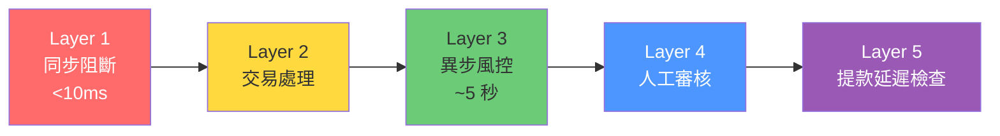

# 第 6 章：風控與合規

---

## 6.1 模組概述

風控與合規模組是平台安全的核心防線，負責即時偵測詐欺行為、評估交易風險、管理 AML/KYC 合規流程。系統採用**配置驅動、人工為中心**的設計理念——投注時不拒絕，提款時執行，確保最佳玩家體驗的同時有效攔截風險。

**核心職責**: 風控規則管理、風險評分、詐欺偵測、人工審核工作流、提款風控、AML 合規

---

## 6.2 風控架構概覽

### 五層偵測管線

| 層級 | 名稱 | 時機 | 功能 | 業務影響 |
|------|------|------|------|---------|
| **Layer 1** | 同步阻斷 | 投注時 (< 10ms) | 僅攔截最高確信度場景 | 極少觸發，不影響體驗 |
| **Layer 2** | 交易處理 | 投注後即時 | 正常交易流程 | 玩家立即看到結果 |
| **Layer 3** | 異步風控 | 投注後 ~5 秒 | 規則評估 → 生成風控提案 | 不影響投注體驗 |
| **Layer 4** | 人工審核 | 待審核佇列 | 分析師審核提案 → 決策 | SLA 驅動 |
| **Layer 5** | 提款延遲檢查 | 提款申請時 | 30 天回溯 → 凍結可疑金額 | 攔截最終出金 |

### 三層即時風控 vs 五層管線

- **業務視角 (三層)**: 同步阻斷 → 異步 BLOCK → 異步 FLAG
- **完整管線 (五層)**: 上述三層 + 人工審核 + 提款延遲檢查
- 兩種描述指同一系統的不同抽象層次

---

## 6.3 Layer 1: 同步阻斷

**處理時間**: < 10ms (僅快取查找)

**觸發條件** (僅最高確信度):

| 規則 | 說明 | 處置 |
|------|------|------|
| 黑名單玩家 | 已確認的詐欺帳戶 | 立即拒絕投注 |
| IP 封鎖 | 已知攻擊來源 IP | 拒絕請求 |
| 帳戶凍結 | 審核中的帳戶 | 拒絕所有操作 |
| 自我排除名單 | UKGC 法規要求 | 拒絕登入與投注 |
| 未成年偵測 | 年齡驗證未通過 | 拒絕所有操作 |

**關鍵原則**: Layer 1 **僅拒絕**，不做複雜判斷。零容忍、零延遲。

---

## 6.4 Layer 3: 異步風控規則

### BLOCK 規則 (高優先級)

| 規則 | 說明 | 偵測方式 |
|------|------|---------|
| 機器人偵測 | 自動化投注行為 | 行為模式分析 |
| 同場對沖 | 同一賽事下相反注 | 即時投注比對 |
| 同 IP 套利 | 同 IP 關聯帳戶對沖 | IP + 帳戶關聯 |
| 異常賠率 | 統計異常的賠率選擇 | 賠率偏離分析 |
| 流水操控 | 人為製造流水 | 投注模式分析 |

### FLAG 規則 (中優先級)

| 規則 | 說明 | 偵測方式 |
|------|------|---------|
| 跨場對沖 | 不同賽事間的對沖 | 歷史投注分析 |
| 低賠率洗流水 | 賠率 < 1.5 的投注 | 賠率過濾 |
| 異常投注模式 | 不符合玩家歷史的投注行為 | 行為基線比對 |
| 高頻投注 | > 10 次/分鐘 | 速率檢查 |

### 規則獨立觸發

**設計原則**: 每條規則獨立觸發，**不做分數累積**。取所有匹配規則中的**最高優先級**。

**為何不累積分數?**
1. 稀釋風險: 黑名單 (嚴重) 被次要異常稀釋
2. 混合風險: 詐欺、AML、套利無法在同一維度比較
3. 合規要求: MGA/UKGC 要求黑名單、自我排除、未成年人**立即行動**

**解決方案**: 取所有匹配規則中的**最高優先級** (如規則 A = MEDIUM、規則 B = HIGH → 最終 HIGH)。

### 複合風險升級邏輯

> v2.2 新增 — 決策 N-01 (Hybrid 模型)

獨立觸發為基礎原則，但新增**複合升級**機制以攔截「多維度中度異常」：

| 觸發條件 | 升級行為 | 原因 |
|---------|---------|------|
| ≥ 3 條 MEDIUM 規則同時觸發 | 自動升級為 **HIGH** | 多維度同時異常暗示帳戶被盜用或團夥操作 |
| ≥ 2 條 HIGH 規則同時觸發 | 自動升級為 **URGENT**（1h SLA） | 高度可疑，需經理介入 |
| BLACKLIST + 任何其他規則 | 維持 **AUTO_REJECT**，不降級 | 黑名單永遠最高優先 |

### ML 加權輔助層（Phase 3）

> 規劃：Phase 3 風控引擎上線後啟用

| 項目 | 說明 |
|------|------|
| 模型架構 | 規則分數 60% + ML 行為分數 40% = 綜合風險分數 |
| 適用範圍 | 僅 Layer 3 異步風控，**不影響** Layer 1 同步阻斷 |
| 部署策略 | 影子模式（Shadow Mode）運行 ≥ 30 天，與規則引擎結果對比驗證後才啟用 |
| 回退機制 | ML 服務不可用時自動回退至純規則引擎 |
| 合規要求 | ML 決策需可解釋（SHAP/LIME），審計日誌記錄模型版本與輸入特徵 |

---

> 📎 **SSOT**: 本段為引用。權威定義請見 [Ch1 §1.4](./01_Player_Management_玩家管理.md)。變更請至 SSOT 來源。

## 6.5 七維風險評估

| 維度 | 說明 | 關鍵指標 |
|------|------|---------|
| **交易金額** | 單筆交易規模 | 閾值梯度觸發 |
| **頻率** | 交易速度 (存款、投注、提款) | 每小時/每日速率 |
| **KYC 等級** | 客戶盡職調查完成度 | L0–L3 驗證層級 |
| **帳齡** | 帳戶註冊時間 | 天/月/年 |
| **行為模式** | 投注模式、勝率、遊戲一致性 | 異常分數 |
| **IP / 設備** | 設備指紋、位置、瀏覽器指紋 | 65,000+ 數據點 |
| **VIP 等級** | 玩家分級 | Bronze → Diamond |

**關鍵合規規則**: VIP 玩家**不享有任何風控豁免**。VIP 狀態僅影響審核佇列優先級，**絕不影響**規則觸發或 AML 閾值 (Entain £17M 罰款前車之鑑)。

> v2.2 補充 — 決策 N-04 (VIP 無豁免，更快 SLA)

**VIP 風控 SLA 差異化**:

| VIP 等級 | 人工審核 SLA | 提款審核 SLA | 可豁免項目 | 不可豁免項目 |
|---------|-------------|-------------|----------|------------|
| Diamond | 15 分鐘 | 30 分鐘 | 無 | 所有風控規則、AML 閾值、KYC 升級 |
| Platinum | 30 分鐘 | 1 小時 | 無 | 同上 |
| Gold | 1 小時 | 2 小時 | 無 | 同上 |
| Silver / Bronze | 標準 SLA | 標準 SLA | 無 | 同上 |

**明確禁止**: 任何配置或規則**不得**允許 VIP 跳過風控審核步驟。VIP 可獲得更快的審核排程，但審核本身的完整性不可妥協。此規則不可被 L2（商戶）或 L3（玩家分層）層級覆蓋。

---

## 6.6 風險評分邊界

### 主邊界 (SSOT)

| 分數範圍 | 決策 | 處置 |
|---------|------|------|
| **[0, 30)** | AUTO_APPROVE | 自動通過，即時處理 |
| **[30, 70)** | MANUAL_REVIEW | 人工審核佇列，SLA 驅動 |
| **[70, 100]** | AUTO_REJECT | 凍結資產，自動拒絕提款 |

### 提款審批子分級

| 優先級 | 可疑金額 | SLA | 超時處置 | 升級規則 |
|--------|---------|-----|---------|---------|
| **URGENT** | > $10,000 | 1 小時 | 自動拒絕提款 | 立即升級至經理 |
| **HIGH** | > $5,000 | 2 小時 | 自動拒絕提款 | 2 小時未處理則升級 |
| **MEDIUM** | > $1,000 | 24 小時 | 自動拒絕提款 | 24 小時未處理則升級 |
| **LOW** | $0–$1,000 | 48 小時 | 自動通過 (釋放資金) | 標準佇列 |

### SLA 管理

- 動態優先級升級: LOW → MEDIUM → HIGH → URGENT (超時自動升級)
- SLA 75% 預警通知
- SLA 監控每 5 分鐘執行一次

---

## 6.7 Layer 4: 人工審核工作流

### 審核佇列

- 排序: 優先級 (DESC) → 建立時間 (ASC)
- 分配: 審核人員**主動認領** (非自動分配)

### 三級權限

| 角色 | 權限 | 範圍 |
|------|------|------|
| **Reviewer** | 處理提案 (通過/拒絕/部分/升級) | 所有一般提案 |
| **Senior Analyst** | 處理升級案件 | 複雜案件 |
| **Compliance Manager** | 最終決策、政策配置 | 最終裁決權 |

### 決策類型

| 決策 | 說明 | 資金處置 | 狀態變更 |
|------|------|---------|---------|
| **Approve** | 可疑金額為合法 | 釋放至錢包 | PENDING → APPROVED |
| **Reject** | 確認違規 | 永久扣除 | PENDING → REJECTED |
| **Partial** | 部分合法 | 釋放部分，凍結其餘 | PENDING → PARTIAL |
| **Escalate** | 案件過於複雜 | 維持凍結 | PENDING → ESCALATED |

**業務規則**:
- Reject 必須附帶文字理由 (強制)
- 所有決策記入審計記錄 (保留 7 年)

---

## 6.8 Layer 5: 提款延遲檢查

| 項目 | 規則 |
|------|------|
| 觸發時機 | 玩家提交提款申請時 |
| 回溯窗口 | 30 天 |
| 判斷邏輯 | 匯總所有未解決的風控提案可疑金額 |
| 觸發條件 | 可疑金額 > 0 → 凍結提款，生成審核提案 |

---

## 6.9 詐欺偵測模式

### 多帳戶偵測

| 關聯類型 | 風險等級 | 處置 |
|---------|---------|------|
| 同 IP + 同設備 | CRITICAL | 立即凍結 |
| 同 IP + 不同設備 | MEDIUM | 家庭帳戶驗證 |
| 不同 IP + 同設備 | HIGH | 帳戶合併調查 |
| 同電話號碼 | CRITICAL | 註冊時阻擋 |
| 同支付方式 | URGENT | 帳戶連結驗證 |
| 3+ 帳戶在關聯圖中 | URGENT | 網路凍結 |

### 設備指紋

- 每設備 65,000+ 數據點 (Canvas、WebGL、Audio 指紋等)
- 反規避偵測: 模擬器 → FLAG、VPN → HIGH、GPS 偽造 → HIGH
- 反指紋工具 (GoLogin 等) → BLOCK

> 📎 **SSOT**: 本段為引用。權威定義請見 [Ch15 §15.1](./15_Responsible_Gambling_負責任博彩.md)。變更請至 SSOT 來源。

### 自我排除逃避偵測 (UKGC LCCP 17.1.1)

**註冊時檢查**:
- 姓名模糊匹配 (Levenshtein 距離 ≤ 2)
- 生日精確匹配
- 地址模糊匹配
- Gamstop API 查詢 (英國)

**匹配處理**:
- 潛在匹配 (相似度 70%+): 暫停帳戶 → 24 小時內人工審核
- 確認匹配: 立即凍結 → 取消投注 → 退還現金 → 沒收紅利

---

## 6.10 串謀偵測（Collusion Detection）

### 真人賭場串謀

| 模式 | 偵測方式 | 風險等級 |
|------|---------|---------|
| 百家樂對沖 | 同桌多帳戶分別押莊/閒，關聯分析（IP / 設備 / 支付） | CRITICAL |
| 結果共享 | Live Dealer 同桌玩家間可疑的通訊時間模式 | HIGH |
| 籌碼轉移 | 同桌固定勝負配對（A 恆輸、B 恆贏） | URGENT |

### 撲克串謀（Soft Play）

| 模式 | 偵測方式 | 風險等級 |
|------|---------|---------|
| 合謀加注 | 同桌 2+ 玩家協調加注/棄牌模式 | HIGH |
| 資訊共享 | 行動時間異常一致（< 1 秒差異） | MEDIUM |
| 籌碼傾倒 | 一方持續性地向另一方轉移籌碼（Win/Loss 比異常） | URGENT |

### 跨平台對沖

| 模式 | 偵測方式 | 風險等級 |
|------|---------|---------|
| 體育對沖 | 同一賽事在本平台與外部平台下反向注 | FLAG（透過行業共享數據偵測） |

### 偵測觸發後處理

| 風險等級 | 處置 |
|---------|------|
| MEDIUM | FLAG — 納入人工審核佇列 |
| HIGH | 暫停涉及帳戶的提款 |
| URGENT / CRITICAL | 凍結所有關聯帳戶，通知合規團隊 |

---

## 6.11 Bot 偵測規範

### 偵測特徵（至少 5 個維度）

| # | 特徵 | 偵測方式 | 閾值 |
|---|------|---------|------|
| 1 | 滑鼠軌跡 | 軌跡直線率 > 90%（非人類曲線） | FLAG |
| 2 | 點擊頻率 | 精確等間隔點擊（標準差 < 50ms） | HIGH |
| 3 | API 呼叫模式 | 非瀏覽器 User-Agent / 缺少 Cookie 支援 | BLOCK |
| 4 | 投注決策時間 | 持續 < 200ms 決策（無閱讀時間） | FLAG |
| 5 | Session 持續時間 | 連續 > 12 小時無中斷活動 | FLAG |
| 6 | 反自動化工具偵測 | WebDriver / Selenium / Puppeteer 特徵 | BLOCK |

### 處置

- FLAG: 標記監控 7 天，累計 3+ FLAG 升級為 HIGH
- HIGH: 觸發 CAPTCHA 挑戰 + 人工審核
- BLOCK: 立即封鎖 Session，帳戶進入審核佇列

---

## 6.12 風控規則治理

### 可配置參數清單

| 類別 | 可配置項 | 預設值 |
|------|---------|--------|
| 閾值 | 速率限制數值、金額閾值、分數邊界 | 見各節定義 |
| 動作 | 規則觸發後的處置（FLAG / BLOCK / URGENT） | 見規則表 |
| 權重 | 七維風險評估的各維度權重 | 均等 |
| 白名單 | IP / 設備 / 帳戶豁免名單 | 空 |
| 時間窗口 | 速率計算的滾動窗口 | 依規則 |

### 變更治理流程

| 步驟 | 說明 | 負責人 |
|------|------|--------|
| 1 | 提出變更請求 + 影響評估 | 風控分析師 |
| 2 | 雙人審批（Maker-Checker） | 資深分析師 + 合規經理 |
| 3 | 灰度發布（Canary 10% 流量，觀察 24 小時） | 系統 |
| 4 | 全量生效 | 系統 |
| 5 | 回滾機制（一鍵回滾至前一版本） | 任何審批者 |

### 變更審計

- 所有參數變更記入審計日誌（含變更前/後值、變更人、時間、核准人）
- 保留 **7 年**（合規要求）

---

## 6.13 速率檢查閾值

| 指標 | 閾值 | 風險等級 |
|------|------|---------|
| 存款頻率 | > 10 次/小時 | FLAG |
| 小額頻繁存款 | > 20 筆 < €50/天 | FLAG (結構化存疑) |
| 提款頻率 | > 5 次/小時 | HIGH |
| 投注頻率 | > 10 次/分鐘 | FLAG (機器人存疑) |
| 24 小時存款速率 | 5+ 筆總計 > £500 | MEDIUM |
| 快速提款 | 存款後 24 小時內提款 | FLAG (測試帳戶存疑) |

---

## 6.14 AML 觸發閾值

| 事件 | 閾值 | 動作 | 管轄區 |
|------|------|------|--------|
| CDD 觸發 | 單筆 ≥ €2,000 / £2,000 | 要求 L1 身份驗證 | 英國/馬爾他 |
| EDD 觸發 | 單筆 ≥ €10,000 或累計 ≥ €50,000 | 要求 L3 + 資金來源 | 全部 |
| PEP 篩查 | 姓名匹配 ≥ 95% | 自動觸發 EDD | 全部 |
| PEP 模糊匹配 | 姓名匹配 70–95% | 24 小時內人工審核 | 全部 |
| 結構化偵測 | ≥ 3 筆 €1,500–€1,999 / 24 小時 | FLAG + SAR 調查 | AML 法規 |

### SAR 提交時限

| 管轄區 | 時限 | 報告機構 |
|--------|------|---------|
| 英國 (UKGC) | **7 個工作天** | NCA |
| 馬爾他 (MGA) | 15 天 | FIAU |
| 直布羅陀 | 7 天 | GFIU |
| 庫拉索 | 30 天 | Gaming Control Board |
| 菲律賓 | 5 個工作天 | AMLC |

---

## 6.15 可負擔性評估 (UKGC 2025+)

| 累計存款 | 動作 | 要求 |
|---------|------|------|
| £125–£500 | 警告 | 顯示可負擔性提醒 |
| £500–£2,000 | 自我聲明 | 玩家填寫財務狀況 |
| > £2,000 | 第三方驗證 | 銀行對帳單、薪資證明 |
| 淨虧損 > £2,000 / 90 天 | 財務評估 | MLRO 審查 |

---

## 6.16 家庭帳戶驗證

### 「家庭」判定標準

| 關聯信號 | 權重 | 說明 |
|---------|------|------|
| 同一住址（KYC 地址匹配） | 高 | 主要判定依據 |
| 同一 IP 地址（持續性，非偶發） | 中 | 需排除 VPN / 公共 WiFi |
| 同一支付方式（銀行帳戶/信用卡） | 高 | 共用支付方式 |
| 同一設備指紋 | 極高 | 同一物理設備 |
| 姓名相似度（Levenshtein ≤ 3 + 同地址） | 中 | 家庭成員姓名相近 |

**判定邏輯**: 任一「高」或「極高」信號 + 至少一個「中」信號 → 觸發家庭帳戶驗證流程

**合法場景** (驗證後允許):
- 配偶/伴侶帳戶
- 成年子女與父母
- 室友共用網路

**驗證流程**:
1. 偵測關聯信號 → 觸發驗證
2. 各帳戶獨立完成 KYC（確認為不同自然人）
3. 人工審核（確認不同身份）
4. 標記為「已驗證家庭帳戶」
5. 限制: 不可共參同一活動、不可帳間轉帳、不可配對投注

### UKGC 可負擔性家庭層級

- 已驗證家庭帳戶的總存款/損失合併計算可負擔性閾值
- 單一家庭成員觸發閾值 → 所有家庭成員納入評估範圍

---

## 6.17 審計與數據保留

### 審計記錄要求

每筆風控提案須記錄:
- 提案 ID、建立時間、觸發規則、風險分數、優先級
- 審核人、決策時間、決策類型、核准/拒絕金額
- 文字說明、補償狀態
- MLRO 簽核 (如適用)

**保留期限**: 最少 **7 年** (不可篡改，Hash 鏈保護)

### 報告頻率

| 頻率 | 報告內容 |
|------|---------|
| 每日 | 多帳戶偵測、帳戶凍結、自我排除逃避 |
| 每週 | 偵測率趨勢、假陽性分析、設備指紋穩定性 |
| 每月 | 合規報告、多帳戶損失估計、系統效能評估 |

---

## 6.18 監控 KPI

| KPI | 目標 | 說明 |
|-----|------|------|
| 詐欺率 | < 0.5% | 確認詐欺 / 總交易 |
| 價值偵測率 (VDR) | > 90% | 攔截詐欺金額 / 總詐欺金額 |
| 召回率 | > 94% | 拒絕詐欺 / 總詐欺 |
| 假陽性率 | < 3% | 拒絕合法 / 總合法 |
| 通過率 | > 97% | 通過交易 / 總交易 |
| 人工審核率 | < 5% | 人工審核 / 總交易 |
| 平均偵測時間 (MTTD) | < 30 分鐘 | 詐欺發生 → 偵測 |
| 審核回應時間 (P95) | < 1 小時 | 提案建立 → 決策 |
| SLA 合規率 | ≥ 95% | 在 SLA 內完成的提案比例 |
| 多帳戶偵測率 | ≥ 95% | — |
| 自我排除逃避率 | < 1% | — |

---

## 6.19 成功指標

| 指標 | 目標 | 說明 |
|------|------|------|
| 風控偵測率 | ≥ 90% | 詐欺行為識別率 |
| 玩家體驗零影響 | 100% | 異步規則不拒絕投注 |
| 合規零罰款 | 100% | 無監管罰款 |
| 投注通過率 | > 99.9% | Layer 1 極少觸發 |
| SAR 提交及時率 | 100% | 在法定期限內完成 |

---

## 6.20 對應技術文檔

> 🔧 **技術實作**: 詳見 [Part 2 Ch6: 風控與合規技術架構](../technical/06_Risk_Compliance_風控與合規.md)
