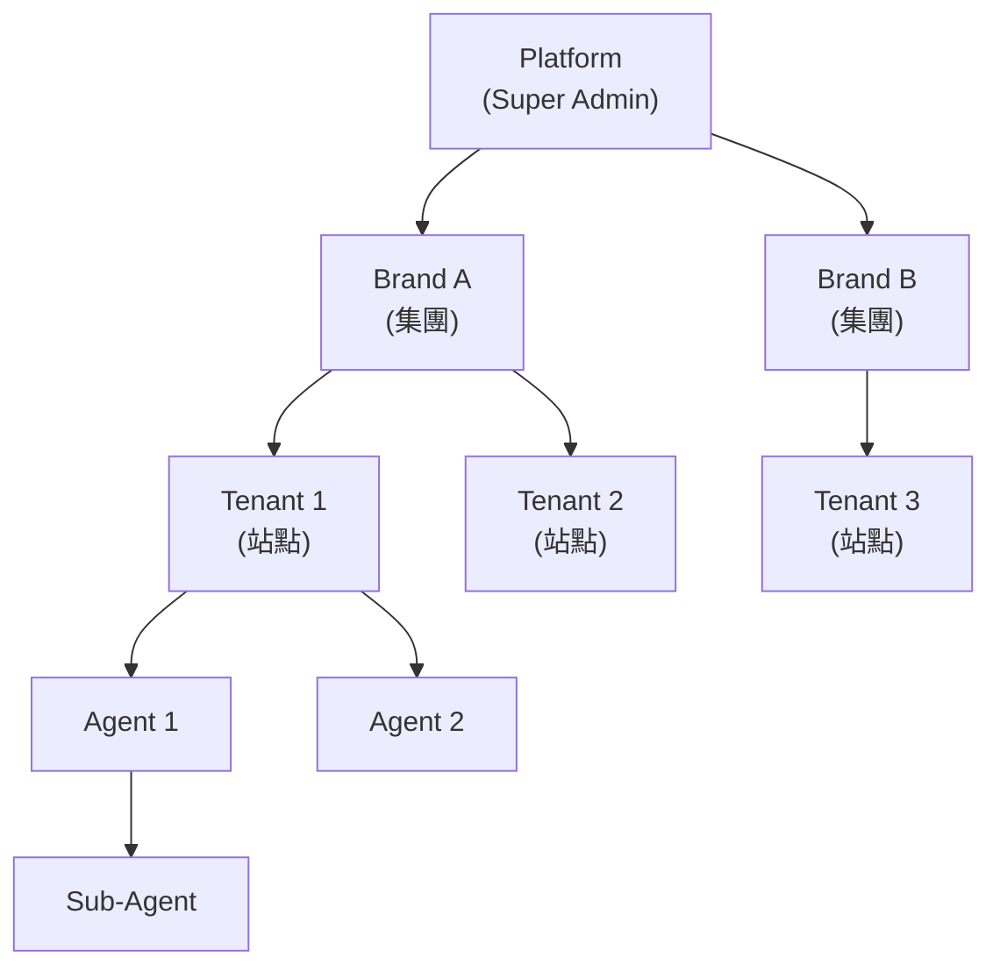

# 第 7 章：治理與牌照

---

## 7.1 模組概述

治理與牌照模組負責多租戶層級管理、權限控制、白標客製化、帳務計費，以及多司法管轄區合規。本模組是所有業務模組的基礎治理層，確保平台數據 100% 隔離、操作全程可審計。

**核心職責**: 多租戶管理、RBAC 權限、MFA 安全、白標客製、計費、多牌照合規

---

## 7.2 四層租戶層級

### 層級定義

| 層級 | 角色 | 職責 | 數據範圍 |
|------|------|------|---------|
| **Platform** | Super Admin | 全局管理、建立品牌、全局風控、GP 緊急開關 | 所有數據 |
| **Brand** | Brand Admin | 管理下屬租戶、共享黑名單、品牌預算 | 品牌內所有租戶 |
| **Tenant** | Tenant Admin | 獨立站點營運、玩家管理、活動配置 | 僅本租戶 |
| **Agent** | Agent | 下線玩家管理、佣金查詢 | 僅自己的下線 |

### 權限矩陣

| 操作 | Super Admin | Brand Admin | Tenant Admin | Agent |
|------|:-----------:|:-----------:|:------------:|:-----:|
| 建立品牌 | ✅ | ❌ | ❌ | ❌ |
| 建立租戶 | ✅ | ✅ | ❌ | ❌ |
| 全局遊戲開關 | ✅ | ❌ | ❌ | ❌ |
| 品牌預算調整 | ✅ | ✅ | ❌ | ❌ |
| 玩家管理 | ✅ | ✅ | ✅ | ❌ |
| 查看佣金報表 | ✅ | ✅ | ✅ | ✅ |
| 風控規則配置 | ✅ | ✅ (品牌級) | ✅ (租戶級) | ❌ |

### 模擬操作 (Impersonation)

- Super Admin 可模擬任何租戶操作 (須全程顯示視覺指示器)
- Brand Admin 可模擬旗下租戶
- 所有模擬操作須完整審計記錄

---

## 7.3 數據隔離政策

### 強制隔離要求

| 規則 | 說明 |
|------|------|
| 租戶隔離 | 所有玩家數據、交易、遊戲紀錄按 `tenant_id` 隔離 |
| 零洩漏 | 任何查詢場景下零跨租戶資料洩漏 |
| 品牌隔離 | Brand A 與 Brand B 之間零訪問 |
| 效能開銷 | 多租戶隔離造成的額外效能負擔 < 5% |

### 跨租戶查詢白名單

| 允許場景 | 限制 |
|---------|------|
| 品牌彙總報表 | 僅 Super Admin / Brand Admin |
| 全局管理操作 | 僅 Super Admin |
| 租戶遷移 | 須專案審批 |

**禁止回傳**: 玩家 PII (Email/手機/證件)、錢包餘額、KYC 文件、支付憑證

所有跨租戶查詢須審計: 操作者、時間、範圍、回傳數據量。

### 共享數據

| 數據類型 | 共享範圍 | 管理者 |
|---------|---------|--------|
| 玩家黑名單 | 品牌級 (可選) | Brand Admin |
| GP 列表 | 全局 | Super Admin |
| 支付供應商 | 租戶獨立 (獨立商戶 ID) | Tenant Admin |
| 風控規則 | 階層式 (全局預設 + 租戶覆蓋) | 各層級 |

---

## 7.4 白標客製化

### 租戶級客製項目

| 項目 | 說明 | 必要性 |
|------|------|--------|
| 網域 | 獨立 FQDN + SSL 證書 | 必要 |
| 視覺識別 | Logo (多尺寸)、色彩方案、頁腳文字 | 必要 |
| Email 模板 | 品牌化交易通知，獨立寄件地址 | 必要 |
| SMS Sender ID | 本地化發送者標識 | 建議 |
| 幣種設定 | 主要幣種與匯率 | 必要 |
| 語言支援 | 多語言介面 | 建議 |

---

## 7.5 租戶計費

### 三種計費模式

| 模式 | 說明 | 適用場景 |
|------|------|---------|
| **固定月費** | 定額 (如 $1,000/月) | 小型站點 |
| **收益分成** | 平台抽取有效流水 2–5% | 大型站點 |
| **混合模式** | 底薪 + 分成 (如 $500/月 + 1%) | 平衡風險 |

### 帳單週期

| 項目 | 規則 |
|------|------|
| 計費週期 | 每月 (每月 1 日) |
| 寬限期 | 7 天 |
| 自動續約 | 預設啟用 |
| 帳單格式 | PDF (含 VAT/稅務) |
| 支付方式 | 銀行轉帳、信用卡、加密貨幣 |

### 逾期處理

| 逾期天數 | 處置 |
|---------|------|
| 0–7 天 | 每日警告 Email |
| 8–14 天 | 帳戶標記「高風險」 |
| 15–30 天 | 停止新玩家註冊 |
| 31+ 天 | 全面暫停服務 |

---

## 7.6 MFA 要求

### 強制 MFA 角色

| 角色 | MFA 要求 | 說明 |
|------|---------|------|
| Super Admin | ✅ 強制 | 全局管理權限 |
| 財務人員 | ✅ 強制 | 資金操作 |
| 風控人員 | ✅ 強制 | 帳戶凍結/解凍 |
| DB Admin | ✅ 強制 | 數據庫存取 |
| DevOps | ✅ 強制 | 系統部署 |

### MFA 方式

| 方式 | 優先級 |
|------|--------|
| TOTP (Google Authenticator 等) | 主要 |
| 備用碼 (一次性) | 備援 |
| SMS / Email OTP | 設備遺失恢復 |

### 設備遺失 SLA

- 恢復時間: 24–48 小時
- 須經上級主管核准

---

## 7.7 品牌級 SSO

### 配置模式

| 模式 | 說明 | 錢包隔離 |
|------|------|---------|
| 完全隔離 | 每個租戶獨立帳戶 | ✅ 完全隔離 |
| 品牌 SSO | 同品牌下共享登入 | ✅ 錢包仍隔離 |
| 聯合登入 | 第三方 IdP (SAML/OIDC) | ✅ 錢包仍隔離 |

**關鍵規則**: 無論 SSO 模式如何，**錢包永遠按租戶隔離**。

---

## 7.8 租戶遷移

### 遷移檢查表

- [ ] 玩家數據完整性驗證
- [ ] 交易歷史完整
- [ ] 錢包餘額對帳
- [ ] 待處理提款已完成
- [ ] 審計記錄保留
- [ ] 監管通知已發送 (如需要)

### 數據可攜性 (GDPR Art 29)

租戶須能匯出: 玩家註冊數據、交易歷史、遊戲紀錄、通訊記錄、行銷同意記錄。格式: JSON 或 CSV (含 Schema 說明)。

---

## 7.9 多管轄區合規

| 管轄區 | 牌照 | 關鍵要求 |
|--------|------|---------|
| 馬爾他 (MGA) | Class 1-4 | 10 年牌照、EU AML 5 合規、玩家資金隔離 |
| 英國 (UKGC) | Remote Operating Licence | 最嚴格、GAMSTOP 強制、可負擔性評估 |
| 庫拉索 | Master Licence | 加密貨幣友好、較寬鬆監管 |
| 菲律賓 (PAGCOR) | POGO Licence | 本地伺服器要求、AMLC 監督 |

### 審計要求

| 項目 | 規則 |
|------|------|
| 操作日誌 | 所有管理操作全程記錄 |
| 保留期限 | 最少 5 年 (MGA)、7 年 (財務) |
| 不可篡改 | Hash 鏈保護 |
| 即時存取 | 監管要求時 24 小時內提供 |

---

## 7.10 成功指標

| 指標 | 目標 | 說明 |
|------|------|------|
| 數據隔離合規率 | 100% | 零跨租戶洩漏 |
| 多租戶效能開銷 | < 5% | 隔離帶來的額外負擔 |
| 新租戶上線時間 | < 24 小時 | 從建立到可用 |
| MFA 覆蓋率 | 100% | 所有強制角色 |
| 審計完整率 | 100% | 所有操作可追溯 |

---

## 7.11 對應技術文檔

> 🔧 **技術實作**: 詳見 [Part 2 Ch7: 治理與牌照技術架構](../technical/07_Governance_Licensing_治理與牌照.md)
