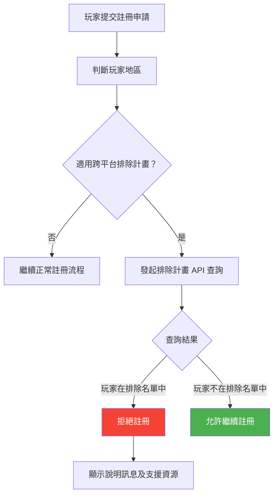

# 跨平台自我排除整合 (Cross-Operator Self-Exclusion)

> **規範來源**: UKGC LCCP 3.5.2、Dutch KSA Requirements、German GlüStV 2021
> **目標讀者**: PM、合規專員
> **相關架構**: [Responsible Gambling Architecture](../../architecture/15_Responsible_Gambling/README.md)
> **最後更新**: 2026-04-02

---

## 1. 概述

跨平台自我排除 (Cross-Operator Self-Exclusion) 是指玩家透過國家或區域性排除計畫，一次性排除自己在所有持牌平台的博彩活動，而無需逐一向每個平台申請。此類計畫的整合對持有相關司法管轄區執照的平台而言通常是強制性義務。

本規範涵蓋與三大跨平台自我排除系統的整合要求：英國的 GamStop、荷蘭的 CRUKS (Centraal Register Uitsluiting Kansspelen)，以及德國的 OASIS (Online-Abgleich Spielersperren im Netz)。每套系統的整合方式、查詢時機、同步窗口期及對現有玩家的處理方式，均有其獨立要求。

---

## 2. 功能需求

### 2.1 各排除計畫整合要求

| 排除計畫 | 覆蓋地區 | 強制整合 | 查詢時機 | 寬限期 |
|---------|---------|---------|---------|-------|
| **GamStop** | 英國（UKGC 持照）| 是（UKGC 強制要求）| 註冊時 + 每次登入 | 0 天（即時生效）|
| **CRUKS** | 荷蘭（KSA 持照）| 是（KSA 強制要求）| 註冊時 + 每次登入 | 0 天（即時生效）|
| **OASIS** | 德國（GlüStV 2021）| 是（德國州際博彩條約）| 註冊時 + 每次登入 | 0 天（即時生效）|

### 2.2 排除查詢流程

**註冊時查詢**

**登入時查詢**

每次玩家成功通過密碼驗證後，在進入帳戶前執行排除名單查詢：

| 查詢結果 | 系統行為 |
|---------|---------|
| 玩家不在排除名單中 | 允許登入，正常進入帳戶 |
| 玩家被新增至排除名單（上次登入後）| 拒絕登入，立即啟動帳戶暫停流程 |
| 排除計畫系統不可用 | 預設拒絕登入（安全優先原則），記錄事件 |

### 2.3 同步窗口期規則

各排除計畫的玩家名單更新不是即時的，平台須處理同步延遲：

| 排除計畫 | 官方同步頻率 | 平台同步觸發時機 | 超時處理 |
|---------|------------|---------------|---------|
| GamStop | 準即時（通常 < 1 小時）| 每次登入時主動查詢 | 超時 5 秒 → 拒絕登入 |
| CRUKS | 每 24 小時更新一次 | 每次登入時查詢；後台每 4 小時批次更新 | 超時 5 秒 → 使用快取（最多 24 小時舊）|
| OASIS | 準即時 | 每次登入時主動查詢 | 超時 5 秒 → 拒絕登入 |

### 2.4 現有玩家處理規則

當系統同步後發現現有活躍玩家（已登入帳戶）被加入排除名單時：

| 情境 | 立即行動 | 後續處理 |
|------|---------|---------|
| 玩家目前正在遊戲中 | 完成當前遊戲局後立即終止 Session | 發送帳戶暫停通知郵件 |
| 玩家目前已登入但未遊戲 | 立即終止 Session | 發送帳戶暫停通知郵件 |
| 玩家目前未登入 | 標記帳戶為暫停狀態 | 下次登入時拒絕並說明原因 |
| 帳戶有未提領餘額 | 餘額凍結；退款流程依監管要求執行 | 通知玩家聯繫客服辦理退款 |

---

## 3. 業務規則

1. **寬限期為零**: 透過 GamStop、CRUKS 或 OASIS 被排除的玩家，平台不提供任何寬限期，排除狀態即時生效。
2. **安全優先原則**: 當排除計畫的 API 查詢超時或不可用時，系統預設拒絕玩家登入（而非允許登入），確保不因系統故障而允許被排除的玩家繼續博彩。
3. **不可人工覆寫**: 跨平台排除名單的結果不得被任何平台員工（包括主管層級）人工覆寫或解除；唯一解除途徑是玩家向排除計畫官方申請移除。
4. **現有玩家寬限期為零**: 現有已註冊玩家若被新增至跨平台排除名單，平台不提供任何過渡期，須立即執行帳戶暫停。
5. **客服限制**: 客服人員不得為已被跨平台排除的玩家繼續提供博彩相關服務（如手動存款協助），但可協助其辦理餘額退款。
6. **資料保密**: 玩家是否被跨平台排除的資訊屬高度敏感個人資料，須嚴格限制查閱權限，不得洩漏給非授權人員。
7. **事件記錄**: 每次排除查詢的結果（無論是否命中）須記錄，並定期向監管機構匯報命中率及系統可用性。

---

## 4. 監管合規

| 法規 | 條款 | 要求 |
|------|------|------|
| UKGC LCCP | 3.5.2（GamStop 強制整合）| 所有 UKGC 持照業務必須整合 GamStop；未整合或未正確執行為重大違規，可能吊銷執照 |
| Dutch KSA | CRUKS 整合要求 | 荷蘭玩家每次登入前須查詢 CRUKS；24 小時同步頻率為最低要求 |
| German GlüStV 2021 | §8（OASIS 整合）| 德國持照業務強制整合 OASIS；違規最高罰款 €500,000 |
| GDPR | Art. 9（特殊類別資料）| 博彩成癮及自我排除資訊屬特殊類別個人資料，須進行資料保護影響評估 (DPIA) |

---

## 5. 驗收標準

- [ ] 英國玩家在 GamStop 排除期間嘗試註冊時，系統拒絕並顯示 GamStop 的聯繫資訊
- [ ] 英國玩家在 GamStop 排除期間嘗試登入時，系統拒絕並顯示說明訊息
- [ ] GamStop API 查詢逾時 5 秒時，系統預設拒絕登入並記錄逾時事件
- [ ] 現有玩家被新增至任一排除名單後，若正在遊戲中，當前遊戲局完成後立即終止 Session
- [ ] 排除名單命中無法被任何後台角色（包括系統管理員）人工覆寫
- [ ] 排除查詢記錄（包括查詢時間、玩家 ID、查詢計畫、結果）保存期限 ≥ 5 年
- [ ] 月度合規報告顯示：各排除計畫的查詢次數、命中次數、API 可用性統計
- [ ] 荷蘭玩家的 CRUKS 查詢快取不超過 24 小時，快取逾期後強制重新查詢
