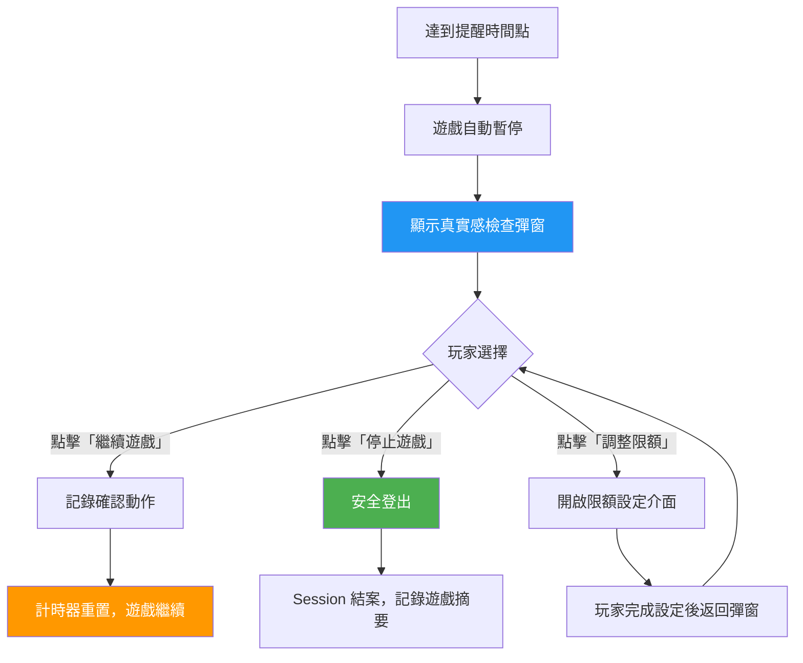

# 真實感檢查介面規範 (Reality Check UX Patterns)

> **規範來源**: MGA RG Framework Art. 7.3、UKGC LCCP 3.5.4
> **目標讀者**: PM、合規專員
> **相關架構**: [Responsible Gambling Architecture](../../architecture/15_Responsible_Gambling/README.md)
> **最後更新**: 2026-04-02

---

## 1. 概述

真實感檢查 (Reality Check) 是一種負責任博彩 (Responsible Gambling) 工具，透過定期彈出提醒視窗，讓玩家了解自己的遊戲時長與輸贏狀況，協助其保持對博彩活動的清醒認識。MGA RG Framework 要求每 30 分鐘至少顯示一次真實感檢查，UKGC LCCP 3.5.4 則規定玩家必須主動確認才能繼續遊戲。

本規範定義了真實感檢查彈窗的觸發時機、顯示內容、玩家互動方式，以及相關的設定選項。所有介面設計必須確保玩家無法在未經確認的情況下忽略或關閉提醒，並且彈窗本身必須包含足夠的資訊協助玩家做出知情決策。

---

## 2. 功能需求

### 2.1 觸發規則

| 規則項目 | 預設值 | 玩家可調整範圍 | 說明 |
|---------|-------|-------------|------|
| 提醒間隔 | **30 分鐘** | 15 分鐘 - 60 分鐘 | 從玩家開始遊戲計時 |
| 計時方式 | 連續遊戲時間 | - | 暫停瀏覽不計入，僅計算活躍遊戲時間 |
| 跨遊戲計時 | 是 | - | 玩家在不同遊戲間切換，計時器不重置 |
| 每日上限提醒 | 登入後 4 小時自動觸發 | 不可關閉 | 無論是否設定自定義間隔 |

### 2.2 彈窗必須顯示的資訊

每次觸發真實感檢查時，彈窗內容必須包含以下全部項目：

| 資訊項目 | 說明 |
|---------|------|
| 本次遊戲時長 | 自本次登入起的遊戲時間（小時：分鐘格式）|
| 本日累計遊戲時長 | 當日所有 Session 的遊戲時間總計 |
| 本次 Session 淨盈虧 | 本次登入的存款 - 提款 + 當前餘額變動（正值=盈利，負值=虧損）|
| 本日累計淨盈虧 | 當日所有 Session 的淨盈虧總計 |
| 快速操作連結 | 設定存款限額、設定遊戲時限、自我排除的直接連結 |
| 繼續遊戲按鈕 | 玩家確認已閱讀資訊後，可繼續遊戲 |
| 停止遊戲按鈕 | 直接導向安全登出 |

### 2.3 玩家互動規則

| 互動要求 | 規定 |
|---------|------|
| 強制確認 | 玩家必須點擊「繼續遊戲」或「停止遊戲」其中一個按鈕，不得直接關閉彈窗 |
| 無計時器強制 | 彈窗不顯示倒數計時器；玩家可花足夠時間閱讀（但彈窗顯示期間遊戲暫停）|
| 遊戲暫停 | 彈窗顯示期間，所有進行中的遊戲自動暫停 |
| 不得繞過 | 彈窗顯示期間，所有遊戲區域互動被禁用，玩家無法透過點擊背景等方式關閉 |

### 2.4 設定選項

玩家可在帳戶設定中調整真實感檢查的相關選項：

| 設定項目 | 可用選項 | 限制 |
|---------|---------|------|
| 提醒間隔 | 15、20、30（預設）、45、60 分鐘 | 不可設定超過 60 分鐘 |
| 顯示淨盈虧 | 顯示（預設）/ 隱藏 | 若隱藏，須保留「查看詳情」連結 |
| 存款限額快速設定 | 直接在彈窗中輸入限額金額 | 限額降低即時生效；提高限額需 24 小時冷靜期 |

### 2.5 彈窗設計規範

---

## 3. 業務規則

1. **30 分鐘最短間隔**: 真實感檢查的提醒間隔不得超過 60 分鐘；即使玩家未設定，系統預設每 30 分鐘觸發一次，符合 MGA RG Framework 的最低要求。
2. **強制確認不可繞過**: 玩家必須主動點擊確認按鈕才能繼續遊戲，系統不得提供任何「下次不再提醒」或「忽略」的選項。
3. **彈窗顯示期間遊戲暫停**: 真實感檢查彈窗顯示期間，玩家的所有遊戲均暫停，不計算遊戲時間，不接受任何下注。
4. **淨盈虧計算標準**: 淨盈虧的計算基礎為：（存款總額 - 提款總額 - 獎金）+ 當前帳戶可下注餘額 (Playable Balance)，確保反映玩家的真實財務狀況。
5. **快速設定即時生效**: 玩家在真實感檢查彈窗中設定更嚴格的限額（降低存款上限或縮短遊戲時間），必須即時生效，不設冷靜期。
6. **每日 4 小時強制觸發**: 無論玩家設定何種間隔，登入後每累計遊戲 4 小時，必須強制觸發一次真實感檢查，此觸發不可被玩家設定關閉。
7. **記錄保留**: 每次真實感檢查的觸發時間、顯示內容（含當時的盈虧數字）及玩家回應（繼續/停止），須保存於玩家的活動記錄中，供玩家本人及監管機構查閱。

---

## 4. 監管合規

| 法規 | 條款 | 要求 |
|------|------|------|
| MGA RG Framework | Art. 7.3（真實感檢查）| 所有線上遊戲須至少每 30 分鐘提供一次真實感檢查；須顯示遊戲時長和淨盈虧 |
| UKGC LCCP | 3.5.4（真實感提醒）| 玩家必須主動確認才能繼續遊戲；確認動作須記錄 |
| MGA Player Protection Rules | Reg. 10 | 真實感檢查必須包含通往負責任博彩工具的連結 |
| UKGC | Safer Gambling Requirements 2020 | 不得使用「贏錢」等正向框架描述淨盈虧；須以客觀數字呈現 |

---

## 5. 驗收標準

- [ ] 玩家連續遊戲 30 分鐘後，系統自動觸發真實感檢查彈窗，遊戲同時暫停
- [ ] 彈窗顯示當次遊戲時長、當日累計時長、當次淨盈虧、當日累計淨盈虧四項必要資訊
- [ ] 彈窗無法被關閉或繞過；玩家只能透過「繼續遊戲」或「停止遊戲」按鈕回應
- [ ] 玩家可在帳戶設定中將提醒間隔調整為 15、20、30、45 或 60 分鐘
- [ ] 玩家累計遊戲達 4 小時，強制觸發真實感檢查，且此觸發不受玩家自定義間隔影響
- [ ] 玩家在彈窗中設定更嚴格的存款或時間限制，限制在確認後即時生效
- [ ] 每次真實感檢查的完整記錄（觸發時間、顯示數據、玩家回應）可在帳戶歷史記錄中查閱
- [ ] 淨盈虧數字使用客觀數字格式（如「-$150」），不使用「損失」或「盈利」等主觀描述
- [ ] 彈窗中的「設定限額」和「自我排除」連結可直接開啟對應功能，無需登出後重新操作
