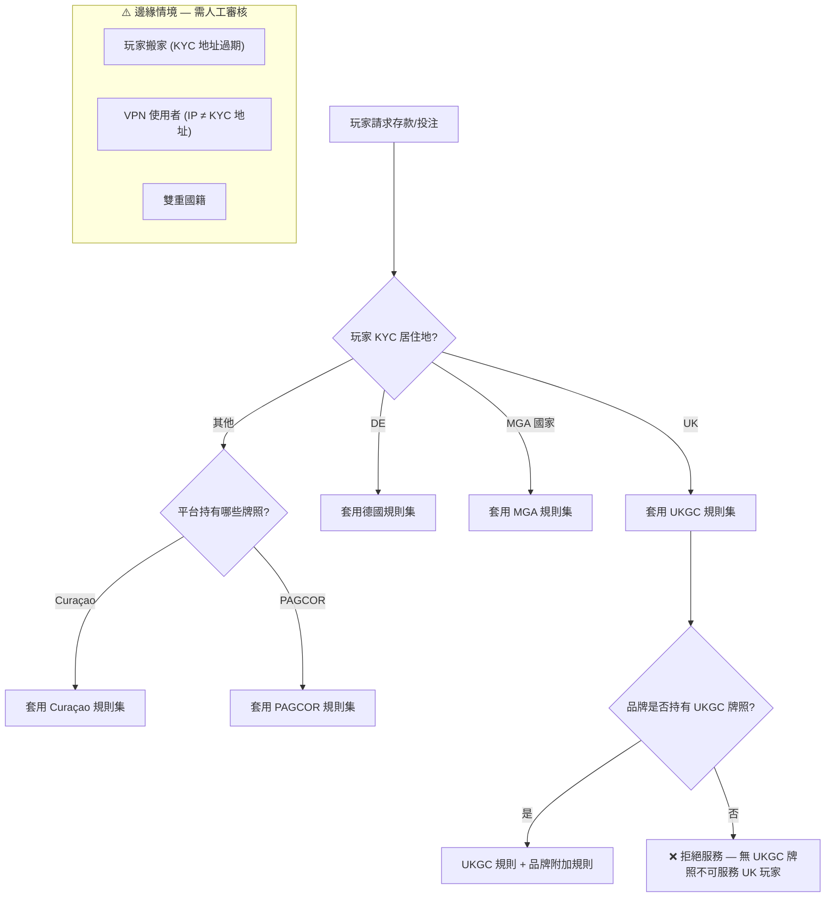

# 附錄 D：司法管轄權衝突矩陣

> **目的**: 當多牌照營運中出現規則衝突時，提供明確的決策優先級
> **適用對象**: 合規官、PM、開發團隊
> **更新頻率**: 每季度或當任一管轄區發布新規時
> **狀態**: ⏳ 骨架已建立，具體規則待法律團隊審閱

---

## D.1 通用原則

| # | 原則 | 說明 |
|---|------|------|
| 1 | **最嚴格規則優先** | 當兩個管轄區規則衝突時，預設適用最嚴格的規則，除非法律明確允許例外 |
| 2 | **玩家註冊地優先** | 玩家適用其 KYC 驗證時提供的居住地所屬管轄區規則 |
| 3 | **牌照要求不可降級** | 持有 UKGC 牌照的品牌，即使服務非 UK 玩家，UKGC 基礎要求仍適用 |
| 4 | **動態路由** | 系統應根據玩家管轄區自動套用對應規則集，而非全域統一 |

---

## D.2 支付限制衝突矩陣

| 功能 | UKGC | MGA | PAGCOR | Curaçao | 德國 | 巴西 | 衝突解決 |
|------|------|-----|--------|---------|------|------|---------|
| **信用卡博彩** | ❌ 禁止 | ✅ 允許 | ✅ 允許 | ✅ 允許 | ❌ 禁止 | ⏳ 待確認 | 按玩家居住地。UK/DE 玩家全域禁止信用卡 |
| **單日存款上限** | 無硬性上限 | 無硬性上限 | 無硬性上限 | 無硬性上限 | €1,000/月 | ⏳ 待確認 | DE 玩家強制執行月度限額 |
| **加密貨幣** | ❌ 不接受 | ⚠️ 需額外 AML | ✅ 允許 | ✅ 允許 | ❌ 不接受 | ⏳ 待確認 | 按玩家居住地+牌照要求雙重過濾 |
| **第三方支付** | ✅ 嚴格 KYC | ✅ 允許 | ✅ 允許 | ✅ 允許 | ✅ 允許 | ⏳ PIX 為主 | — |
| **最低提款延遲** | 無強制 | 無強制 | 無強制 | 無強制 | 無強制 | ⏳ 待確認 | — |

---

## D.3 玩家保護衝突矩陣

| 功能 | UKGC | MGA | PAGCOR | Curaçao | 德國 | 衝突解決 |
|------|------|-----|--------|---------|------|---------|
| **自我排除資料庫** | GAMSTOP (強制) | MGA 登記冊 | — | — | OASIS (強制) | 按牌照要求接入對應資料庫 |
| **存款限額設置** | 玩家可設 | 玩家可設 | — | — | **強制** 月 €1K | DE: 系統強制；其他: 玩家自選 |
| **損失限額** | 玩家可設 | 玩家可設 | — | — | **強制** | DE: 系統強制；其他: 玩家自選 |
| **Session 時長限制** | 建議提醒 | 無要求 | — | — | **強制** | DE: 強制中斷；其他: 提醒 |
| **可負擔性評估** | **三級強制** (£125/£500/£2K) | 基於風險 | — | — | 無明確要求 | UKGC 玩家: 三級強制；MGA: 平台自定閾值 |
| **冷靜期** | 24h (>6 個月排除) | 24h | — | — | 最少 3 個月 | 取最長冷靜期 |
| **現實檢查** | 每 60 分鐘 | 無強制 | — | — | 每 60 分鐘 | UKGC/DE: 60 分鐘；其他: 可選 |
| **Spin 速度** | ≥ 2.5 秒/次 | 無限制 | 無限制 | 無限制 | ≥ 5 秒/次 | DE 最嚴: 5 秒/次；UKGC: 2.5 秒 |

---

## D.4 KYC/AML 衝突矩陣

| 功能 | UKGC | MGA | PAGCOR | Curaçao | 衝突解決 |
|------|------|-----|--------|---------|---------|
| **KYC 觸發點** | 註冊後 72h 或 £2K 存款 | €2,000 累計存款 | ⏳ 待確認 | ⏳ 寬鬆 | 取最早觸發點 |
| **KYC 完成時限** | 72 小時 | 合理時間 | ⏳ 待確認 | ⏳ 待確認 | 72 小時（UKGC 標準） |
| **資金來源檢查** | £2K+ 觸發 SOF | €2K+ | ⏳ 待確認 | ⏳ 高額 | 取最低門檻 |
| **增強盡職調查 (EDD)** | 風險評估觸發 | €15K+ 或 PEP | ⏳ 待確認 | ⏳ 待確認 | 風險評估+金額雙觸發 |
| **SAR 報告** | 英國 NCA | 馬爾他 FIAU | ⏳ 當地機構 | ⏳ 當地機構 | 向**所有**適用機構報告 |
| **PEP 篩查** | 強制 | 強制 | ⏳ 待確認 | ⏳ 待確認 | 全域強制 |

---

## D.5 資料保護衝突矩陣

| 功能 | GDPR (EU/EEA) | UK GDPR | 菲律賓 DPA | 巴西 LGPD | 衝突解決 |
|------|--------------|---------|-----------|----------|---------|
| **刪除權** | 37 天流程 | 37 天流程 | 有刪除權 | 有刪除權 | 統一 37 天流程（最嚴格） |
| **AML 覆蓋刪除權** | ✅ AML > GDPR | ✅ 同 EU | ⏳ 待確認 | ⏳ 待確認 | AML 調查中暫停刪除 |
| **資料跨境傳輸** | 需適當保護措施 | 同 EU | ⏳ 待確認 | 需充分性認定 | SCC + 影響評估 |
| **資料保留期限** | 最短必要 | 同 EU | ⏳ 待確認 | 最短必要 | AML: 5-7 年；其他: 最短必要 |
| **違反通知** | 72 小時 | 72 小時 | ⏳ 待確認 | 合理時間 | 72 小時（全域統一） |
| **DPO 要求** | 大規模處理時 | 同 EU | ⏳ 待確認 | 有 | 全域指派 DPO |

---

## D.6 遊戲內容限制衝突矩陣

| 功能 | UKGC | MGA | 德國 | 衝突解決 |
|------|------|-----|------|---------|
| **RTP 下限** | 無強制 (須公開) | 無強制 | ⏳ 待確認 | 公開 RTP，無強制下限 |
| **Autoplay** | ❌ 禁止 | ✅ 允許 | ❌ 禁止 | UK/DE 玩家禁止 Autoplay |
| **免費遊戲** | 限制 (不可模擬真錢) | ✅ 允許 | ⏳ 待確認 | 按管轄區動態開關 |
| **廣告限制** | 嚴格 (watershed) | 有限制 | **極嚴格** | 按管轄區套用廣告規則 |
| **累積獎金 (Jackpot)** | 需公開中獎概率 | 需公開 | ⏳ 待確認 | 全域公開概率 |

---

## D.7 跨境玩家情境決策樹



### 邊緣情境處理

| 情境 | 處理規則 | 備註 |
|------|---------|------|
| **玩家搬家** | 要求更新 KYC 地址後重新套用規則集 | 30 天內未更新 → 限制投注 |
| **VPN 使用者** | IP 與 KYC 地址不符 → 標記審核，不自動封鎖 | ⏳ 待決策: 是否強制地理圍欄？ |
| **雙重國籍** | 以**居住地**（非國籍）為準 | 符合 FATF 建議 |
| **旅行中的玩家** | 短期 IP 變化 ≤ 14 天不觸發規則切換 | ⏳ 待決策: 德國限額是否在海外仍適用？ |
| **牌照不覆蓋的國家** | 拒絕服務或路由至適用牌照 | ⏳ 需法律確認 |

---

## D.8 實作建議

### 規則引擎整合

```
Compliance Middleware 架構:
  請求進入 → 解析 player.jurisdiction
    → 載入 JurisdictionRuleSet(jurisdiction)
    → 合併 PlatformBaseRules + JurisdictionRules
    → 衝突時: JurisdictionRules 覆蓋 PlatformBaseRules
    → 返回 EffectiveRuleSet
```

### 配置管理

| 項目 | 說明 |
|------|------|
| 規則儲存 | 每個管轄區一組 JSON/YAML 配置 |
| 變更審批 | 合規官 Maker-Checker 流程 |
| 版本控制 | 規則集版本化，保留歷史（審計需求） |
| 灰度發布 | 新規則先對 5% 流量生效，驗證後全量 |
| 監控 | 規則命中率儀表板，異常觸發告警 |

---

## D.9 待決策事項

> 以下事項需法律團隊 + 合規官審閱後填充：

| # | 事項 | 影響 | 負責 |
|---|------|------|------|
| 1 | PAGCOR 各項具體要求填充 | D.2~D.6 表格 | 合規 |
| 2 | Curaçao 各項具體要求填充 | D.2~D.6 表格 | 合規 |
| 3 | 巴西 Lei 14.790/2023 細則落地 | D.2/D.4/D.5 | 合規+法務 |
| 4 | VPN 使用者是否強制地理圍欄 | D.7 邊緣情境 | PM+合規 |
| 5 | 德國限額海外是否適用 | D.7 邊緣情境 | 法務 |
| 6 | 跨境資料傳輸 SCC 模板 | D.5 | 法務+DPO |

---

> 📎 **相關文檔**: [Ch6 風控與合規](./06_Risk_Compliance_風控與合規.md) | [Ch7 治理與牌照](./07_Governance_Licensing_治理與牌照.md) | [Ch13 安全合規](./13_Security_Compliance_安全合規.md) | [Ch15 負責任博彩](./15_Responsible_Gambling_負責任博彩.md)

*Appendix D v1.0 — 2026-03-25 — 骨架建立，待法律團隊填充*
