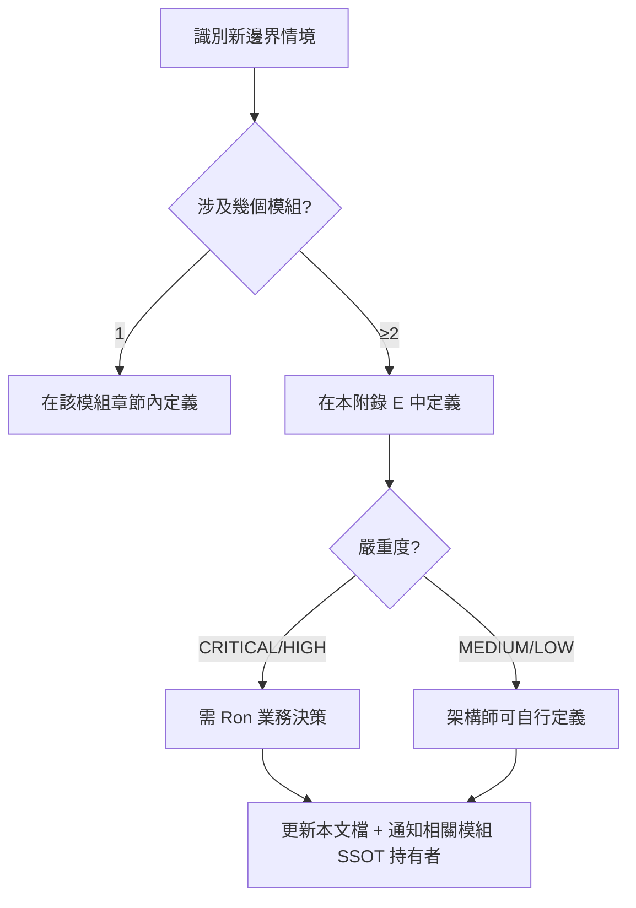

# 附錄 E：跨模組邊界情境矩陣

> **目的**: 系統性定義模組交界處的邊緣情境行為，消除未定義狀態
> **適用對象**: 架構師、開發團隊、QA
> **原則**: 每個邊界情境必須有明確的決策規則、SSOT 歸屬、和可測試的預期行為
> **狀態**: ✅ 全部 12 情境已決策 (2026-03-25)

---

## E.1 情境索引

| # | 邊界情境 | 涉及模組 | 嚴重度 | 狀態 |
|---|---------|---------|--------|------|
| BS-01 | Token 過期 × 流水進度 | Ch2 錢包 × Ch4 遊戲 × Ch5 促銷 | CRITICAL | ✅ 已決策 (Option C) |
| BS-02 | 紅利過期 × 未結算投注結算 | Ch5 促銷 × Ch2 錢包 | CRITICAL | ✅ 已決策 (Option B) |
| BS-03 | GP 維護 × 回合超時 | Ch4 遊戲 × Ch2 錢包 | HIGH | ✅ 已決策 |
| BS-04 | 自我排除 × 代理信用結算中投注 | Ch15 負責任博彩 × Ch8 代理 × Ch2 錢包 | CRITICAL | ✅ 已決策 (Option B) |
| BS-05 | 出金請求 × 流水驗證時序 | Ch3 支付 × Ch5 促銷 × Ch2 錢包 | HIGH | ✅ 已決策 |
| BS-06 | VIP 降級 × 進行中紅利 | Ch1 玩家 × Ch5 促銷 | MEDIUM | ✅ 已決策 |
| BS-07 | KYC 升級觸發 × 進行中交易 | Ch1 玩家 × Ch6 風控 × Ch2 錢包 | HIGH | ✅ 已決策 |
| BS-08 | 帳戶凍結 × 未結算投注 | Ch6 風控 × Ch2 錢包 × Ch4 遊戲 | HIGH | ✅ 已決策 |

---

## E.2 核心情境詳細定義

### BS-01：Token 過期 × 流水進度

**情境描述**: 玩家正在進行紅利流水要求。一筆投注的 Win 結算回調因 GP 延遲而在 Token 過期後到達平台。根據 Ch4 §4.3 嚴格拒絕策略，該 Credit 操作被拒絕。

**涉及規則**:
- Ch4 §4.3: Token 過期 → 金額操作一律拒絕
- Ch5 §5.3: 流水 = 累計有效投注額（WIN/LOSS = Bet Amount）
- Ch2 §2.8: Seamless Wallet 回調需有效 Token

**問題**: 這筆投注的有效投注額是否計入流水進度？

**選項**:

| 選項 | 描述 | 優點 | 缺點 |
|------|------|------|------|
| A | **計入流水 + 拒絕 Credit** | 流水進度不受影響 | 玩家贏了但拿不到錢 (嚴重客訴) |
| B | **不計入流水 + 拒絕 Credit** | 邏輯一致 (整筆交易作廢) | 玩家損失流水進度 (中度客訴) |
| C | **計入流水 + 走 Resettlement 補發** | 玩家不受損 | 需額外對帳流程 |

> ✅ **決策 (2026-03-25)**: **選項 C** — 流水照計，Credit 走 Resettlement 人工補發路徑（Ch4 §4.3 已預留此路徑）。
> **理由**: 玩家不應因 GP 延遲而蒙受損失；流水進度保留可避免嚴重客訴；Resettlement 路徑已有基礎設施支撐。
> **SSOT 歸屬**: Ch5 持有流水計算規則，Ch4 持有 Token 過期規則。邊界由本文檔定義。
> **決策者**: Ron — 2026-03-25

---

### BS-02：紅利過期 × 未結算投注結算

**情境描述**: 玩家持有 BONUS 紅利，流水要求尚未完成。紅利到期時，Ch5 §5.5 規定「未使用 BONUS 即時沒收」。但此時有一筆使用 BONUS 資金的投注尚未結算。

**涉及規則**:
- Ch5 §5.5: 紅利到期 → Option B (即時沒收未使用 BONUS，未結算投注的 BONUS 部分即時沒收)
- Ch2 §2.3: 三錢包模型 (CASH / BONUS / CREDIT)
- Ch2 §2.6: 回合管理 — 進行中投注有鎖定資金

**問題**: 該投注結算後的 Win 資金歸入哪個錢包？

**選項**:

| 選項 | 描述 | 優點 | 缺點 |
|------|------|------|------|
| A | **歸 BONUS 錢包**（即使已沒收，暫時重開） | 邏輯一致 (哪來回哪去) | BONUS 錢包已沒收，系統複雜度高 |
| B | **歸 CASH 錢包，免除流水要求** | 實作簡單，玩家友好 | 平台可能損失（玩家用 BONUS 投注卻得 CASH） |
| C | **歸 CASH 錢包，按比例扣除未完成流水** | 平衡雙方利益 | 計算複雜，玩家難理解 |
| D | **沒收 Win（紅利條款涵蓋）** | 平台風險最低 | 嚴格 jurisdiction 可能不允許 |

> ✅ **決策 (2026-03-25)**: **選項 B** — 歸 CASH 錢包，免除流水要求。
> **理由**: Ch5 §5.5 已選即時沒收策略，平台已接受紅利損失。Win 歸 CASH 是對玩家的善意補償，實作最簡單且避免重開已沒收的 BONUS 錢包的系統複雜度。
> **SSOT 歸屬**: Ch5 持有紅利規則。
> **決策者**: Ron — 2026-03-25

---

### BS-03：GP 維護 × 回合超時

**情境描述**: GP 通知計畫維護，Ch4 §4.7 要求 5 分鐘內結算所有活躍回合。但 Ch2 §2.6 定義回合超時為 2 小時。GP 維護窗口中，超時回合如何處理？

**涉及規則**:
- Ch4 §4.7: GP 維護 → 5 分鐘內結算或回滾
- Ch2 §2.6: 回合超時 2 小時
- Ch2 §2.6: 超時回合 → 自動回滾 + 退還投注金額

**問題**: GP 維護的 5 分鐘結算要求 vs 回合 2 小時超時，哪個優先？

**決策規則**:

| 場景 | 行為 | 原因 |
|------|------|------|
| GP 計畫維護 | GP 5 分鐘結算優先 | GP 維護是已知事件，平台無法控制 GP 可用性 |
| GP 非計畫中斷 | Ch2 §2.6 回合超時 (2h) 適用 | 留更多時間等 GP 恢復 |
| 5 分鐘到期仍未結算 | 強制回滾 + 退還投注額至玩家 | 與 Ch15 自我排除流程一致 |

> ✅ **決策 (2026-03-25)**: 計畫維護 → GP 5 分鐘結算期限優先；非計畫中斷 → Ch2 §2.6 回合超時 (2h) 適用。5 分鐘到期仍未結算 → 強制回滾 + 退還投注額。
> **理由**: 計畫維護是已知事件，平台無法控制 GP 可用性，必須在維護窗口前完成清算。非計畫中斷應留更長緩衝等待 GP 恢復，減少不必要的強制回滾。
> **SSOT 歸屬**: Ch4 持有 GP 整合規則。
> **決策者**: Ron — 2026-03-25

---

### BS-04：自我排除 × 代理信用結算中投注

**情境描述**: 玩家啟動自我排除。Ch15 §15.2 要求 5 分鐘內完成 Token 撤銷和回合回滾。但此時玩家有一筆通過代理信用 (CREDIT 錢包) 資金的投注正在結算中。Ch8 的代理結算規則未定義此情境。

**涉及規則**:
- Ch15 §15.2: 自我排除 → 5 分鐘結算/回滾 → 凍結所有錢包
- Ch8 §8.3: 代理信用 → 自我排除時禁止任何信用操作
- Ch2 §2.3: CREDIT 錢包凍結影響代理結算

**問題**: 結算中的代理信用投注是強制回滾還是等待結算完成？

**選項**:

| 選項 | 描述 | 優點 | 缺點 |
|------|------|------|------|
| A | **強制回滾** | 與 Ch15 5 分鐘要求一致 | 代理可能損失（投注已在 GP 確認） |
| B | **等待結算完成後凍結** | 代理不受損，投注結果完整 | 可能超出 5 分鐘時限 |
| C | **5 分鐘內可結算則等待，超時則回滾** | 平衡兩者 | 需 GP 配合回報預計結算時間 |

> ✅ **決策 (2026-03-25)**: **選項 B** — 等待結算完成後凍結。
> **理由**: Ch15 §15.2 步驟 3 已定義「等待進行中回合結算（GP 須在 5 分鐘內完成）」，5 分鐘是 GP 的 SLA 而非硬截止。強制回滾會損害代理利益（投注已在 GP 確認）。結算完成後立即凍結 CREDIT 錢包並通知代理。
> **SSOT 歸屬**: Ch15 持有排除流程，Ch8 持有代理信用規則。邊界由本文檔定義。
> **決策者**: Ron — 2026-03-25

---

### BS-05：出金請求 × 流水驗證時序

**情境描述**: 玩家發起出金請求。Ch5 規定「提款時驗證流水」。但驗證需要計算全部有效投注額，可能需要數秒。此期間玩家狀態如何？

**涉及規則**:
- Ch5: 提款時驗證流水要求
- Ch3: 出金 SLA（VIP Diamond 15 分鐘自動）
- Ch2: 可下注餘額計算

**決策規則**:

| 步驟 | 行為 | 說明 |
|------|------|------|
| 1 | 出金請求到達 | 即時鎖定請求金額 (從可下注餘額扣除) |
| 2 | 流水驗證 | 同步計算 (目標 < 1 秒) |
| 3a | 流水通過 | 進入風控審核 (Ch6 Layer 5) |
| 3b | 流水未通過 | 拒絕出金 + 釋放鎖定金額 + 通知玩家剩餘流水 |
| 4 | 驗證超時 (> 5 秒) | 排入異步佇列，不阻斷玩家其他操作 |

> ✅ **決策 (2026-03-25)** — Ron 確認上述時序。已寫入 Ch2 §2.16 (GAP-1)。
> **SSOT 歸屬**: Ch5 持有流水規則，Ch3 持有出金流程，Ch2 §2.16 持有驗證時序 SLA。

---

### BS-06：VIP 降級 × 進行中紅利

**情境描述**: 玩家從 Platinum 降級為 Gold。此時持有 Platinum 專屬紅利（如 0.8% 流水返佣），紅利流水尚未達標。是否沒收？

**涉及規則**:
- Ch1 §1.5: VIP 降級保護期（Platinum 2 個月）
- Ch5 §5.5: 紅利生命週期管理

✅ **決策 (2026-03-25)**:

| 項目 | 規則 |
|------|------|
| 已領取紅利 | **繼續有效至原定過期日**，不因降級沒收 |
| 流水要求 | 維持原領取時的倍數要求，不追溯調整 |
| 新紅利資格 | 降級後按新等級發放，不再享受原等級專屬紅利 |
| 返佣率 | 降級生效後立即按新等級計算 |

> **決策理由**: 沒收已領取紅利會引發大量客訴，且多數監管機構認為已發放紅利屬於承諾。
> **SSOT 歸屬**: Ch5 持有紅利規則，Ch1 持有 VIP 降級邏輯。

---

### BS-07：KYC 升級觸發 × 進行中交易

**情境描述**: 玩家累計存款達 €2K，觸發 L1→L2 KYC 升級。此時玩家正在進行遊戲回合。是否中斷遊戲要求立即提交 KYC 文件？

**涉及規則**:
- Ch1 §1.4: KYC 觸發條件與時限
- Ch6: 風控即時反應
- Ch2: 遊戲回合完整性

✅ **決策 (2026-03-25)**:

| 步驟 | 行為 | 說明 |
|------|------|------|
| 1 | 觸發 KYC 升級標記 | 後台標記 `KYC_UPGRADE_PENDING` |
| 2 | **不中斷進行中遊戲** | 當前回合允許正常完成 |
| 3 | 回合結束後限制 | 封鎖新投注 + 封鎖存款，直到 KYC 升級完成 |
| 4 | 提款允許 | 在 L1 限額內允許提款（不超過 L1 日提限） |
| 5 | KYC 完成後 | 解除封鎖，按 L2 限額運行 |
| 6 | KYC 超時 (UKGC 72h) | 凍結帳戶，僅允許提款 |

> **決策理由**: 中斷進行中遊戲會導致玩家資金風險（回合結果未結算）。延遲到回合結束後再限制，風險窗口 < 5 分鐘，可接受。
> **SSOT 歸屬**: Ch1 持有 KYC 規則，本文檔定義過渡行為。

---

### BS-08：帳戶凍結 × 未結算投注

**情境描述**: 風控系統判定玩家高風險（如疑似洗錢），觸發帳戶凍結。此時玩家有 3 筆未結算的體育投注和 1 個進行中的 Slot 回合。

**涉及規則**:
- Ch6: 風控凍結觸發
- Ch2 §2.6: 回合超時 2 小時
- Ch4: GP 結算流程
- Ch15: 自我排除處理（BS-04 參照）

✅ **決策 (2026-03-25)**:

| 項目 | 規則 |
|------|------|
| 進行中 Slot 回合 | 等同 BS-04 邏輯 — **等待結算完成後凍結** |
| 未結算體育投注 | **正常等待事件結果**，結算後資金凍結在帳戶內 |
| 新投注 | **即時封鎖**，凍結指令到達後禁止任何新投注 |
| 存款 | **即時封鎖** |
| 提款 | **即時封鎖**（風控凍結期間不允許出金） |
| 結算後資金 | 歸入玩家帳戶但狀態為 `FROZEN`，待風控審查結果 |
| 解凍後 | 全部功能恢復；若確認違規則按 Ch6 處置 |

> **決策理由**: 與 BS-04（自我排除）邏輯一致，確保投注結算完整性。但區別在於風控凍結同時封鎖提款（自我排除允許提款）。
> **SSOT 歸屬**: Ch6 持有凍結規則，本文檔定義過渡行為。

---

### BS-09：代理層級變更 × 結算週期中

**情境描述**: 代理 A 原屬 L3 代理，月中（15 日）被移至 L5 代理下。本月 1-14 日的 GGR 已按 L3 佣金率計算。15-30 日應按哪個層級的佣金率？

**涉及規則**:
- Ch8 §8.4: 佣金計算模型
- Ch8 §8.5: 結算週期

✅ **決策 (2026-03-25)**:

| 項目 | 規則 |
|------|------|
| 佣金分攤 | **按日加權分攤** — 1-14 日按 L3 佣金率，15-30 日按 L5 佣金率 |
| 結算時機 | 月底統一結算，報表拆分顯示兩段 |
| 下線歸屬 | 變更即時生效 — 15 日起代理 A 的下線收入歸 L5 上級 |
| 已產生佣金 | 1-14 日已累計的佣金**不追溯調整** |
| 審計記錄 | 層級變更事件記入 `agent_hierarchy_audit_log` |

> **決策理由**: 按日分攤最公平，避免月中變更導致佣金爭議。不追溯調整保護代理既有利益。
> **SSOT 歸屬**: Ch8 持有佣金規則。

---

### BS-10：多幣種出金 × FX 匯率波動

**情境描述**: 玩家以 USD 帳戶申請出金 $5,000，實際出金為 THB（泰銖）。出金審核期間（最長 48h），USD/THB 匯率變動超過 2%。是否重新計算出金金額？

**涉及規則**:
- Ch2 §2.13: FX 匯率管理（SSOT）
- Ch3: 出金 SLA
- F-04: FX 風險分攤矩陣

✅ **決策 (2026-03-25)**:

| 項目 | 規則 |
|------|------|
| 匯率鎖定 | **鎖定申請時匯率**，審核期間匯率變動不影響玩家出金金額 |
| 平台風險 | 匯差由 F-04 規則處理 — 法幣 ≤0.5% 平台吸收，超出部分 50/50 分攤 |
| 超出 2% 保護 | 若審核期間匯率變動 > 2%，系統自動觸發 FLAG，財務審核是否需要重新報價 |
| 加密貨幣 | 不鎖定匯率 — 結算時即時匯率，超出 2% 需玩家重新確認 |
| SLA 影響 | 匯率波動不延長出金 SLA |

> **決策理由**: 鎖定申請時匯率對玩家體驗最佳。法幣波動 0.5% 以內平台可承受；極端波動靠 FLAG 機制人工介入。
> **SSOT 歸屬**: Ch2 §2.13 持有 FX 規則，本文檔定義出金場景特殊處理。

---

### BS-11：GDPR 刪除 × 進行中紅利

**情境描述**: 玩家行使 GDPR 刪除權（Right to Erasure），但此時持有 $200 活躍紅利（流水進度 60%）和 $150 CASH 餘額。

**涉及規則**:
- Ch13 §13.2: GDPR 刪除流程（37 天流程）
- Ch5 §5.5: 紅利生命週期

✅ **決策 (2026-03-25)**:

| 步驟 | 行為 | 時間點 |
|------|------|--------|
| 1 | 確認刪除請求 | Day 0 |
| 2 | **即時沒收所有 BONUS 餘額** | Day 0 |
| 3 | CASH 餘額提款 | Day 0-7（確認連結有效期內允許提款） |
| 4 | 冷靜期 | Day 0-30 |
| 5 | 未提取 CASH 處理 | Day 30 — 按監管要求處理（轉入信託帳戶或退款至最後存款來源） |
| 6 | 加密銷毀 | Day 37 |

| 特殊情境 | 處理 |
|---------|------|
| 未結算投注 | 等待結算，Win 歸 CASH（可在冷靜期提取） |
| 紅利產生的盈利 | 流水未達標 → 沒收；已達標 → 轉 CASH |
| 推薦獎金 | 被推薦人的推薦獎金不受影響（已獨立計算） |

> **決策理由**: GDPR 刪除權優先級高於紅利承諾。紅利為促銷性質，非玩家本金。CASH 餘額屬於玩家資金，必須提供合理提取窗口。
> **SSOT 歸屬**: Ch13 持有 GDPR 規則，Ch5 持有紅利規則。

---

### BS-12：Chargeback × 進行中流水

**情境描述**: 玩家存入 $500 並領取 100% 歡迎紅利（$500 BONUS，30x 流水），目前已累計 $8,000 有效投注額（達標要求 $15,000）。此時玩家對原始 $500 存款發起 Chargeback 並成功。

**涉及規則**:
- Ch3 §3.9: Chargeback 處理流程
- Ch5 §5.3: 流水計算規則

✅ **決策 (2026-03-25)**:

| 步驟 | 行為 |
|------|------|
| 1 | Chargeback 成功確認 |
| 2 | **沒收全部 BONUS 餘額** — 原始存款被撤回，紅利基礎不存在 |
| 3 | **回扣全部流水進度** — $8,000 有效投注額歸零 |
| 4 | **CASH 餘額扣回** — 扣回 $500 Chargeback 金額；若 CASH 不足則產生負餘額 |
| 5 | **標記玩家** — `CHARGEBACK_FLAG`，觸發 Ch6 風控審查 |
| 6 | **禁止新紅利** — 30 天內禁止領取任何紅利 |
| 7 | 其他紅利影響 | 若玩家有其他活躍紅利，**不受影響**（僅回扣與 CB 存款關聯的紅利） |

> **決策理由**: Chargeback 撤回了紅利的觸發條件（存款），因此紅利及其產生的流水應全部回扣。這也是行業標準做法，防止「存款→領紅利→CB 存款→保留紅利」的濫用模式。
> **SSOT 歸屬**: Ch3 持有 CB 規則，Ch5 持有流水規則。

---

## E.4 邊界情境決策流程

---

> 📎 **相關文檔**: [Ch2 錢包系統](./02_Wallet_System_錢包系統.md) | [Ch4 遊戲整合](./04_Game_Integration_遊戲整合.md) | [Ch5 促銷與 VIP](./05_Promotions_VIP_促銷與VIP.md) | [Ch8 代理營運](./08_Agent_Operations_代理營運.md) | [Ch15 負責任博彩](./15_Responsible_Gambling_負責任博彩.md)

*Appendix E v2.0 — 2026-03-25 — BS-01~BS-12 全部 12 情境已決策*
