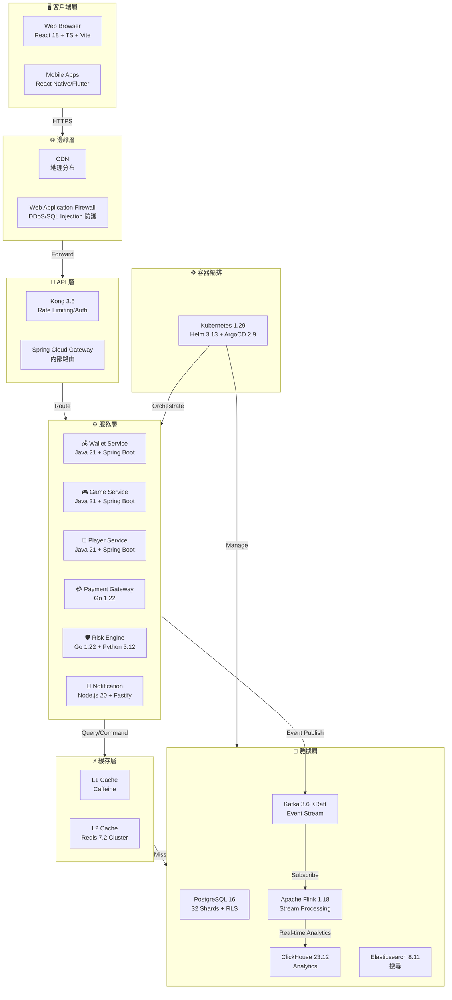

# 第 0 章：架構總覽

## 0.1 架構範式

**演進式模塊化單體 + 事件驅動 + CQRS 模式**

```
目標規模：200K+ 並發用戶
部署模式：Multi-tenant SaaS
地理分布：全球分布式
```

### C4 架構圖



---

## 0.2 技術棧全景

| 分類 | 技術 | 版本 | 用途 |
|-----|------|------|------|
| **後端基礎** | Java | 21 LTS (支持至 2029) | 核心業務邏輯 |
| | Spring Boot | 3.2.x | Web 框架 |
| | SmartAdmin | 4.x | 後台管理標準 |
| **高性能計算** | Go | 1.22 | 風控引擎、支付網關 |
| **實時通信** | Node.js | 20 LTS | WebSocket 伺服器 |
| | Fastify | 4.25 | 極速 HTTP 框架 |
| **ML / 風控** | Python | 3.12 | 詐欺檢測模型 |
| | FastAPI | - | ML API 服務 |
| **前端 - Web** | React | 18 + TypeScript | SPA 應用 |
| | Vite | 5.x | 極速打包 |
| | Next.js | 14 | SSR / ISR 頁面 |
| **前端 - Mobile** | React Native | 0.73 | iOS/Android |
| | Flutter | 3.16 | 高性能移動應用 |
| **數據庫** | PostgreSQL | 16 | 主關係型數據庫 |
| | Citus | 12.1 | 32 片分片引擎 |
| | Redis | 7.2 Cluster | 分布式緩存 |
| **流式處理** | Kafka | 3.6 KRaft | 事件中樞 |
| | Apache Flink | 1.18 | 實時流處理 |
| | Flink CDC | 3.0.1 | 變更數據捕獲 |
| **分析引擎** | ClickHouse | 23.12 | 列存 OLAP 數據倉庫 |
| **搜尋引擎** | Elasticsearch | 8.11 | 全文檢索 |
| **規則引擎** | LiteFlow | 2.15.3 | SQL 模式規則配置 |
| **緩存框架** | JetCache | 2.7.5 | L1 Caffeine + L2 Redis |
| **API 網關** | Kong | 3.5 | 外部 API 管理 |
| | Spring Cloud Gateway | 4.x | 內部服務路由 |
| **容器 & 編排** | Docker | 25.0 | 容器化 |
| | Kubernetes | 1.29 | 容器編排 |
| | Helm | 3.13 | K8s 包管理 |
| | ArgoCD | 2.9 | GitOps 持續部署 |
| **基礎設施代碼** | Terraform | 1.7 | IaC 基礎設施 |
| **認證 & 授權** | Sa-Token | 1.37+ | 多角色認證框架 |
| | JWT RS256 | - | 非對稱簽名令牌 |
| **Distributed Lock** | Redisson | 3.24+ | Redis 分布式鎖 |
| **ORM** | MyBatis-Plus | 3.5.5 | 數據訪問框架 |
| **多租戶隔離** | PostgreSQL RLS | - | 行級別安全策略 |
| **函數式編程** | Vavr | 1.0.0-alpha | Option/Try/Either |
| **監控** | Prometheus | 2.x | 指標採集 |
| | Grafana | 10.x | 可視化儀表板 |
| | Datadog / New Relic | - | APM / 分布式追蹤 |

---

## 0.3 SmartAdmin 四層架構

SmartAdmin 框架遵循嚴格的四層分層模式，確保代碼組織的一致性和可維護性。

### 層級劃分

```
┌─────────────────────────────────────────┐
│  Controller Layer                       │  API 端點、參數驗證、HTTP 響應
├─────────────────────────────────────────┤
│  Service Layer                          │  業務邏輯、使用 Vavr Option/Try
├─────────────────────────────────────────┤
│  Manager Layer  ⭐ 特殊層                │  @Transactional / @Cacheable
│  (Transaction Boundary)                 │  Redisson 分布式鎖 (ADR-013)
├─────────────────────────────────────────┤
│  Dao Layer                              │  MyBatis-Plus 數據訪問
└─────────────────────────────────────────┘
```

### 各層職責

#### Controller 層
```java
@RestController
@RequestMapping("/api/players")
@RequiredArgsConstructor
public class PlayerController {
    private final PlayerService playerService;

    @PostMapping
    public ResponseDTO<?> create(@Valid @RequestBody CreatePlayerRequest req) {
        return playerService.create(req)
            .fold(
                error -> ResponseDTO.error(error),
                success -> ResponseDTO.ok(success)
            );
    }
}
```

**職責**：
- HTTP 請求解析 → 參數驗證 (@Valid)
- 調用 Service 層
- HTTP 響應序列化 (ResponseDTO)
- **不能**：直接訪問數據庫、使用 @Transactional

#### Service 層
```java
@Service
@RequiredArgsConstructor
public class PlayerService {
    private final PlayerManager playerManager;
    private final WalletManager walletManager;

    public Try<PlayerDTO> create(CreatePlayerRequest req) {
        return Try.of(() -> {
            // 業務邏輯編排
            Player player = playerManager.createPlayer(req);
            walletManager.initWallet(player.getId());
            return PlayerDTO.from(player);
        });
    }
}
```

**職責**：
- 業務邏輯編排（多個 Manager 的組合）
- 使用 Vavr Try/Option/Either（**非 java.util.Optional**）
- 調用 Manager 層（含事務邊界）
- **不能**：直接數據庫操作、@Transactional、@Cacheable

#### Manager 層 ⭐ 事務邊界

```java
@Component
@RequiredArgsConstructor
@Transactional(rollbackFor = Throwable.class)
public class PlayerManager {
    private final PlayerDao playerDao;
    private final RedissonClient redissonClient;

    public Player createPlayer(CreatePlayerRequest req) {
        // 分布式鎖（ADR-013）
        RLock lock = redissonClient.getLock("player:username:" + req.getUsername());
        try {
            if (!lock.tryLock(3, TimeUnit.SECONDS)) {
                throw new BizException(ErrorCode.PLAYER_DUPLICATE);
            }

            Player player = new Player()
                .setUsername(req.getUsername())
                .setEmail(req.getEmail());

            playerDao.insert(player);
            return player;
        } finally {
            lock.unlock();
        }
    }

    @Cacheable(value = "player", key = "#playerId")
    public Player getPlayerById(Long playerId) {
        return playerDao.selectById(playerId);
    }
}
```

**職責** ⭐ **唯一帶 @Transactional 的層**：
- 事務管理（@Transactional(rollbackFor = Throwable.class)）
- **唯一**使用 @Cacheable 的層（JetCache）
- 分布式鎖管理（Redisson）
- 調用 Dao 層
- **不能**：業務邏輯、多個 Manager 協調

#### Dao 層
```java
@Mapper
public interface PlayerDao extends BaseMapper<Player> {
    @Select("SELECT * FROM t_player WHERE email = #{email} AND deleted = 0")
    Player selectByEmail(@Param("email") String email);
}
```

**職責**：
- 使用 MyBatis-Plus 進行 CRUD
- 執行原始 SQL 查詢
- **不能**：任何業務邏輯

### 代碼示例模板

```java
// ========== Controller ==========
@RestController
@RequestMapping("/api/wallets")
@RequiredArgsConstructor
public class WalletController {
    private final WalletService walletService;

    @PostMapping("/{playerId}/deposit")
    public ResponseDTO<?> deposit(
        @PathVariable Long playerId,
        @Valid @RequestBody DepositRequest req
    ) {
        return walletService.deposit(playerId, req)
            .fold(
                error -> ResponseDTO.error(error),
                success -> ResponseDTO.ok(success)
            );
    }
}

// ========== Service ==========
@Service
@RequiredArgsConstructor
public class WalletService {
    private final WalletManager walletManager;
    private final PaymentManager paymentManager;

    public Try<WalletDTO> deposit(Long playerId, DepositRequest req) {
        return Try.of(() -> {
            Wallet wallet = walletManager.getWalletByPlayerId(playerId)
                .getOrElseThrow(() -> new BizException(ErrorCode.WALLET_NOT_FOUND));

            Payment payment = paymentManager.processDeposit(wallet, req);
            Wallet updated = walletManager.creditBalance(wallet.getId(), req.getAmount());

            return WalletDTO.from(updated);
        }).mapFailure(Throwable::getMessage);
    }
}

// ========== Manager ==========
@Component
@RequiredArgsConstructor
@Transactional(rollbackFor = Throwable.class)
public class WalletManager {
    private final WalletDao walletDao;
    private final RedissonClient redissonClient;

    public Wallet creditBalance(Long walletId, BigDecimal amount) {
        RLock lock = redissonClient.getLock("wallet:balance:" + walletId);
        try {
            if (!lock.tryLock(2, TimeUnit.SECONDS)) {
                throw new BizException(ErrorCode.WALLET_LOCKED);
            }

            Wallet wallet = walletDao.selectById(walletId);
            wallet.setBalance(wallet.getBalance().add(amount));
            walletDao.updateById(wallet);
            return wallet;
        } finally {
            lock.unlock();
        }
    }

    @Cacheable(value = "wallet", key = "#playerId")
    public Wallet getWalletByPlayerId(Long playerId) {
        return walletDao.selectOne(
            new QueryWrapper<Wallet>()
                .eq("player_id", playerId)
                .eq("deleted", 0)
        );
    }
}

// ========== Dao ==========
@Mapper
public interface WalletDao extends BaseMapper<Wallet> {
    @Select("""
        SELECT * FROM t_wallet
        WHERE player_id = #{playerId} AND deleted = 0
    """)
    Wallet selectByPlayerId(@Param("playerId") Long playerId);
}
```

### 關鍵約定

| 規則 | 示例 | 備註 |
|-----|------|------|
| **依賴注入** | `@RequiredArgsConstructor + private final` | 所有層都用 Constructor 注入 |
| **響應格式** | `ResponseDTO.ok(data)` / `ResponseDTO.error(ErrorCode)` | 統一 API 響應 |
| **函數式編程** | `Vavr Option<T>`, `Try<T>`, `Either<L,R>` | 禁用 java.util.Optional |
| **布爾欄位名** | `deleted` ✅ / `isDeleted` ❌ | 數據庫字段風格 |
| **表名風格** | `t_player`, `t_wallet` (ADR-001) | 單數 + t_ 前綴 |
| **實體類命名** | `Player`, `Wallet` | 單數 + Entity 後綴（可選） |
| **事務邊界** | 僅在 Manager 層 | 見 ADR-013 |

---

## 0.4 多租戶架構

### 4 層級层次結構

```
┌─────────────────────────────────┐
│  Platform (iGaming 平台)        │  所有品牌共用
├─────────────────────────────────┤
│  Brand (品牌)                   │  不同運營商
│  ├─ Brand A (SportsBook)        │
│  ├─ Brand B (Casino)            │
│  └─ Brand C (Poker)             │
├─────────────────────────────────┤
│  Tenant (租戶)                  │  獨立計費單位
│  ├─ Tenant A1 (主租戶)          │
│  ├─ Tenant A2 (子品牌)          │
│  └─ Tenant B1                   │
├─────────────────────────────────┤
│  Agent (代理)                   │  推廣代理
│  ├─ Agent-A1-001                │
│  └─ Agent-A1-002                │
└─────────────────────────────────┘
```

### 三層隔離策略

#### 第 1 層：應用層隔離
```java
@Aspect
@Component
public class TenantContextInterceptor {

    public static final ThreadLocal<Long> TENANT_CONTEXT = new ThreadLocal<>();

    @Before("@annotation(com.smartadmin.annot.TenantRequired)")
    public void setTenantContext(JoinPoint jp) {
        // 從 Sa-Token 獲取租戶 ID
        Long tenantId = StpUtil.getLoginId(Long.class);
        TENANT_CONTEXT.set(tenantId);
    }

    @After("@annotation(com.smartadmin.annot.TenantRequired)")
    public void clearTenantContext() {
        TENANT_CONTEXT.remove();
    }

    public static Long getTenantId() {
        return TENANT_CONTEXT.get();
    }
}
```

#### 第 2 層：MyBatis 攔截器層隔離
```java
@Component
public class TenantLineInnerInterceptor implements InnerInterceptor {

    @Override
    public void beforeQuery(Executor executor, MappedStatement ms,
                           Object parameter, RowBounds rowBounds,
                           ResultHandler<?> resultHandler, BoundSql boundSql) {

        Long tenantId = TenantContextInterceptor.getTenantId();
        if (tenantId != null && !isIgnoredTable(ms.getId())) {
            // 自動注入 WHERE tenant_id = ?
            String modifiedSql = boundSql.getSql()
                + " AND tenant_id = " + tenantId;

            // 修改 BoundSql (反射或代理)
            this.setBoundSql(boundSql, modifiedSql);
        }
    }

    private boolean isIgnoredTable(String statementId) {
        // @TenantIgnore 白名單檢查
        return TenantIgnoreRegistry.isIgnored(statementId);
    }
}
```

#### 第 3 層：數據庫 RLS 策略（最終防線）
```sql
-- 為每張租戶相關表創建 RLS 策略
CREATE POLICY tenant_isolation ON t_player
    FOR ALL
    TO smartadmin_app
    USING (
        tenant_id = current_setting('app.current_tenant_id', true)::BIGINT
    )
    WITH CHECK (
        tenant_id = current_setting('app.current_tenant_id', true)::BIGINT
    );

ALTER TABLE t_player ENABLE ROW LEVEL SECURITY;

CREATE POLICY tenant_isolation ON t_wallet
    FOR ALL
    TO smartadmin_app
    USING (
        tenant_id = current_setting('app.current_tenant_id', true)::BIGINT
    )
    WITH CHECK (
        tenant_id = current_setting('app.current_tenant_id', true)::BIGINT
    );

ALTER TABLE t_wallet ENABLE ROW LEVEL SECURITY;

-- ... 對所有租戶相關表重複
```

**應用層設置 RLS 上下文**：
```java
@Aspect
@Component
public class RLSContextAspect {

    @Before("@annotation(com.smartadmin.annot.TenantRequired)")
    public void setRLSContext(JoinPoint jp) throws SQLException {
        Long tenantId = TenantContextInterceptor.getTenantId();

        // 從 DataSource 獲取連接並設置參數
        try (Connection conn = DataSourceUtils.getConnection(dataSource)) {
            conn.createStatement()
                .execute("SET app.current_tenant_id = " + tenantId);
        }
    }
}
```

### @TenantIgnore 白名單（ADR-014）

某些操作需要跨越租戶邊界訪問數據，但受嚴格限制。

#### 允許的場景 ✅

1. **跨品牌報表（只讀）**
   ```java
   @Service
   @RequiredArgsConstructor
   public class CrossBrandReportService {
       private final PlayerDao playerDao;

       @TenantIgnore  // 僅限報表查詢，不能修改
       public List<PlayerStatistics> getGlobalPlayerStats() {
           return playerDao.selectAll();  // 會跳過 tenant_id 過濾
       }
   }
   ```

2. **全局遊戲提供商管理**
   ```java
   @Component
   @Transactional(rollbackFor = Throwable.class)
   public class GameProviderManager {

       @TenantIgnore
       public GameProvider createGlobalProvider(String providerName) {
           // 無 tenant_id 的全局記錄
       }
   }
   ```

3. **全局風控規則**
   ```java
   @Component
   public class RiskRuleManager {

       @TenantIgnore
       public RiskRule getDefaultRule(String ruleType) {
           // Platform 級別規則
       }
   }
   ```

4. **跨租戶遷移**
   ```java
   @Component
   @RequiredArgsConstructor
   public class TenantMigrationManager {

       @TenantIgnore
       public void migratePlayerData(Long sourcePlayerId, Long targetTenantId) {
           // 特殊場景：遷移玩家數據
       }
   }
   ```

#### 禁止的場景 ❌

```java
@TenantIgnore  // ❌ 不允許
public PlayerKYCDocument getPlayerKYC(Long playerId) {
    // 個人身份信息（PII）不能跨租戶
}

@TenantIgnore  // ❌ 不允許
public void accessPlayerWallet(Long playerId, BigDecimal amount) {
    // 錢包操作必須限制在租戶內
}

@TenantIgnore  // ❌ 不允許
public void readPaymentCredentials(Long playerId) {
    // 支付憑證是敏感信息
}
```

#### 靜態檢查（ArchUnit）

```java
@RunWith(ArchUnitRunner.class)
public class TenantIsolationArchTest {

    @ArchTest
    static final ArchRule tenantIgnore_only_in_allowed_services =
        methods()
            .that().areAnnotatedWith(TenantIgnore.class)
            .should().beDeclaredInClassesThat()
                .haveSimpleNameEndingWith("ReportService")
                .or().haveSimpleNameEndingWith("MigrationManager")
            .as("@TenantIgnore 只允許在 *ReportService 或 *MigrationManager 中使用")
            .check(new ClassFileImporter().importPackages("com.smartadmin"));

    @ArchTest
    static final ArchRule no_tenant_ignore_on_pii =
        methods()
            .that().areAnnotatedWith(TenantIgnore.class)
            .and().haveRawReturnType(
                type -> type.getSimpleName().contains("KYC")
                    || type.getSimpleName().contains("Credential")
                    || type.getSimpleName().contains("Password")
            )
            .should().never().exist()
            .as("PII 相關方法不能使用 @TenantIgnore")
            .check(new ClassFileImporter().importPackages("com.smartadmin"));
}
```

---

## 0.5 事件驅動架構

事件驅動架構是實現高度解耦和異步處理的核心。所有域事件通過 Kafka 發布，由多個訂閱者處理。

### 域事件基礎結構

```java
@Data
@Builder
@NoArgsConstructor
@AllArgsConstructor
public class DomainEvent {

    /** 全局唯一事件 ID (UUID v4) */
    private String eventId;

    /** 事件類型枚舉 */
    private String eventType;  // e.g., WALLET_DEBITED, PLAYER_REGISTERED

    /** 租戶 ID (多租戶隔離) */
    private Long tenantId;

    /** 聚合根類型 */
    private String aggregateType;  // e.g., Wallet, Player, Risk

    /** 聚合根 ID */
    private String aggregateId;

    /** 事件載荷 (JSON) */
    @JsonRawValue
    private JsonNode payload;

    /** 分布式追蹤 ID (來自 MDC) */
    private String traceId;

    /** 事件發生時間 */
    private Instant timestamp;

    /** 事件格式版本 (向前兼容性) */
    private Integer version;  // 用於檢測載荷結構變更
}
```

### 具體事件示例

#### 錢包事件
```java
@Data
@EqualsAndHashCode(callSuper = true)
public class WalletDebitedEvent extends DomainEvent {
    // 此類型事件的 eventType = "WALLET_DEBITED"
    // payload 結構:
    // {
    //   "walletId": 12345,
    //   "amount": "500.50",
    //   "currency": "USD",
    //   "reason": "BET_LOSS",
    //   "gameId": "slot-machine-001"
    // }
}

@Data
@EqualsAndHashCode(callSuper = true)
public class WalletCreditedEvent extends DomainEvent {
    // eventType = "WALLET_CREDITED"
}
```

#### 玩家事件
```java
@Data
@EqualsAndHashCode(callSuper = true)
public class PlayerRegisteredEvent extends DomainEvent {
    // eventType = "PLAYER_REGISTERED"
    // payload:
    // {
    //   "playerId": 99999,
    //   "username": "john_doe",
    //   "email": "john@example.com",
    //   "registeredAt": "2026-03-24T10:30:00Z",
    //   "source": "web_signup"
    // }
}

@Data
@EqualsAndHashCode(callSuper = true)
public class PlayerStatusChangedEvent extends DomainEvent {
    // eventType = "PLAYER_STATUS_CHANGED"
}
```

#### 遊戲事件
```java
@Data
@EqualsAndHashCode(callSuper = true)
public class GameRoundCompletedEvent extends DomainEvent {
    // eventType = "GAME_ROUND_COMPLETED"
    // payload:
    // {
    //   "gameRoundId": "round-1234567890",
    //   "playerId": 99999,
    //   "gameId": "slots-v3",
    //   "stake": "50.00",
    //   "payout": "150.00",
    //   "rtp": "96.5",
    //   "duration": 45000
    // }
}
```

#### 風控事件
```java
@Data
@EqualsAndHashCode(callSuper = true)
public class RiskAlertTriggeredEvent extends DomainEvent {
    // eventType = "RISK_ALERT_TRIGGERED"
    // payload:
    // {
    //   "riskLevel": "HIGH",
    //   "ruleId": "rule-excessive-loss",
    //   "playerId": 99999,
    //   "details": { ... },
    //   "action": "FREEZE_ACCOUNT"
    // }
}
```

### Kafka 主題配置

| 主題名 | 分區數 | 副本因子 | 保留期 | 用途 |
|-------|-------|---------|-------|------|
| `igaming.wallet.events` | 12 | 3 | 30d | 錢包相關事件（轉賬、充值） |
| `igaming.game.events` | 24 | 3 | 90d | 遊戲回合、結果事件 |
| `igaming.player.events` | 8 | 3 | 30d | 玩家註冊、狀態變更 |
| `igaming.risk.events` | 12 | 3 | 60d | 風控告警、檢測事件 |
| `igaming.activity.events` | 16 | 3 | 180d | 用戶活動追蹤 |

### 事件發布示例

```java
@Component
@RequiredArgsConstructor
@Transactional(rollbackFor = Throwable.class)
public class WalletManager {
    private final WalletDao walletDao;
    private final KafkaTemplate<String, DomainEvent> kafkaTemplate;

    public void debitWallet(Long walletId, BigDecimal amount, String reason) {
        RLock lock = redissonClient.getLock("wallet:" + walletId);
        try {
            if (!lock.tryLock(2, TimeUnit.SECONDS)) {
                throw new BizException(ErrorCode.WALLET_LOCKED);
            }

            Wallet wallet = walletDao.selectById(walletId);
            wallet.setBalance(wallet.getBalance().subtract(amount));
            walletDao.updateById(wallet);

            // 發布事件
            DomainEvent event = DomainEvent.builder()
                .eventId(UUID.randomUUID().toString())
                .eventType("WALLET_DEBITED")
                .tenantId(wallet.getTenantId())
                .aggregateType("Wallet")
                .aggregateId(wallet.getId().toString())
                .payload(jsonMapper.valueToTree(Map.of(
                    "walletId", wallet.getId(),
                    "amount", amount.toString(),
                    "reason", reason
                )))
                .traceId(MDC.get("traceId"))
                .timestamp(Instant.now())
                .version(1)
                .build();

            kafkaTemplate.send("igaming.wallet.events", event);

        } finally {
            lock.unlock();
        }
    }
}
```

### 事件消費示例

```java
@Component
@Slf4j
public class PlayerRegistrationEventListener {

    private final PlayerService playerService;
    private final NotificationService notificationService;

    @KafkaListener(topics = "igaming.player.events",
                   groupId = "player-registration-group")
    public void handlePlayerRegistered(DomainEvent event) throws JsonProcessingException {
        if (!"PLAYER_REGISTERED".equals(event.getEventType())) {
            return;
        }

        Map<String, String> payload = objectMapper.readValue(
            event.getPayload().toString(),
            Map.class
        );

        Long playerId = Long.valueOf(payload.get("playerId"));
        String email = payload.get("email");

        // 發送歡迎郵件
        notificationService.sendWelcomeEmail(email, playerId);

        // 初始化新玩家獎勵
        playerService.grantWelcomeBonus(playerId);

        log.info("Player registration processed: playerId={}, traceId={}",
                 playerId, event.getTraceId());
    }
}
```

### 事件版本管理

```java
public class EventVersionManager {

    /**
     * 處理不同版本的事件載荷
     */
    public static WalletDebitedEvent parseWalletDebited(DomainEvent event) {
        int version = event.getVersion() != null ? event.getVersion() : 1;

        return switch (version) {
            case 1 -> parseV1(event.getPayload());
            case 2 -> parseV2(event.getPayload());  // 新增欄位
            default -> throw new IllegalArgumentException(
                "Unknown event version: " + version
            );
        };
    }

    private static WalletDebitedEvent parseV1(JsonNode payload) {
        // 舊版本解析邏輯
        return WalletDebitedEvent.builder()
            .walletId(payload.get("walletId").asLong())
            .amount(new BigDecimal(payload.get("amount").asText()))
            .currency("USD")  // 默認值
            .build();
    }

    private static WalletDebitedEvent parseV2(JsonNode payload) {
        // 新版本支持多幣種
        return WalletDebitedEvent.builder()
            .walletId(payload.get("walletId").asLong())
            .amount(new BigDecimal(payload.get("amount").asText()))
            .currency(payload.get("currency").asText())  // 新欄位
            .gameId(payload.get("gameId").asText())      // 新欄位
            .build();
    }
}
```

---

## 0.6 資料層架構

### 0.6.1 多級快取系統（JetCache 2.7.5）

```
┌─────────────────────────────────────────────────────────┐
│  應用層查詢請求                                         │
└────────────────┬────────────────────────────────────────┘
                 │
    ┌────────────▼────────────┐
    │ L1 Cache (Caffeine JVM) │  ⚡ <1ms
    │ TTL: 100s               │  命中率: 95%
    │ 容量: 10,000 entries    │
    └────────────┬────────────┘
                 │ (Miss)
    ┌────────────▼────────────┐
    │ L2 Cache (Redis Cluster)│  🚀 2-5ms
    │ TTL: 1h                 │  命中率: 4.5%
    │ 分布式共享              │
    └────────────┬────────────┘
                 │ (Miss)
    ┌────────────▼─────────────┐
    │ L3 DB (PostgreSQL 16)    │  🐢 20-50ms
    │ 32 Citus shards          │  命中率: 0.5%
    │ RLS 隔離                 │
    └──────────────────────────┘
```

#### JetCache 配置

```yaml
jetcache:
  remote:
    default:
      type: redis
      keyPrefix: "igaming:"
      valueEncoder: kryo
      valueDecoder: kryo
      host: ${REDIS_HOST}
      port: 6379
      password: ${REDIS_PASSWORD}
      pool:
        maxTotal: 100
        maxIdle: 100
        minIdle: 10
        maxWaitMillis: 5000
  local:
    default:
      type: caffeine
      expireAfterWriteInMillis: 100000  # 100s
      maximumSize: 10000
```

#### 使用示例

```java
@Component
@RequiredArgsConstructor
@Transactional(rollbackFor = Throwable.class)
public class PlayerManager {
    private final PlayerDao playerDao;
    private final Cache<String, Player> playerCache;

    /**
     * 二級緩存：L1 Caffeine + L2 Redis
     */
    @Cached(
        name = "player",
        key = "#playerId",
        expire = 3600,      // L2 Redis: 1h
        cacheType = CacheType.BOTH  // 同時用 L1+L2
    )
    public Player getPlayerById(Long playerId) {
        return playerDao.selectById(playerId);
    }

    /**
     * 緩存失效
     */
    @CacheInvalidate(name = "player", key = "#player.id")
    public Player updatePlayer(Player player) {
        playerDao.updateById(player);
        return player;
    }

    /**
     * 批量加載帶緩存預熱
     */
    public List<Player> getPlayersWithWarmup(List<Long> playerIds) {
        return playerIds.stream()
            .map(this::getPlayerById)
            .collect(Collectors.toList());
    }
}
```

#### 緩存策略表

| 實體 | L1 TTL | L2 TTL | 失效觸發 | 命中率目標 |
|-----|--------|--------|--------|----------|
| Player 基礎信息 | 100s | 1h | 數據更新時 | 92% |
| Wallet 余額 | 30s | 10min | 交易時 | 88% |
| Game 配置 | 300s | 24h | 管理員更新 | 99% |
| RiskRule 規則 | 600s | 7d | 規則變更時 | 98% |

### 0.6.2 流式數據處理（Flink 1.18）

#### Flink 架構

```
┌──────────────────────────────────────────────────────────┐
│  Kafka Topics (Event Source)                             │
│  ├─ igaming.wallet.events                                │
│  ├─ igaming.game.events                                  │
│  ├─ igaming.player.events                                │
│  └─ igaming.risk.events                                  │
└───────────────────┬──────────────────────────────────────┘
                    │
        ┌───────────▼──────────────┐
        │  Flink CDC 3.0.1         │
        │  (Debezium 2.5.0)        │
        │  變更數據捕獲            │
        └───────────┬──────────────┘
                    │
        ┌───────────▼────────────────────┐
        │  Flink Stream Processing      │
        │  - Flink SQL (Windowing)      │
        │  - Flink CEP (Complex Event)  │
        │  - State (RocksDB)            │
        └───────────┬────────────────────┘
                    │
        ┌───────────┴─────────────────┬──────────────────┐
        │                             │                  │
    ┌───▼────────┐          ┌────────▼──┐       ┌─────▼────┐
    │ ClickHouse │          │ Kafka     │       │ S3      │
    │ 實時 OLAP  │          │ 輸出話題  │       │ 檢查點  │
    └────────────┘          └───────────┘       └─────────┘
```

#### Flink Job 示例：實時交易統計

```java
@Component
@Slf4j
public class RealtimeGameAnalyticsJob {

    private final StreamExecutionEnvironment env;
    private final CheckpointConfig checkpointConfig;

    public void submitJob() throws Exception {
        // 1. 數據源：Kafka 遊戲事件
        FlinkKafkaConsumer<DomainEvent> kafkaSource =
            new FlinkKafkaConsumer<>(
                "igaming.game.events",
                new KafkaEventDeserializationSchema(),
                kafkaProperties()
            );
        kafkaSource.setStartFromLatest();

        DataStream<DomainEvent> gameEvents = env.addSource(kafkaSource);

        // 2. 轉換：提取遊戲回合信息
        DataStream<GameRound> gameRounds = gameEvents
            .filter(e -> "GAME_ROUND_COMPLETED".equals(e.getEventType()))
            .map(this::extractGameRound)
            .returns(GameRound.class)
            .uid("extract-game-rounds");

        // 3. 時間窗口：每分鐘統計一次
        DataStream<GameMetrics> metrics = gameRounds
            .keyBy(GameRound::getTenantId)
            .timeWindow(Time.minutes(1))
            .reduce((r1, r2) -> GameMetrics.builder()
                .tenantId(r1.getTenantId())
                .totalGames(r1.getTotalGames() + r2.getTotalGames())
                .totalStake(r1.getTotalStake().add(r2.getTotalStake()))
                .totalPayout(r1.getTotalPayout().add(r2.getTotalPayout()))
                .windowEnd(System.currentTimeMillis())
                .build()
            );

        // 4. 輸出：寫入 ClickHouse
        metrics.addSink(new ClickHouseSinkFunction(clickHouseProperties()));

        // 5. 檢查點配置
        env.enableCheckpointing(60000);  // 60s 檢查點
        env.getCheckpointConfig()
            .setCheckpointingMode(CheckpointingMode.EXACTLY_ONCE);
        env.getCheckpointConfig()
            .setStateBackend(new RocksDBStateBackend("s3://igaming-checkpoints"));

        env.execute("Realtime Game Analytics Job");
    }
}
```

#### Flink CEP 詐欺檢測

```java
@Component
public class FraudDetectionJob {

    public void detectAnomalies(DataStream<PlayerBehavior> behaviors)
            throws Exception {

        // 模式定義：檢測連續大額投注
        Pattern<PlayerBehavior, ?> fraudPattern = Pattern
            .<PlayerBehavior>begin("first")
                .where(b -> b.getStake().compareTo(new BigDecimal("1000")) > 0)
            .next("second")
                .where(b -> b.getStake().compareTo(new BigDecimal("1000")) > 0)
            .next("third")
                .where(b -> b.getStake().compareTo(new BigDecimal("1000")) > 0)
            .within(Time.minutes(5));  // 5 分鐘內

        DataStream<Alert> alerts = CEP.pattern(behaviors, fraudPattern)
            .select(patterns -> new Alert(
                patterns.get("first").get(0).getPlayerId(),
                "EXCESSIVE_BETTING",
                patterns.get("third").get(0).getTimestamp()
            ));

        alerts.addSink(new KafkaSink<>("igaming.risk.events"));
    }
}
```

### 0.6.3 數據流向（三路）

```
┌─────────────────────────────────────────────────────────┐
│            用戶交互事件 (Domain Event)                  │
│  例：玩家充值、遊戲結束、提現申請                        │
└────────────────┬─────────────────────────────────────────┘
                 │
       ┌─────────┴─────────┬──────────────────┐
       │                   │                  │
       │                   │                  │
   ┌───▼────┐     ┌──────▼──────┐   ┌──────▼─────┐
   │ 熱路線 │     │ 暖路線      │   │ 冷路線     │
   │ <5s    │     │ 5-60s       │   │ T+1 天     │
   └───┬────┘     └──────┬──────┘   └──────┬─────┘
       │                 │                 │
   ┌───▼────────┐  ┌────▼──────────┐  ┌───▼────────────┐
   │ 實時應用   │  │ Flink 流處理  │  │ 批量 ETL       │
   │ - Redis    │  │ - 聚合統計    │  │ - 數據倉庫     │
   │ - WebSocket│  │ - CEP 風控    │  │ - BI 分析      │
   │ - Wallet   │  │ - 規則引擎    │  │ - 機器學習     │
   │   更新     │  │               │  │                │
   └────────────┘  └────┬──────────┘  └────┬───────────┘
                        │                  │
                    ┌───▼──────────┐   ┌───▼───────┐
                    │ ClickHouse   │   │ Data Lake │
                    │ (實時 OLAP)  │   │ (S3)      │
                    └──────────────┘   └───────────┘
                        │
                        │ (Dashboards)
                    ┌───▼──────────┐
                    │ 實時儀表板   │
                    │ Grafana      │
                    │ Tableau      │
                    └──────────────┘
```

#### 三路具體例子

**熱路線示例（<5 秒）**
```java
// 玩家充值事件 → 立即更新錢包余額 → WebSocket 推送前端
@KafkaListener(topics = "igaming.wallet.events")
public void handleDepositNotification(DomainEvent event) {
    Long playerId = extractPlayerId(event);
    BigDecimal newBalance = getLatestBalance(playerId);

    // 實時推送更新
    webSocketTemplate.convertAndSendToUser(
        playerId.toString(),
        "/topic/wallet",
        new WalletUpdateMessage(newBalance)
    );

    // 可選：更新 Redis 快取
    cache.put("wallet:" + playerId, newBalance, Duration.ofMinutes(10));
}
```

**暖路線示例（5-60 秒）**
```java
// Flink 每分鐘彙總遊戲統計 → 寫入 ClickHouse
@Component
public class GameMetricsAggregator {

    public void aggregatePerMinute(DataStream<GameRound> rounds)
            throws Exception {

        rounds.keyBy(GameRound::getTenantId, GameRound::getGameId)
            .window(TumblingEventTimeWindows.of(Time.minutes(1)))
            .aggregate(
                new AggregateFunction<GameRound, GameMetrics, GameMetrics>() {
                    @Override
                    public GameMetrics createAccumulator() {
                        return new GameMetrics();
                    }

                    @Override
                    public GameMetrics add(GameRound round, GameMetrics metrics) {
                        metrics.incrementRoundCount();
                        metrics.addStake(round.getStake());
                        metrics.addPayout(round.getPayout());
                        return metrics;
                    }

                    @Override
                    public GameMetrics getResult(GameMetrics metrics) {
                        return metrics;
                    }

                    @Override
                    public GameMetrics merge(GameMetrics m1, GameMetrics m2) {
                        return m1.merge(m2);
                    }
                }
            )
            .addSink(new ClickHouseSink());  // 寫入 ClickHouse
    }
}
```

**冷路線示例（T+1 天）**
```bash
# Airflow DAG: 每日夜間運行
from airflow import DAG
from airflow.operators.spark_operator import SparkSubmitOperator

dag = DAG('daily_etl_pipeline', schedule_interval='0 2 * * *')  # 凌晨 2 點

# 1. 從 S3 讀取原始 Kafka 日志
# 2. 變換與清洗
# 3. 寫入數據倉庫 (DW)
# 4. 觸發 ML 特征工程
# 5. 更新 BI 報表

spark_job = SparkSubmitOperator(
    task_id='spark_etl',
    application='/opt/spark/jobs/daily_etl.py',
    conf={'spark.executor.instances': '50'},
    dag=dag
)
```

---

## 0.7 認證與授權

### 多角色令牌策略

| 角色 | 令牌類型 | 訪問期限 | 刷新期限 | 安全機制 |
|-----|---------|--------|--------|--------|
| **玩家 (Player)** | JWT (Redis) | 15 分鐘 | 30 天 | 設備指紋 + 令牌輪換 |
| **遊戲提供商 (Game Provider)** | Opaque API Key | 永久 | - | HMAC-SHA256 + IP 白名單 |
| **支付服務提供商 (PSP)** | JWT (OAuth 2.0) | 1 小時 | 7 天 | OAuth 2.0 + Webhook 簽名 |
| **管理員 (Admin)** | JWT (Redis) | 30 分鐘 | 7 天 | MFA (TOTP/SMS) + IP 限制 |

#### 玩家認證流程

```java
@RestController
@RequestMapping("/api/auth")
@RequiredArgsConstructor
public class AuthController {

    private final AuthService authService;
    private final JwtTokenProvider jwtTokenProvider;

    @PostMapping("/login")
    public ResponseDTO<?> login(@Valid @RequestBody LoginRequest req) {
        // 1. 驗證用戶名/密碼
        Player player = authService.authenticatePlayer(req.getUsername(), req.getPassword());
        if (player == null) {
            return ResponseDTO.error(ErrorCode.INVALID_CREDENTIALS);
        }

        // 2. 生成訪問令牌 (JWT, 15 分鐘)
        String accessToken = jwtTokenProvider.generateAccessToken(
            player.getId(),
            player.getTenantId(),
            Duration.ofMinutes(15)
        );

        // 3. 生成刷新令牌 (Redis, 30 天)
        String refreshToken = jwtTokenProvider.generateRefreshToken(
            player.getId(),
            Duration.ofDays(30)
        );

        // 4. 記錄設備指紋
        String deviceFingerprint = generateDeviceFingerprint(req);
        authService.recordLogin(player.getId(), deviceFingerprint, req.getIpAddress());

        return ResponseDTO.ok(LoginResponse.builder()
            .accessToken(accessToken)
            .refreshToken(refreshToken)
            .expiresIn(900)  // 900 秒 = 15 分鐘
            .tokenType("Bearer")
            .build()
        );
    }

    @PostMapping("/refresh")
    public ResponseDTO<?> refreshToken(@RequestBody RefreshTokenRequest req) {
        // 1. 驗證刷新令牌
        Long playerId = jwtTokenProvider.validateRefreshToken(req.getRefreshToken());

        // 2. 檢查設備指紋（防止令牌盜用）
        String newFingerprint = generateDeviceFingerprint(req);
        if (!authService.isDeviceFingerprintValid(playerId, newFingerprint)) {
            throw new BizException(ErrorCode.INVALID_DEVICE_FINGERPRINT);
        }

        // 3. 發行新的訪問令牌
        String newAccessToken = jwtTokenProvider.generateAccessToken(
            playerId,
            authService.getTenantId(playerId),
            Duration.ofMinutes(15)
        );

        // 4. 令牌輪換：使舊刷新令牌失效
        authService.rotateRefreshToken(playerId);

        return ResponseDTO.ok(Map.of(
            "accessToken", newAccessToken,
            "expiresIn", 900
        ));
    }
}

@Component
@RequiredArgsConstructor
public class JwtTokenProvider {

    private final RSAKeyProvider rsaKeyProvider;
    private final RedisTemplate<String, String> redisTemplate;

    /**
     * 生成訪問令牌 (JWT RS256 非對稱簽名)
     */
    public String generateAccessToken(Long playerId, Long tenantId, Duration duration) {
        Date now = new Date();
        Date expiryDate = new Date(now.getTime() + duration.toMillis());

        return Jwts.builder()
            .setSubject(playerId.toString())
            .claim("tenantId", tenantId)
            .claim("roles", "PLAYER")
            .setIssuedAt(now)
            .setExpiration(expiryDate)
            .signWith(rsaKeyProvider.getPrivateKey(), SignatureAlgorithm.RS256)
            .compact();
    }

    /**
     * 生成刷新令牌 (Opaque token + Redis 存儲)
     */
    public String generateRefreshToken(Long playerId, Duration duration) {
        String token = UUID.randomUUID().toString();

        String key = "refresh_token:" + playerId + ":" + token;
        redisTemplate.opsForValue().set(
            key,
            playerId.toString(),
            duration
        );

        return token;
    }

    /**
     * 驗證訪問令牌
     */
    public Long validateAccessToken(String token) {
        try {
            Jws<Claims> jws = Jwts.parserBuilder()
                .setSigningKey(rsaKeyProvider.getPublicKey())
                .build()
                .parseClaimsJws(token);

            return Long.valueOf(jws.getBody().getSubject());
        } catch (JwtException e) {
            throw new BizException(ErrorCode.INVALID_TOKEN);
        }
    }
}
```

#### 遊戲提供商認證

```java
@Component
@RequiredArgsConstructor
public class GameProviderAuthInterceptor implements HandlerInterceptor {

    @Override
    public boolean preHandle(HttpServletRequest request,
                            HttpServletResponse response,
                            Object handler) throws Exception {

        String apiKey = request.getHeader("X-API-Key");
        String timestamp = request.getHeader("X-Timestamp");
        String signature = request.getHeader("X-Signature");

        // 1. 驗證 API Key
        GameProvider provider = authService.getProviderByApiKey(apiKey);
        if (provider == null) {
            response.sendError(HttpServletResponse.SC_UNAUTHORIZED);
            return false;
        }

        // 2. 驗證時間戳（防重放攻擊）
        long requestTime = Long.parseLong(timestamp);
        if (Math.abs(System.currentTimeMillis() - requestTime) > 60000) {
            response.sendError(HttpServletResponse.SC_BAD_REQUEST);
            return false;
        }

        // 3. HMAC-SHA256 簽名驗證
        String payload = request.getMethod() + "|"
            + request.getRequestURI() + "|"
            + timestamp;

        String expectedSignature = HmacUtils.hmacSha256Hex(
            provider.getSecretKey(),
            payload
        );

        if (!expectedSignature.equals(signature)) {
            response.sendError(HttpServletResponse.SC_UNAUTHORIZED);
            return false;
        }

        // 4. IP 白名單檢查
        String clientIp = getClientIpAddress(request);
        if (!provider.isIpWhitelisted(clientIp)) {
            response.sendError(HttpServletResponse.SC_FORBIDDEN);
            return false;
        }

        // 5. 設置請求上下文
        request.setAttribute("gameProviderId", provider.getId());

        return true;
    }
}
```

### 速率限制（Redis Token Bucket）

```java
@Component
@RequiredArgsConstructor
public class RateLimitInterceptor implements HandlerInterceptor {

    private final RedisTemplate<String, Long> redisTemplate;

    @Override
    public boolean preHandle(HttpServletRequest request,
                            HttpServletResponse response,
                            Object handler) throws Exception {

        String clientId = getClientIdentifier(request);

        // 1. 全局限制：每 IP 每分鐘 100 次請求
        if (!allowGlobalRateLimit(clientId, 100, 60)) {
            response.setStatus(HttpServletResponse.SC_TOO_MANY_REQUESTS);
            response.setHeader("Retry-After", "60");
            return false;
        }

        // 2. 用戶限制：每玩家每分鐘 1,000 次請求
        if (isAuthenticatedPlayer(request)) {
            Long playerId = getAuthenticatedPlayerId(request);
            if (!allowUserRateLimit(playerId, 1000, 60)) {
                response.setStatus(HttpServletResponse.SC_TOO_MANY_REQUESTS);
                return false;
            }
        }

        // 3. 端點特定限制
        if (request.getRequestURI().contains("/api/game")) {
            if (!allowEndpointRateLimit(clientId, "game", 500, 60)) {
                response.setStatus(HttpServletResponse.SC_TOO_MANY_REQUESTS);
                return false;
            }
        }

        return true;
    }

    private boolean allowGlobalRateLimit(String clientId, int quota, int window) {
        String key = "ratelimit:global:" + clientId;
        Long current = redisTemplate.opsForValue().increment(key);

        if (current == 1) {
            redisTemplate.expire(key, Duration.ofSeconds(window));
        }

        return current <= quota;
    }
}
```

---

## 0.8 部署架構

### 發布策略

#### Blue-Green 部署（無狀態服務）

適用於：API Gateway、Game Service、Notification Service

```yaml
# 藍色環境（當前運行）
apiVersion: apps/v1
kind: Deployment
metadata:
  name: api-gateway-blue
spec:
  replicas: 10
  selector:
    matchLabels:
      app: api-gateway
      version: blue
  template:
    metadata:
      labels:
        app: api-gateway
        version: blue
    spec:
      containers:
      - name: api-gateway
        image: igaming/api-gateway:v1.2.3
        ports:
        - containerPort: 8080

---
# 綠色環境（新版本，初始不接收流量）
apiVersion: apps/v1
kind: Deployment
metadata:
  name: api-gateway-green
spec:
  replicas: 10
  selector:
    matchLabels:
      app: api-gateway
      version: green
  template:
    metadata:
      labels:
        app: api-gateway
        version: green
    spec:
      containers:
      - name: api-gateway
        image: igaming/api-gateway:v1.3.0
        ports:
        - containerPort: 8080

---
# Service 初始指向藍色環境
apiVersion: v1
kind: Service
metadata:
  name: api-gateway
spec:
  selector:
    app: api-gateway
    version: blue  # 切換時改為 green
  ports:
  - port: 80
    targetPort: 8080
```

**切換流程**：
1. 部署綠色環境（新版本）
2. 運行整體測試
3. 修改 Service selector 指向綠色
4. 監控流量
5. 刪除藍色環境

#### Canary 部署（關鍵服務）

適用於：Wallet Service、Payment Gateway、Risk Engine

```yaml
# 灰度發佈：先發到 5% 流量
apiVersion: fluxcd.io/v1
kind: Canary
metadata:
  name: wallet-service-canary
spec:
  targetRef:
    apiVersion: apps/v1
    kind: Deployment
    name: wallet-service

  # 階段 1: 5% 流量 (5 分鐘)
  stages:
  - weight: 5
    duration: 5m
    metrics:
    - name: error-rate
      thresholdRange:
        max: 1  # 允許最多 1% 錯誤率
    - name: p99-latency
      thresholdRange:
        max: 1000  # P99 延遲 < 1s

  # 階段 2: 25% 流量 (10 分鐘)
  - weight: 25
    duration: 10m
    metrics:
    - name: error-rate
      thresholdRange:
        max: 0.5
    - name: p99-latency
      thresholdRange:
        max: 800

  # 階段 3: 50% 流量 (15 分鐘)
  - weight: 50
    duration: 15m
    metrics:
    - name: error-rate
      thresholdRange:
        max: 0.1
    - name: p99-latency
      thresholdRange:
        max: 500

  # 階段 4: 100% 流量 (完全切換)
  - weight: 100
    duration: 0m
```

### 環境分層

```
┌─────────────────────────────────────────────────────────┐
│  Git Branch Strategy                                    │
└──────────────┬──────────────────────┬──────────────────┘
               │                      │
        ┌──────▼─────────┐    ┌──────▼──────────┐
        │ feature/*      │    │ develop        │
        │ (DEV)          │    │ (UAT)          │
        │                │    │                │
        │ - 任何新功能   │    │ - 集成測試     │
        │ - 單元測試 OK  │    │ - 性能測試     │
        │ - 快速反復     │    │ - 隻讀穩定     │
        └────────────────┘    └────┬───────────┘
                                   │
                            ┌──────▼──────────┐
                            │ tag v*.*.*      │
                            │ (PROD)          │
                            │                │
                            │ - 批准發佈      │
                            │ - 金絲雀部署    │
                            │ - 監控告警      │
                            └─────────────────┘
```

#### CI/CD 流程（ArgoCD + GitHub Actions）

```yaml
# .github/workflows/ci-cd.yml
name: CI/CD Pipeline

on:
  push:
    branches: [develop, main]
    tags: [v*]

jobs:
  test:
    runs-on: ubuntu-latest
    steps:
    - uses: actions/checkout@v3

    - name: Run Unit Tests
      run: mvn clean test

    - name: Run Integration Tests
      run: mvn verify

    - name: SonarQube Analysis
      uses: sonarsource/sonarcloud-github-action@master

  build:
    needs: test
    runs-on: ubuntu-latest
    steps:
    - uses: actions/checkout@v3

    - name: Build Docker Image
      run: docker build -t igaming/wallet:${{ github.sha }} .

    - name: Push to Registry
      run: docker push igaming/wallet:${{ github.sha }}

  deploy-dev:
    if: github.ref == 'refs/heads/feature/*'
    needs: build
    runs-on: ubuntu-latest
    steps:
    - name: Deploy to DEV
      run: |
        kubectl set image deployment/wallet-service \
          wallet=igaming/wallet:${{ github.sha }} \
          -n dev

  deploy-uat:
    if: github.ref == 'refs/heads/develop'
    needs: build
    runs-on: ubuntu-latest
    steps:
    - name: Deploy to UAT
      run: |
        kubectl set image deployment/wallet-service \
          wallet=igaming/wallet:${{ github.sha }} \
          -n uat

  deploy-prod:
    if: startsWith(github.ref, 'refs/tags/v')
    needs: build
    runs-on: ubuntu-latest
    steps:
    - name: Approve and Deploy to PROD
      run: |
        # 等待人工審批
        echo "Waiting for approval..."
        # ArgoCD 會自動同步
```

### 監控棧

```
┌──────────────┐
│ Prometheus   │  指標採集 (Prometheus 2.x)
├──────────────┤
│   - JVM 堆   │
│   - HTTP QPS │
│   - 數據庫延遲 │
│   - Kafka lag │
└────────┬─────┘
         │
         ├─────────────────────────┬──────────────────┐
         │                         │                  │
    ┌────▼────────┐    ┌──────────▼──────┐   ┌──────▼─────┐
    │ Grafana      │    │ Datadog / NR    │   │ AlertManager│
    │ 儀表板視覺化 │    │ APM / 分布式追蹤 │   │ 告警通知    │
    └──────────────┘    └─────────────────┘   └─────────────┘
```

**關鍵指標監控**：
- 應用層：QPS、延遲 (P50/P95/P99)、錯誤率、緩存命中率
- 基礎設施：CPU、內存、磁盤 I/O、網絡帶寬
- 數據庫：慢查詢、連接池、鎖等待
- Kafka：topic lag、吞吐量、分區再平衡

---

## 0.9 15 模組技術索引

| 章節 | 模組名 | 技術棧 | 狀態 |
|-----|--------|--------|------|
| Ch1 | Player Service (玩家服務) | Java 21 + Spring Boot + MyBatis-Plus | 已實現 |
| Ch2 | Wallet Service (錢包服務) | Java 21 + Redisson + 分布式鎖 | 已實現 |
| Ch3 | Game Engine (遊戲引擎) | Java 21 + WebSocket + Netty | 設計中 |
| Ch4 | Payment Gateway (支付網關) | Go 1.22 + gRPC | 已實現 |
| Ch5 | Risk Engine (風控引擎) | Go 1.22 + Python ML + CEP | 已實現 |
| Ch6 | Real-time Notification (實時通知) | Node.js 20 + Fastify + Redis Pub/Sub | 已實現 |
| Ch7 | Analytics Platform (分析平台) | Flink 1.18 + ClickHouse | 已實現 |
| Ch8 | API Gateway (API 網關) | Kong 3.5 + Spring Cloud Gateway | 已實現 |
| Ch9 | Search Service (搜尋服務) | Elasticsearch 8.11 + Kibana | 設計中 |
| Ch10 | Rule Engine (規則引擎) | LiteFlow 2.15.3 + SQL 配置 | 已實現 |
| Ch11 | Cache Layer (緩存層) | JetCache 2.7.5 + Redis Cluster | 已實現 |
| Ch12 | Event Stream (事件流) | Kafka 3.6 KRaft + 多主題 | 已實現 |
| Ch13 | Data Lake (數據湖) | S3 + Parquet + Delta Lake | 設計中 |
| Ch14 | Admin Dashboard (後台管理) | React 18 + TypeScript + Ant Design | 已實現 |
| Ch15 | Mobile Apps (移動應用) | React Native 0.73 + Flutter 3.16 | 已實現 |

---

## 0.10 三層配置層級架構 (Configuration Hierarchy)

> v2.2 新增 — 平台業務規則配置的技術實現

所有平台業務規則中的可配置參數（百分比、金額、時間、次數、閾值）均須透過資料庫驅動，不得硬編碼。平台採用三層覆蓋架構，支援全局預設、品牌差異化、及司法管轄區監管強制三個層級。

### 層級結構與解析邏輯

| 層級 | 說明 | 優先級 | 適用場景 |
|------|------|--------|---------|
| **Jurisdiction** | 司法管轄區覆蓋 | 最高 | UKGC: `slots_max_bet = £2` |
| **Brand** | 品牌客製化覆蓋 | 中 | BrandA: `welcome_bonus_cap = $300` |
| **Global** | 全域預設值 | 最低 | 平台基礎: `welcome_bonus_cap = $500` |

**解析函數**：`resolveConfig(paramKey, brandId, jurisdictionCode)` 優先級順序為 **Jurisdiction > Brand > Global**

**合規參數特殊規則** (`compliance_driven = true`)：
- `LOWER_IS_STRICTER` 類（投注上限、存款限額）→ 取**最小值**
- `HIGHER_IS_STRICTER` 類（KYC等級、保留年限）→ 取**最大值**

### 快取與失效機制

三層快取架構確保 99.9% 命中率，同時保持配置即時性：

```
L1 快取 (Caffeine/JVM 本地) ──→ TTL: 5 秒
    ↓ (Miss)
L2 快取 (Redis Cluster)     ──→ TTL: 30 秒
    ↓ (Miss)
L3 資料庫 (PostgreSQL)      ──→ 權威來源
```

**失效廣播**：Redis Pub/Sub 事件驅動，≤5秒內所有服務實例完成快取同步

### 變更控制與核准流程

- 所有配置變更須記錄完整審計軌跡（WHO / WHEN / OLD_VALUE / NEW_VALUE / REASON）
- 合規參數 (`compliance_driven = true`) 須 **Maker-Checker 雙人審批**
- 非合規參數自動核准，配置變更立即生效（熱重載，無需重啟）
- 變更歷史可追溯，支援回滾至任何歷史版本

### 相關技術文檔

詳見 **[Technical_Configurable_Parameters_System_可配置參數系統技術規格.md](./Technical_Configurable_Parameters_System_可配置參數系統技術規格.md)**，完整規格包含：
- 845+ 參數註冊表及驗證規則
- PostgreSQL schema 定義 (`config_param_definition`, `config_param_value`, `config_audit_log`)
- 行政 UI 與 API 端點文檔
- 常見 FAQ 與故障排除

---

## 0.11 ADR (架構決策記錄) 索引

| ADR 編號 | 標題 | 決策要點 | 相關章節 |
|---------|------|--------|--------|
| ADR-001 | 數據庫命名規範 (Singular Standard) | 表名單數 + t_ 前綴，字段名駝峰 | Ch2, Ch7 |
| ADR-012 | 非同步風控提案系統 (Flag Mode) | 風控用 Flag 返回即時結果 + 後台異步核實 | Ch5 |
| ADR-013 | Manager 層事務邊界 | 僅 Manager 層使用 @Transactional | Ch1-Ch6 |
| ADR-014 | @TenantIgnore 白名單 | 跨租戶操作需明確授權，限制在報表和遷移 | Ch1, Ch2 |
| ADR-015 | 三層冪等防護 | 應用層 Token + 數據庫 Unique Key + 支付回調驗證 | Ch2, Ch4 |

---

## 0.12 對應業務文檔

完整的業務功能描述請參閱：

> **📄 [requirements/00_Overview_總覽.md](../requirements/00_Overview_總覽.md)**

該文檔涵蓋：
- 業務願景與市場定位
- 15 個核心業務模組的功能需求
- 用戶故事與驗收準則
- 遵規與風險管理要求

### 相關支援文檔

- **§0.10 配置層級架構**：[requirements/00_Overview_總覽.md §0.10](../requirements/00_Overview_總覽.md)
- **Ch16 事件與事後回應**：[technical/16_Incident_Response_事件與事後回應.md](./16_Incident_Response_事件與事後回應.md)
- **運營支援文檔**：Operations / Support / Customer Success 團隊參考資料

---

## 相關資源

- **配置文檔**：`deployment/docker-compose.yml`（本地開發）
- **Kubernetes 清單**：`k8s/` 目錄
- **Terraform IaC**：`infrastructure/terraform/`
- **監控告警規則**：`monitoring/prometheus-rules.yml`
- **遷移腳本**：`db/migrations/`

---

**文檔版本**：v2.2
**最後更新**：2026-03-25
**維護者**：Architecture Team
