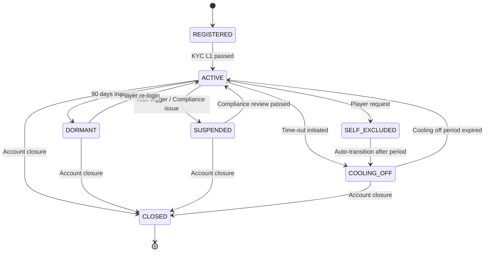

# 第 1 章：玩家管理技術架構

## 1.1 模組概述

SmartAdmin 4-layer implementation for player lifecycle management. The Player Management module serves as the foundational layer for all user interactions within the iGaming platform, handling registration, authentication, identity verification, and player segmentation across multi-tenant environments.

**Key Responsibilities:**
- Player account lifecycle management (registration → active → dormant → closure)
- Know Your Customer (KYC) compliance integration
- Personally Identifiable Information (PII) encryption and security
- VIP tier calculation and management
- RFM (Recency, Frequency, Monetary) player segmentation
- Session management with fraud detection
- Tenant-level Row-Level Security (RLS) enforcement

**Architecture Pattern:** SmartAdmin 4-layer separation of concerns (Controller → Service → Manager → Repository)

---

## 1.2 資料模型

### 核心表結構

#### t_player (玩家主表)

```sql
CREATE TABLE t_player (
    id BIGSERIAL PRIMARY KEY,
    tenant_id BIGINT NOT NULL,

    -- Authentication
    username VARCHAR(100) NOT NULL UNIQUE,
    password_hash VARCHAR(200) NOT NULL,

    -- PII (Encrypted + Blind Index)
    email VARCHAR(200),
    email_blind_index VARCHAR(64),
    phone VARCHAR(50),
    phone_blind_index VARCHAR(64),

    -- Profile
    first_name VARCHAR(100),
    last_name VARCHAR(100),
    date_of_birth DATE,
    gender CHAR(1),

    -- Status Management
    status VARCHAR(50) NOT NULL DEFAULT 'REGISTERED',
    kyc_level VARCHAR(5) DEFAULT 'L0',
    vip_tier VARCHAR(20) DEFAULT 'BRONZE',

    -- Preferences
    country_code VARCHAR(5),
    language VARCHAR(10) DEFAULT 'en',
    currency VARCHAR(3),

    -- Audit
    created_at TIMESTAMP NOT NULL DEFAULT CURRENT_TIMESTAMP,
    updated_at TIMESTAMP NOT NULL DEFAULT CURRENT_TIMESTAMP,
    version BIGINT NOT NULL DEFAULT 0,

    -- Constraints
    CONSTRAINT fk_player_tenant FOREIGN KEY (tenant_id) REFERENCES t_tenant(id),
    CONSTRAINT ck_player_status CHECK (status IN ('REGISTERED', 'ACTIVE', 'DORMANT', 'SELF_EXCLUDED', 'SUSPENDED', 'CLOSED', 'COOLING_OFF')),
    CONSTRAINT ck_player_kyc_level CHECK (kyc_level IN ('L0', 'L1', 'L2', 'L3')),
    CONSTRAINT ck_player_vip_tier CHECK (vip_tier IN ('BRONZE', 'SILVER', 'GOLD', 'PLATINUM', 'DIAMOND'))
);

CREATE UNIQUE INDEX idx_player_tenant_username ON t_player(tenant_id, username);
CREATE INDEX idx_player_email_blind ON t_player(email_blind_index) WHERE email_blind_index IS NOT NULL;
CREATE INDEX idx_player_phone_blind ON t_player(phone_blind_index) WHERE phone_blind_index IS NOT NULL;
CREATE INDEX idx_player_status ON t_player(status);
CREATE INDEX idx_player_kyc_level ON t_player(kyc_level);
CREATE INDEX idx_player_vip_tier ON t_player(vip_tier);
```

**Row-Level Security Policy:**
```sql
ALTER TABLE t_player ENABLE ROW LEVEL SECURITY;
CREATE POLICY player_tenant_isolation ON t_player
  FOR ALL USING (tenant_id = current_setting('app.tenant_id')::BIGINT);
```

#### t_player_kyc (KYC 文件追蹤)

```sql
CREATE TABLE t_player_kyc (
    id BIGSERIAL PRIMARY KEY,
    player_id BIGINT NOT NULL,
    kyc_level VARCHAR(5) NOT NULL,
    status VARCHAR(50) NOT NULL DEFAULT 'PENDING',
    document_type VARCHAR(50),
    document_url VARCHAR(255),
    document_s3_key VARCHAR(255),
    s3_encryption_key_id VARCHAR(100),
    rejection_reason VARCHAR(1000),
    reviewed_by_user_id BIGINT,
    reviewed_at TIMESTAMP,
    expires_at TIMESTAMP,
    created_at TIMESTAMP NOT NULL DEFAULT CURRENT_TIMESTAMP,
    updated_at TIMESTAMP NOT NULL DEFAULT CURRENT_TIMESTAMP,
    version BIGINT NOT NULL DEFAULT 0,

    CONSTRAINT fk_player_kyc_player FOREIGN KEY (player_id) REFERENCES t_player(id) ON DELETE CASCADE,
    CONSTRAINT ck_kyc_status CHECK (status IN ('PENDING', 'APPROVED', 'REJECTED', 'EXPIRED'))
);

CREATE INDEX idx_player_kyc_player_id ON t_player_kyc(player_id);
CREATE INDEX idx_player_kyc_status ON t_player_kyc(status);
```

#### t_player_tag (玩家標籤系統)

```sql
CREATE TABLE t_player_tag (
    id BIGSERIAL PRIMARY KEY,
    player_id BIGINT NOT NULL,
    tag_name VARCHAR(100) NOT NULL,
    tag_value VARCHAR(500),
    tag_type VARCHAR(50),
    created_at TIMESTAMP NOT NULL DEFAULT CURRENT_TIMESTAMP,

    CONSTRAINT fk_player_tag_player FOREIGN KEY (player_id) REFERENCES t_player(id) ON DELETE CASCADE,
    CONSTRAINT ck_tag_type CHECK (tag_type IN ('BEHAVIORAL', 'RISK', 'PREFERENCE', 'COMPLIANCE', 'MANUAL'))
);

CREATE INDEX idx_player_tag_player_id ON t_player_tag(player_id);
CREATE INDEX idx_player_tag_name ON t_player_tag(tag_name);
```

#### t_player_session (會話追蹤)

```sql
CREATE TABLE t_player_session (
    id BIGSERIAL PRIMARY KEY,
    player_id BIGINT NOT NULL,
    session_token VARCHAR(255) NOT NULL UNIQUE,
    device_fingerprint VARCHAR(255),
    ip_address INET,
    user_agent VARCHAR(500),
    login_at TIMESTAMP NOT NULL DEFAULT CURRENT_TIMESTAMP,
    last_activity_at TIMESTAMP NOT NULL,
    expires_at TIMESTAMP NOT NULL,
    is_active BOOLEAN NOT NULL DEFAULT TRUE,
    logout_at TIMESTAMP,

    CONSTRAINT fk_player_session_player FOREIGN KEY (player_id) REFERENCES t_player(id) ON DELETE CASCADE
);

CREATE INDEX idx_player_session_token ON t_player_session(session_token);
CREATE INDEX idx_player_session_player_active ON t_player_session(player_id) WHERE is_active = TRUE;
```

### PII 加密策略

**Multi-Layer Encryption Architecture:**

1. **Application-Layer Encryption (AES-256-GCM)**
   - Sensitive fields (email, phone, name, DOB) encrypted before database write
   - Encryption key rotation every 90 days managed by KeyVault
   - IV (Initialization Vector) randomly generated per record
   - Authenticated encryption prevents tampering

2. **Blind Index (HMAC-SHA256)**
   - Searchable encryption without decryption
   - Separate index key from encryption key
   - Email blind index enables duplicate check without exposing plaintext
   - Phone blind index enables account recovery lookup

3. **Column Encryption Example**
   ```java
   @Column(name = "email")
   @PiiEncrypted(algorithm = "AES-256-GCM", keyId = "pii-master-key-1")
   private String email;

   @Column(name = "email_blind_index")
   @BlindIndexed(algorithm = "HMAC-SHA256", keyId = "blind-index-key-1")
   private String emailBlindIndex;

   // During registration:
   // 1. plaintext email from request
   // 2. Calculate emailBlindIndex = HMAC(email, blindIndexKey)
   // 3. Encrypt email with AES-256-GCM
   // 4. Store encrypted_email, emailBlindIndex in database
   ```

4. **Encryption Key Management**
   - Master keys stored in HashiCorp Vault
   - Tenant isolation: each tenant has separate encryption keys
   - Key derivation: tenant_id + key_version → key material
   - Rotation without re-encryption: transparent via keyId versioning

---

## 1.3 狀態機

**Player Lifecycle State Machine:**



**State Transition Rules:**

| From State | To State | Trigger | Conditions |
|---|---|---|---|
| REGISTERED | ACTIVE | KYC L1 approval | Email verified + ID verified |
| ACTIVE | DORMANT | Scheduled job | No login/transaction for 90 days |
| ACTIVE | SUSPENDED | Admin action | Fraud detected / Compliance flag |
| ACTIVE | SELF_EXCLUDED | Player request | Via account settings API |
| ACTIVE | COOLING_OFF | Admin/System | Responsible gambling trigger |
| DORMANT | ACTIVE | Player login | Valid session creation |
| SUSPENDED | ACTIVE | Admin approval | Compliance review passed |
| SELF_EXCLUDED | COOLING_OFF | System (auto) | Transition rule after 30 days |
| COOLING_OFF | ACTIVE | System (auto) | Period expiration |
| Any State | CLOSED | Admin action | Permanent account closure |

**State-Specific Restrictions:**
- REGISTERED: Cannot place bets, limited wallet operations
- DORMANT: No login allowed (auto-redirect to reactivation flow)
- SUSPENDED: All operations blocked except admin communication
- SELF_EXCLUDED: Operations blocked for exclusion period (default 30 days)
- COOLING_OFF: Betting disabled but account accessible for 24-168 hours
- CLOSED: Permanent termination, no login possible

---

## 1.4 註冊流程

**API Endpoint:**
```
POST /api/v1/players/register
Content-Type: application/json
```

**Request Payload:**
```json
{
  "username": "john_doe_123",
  "password": "SecurePassword@2026",
  "email": "john@example.com",
  "phone": "+1-555-0123",
  "first_name": "John",
  "last_name": "Doe",
  "date_of_birth": "1990-05-15",
  "country_code": "US",
  "currency": "USD",
  "language": "en"
}
```

**Registration Service Flow:**

```java
@Service
@Transactional(isolation = Isolation.SERIALIZABLE)
public class PlayerRegistrationService {

    private final PlayerManager playerManager;
    private final EncryptionService encryptionService;
    private final KycService kycService;
    private final KafkaTemplate kafkaTemplate;
    private final RateLimitService rateLimitService;

    public PlayerDto registerPlayer(RegisterPlayerRequest request, String ipAddress) {
        // 1. Rate limiting check
        if (!rateLimitService.checkLimit("registration", ipAddress, 5, Duration.ofHours(1))) {
            throw new RateLimitExceededException("Registration rate limit exceeded");
        }

        // 2. Input validation
        validateRegistrationInput(request);

        // 3. Duplicate check using blind index
        String emailBlindIndex = blindIndexPassword(request.getEmail());
        String phoneBlindIndex = blindIndexPassword(request.getPhone());

        if (playerManager.existsByEmailBlindIndex(emailBlindIndex)) {
            throw new PlayerAlreadyExistsException("Email already registered");
        }
        if (playerManager.existsByPhoneBlindIndex(phoneBlindIndex)) {
            throw new PlayerAlreadyExistsException("Phone already registered");
        }

        // 4. Encrypt sensitive data
        String encryptedEmail = encryptionService.encrypt(request.getEmail(), "AES-256-GCM");
        String encryptedPhone = encryptionService.encrypt(request.getPhone(), "AES-256-GCM");

        // 5. Hash password with Argon2id
        String passwordHash = passwordEncoder.encode(request.getPassword());

        // 6. Create player entity atomically with CASH wallet
        Player player = playerManager.createPlayerWithWallet(
            request.getUsername(),
            passwordHash,
            encryptedEmail,
            emailBlindIndex,
            encryptedPhone,
            phoneBlindIndex,
            request.getFirstName(),
            request.getLastName(),
            request.getDateOfBirth(),
            request.getCountryCode(),
            request.getCurrency(),
            request.getLanguage()
        );

        // 7. Send verification email (async)
        emailService.sendVerificationEmailAsync(player.getId());

        // 8. Publish event to Kafka
        PlayerRegisteredEvent event = new PlayerRegisteredEvent(
            player.getId(),
            player.getUsername(),
            player.getCountryCode(),
            LocalDateTime.now()
        );
        kafkaTemplate.send("players.registered", event);

        // 9. Trigger L0 KYC auto-approval after email verification
        kycService.initiateL0Kyc(player.getId());

        return PlayerDto.fromEntity(player);
    }
}
```

**Database Transaction Guarantee:**
- SERIALIZABLE isolation level prevents concurrent duplicate registration
- Player + CASH wallet creation in single transaction with savepoint
- Idempotent: duplicate requests with same email rejected with unique constraint violation

**Rate Limiting:**
- Redis-backed sliding window: 5 registrations per IP per hour
- Distributed rate limiting for multi-instance deployments
- Rate limit key: `registration:${ip_address}:${hour}`

**Password Hashing:**
- Argon2id algorithm (memory-hard, GPU-resistant)
- Parameters: memory=64MB, iterations=3, parallelism=4
- Salt: automatically generated per hash (secure random)

**Async Operations:**
- Email verification email sent asynchronously to prevent registration latency
- Event published to Kafka topic `players.registered` for downstream processing
- L0 KYC initiated but completion tracked separately

---

## 1.5 KYC 整合

**Know Your Customer (KYC) Compliance Integration**

### KYC Levels

| Level | Requirements | Trigger | Timeline | Provider |
|-------|---|---|---|---|
| **L0** | Email + Phone verification | Auto on registration | Immediate | Internal |
| **L1** | Government ID verification | Auto after 24h registration window | 5-15 minutes | Onfido/Jumio |
| **L2** | Address proof | Manual workflow | 1-3 days | Manual review queue |
| **L3** | Bank verification + Video KYC | High-value withdrawal | 2-5 days | BNPLApiClient + Video platform |

### KYC Adapter Pattern (Analogous to GP Payment Adapter)

```java
public interface KycProvider {
    VerificationResult verifyIdentity(IdentityVerificationRequest request);
    DocumentVerificationResult verifyDocument(DocumentVerificationRequest request);
    AddressVerificationResult verifyAddress(AddressVerificationRequest request);
}

@Service
@RequiredArgsConstructor
public class KycAdapterFactory {
    private final OnfidoAdapter onfidoAdapter;
    private final JumioAdapter jumioAdapter;

    public KycProvider getProviderForTenant(Long tenantId) {
        TenantConfig config = tenantService.getConfig(tenantId);
        return switch(config.getKycProvider()) {
            case "onfido" -> onfidoAdapter;
            case "jumio" -> jumioAdapter;
            default -> throw new ConfigurationException("Unknown KYC provider");
        };
    }
}
```

### L0 KYC - Auto Verification

```java
@Service
public class L0KycService {

    public void initiateL0Kyc(Long playerId) {
        // Email verification
        Player player = playerRepository.findById(playerId);

        String verificationToken = generateSecureToken();
        playerManager.updateKycVerificationToken(playerId, verificationToken, L0_VERIFICATION);

        emailService.sendVerificationEmail(
            player.getEncryptedEmail(),
            verificationToken
        );
    }

    public void completeEmailVerification(String token) {
        PlayerKycVerification verification = findByToken(token);

        if (isExpired(verification)) {
            throw new TokenExpiredException("Verification link expired");
        }

        Player player = verification.getPlayer();
        playerManager.markL0KycApproved(player.getId());
        playerManager.updatePlayerStatus(player.getId(), ACTIVE);
    }
}
```

### L1 KYC - ID Verification via 3rd Party

```java
@Service
@Transactional
public class L1KycService {

    private final KycAdapterFactory adapterFactory;
    private final PlayerManager playerManager;
    private final S3Client s3Client;

    public String initiateIdVerification(Long playerId, String documentType) {
        Player player = playerRepository.findById(playerId);

        // Create KYC record with PENDING status
        PlayerKyc kyc = PlayerKyc.builder()
            .player(player)
            .kycLevel("L1")
            .documentType(documentType)
            .status("PENDING")
            .build();

        playerKycRepository.save(kyc);

        // Request ID verification from provider
        KycProvider provider = adapterFactory.getProviderForTenant(player.getTenantId());

        IdentityVerificationRequest verReq = IdentityVerificationRequest.builder()
            .externalReference(kyc.getId().toString())
            .documentType(documentType)
            .build();

        VerificationResult result = provider.verifyIdentity(verReq);

        // Publish event for webhook callback
        kafkaTemplate.send("kyc.l1.initiated", new KycL1InitiatedEvent(
            playerId,
            result.getVerificationId()
        ));

        return result.getVerificationSessionUrl();
    }

    public void handleProviderCallback(KycCallbackPayload payload) {
        PlayerKyc kyc = playerKycRepository.findById(payload.getExternalReference());

        if (payload.getStatus().equals("APPROVED")) {
            playerManager.updatePlayerKycLevel(kyc.getPlayerId(), "L1");

            // Check if L1 requirements for ACTIVE status are met
            Player player = playerRepository.findById(kyc.getPlayerId());
            if (player.getStatus().equals(REGISTERED)) {
                playerManager.updatePlayerStatus(kyc.getPlayerId(), ACTIVE);
            }

            kyc.setStatus("APPROVED");
        } else if (payload.getStatus().equals("REJECTED")) {
            kyc.setStatus("REJECTED");
            kyc.setRejectionReason(payload.getReason());
        }

        playerKycRepository.save(kyc);
    }
}
```

### L2 KYC - Address Proof (Manual Review)

```java
@Service
public class L2KycService {

    private final SqsClient sqsClient;

    public void submitAddressProof(Long playerId, MultipartFile addressDocument) {
        // Validate document type (utility bill, lease agreement, etc.)
        validateAddressDocument(addressDocument);

        // Upload to encrypted S3 with tenant isolation
        String s3Key = uploadToSecureS3(playerId, addressDocument);

        PlayerKyc kyc = PlayerKyc.builder()
            .player(playerRepository.findById(playerId))
            .kycLevel("L2")
            .documentType("ADDRESS_PROOF")
            .documentS3Key(s3Key)
            .s3EncryptionKeyId(generateEncryptionKeyId())
            .status("PENDING")
            .build();

        playerKycRepository.save(kyc);

        // Add to manual review queue (SQS)
        sqsClient.sendMessage("kyc-review-queue", new KycReviewMessage(
            kyc.getId(),
            playerId,
            KycReviewType.ADDRESS_PROOF
        ));
    }
}
```

### L3 KYC - Bank Verification + Video KYC

```java
@Service
public class L3KycService {

    public void initiateL3KycForHighValueWithdrawal(Long playerId, BigDecimal withdrawalAmount) {
        // Trigger L3 if withdrawal exceeds threshold (configurable per tenant)
        TenantConfig config = tenantService.getConfig(getCurrentTenantId());

        if (withdrawalAmount.compareTo(config.getL3KycThreshold()) > 0) {
            // Bank account verification
            initiateOpenBankingVerification(playerId);

            // Video KYC
            initiateVideoKycSession(playerId);
        }
    }

    private void initiateOpenBankingVerification(Long playerId) {
        // OAuth flow with OpenBanking API
        Player player = playerRepository.findById(playerId);

        String authorizationUrl = openBankingClient.getAuthorizationUrl(
            playerId,
            "account-verification"
        );

        // Return URL to frontend for bank selection
    }

    private void initiateVideoKycSession(Long playerId) {
        Player player = playerRepository.findById(playerId);

        VideoKycRequest request = VideoKycRequest.builder()
            .playerId(playerId)
            .referenceId(UUID.randomUUID().toString())
            .language(player.getLanguage())
            .build();

        VideoKycSession session = videoKycProvider.initiateSession(request);

        playerKycRepository.save(PlayerKyc.builder()
            .player(player)
            .kycLevel("L3")
            .documentType("VIDEO_KYC")
            .documentUrl(session.getVideoSessionUrl())
            .status("PENDING")
            .build()
        );
    }
}
```

### Document Storage Security

```java
@Service
public class KycDocumentStorageService {

    private final S3Client s3Client;
    private final EncryptionService encryptionService;

    public String uploadKycDocument(Long playerId, MultipartFile document) {
        // Generate S3 key with tenant isolation
        String s3Key = String.format(
            "kyc/%d/%d/%s",
            getTenantId(),
            playerId,
            UUID.randomUUID()
        );

        // Encrypt file content before S3 upload
        byte[] encryptedContent = encryptionService.encryptFile(
            document.getBytes(),
            "AES-256-GCM"
        );

        // Upload with SSE (Server-Side Encryption)
        PutObjectRequest putRequest = PutObjectRequest.builder()
            .bucket("kyc-documents")
            .key(s3Key)
            .serverSideEncryption(ServerSideEncryption.AES256)
            .build();

        s3Client.putObject(putRequest, RequestBody.fromBytes(encryptedContent));

        // Set object lifecycle: delete after 90 days
        setObjectLifecyclePolicy(s3Key, 90);

        return s3Key;
    }
}
```

---

## 1.6 VIP 計算引擎

**VIP Tier System:**

| Tier | Points Range | Benefits | Upgrade Timeline |
|------|---|---|---|
| BRONZE | 0 - 499 | Base rewards | Automatic on registration |
| SILVER | 500 - 4,999 | 5% bonus points | Daily recalculation |
| GOLD | 5,000 - 24,999 | 10% bonus + priority support | Daily recalculation |
| PLATINUM | 25,000 - 99,999 | 15% bonus + concierge | Daily recalculation |
| DIAMOND | 100,000+ | 20% bonus + exclusive events | Daily recalculation |

**VIP Points Accumulation Formula:**

```
points = (total_bets - total_losses) × point_multiplier × activity_bonus
point_multiplier = 0.1 + (currency_multiplier × 0.02)
activity_bonus = 1.0 + (consecutive_days_active × 0.01) [capped at 1.5]
```

### Daily VIP Recalculation Batch Job

```java
@Component
@RequiredArgsConstructor
public class VipTierRecalculationJob {

    private final PlayerRepository playerRepository;
    private final PlayerManager playerManager;
    private final BettingAnalyticsService analyticsService;
    private final KafkaTemplate kafkaTemplate;
    private final ApplicationEventPublisher eventPublisher;

    @Scheduled(cron = "0 2 * * *")  // Daily at 2:00 AM UTC
    public void recalculateVipTiers() {
        // Process in batches to avoid memory exhaustion
        int pageSize = 1000;
        int page = 0;

        while (true) {
            Page<Player> players = playerRepository.findActive(PageRequest.of(page, pageSize));

            if (players.isEmpty()) break;

            players.getContent().forEach(player -> {
                // Calculate new points
                BigDecimal newPoints = calculateVipPoints(player.getId());

                // Determine new tier
                String newTier = determineVipTier(newPoints);
                String currentTier = player.getVipTier();

                if (!newTier.equals(currentTier)) {
                    // Handle tier change
                    playerManager.updateVipTier(player.getId(), newTier);

                    if (isTierUpgrade(currentTier, newTier)) {
                        // Immediate upgrade notification
                        publishVipUpgradeEvent(player.getId(), currentTier, newTier);

                        // Grant tier upgrade bonus
                        grantVipUpgradeBonus(player.getId(), newTier);

                        // Log VIP upgrade
                        auditLog.info("VIP upgrade: {} -> {}", currentTier, newTier, player.getId());
                    } else {
                        // Downgrade with grace period (evaluated next month)
                        if (shouldApplyDowngradeGracePeriod(player, currentTier)) {
                            // Keep current tier, schedule re-evaluation
                            scheduleDowngradeEvaluation(player.getId(), currentTier);
                        } else {
                            playerManager.updateVipTier(player.getId(), newTier);
                            publishVipDowngradeEvent(player.getId(), currentTier, newTier);
                        }
                    }
                }
            });

            page++;
        }

        // Publish completion event
        kafkaTemplate.send("vip.recalculation.completed", new VipRecalculationCompletedEvent(
            LocalDateTime.now(),
            players.getTotalElements()
        ));
    }

    private BigDecimal calculateVipPoints(Long playerId) {
        // Query betting analytics service (ClickHouse)
        BettingMetrics metrics = analyticsService.getPlayerMetrics(playerId);

        BigDecimal totalBets = metrics.getTotalBets();
        BigDecimal totalLosses = metrics.getTotalLosses();
        BigDecimal currencyMultiplier = getCurrencyMultiplier(metrics.getCurrency());
        BigDecimal activityBonus = calculateActivityBonus(playerId);

        BigDecimal pointMultiplier = BigDecimal.valueOf(0.1)
            .add(currencyMultiplier.multiply(BigDecimal.valueOf(0.02)));

        return totalBets.subtract(totalLosses)
            .multiply(pointMultiplier)
            .multiply(activityBonus);
    }

    private String determineVipTier(BigDecimal points) {
        return switch(true) {
            case points.compareTo(BigDecimal.valueOf(100000)) >= 0 -> "DIAMOND";
            case points.compareTo(BigDecimal.valueOf(25000)) >= 0 -> "PLATINUM";
            case points.compareTo(BigDecimal.valueOf(5000)) >= 0 -> "GOLD";
            case points.compareTo(BigDecimal.valueOf(500)) >= 0 -> "SILVER";
            default -> "BRONZE";
        };
    }
}
```

### VIP Change Events

```java
public class VipUpgradeEvent extends ApplicationEvent {
    private final Long playerId;
    private final String fromTier;
    private final String toTier;
    private final LocalDateTime timestamp;

    // Subscribers in RewardService will grant tier-specific bonuses
}

@Service
public class VipEventHandler {

    @EventListener
    public void handleVipUpgrade(VipUpgradeEvent event) {
        // Grant bonus points/funds based on tier
        // Send in-game notification
        // Update analytics
        // Trigger email notification
        notificationService.sendVipUpgradeNotification(event.getPlayerId(), event.getToTier());
    }
}
```

### Tenant-Specific VIP Configuration

```java
@Data
public class TenantVipConfig {
    private Map<String, Long> tierPointThresholds;  // "SILVER" -> 500
    private Map<String, BigDecimal> bonusMultipliers;  // "GOLD" -> 0.10
    private Map<String, BigDecimal> currencyMultipliers;  // "USD" -> 1.0, "JPY" -> 0.01
    private Boolean enableDowngradeGracePeriod;
    /** 降級保護期 — per-tier 可配置 (aligned with Requirements §1.5) */
    private Map<String, Integer> downgradeGraceMonths;
    // 預設: DIAMOND=3, PLATINUM=2, GOLD=1, SILVER=1
}
```

### VIP Downgrade Protection (aligned with Requirements §1.5)

**降級規則**: 連續 2 個月未達維持門檻 → 降一級。但各等級享有不同保護期：

| VIP Tier | 保護期 (可配置) | 說明 |
|----------|-------------|------|
| Diamond | 3 個月 | 高價值玩家長保護期 |
| Platinum | 2 個月 | 中高保護期 |
| Gold | 1 個月 | 標準保護期 |
| Silver | 1 個月 | 標準保護期 |

```java
@Component
public class VipDowngradeProtectionService {

    private final TenantVipConfig vipConfig;
    private final VipDowngradeTrackRepository trackRepo;

    /**
     * 判斷是否應套用降級保護期。
     * 在保護期內第1個月未達標: 發送預警通知但不降級。
     * 保護期到期仍未達標: 執行降級。
     */
    public boolean shouldApplyDowngradeGracePeriod(Player player, String currentTier) {
        Map<String, Integer> graceMonths = vipConfig.getDowngradeGraceMonths();
        int gracePeriod = graceMonths.getOrDefault(currentTier, 1);

        Optional<VipDowngradeTrack> track = trackRepo
            .findActiveByPlayerId(player.getId());

        if (track.isEmpty()) {
            // 首次未達標 → 建立追蹤記錄，開始保護期
            trackRepo.save(VipDowngradeTrack.builder()
                .playerId(player.getId())
                .currentTier(currentTier)
                .graceMonthsTotal(gracePeriod)
                .graceMonthsRemaining(gracePeriod - 1)  // 本月已消耗1個月
                .firstMissDate(Instant.now())
                .status("GRACE_PERIOD")
                .build());

            // 發送預警通知
            notificationService.sendVipDowngradeWarning(
                player.getId(), currentTier, gracePeriod);
            return true;  // 保護中，不降級
        }

        VipDowngradeTrack t = track.get();
        if (t.getGraceMonthsRemaining() > 0) {
            // 仍在保護期內
            t.setGraceMonthsRemaining(t.getGraceMonthsRemaining() - 1);
            trackRepo.save(t);
            notificationService.sendVipDowngradeWarning(
                player.getId(), currentTier, t.getGraceMonthsRemaining());
            return true;  // 保護中，不降級
        }

        // 保護期已耗盡 → 執行降級
        t.setStatus("DOWNGRADED");
        t.setDowngradedAt(Instant.now());
        trackRepo.save(t);
        return false;  // 不再保護，執行降級
    }

    /**
     * 如果玩家在保護期內重新達標，取消降級追蹤
     */
    public void cancelDowngradeTrackIfMet(Long playerId) {
        trackRepo.findActiveByPlayerId(playerId).ifPresent(track -> {
            track.setStatus("CANCELLED_MET_THRESHOLD");
            trackRepo.save(track);
        });
    }
}
```

**t_vip_downgrade_track** (降級保護追蹤):

| 欄位 | 類型 | 說明 |
|------|------|------|
| id | BIGSERIAL | PK |
| player_id | BIGINT | FK → t_player |
| current_tier | VARCHAR(20) | 保護中的 VIP 等級 |
| grace_months_total | INT | 總保護月數 |
| grace_months_remaining | INT | 剩餘保護月數 |
| first_miss_date | TIMESTAMP | 首次未達標日期 |
| status | VARCHAR(30) | GRACE_PERIOD / DOWNGRADED / CANCELLED_MET_THRESHOLD |
| downgraded_at | TIMESTAMP | 實際降級日期 |
| created_at | TIMESTAMP | 建立時間 |

### 1.6.1 MFA 恢復服務 (aligned with Requirements §1.12)

5 種 MFA 恢復場景的技術實作：

```java
@Service
public class MfaRecoveryService {

    private final PlayerManager playerManager;
    private final KycService kycService;
    private final NotificationService notificationService;
    private final WithdrawalFreezeService withdrawalFreezeService;

    /**
     * 場景 1: MFA 設備遺失 → 備用驗證碼恢復
     * 註冊時預先生成 10 組一次性備用碼 (TOTP backup codes)
     */
    public MfaRecoveryResult recoverWithBackupCode(Long playerId, String backupCode) {
        Player player = playerManager.findById(playerId);
        boolean valid = mfaBackupCodeService.verifyAndConsume(playerId, backupCode);
        if (!valid) throw new InvalidBackupCodeException();

        // 重設 MFA 後凍結提款 24 小時
        mfaService.resetMfa(playerId);
        applyWithdrawalFreeze(playerId, "BACKUP_CODE_RECOVERY");
        return MfaRecoveryResult.success("MFA reset. Please re-enroll.");
    }

    /**
     * 場景 2: 備用碼亦遺失 → 客服人工恢復 (KYC L2 + 視訊)
     */
    public MfaRecoveryResult initiateManualRecovery(Long playerId) {
        // 驗證玩家已通過 KYC L2
        if (!kycService.isKycLevelMet(playerId, "L2")) {
            throw new KycLevelInsufficientException("KYC L2 required for manual MFA recovery");
        }

        // 建立人工恢復工單，需要視訊通話確認
        MfaRecoveryTicket ticket = MfaRecoveryTicket.builder()
            .playerId(playerId)
            .type(MfaRecoveryType.MANUAL_WITH_VIDEO)
            .status("PENDING_VIDEO_VERIFICATION")
            .build();
        ticketRepository.save(ticket);

        return MfaRecoveryResult.pending("Video verification required. CS will contact you.");
    }

    /**
     * 場景 3: Email MFA → 重設至新設備 (原 Email + 48h 冷靜期)
     */
    public MfaRecoveryResult resetEmailMfa(Long playerId, String emailOtp) {
        boolean verified = emailOtpService.verify(playerId, emailOtp);
        if (!verified) throw new InvalidOtpException();

        // 48 小時冷靜期後自動重設
        scheduledTaskService.schedule(
            () -> {
                mfaService.resetEmailMfa(playerId);
                applyWithdrawalFreeze(playerId, "EMAIL_MFA_RESET");
            },
            Instant.now().plus(48, ChronoUnit.HOURS)
        );

        return MfaRecoveryResult.pending("Email MFA will reset after 48-hour cooling period.");
    }

    /**
     * 場景 4: TOTP MFA → 客服人工 + KYC L2 + 24h 冷靜期
     */
    public MfaRecoveryResult resetTotpMfa(Long playerId) {
        if (!kycService.isKycLevelMet(playerId, "L2")) {
            throw new KycLevelInsufficientException("KYC L2 required");
        }

        MfaRecoveryTicket ticket = MfaRecoveryTicket.builder()
            .playerId(playerId)
            .type(MfaRecoveryType.TOTP_RESET)
            .status("PENDING_CS_APPROVAL")
            .coolingOffHours(24)
            .build();
        ticketRepository.save(ticket);

        return MfaRecoveryResult.pending("CS approval + 24h cooling period required.");
    }

    /**
     * 場景 5: WebAuthn 硬體金鑰 → 使用備用認證方式
     * 前提: 註冊時須設定至少 2 組認證方式
     */
    public MfaRecoveryResult recoverWebAuthn(Long playerId, String alternateMethod,
                                              String credential) {
        // 使用備用認證方式（TOTP / Email OTP / 備用金鑰）
        boolean verified = mfaService.verifyAlternateMethod(playerId, alternateMethod, credential);
        if (!verified) throw new InvalidCredentialException();

        // 移除失效的 WebAuthn，允許重新綁定
        webAuthnService.removeCredential(playerId);
        applyWithdrawalFreeze(playerId, "WEBAUTHN_RECOVERY");
        return MfaRecoveryResult.success("WebAuthn removed. Please register new security key.");
    }

    /**
     * MFA 重設後 24 小時提款凍結 (安全限制)
     */
    private void applyWithdrawalFreeze(Long playerId, String reason) {
        withdrawalFreezeService.freeze(
            playerId,
            Duration.ofHours(24),
            "MFA_RECOVERY:" + reason
        );
        notificationService.sendWithdrawalFreezeNotice(playerId, 24);
    }
}
```

**MFA Recovery API Endpoints:**

| HTTP | Path | Auth | Description |
|------|------|------|---|
| `POST` | `/api/v1/players/{id}/mfa/recover/backup-code` | Player | 場景 1: 備用碼恢復 |
| `POST` | `/api/v1/players/{id}/mfa/recover/manual` | Player | 場景 2: 人工恢復申請 |
| `POST` | `/api/v1/players/{id}/mfa/recover/email-reset` | Player | 場景 3: Email MFA 重設 |
| `POST` | `/api/v1/players/{id}/mfa/recover/totp-reset` | Player | 場景 4: TOTP 重設申請 |
| `POST` | `/api/v1/players/{id}/mfa/recover/webauthn` | Player | 場景 5: WebAuthn 備用認證 |

---

## 1.7 RFM 分群

**RFM (Recency, Frequency, Monetary) Analysis:**

RFM is a behavioral segmentation technique that groups players into 6 personas based on their recent activity, betting frequency, and monetary value.

### RFM Metrics Definition

```
Recency (R): Days since last activity
Frequency (F): Number of betting events in past 90 days
Monetary (M): Total net loss amount in past 90 days

Each metric scored 1-5 (lower score = better recency/frequency/higher monetary value)

RFM Score = R_score × 100 + F_score × 10 + M_score
Example: R=1, F=2, M=1 → Score = 121 (Champions)
```

### Daily Flink SQL Batch Job

```sql
-- Flink Streaming SQL Job: RFM Segmentation

CREATE TEMPORARY VIEW player_rfm AS
SELECT
    p.id as player_id,
    p.tenant_id,
    DATEDIFF(DAY, MAX(be.event_time), CURRENT_DATE) as recency_days,
    COUNT(DISTINCT be.id) as betting_frequency,
    SUM(CASE WHEN be.result_amount < 0 THEN ABS(be.result_amount) ELSE 0 END) as total_monetary
FROM t_player p
LEFT JOIN betting_events be ON p.id = be.player_id
    AND be.event_time >= DATE_SUB(CURRENT_DATE, INTERVAL 90 DAY)
WHERE p.status = 'ACTIVE'
GROUP BY p.id, p.tenant_id
ORDER BY p.id;

-- RFM Scoring
CREATE TEMPORARY VIEW rfm_scores AS
SELECT
    player_id,
    tenant_id,
    recency_days,
    betting_frequency,
    total_monetary,
    -- Recency score (R)
    CASE
        WHEN recency_days <= 7 THEN 5
        WHEN recency_days <= 30 THEN 4
        WHEN recency_days <= 60 THEN 3
        WHEN recency_days <= 90 THEN 2
        ELSE 1
    END as r_score,
    -- Frequency score (F)
    CASE
        WHEN betting_frequency >= 50 THEN 5
        WHEN betting_frequency >= 30 THEN 4
        WHEN betting_frequency >= 15 THEN 3
        WHEN betting_frequency >= 5 THEN 2
        ELSE 1
    END as f_score,
    -- Monetary score (M) - inverted
    CASE
        WHEN total_monetary >= 5000 THEN 5
        WHEN total_monetary >= 1000 THEN 4
        WHEN total_monetary >= 100 THEN 3
        WHEN total_monetary > 0 THEN 2
        ELSE 1
    END as m_score
FROM player_rfm;

-- Segment Assignment
INSERT INTO t_player_rfm_segment
SELECT
    player_id,
    tenant_id,
    CURRENT_DATE as segment_date,
    CASE
        -- Champions: R >= 4, F >= 4, M >= 4
        WHEN r_score >= 4 AND f_score >= 4 AND m_score >= 4 THEN 'CHAMPIONS'
        -- Loyal: R >= 3, F >= 3, M >= 3
        WHEN r_score >= 3 AND f_score >= 3 AND m_score >= 3 THEN 'LOYAL'
        -- Potential: R >= 3, F >= 2, M >= 2
        WHEN r_score >= 3 AND f_score >= 2 AND m_score >= 2 THEN 'POTENTIAL'
        -- At Risk: R <= 2, F >= 2, M >= 2
        WHEN r_score <= 2 AND f_score >= 2 AND m_score >= 2 THEN 'AT_RISK'
        -- Hibernating: R <= 2, F >= 1
        WHEN r_score <= 2 AND f_score >= 1 THEN 'HIBERNATING'
        -- New: Activity < 7 days
        ELSE 'NEW'
    END as segment,
    r_score,
    f_score,
    m_score
FROM rfm_scores;
```

### ClickHouse Analytics Storage

```sql
CREATE TABLE ch_player_rfm_segments (
    segment_date Date,
    player_id Int64,
    tenant_id Int64,
    segment String,
    recency_days UInt16,
    betting_frequency UInt32,
    total_monetary Decimal128(2),
    r_score UInt8,
    f_score UInt8,
    m_score UInt8
) ENGINE = MergeTree()
ORDER BY (segment_date, tenant_id, player_id);

CREATE TABLE ch_player_rfm_timeseries (
    date Date,
    tenant_id Int64,
    segment String,
    player_count UInt32,
    avg_monetary Decimal128(2)
) ENGINE = SummingMergeTree()
ORDER BY (date, tenant_id, segment);
```

### RFM Query for Marketing Teams

```java
@Service
public class RfmAnalyticsService {

    private final ClickHouseClient clickHouseClient;

    public List<PlayerSegmentDto> getSegmentPlayers(Long tenantId, String segment) {
        String query = """
            SELECT player_id, segment, recency_days, betting_frequency, total_monetary
            FROM ch_player_rfm_segments
            WHERE tenant_id = ? AND segment = ? AND segment_date = today()
            ORDER BY total_monetary DESC
            LIMIT 10000
            """;

        return clickHouseClient.executeQuery(query,
            new Object[]{tenantId, segment},
            PlayerSegmentDto.class
        );
    }

    public SegmentMetricsDto getSegmentMetrics(Long tenantId, LocalDate date) {
        String query = """
            SELECT segment, player_count, avg_monetary
            FROM ch_player_rfm_timeseries
            WHERE tenant_id = ? AND date = ?
            """;

        return clickHouseClient.executeQuery(query,
            new Object[]{tenantId, date},
            SegmentMetricsDto.class
        ).stream()
        .collect(toSegmentMetricsDto());
    }
}
```

---

## 1.8 Session 管理

**Multi-Layer Session Architecture:**

### Sa-Token Session Framework Integration

```java
@Service
@RequiredArgsConstructor
public class PlayerSessionService {

    private final RedisTemplate<String, SessionData> sessionRedis;
    private final DeviceFingerprintService deviceFingerprintService;
    private final ImpossibleTravelDetector travelDetector;

    public SessionData createSession(Long playerId, LoginRequest request) {
        // Device fingerprint binding
        String deviceFingerprint = deviceFingerprintService.calculate(
            request.getUserAgent(),
            request.getAcceptLanguage(),
            request.getScreenResolution()
        );

        // Generate session token (Sa-Token)
        String sessionToken = StpUtil.getTokenValueByLoginId(playerId);

        // Create session data
        SessionData sessionData = SessionData.builder()
            .playerId(playerId)
            .sessionToken(sessionToken)
            .deviceFingerprint(deviceFingerprint)
            .ipAddress(request.getIpAddress())
            .userAgent(request.getUserAgent())
            .loginAt(LocalDateTime.now())
            .expiresAt(LocalDateTime.now().plusHours(24))
            .isActive(true)
            .build();

        // Check impossible travel
        checkImpossibleTravel(playerId, request.getIpAddress());

        // Store in Redis with TTL
        sessionRedis.opsForValue().set(
            "session:" + sessionToken,
            sessionData,
            Duration.ofHours(24)
        );

        // Store in database for audit
        playerSessionRepository.save(PlayerSession.builder()
            .playerId(playerId)
            .sessionToken(sessionToken)
            .deviceFingerprint(deviceFingerprint)
            .ipAddress(InetAddress.getByName(request.getIpAddress()))
            .userAgent(request.getUserAgent())
            .loginAt(LocalDateTime.now())
            .expiresAt(sessionData.getExpiresAt())
            .isActive(true)
            .build()
        );

        return sessionData;
    }

    public void checkDeviceFingerprint(String sessionToken, String currentFingerprint) {
        SessionData session = sessionRedis.opsForValue().get("session:" + sessionToken);

        if (!session.getDeviceFingerprint().equals(currentFingerprint)) {
            // Device fingerprint mismatch - potential session hijacking
            throw new DeviceFingerprintMismatchException(
                "Device fingerprint changed. Session requires re-authentication."
            );
        }
    }

    private void checkImpossibleTravel(Long playerId, String newIpAddress) {
        PlayerSession lastSession = playerSessionRepository
            .findLatestActiveSession(playerId);

        if (lastSession == null) return;

        String previousIpAddress = lastSession.getIpAddress().toString();
        long timeSinceLastSession = Duration.between(
            lastSession.getLastActivityAt(),
            LocalDateTime.now()
        ).toMinutes();

        if (travelDetector.isImpossible(previousIpAddress, newIpAddress, timeSinceLastSession)) {
            throw new ImpossibleTravelDetectedException(
                "Login from impossible location. Please verify your identity."
            );
        }
    }
}
```

### Concurrent Session Limiting

```java
@Service
public class ConcurrentSessionLimitService {

    private final RedisTemplate<String, Set<String>> sessionIndexRedis;
    private final TenantConfigService tenantConfig;

    public void validateConcurrentSessionLimit(Long playerId) throws ConcurrentSessionLimitExceededException {
        Long tenantId = getTenantId();
        TenantPlayerLimitConfig config = tenantConfig.getSessionLimitConfig(tenantId);

        Set<String> activeSessions = sessionIndexRedis.opsForSet()
            .members("player-sessions:" + playerId);

        int activeCount = activeSessions != null ? activeSessions.size() : 0;

        if (activeCount >= config.getConcurrentSessionLimit()) {
            // Implement configurable behavior
            if (config.getExcessSessionBehavior() == SessionBehavior.REJECT_NEW) {
                throw new ConcurrentSessionLimitExceededException(
                    "Maximum concurrent sessions exceeded: " + activeCount
                );
            } else if (config.getExcessSessionBehavior() == SessionBehavior.TERMINATE_OLDEST) {
                String oldestSession = findOldestSession(activeSessions);
                invalidateSession(oldestSession);
            }
        }
    }
}
```

### Session Invalidation on Status Change

```java
@Service
@Transactional
public class PlayerStatusChangeService {

    private final PlayerSessionRepository sessionRepository;
    private final RedisTemplate<String, SessionData> sessionRedis;

    public void updatePlayerStatus(Long playerId, PlayerStatus newStatus) {
        Player player = playerRepository.findById(playerId);

        // Status transition logic
        PlayerStatus oldStatus = player.getStatus();
        playerManager.updateStatus(playerId, newStatus);

        // Invalidate sessions based on status
        if (newStatus == SUSPENDED || newStatus == CLOSED || newStatus == SELF_EXCLUDED) {
            // Immediately invalidate all sessions
            invalidateAllPlayerSessions(playerId);

            // Optional: notify user via email/push
            notificationService.sendSessionTerminationNotice(playerId, newStatus);
        }
    }

    private void invalidateAllPlayerSessions(Long playerId) {
        List<PlayerSession> activeSessions = sessionRepository
            .findActiveSessionsByPlayerId(playerId);

        activeSessions.forEach(session -> {
            // Remove from Redis
            sessionRedis.delete("session:" + session.getSessionToken());

            // Mark as inactive in DB
            session.setIsActive(false);
            session.setLogoutAt(LocalDateTime.now());
            sessionRepository.save(session);
        });
    }
}
```

---

## 1.9 API 端點

**Player Management API Specification:**

### Authentication & Player Profile

| HTTP | Path | Auth | Description | Rate Limit |
|------|------|------|---|---|
| `POST` | `/api/v1/players/register` | Public | Register new player | 5/hour per IP |
| `POST` | `/api/v1/players/login` | Public | Player login, return session token | 10/min per IP |
| `POST` | `/api/v1/players/logout` | Player | Invalidate session | 1000/day per player |
| `GET` | `/api/v1/players/{id}` | Player, Admin | Get player profile | 100/min |
| `PUT` | `/api/v1/players/{id}` | Player | Update profile (name, preferences) | 100/min |
| `POST` | `/api/v1/players/{id}/password-reset` | Player | Change password | 5/day per player |

### KYC Management

| HTTP | Path | Auth | Description |
|------|------|------|---|
| `GET` | `/api/v1/players/{id}/kyc/status` | Player | Get KYC status (L0-L3) |
| `POST` | `/api/v1/players/{id}/kyc/l0/verify-email` | Player | Send email verification link |
| `POST` | `/api/v1/players/{id}/kyc/l1/initiate` | Player | Start ID verification flow |
| `GET` | `/api/v1/players/{id}/kyc/l1/callback` | Public | Webhook callback from Onfido |
| `POST` | `/api/v1/players/{id}/kyc/l2/submit` | Player | Upload address proof |
| `POST` | `/api/v1/players/{id}/kyc/l3/initiate-video` | Player | Start video KYC session |

### VIP & Segmentation

| HTTP | Path | Auth | Description |
|------|------|------|---|
| `GET` | `/api/v1/players/{id}/vip-tier` | Player | Get current VIP tier |
| `GET` | `/api/v1/players/{id}/rfm-segment` | Admin | Get RFM segment (Champions, Loyal, etc.) |
| `GET` | `/api/v1/admin/players/segments/{segment}` | Admin | List players in segment (paginated) |

### Admin Operations

| HTTP | Path | Auth | Description | Audit |
|------|------|------|---|---|
| `GET` | `/api/v1/admin/players` | Admin | List all players (paginated, filterable) | Yes |
| `POST` | `/api/v1/admin/players/{id}/suspend` | Admin | Suspend player account | Yes |
| `POST` | `/api/v1/admin/players/{id}/cooling-off` | Admin | Initiate cooling-off period | Yes |
| `POST` | `/api/v1/admin/players/{id}/close` | Admin | Permanently close account | Yes |
| `GET` | `/api/v1/admin/players/{id}/sessions` | Admin | View active sessions | Yes |
| `POST` | `/api/v1/admin/players/{id}/sessions/{sessionId}/terminate` | Admin | Force logout | Yes |

### Example Request/Response

**POST /api/v1/players/login**
```json
// Request
{
  "username": "john_doe_123",
  "password": "SecurePassword@2026",
  "ipAddress": "203.0.113.45",
  "userAgent": "Mozilla/5.0...",
  "deviceFingerprint": "abc123def456"
}

// Response 200
{
  "playerId": 12345,
  "sessionToken": "eyJhbGciOiJIUzI1NiIsInR5cCI6IkpXVCJ9...",
  "vipTier": "GOLD",
  "kycLevel": "L1",
  "status": "ACTIVE",
  "expiresAt": "2026-03-25T14:30:00Z"
}

// Response 401 - Impossible Travel
{
  "error": "ImpossibleTravelDetected",
  "message": "Login from impossible location. Please verify your identity.",
  "verification_required": true,
  "verification_url": "/api/v1/verification/send-code"
}
```

---

## 1.10 ArchUnit 規則

**Code Architecture Constraints (Enforced by ArchUnit):**

```java
@AnalyzeClasses(packages = "com.igaming.player")
public class PlayerManagementArchitectureTest {

    // Rule 1: Service layer isolation
    @ArchTest
    public static final ArchRule services_should_not_have_transactional =
        noClasses()
            .that().resideInAPackage("..service")
            .should().beAnnotatedWith(Transactional.class)
            .as("Services should not have @Transactional - use Manager layer");

    // Rule 2: Manager layer transaction boundary
    @ArchTest
    public static final ArchRule managers_must_have_transactional =
        classes()
            .that().haveSimpleNameEndingWith("Manager")
            .and().resideInAPackage("..manager")
            .should().beAnnotatedWith(Transactional.class)
            .as("Manager classes must have @Transactional annotation");

    // Rule 3: Repository access control
    @ArchTest
    public static final ArchRule repositories_only_accessed_by_manager =
        classes()
            .that().implement(Repository.class)
            .should().onlyBeAccessedByClassesThat()
                .haveSimpleNameEndingWith("Manager")
                .or().haveSimpleNameEndingWith("Repository")
            .as("Repository classes should only be accessed by Manager or other Repository classes");

    // Rule 4: PII field encryption enforcement
    @ArchTest
    public static final ArchRule pii_fields_must_use_encryption =
        fields()
            .that().haveName("email")
                .or().haveName("phone")
                .or().haveName("firstName")
            .and().areDeclaredInClassesThat().haveSimpleNameContaining("Player")
            .should().beAnnotatedWith(PiiEncrypted.class)
            .as("All PII fields must use @PiiEncrypted annotation");

    // Rule 5: Dependency direction
    @ArchTest
    public static final ArchRule dependency_direction =
        layeredArchitecture()
            .layer("Controller").definedBy("..controller..")
            .layer("Service").definedBy("..service..")
            .layer("Manager").definedBy("..manager..")
            .layer("Repository").definedBy("..repository..")
            .layer("Entity").definedBy("..entity..")
            .mayNotAccessAnyLayer()
            .whereLayer("Controller").mayNotAccessLayerMatching(".*Manager|.*Repository")
            .whereLayer("Service").mayNotAccessLayerMatching(".*Repository")
            .whereLayer("Entity").mayNotAccessAnyLayer()
            .as("Enforce layered architecture dependency order");

    // Rule 6: No circular dependencies
    @ArchTest
    public static final ArchRule no_cycles =
        slices().matching("..player.(*)..")
            .should().beFreeOfCycles()
            .as("No circular dependencies within player module");
}
```

**Implementation Examples:**

```java
// INCORRECT - Service with @Transactional
@Service
@Transactional  // ❌ Violates Rule 1
public class PlayerService {
    public void registerPlayer(RegisterRequest request) { ... }
}

// CORRECT - Service without @Transactional
@Service
public class PlayerService {
    private final PlayerManager playerManager;

    public void registerPlayer(RegisterRequest request) {
        playerManager.createPlayer(request);  // Delegates to Manager
    }
}

// CORRECT - Manager with @Transactional
@Service
@Transactional
public class PlayerManager {
    private final PlayerRepository playerRepository;

    public Player createPlayer(RegisterRequest request) {
        // Actual database write
        return playerRepository.save(...);
    }
}

// CORRECT - PII field encryption
@Entity
public class Player {

    @Column(name = "email")
    @PiiEncrypted(algorithm = "AES-256-GCM", keyId = "pii-master-key-1")
    private String email;  // ✓ Rule 4 satisfied

    @Column(name = "phone")
    @PiiEncrypted(algorithm = "AES-256-GCM", keyId = "pii-master-key-1")
    private String phone;  // ✓ Rule 4 satisfied
}
```

---

## 1.11 對應業務文檔

**Cross-Reference to Requirements:**

This technical implementation document corresponds to business requirements defined in:
- [`requirements/01_Player_Management_玩家管理.md`](../requirements/01_Player_Management_玩家管理.md)

**Key Business Requirements Implemented:**

1. **Player Registration** (Req 1.1)
   - Rate limiting: 5 registrations per IP per hour
   - Password security: Argon2id hashing
   - Automated L0 KYC upon email verification

2. **KYC Compliance** (Req 1.2)
   - 4-level KYC progression (L0 → L1 → L2 → L3)
   - 3rd-party provider integration (Onfido, Jumio)
   - Document retention and secure S3 storage

---

## 變更紀錄

### v2.1 (Sprint Sync)

| 項目 | 變更內容 | 需求來源 |
|------|---------|---------|
| §1.6 TenantVipConfig | `gracePeriodDays` (單一值) → `downgradeGraceMonths` (per-tier Map)；預設 DIAMOND=3, PLATINUM=2, GOLD=1, SILVER=1 | M-05 VIP 降級 |
| §1.6 VIP Downgrade Protection | **新增** `VipDowngradeProtectionService` + `t_vip_downgrade_track` schema；實作保護期內預警通知、保護期耗盡才降級、重新達標取消追蹤 | M-05 VIP 降級 |
| §1.6.1 MFA 恢復服務 | **新增** `MfaRecoveryService` 5 種恢復場景 (備用碼 / 人工視訊 / Email 48h 冷靜 / TOTP CS審批 / WebAuthn 備用認證)；所有場景統一 24h 提款凍結 | M-09 MFA 恢復 |
| §1.6.1 MFA Recovery API | **新增** 5 個 REST endpoints for MFA recovery | M-09 |

3. **Player Status Management** (Req 1.3)
   - State machine enforcement with 7 states
   - Automatic DORMANT transition after 90 days inactivity
   - Compliance-driven suspension flows

4. **VIP Tier System** (Req 1.4)
   - Daily recalculation based on RFM metrics
   - 5-tier structure with configurable thresholds
   - Immediate upgrade notifications

5. **Session Security** (Req 1.5)
   - Device fingerprint binding
   - Impossible travel detection
   - Concurrent session limiting

6. **Data Privacy** (Req 1.6)
   - Application-layer AES-256-GCM encryption for PII
   - Blind indexing for searchable encrypted fields
   - Tenant-level Row-Level Security (RLS)

---

*Last Updated: 2026-03-24 | Version: v2.0 | Technical Documentation*
