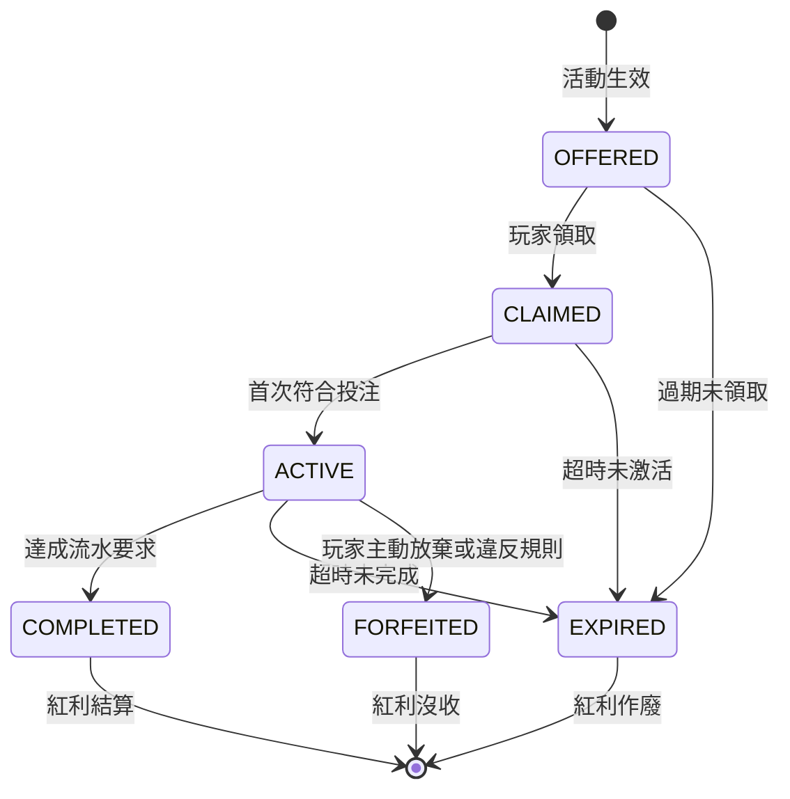

# 第 5 章：促銷與 VIP 技術架構

## 5.1 模組概述

促銷與 VIP 模組提供完整的活動引擎，整合 LiteFlow 規則引擎進行紅利計算、流水計算追蹤和 VIP 等級管理。核心功能包括：

- 多種活動類型支援（歡迎獎金、再充值獎金、免費旋轉、現金回扣等）
- 複雜流水要求計算與追蹤
- 紅利衝突策略管理
- VIP 等級系統與權益分配
- 濫用偵測與防控
- 活動審批流程

## 5.2 資料模型

### t_activity（活動主表）

| 欄位 | 類型 | 說明 |
|------|------|------|
| activity_id | BIGINT | 活動唯一標識 |
| tenant_id | BIGINT | 租戶 ID |
| name | VARCHAR(255) | 活動名稱 |
| type | ENUM | 活動類型：WELCOME（歡迎）、RELOAD（再充值）、FREE_SPIN（免費旋轉）、CASHBACK（現金回扣）、REFERRAL（推薦）、ACTIVITY（活動）、BIRTHDAY（生日） |
| status | ENUM | 狀態：DRAFT、PENDING_APPROVAL、APPROVED、ACTIVE、ENDED、SUSPENDED |
| start_time | TIMESTAMP | 開始時間 |
| end_time | TIMESTAMP | 結束時間 |
| rules | JSONB | 規則配置，包含流水倍數、限制條件等 |
| budget | DECIMAL(15,2) | 活動預算 |
| spent | DECIMAL(15,2) | 已消耗額度 |
| conflict_strategy | VARCHAR(50) | 衝突策略：MAX_REWARD、PRIORITY、PLAYER_CHOICE、STACK_ALL、TYPE_EXCLUSIVE、SEQUENTIAL |
| approval_status | ENUM | 審批狀態 |
| created_at | TIMESTAMP | 建立時間 |
| updated_at | TIMESTAMP | 更新時間 |

### t_bonus（紅利記錄表）

| 欄位 | 類型 | 說明 |
|------|------|------|
| bonus_id | BIGINT | 紅利唯一標識 |
| tenant_id | BIGINT | 租戶 ID |
| player_id | BIGINT | 玩家 ID |
| activity_id | BIGINT | 活動 ID |
| type | ENUM | 紅利類型：DEPOSIT_BONUS、FREE_SPIN、CASHBACK 等 |
| amount | DECIMAL(15,2) | 紅利金額 |
| wagering_required | DECIMAL(15,2) | 需要的流水金額 |
| wagering_completed | DECIMAL(15,2) | 已完成的流水金額 |
| status | ENUM | 狀態：OFFERED（已提供）、CLAIMED（已領取）、ACTIVE（進行中）、COMPLETED（已完成）、EXPIRED（已過期）、FORFEITED（已沒收） |
| game_restrictions | JSONB | 遊戲限制配置 |
| expires_at | TIMESTAMP | 過期時間 |
| claimed_at | TIMESTAMP | 領取時間 |
| completed_at | TIMESTAMP | 完成時間 |
| created_at | TIMESTAMP | 建立時間 |
| updated_at | TIMESTAMP | 更新時間 |

### t_turnover_game_weight_rule（流水遊戲權重規則表）

| 欄位 | 類型 | 說明 |
|------|------|------|
| rule_id | BIGINT | 規則唯一標識 |
| tenant_id | BIGINT | 租戶 ID |
| activity_id | BIGINT (nullable) | 活動 ID (NULL = 租戶全域預設，非 NULL = 活動級覆蓋) |
| game_type | VARCHAR(50) | 遊戲類型 |
| weight_percentage | DECIMAL(5,2) | 權重百分比 |
| effective_date | TIMESTAMP | 生效日期 |
| created_at | TIMESTAMP | 建立時間 |

**UNIQUE CONSTRAINT**: `(tenant_id, activity_id, game_type)` — 同一活動（或全域）下每種遊戲類型只能有一條規則。

**權重查詢優先級**: 活動級 > 租戶全域預設。`GameWeightService.getWeight(tenantId, activityId, gameType)` 先查活動級，miss 則 fallback 到 `activity_id IS NULL` 的全域預設。

**預設權重配置** (此為 SSOT，Ch0 §0.8 引用此值):
- Slots（老虎機）：100%
- Sports（體育博彩）：50%
- Baccarat（百家樂）：**可配置，預設 10%** (低莊家優勢)
- Roulette（輪盤）：20%
- Blackjack（二十一點）：10%
- Poker（撲克）：5%
- 其他桌遊：5%–20%（依活動定義）

### t_turnover_rule（流水規則表）

| 欄位 | 類型 | 說明 |
|------|------|------|
| rule_id | BIGINT | 規則唯一標識 |
| tenant_id | BIGINT | 租戶 ID |
| rule_code | VARCHAR(100) | 規則代碼 |
| description | VARCHAR(255) | 規則描述 |
| parameters | JSONB | 規則參數 |
| status | ENUM | 狀態：ACTIVE、INACTIVE |
| created_at | TIMESTAMP | 建立時間 |
| updated_at | TIMESTAMP | 更新時間 |

### t_turnover_rule_change_log（流水規則變更日誌表）

| 欄位 | 類型 | 說明 |
|------|------|------|
| log_id | BIGINT | 日誌唯一標識 |
| rule_id | BIGINT | 規則 ID |
| tenant_id | BIGINT | 租戶 ID |
| old_parameters | JSONB | 變更前參數 |
| new_parameters | JSONB | 變更後參數 |
| changed_by | BIGINT | 變更操作者 ID |
| change_reason | VARCHAR(255) | 變更原因 |
| changed_at | TIMESTAMP | 變更時間 |

### t_vip_tier（VIP 等級表）

| 欄位 | 類型 | 說明 |
|------|------|------|
| tier_id | BIGINT | 等級唯一標識 |
| tenant_id | BIGINT | 租戶 ID |
| tier_name | VARCHAR(50) | 等級名稱（Bronze、Silver、Gold、Platinum、Diamond） |
| tier_level | INT | 等級級別 |
| min_points | BIGINT | 最低積分 |
| max_points | BIGINT | 最高積分 |
| cashback_rate | DECIMAL(5,2) | 回扣率 |
| bonus_multiplier | DECIMAL(5,2) | 紅利倍數 |
| free_spin_monthly | INT | 月度免費旋轉次數 |
| withdrawal_limit | DECIMAL(15,2) | 提款限額 |
| created_at | TIMESTAMP | 建立時間 |
| updated_at | TIMESTAMP | 更新時間 |

### t_player_vip_status（玩家 VIP 狀態表）

| 欄位 | 類型 | 說明 |
|------|------|------|
| status_id | BIGINT | 狀態唯一標識 |
| tenant_id | BIGINT | 租戶 ID |
| player_id | BIGINT | 玩家 ID |
| tier_id | BIGINT | 當前 VIP 等級 ID |
| tier_name | VARCHAR(50) | 當前等級名稱 |
| current_points | BIGINT | 當前積分 |
| promotion_points | BIGINT | 促銷積分 |
| total_points | BIGINT | 總積分 |
| monthly_reset_date | TIMESTAMP | 月度重置日期 |
| last_upgrade_at | TIMESTAMP | 最後升級時間 |
| last_downgrade_at | TIMESTAMP | 最後降級時間 |
| created_at | TIMESTAMP | 建立時間 |
| updated_at | TIMESTAMP | 更新時間 |

## 5.3 流水計算引擎（LiteFlow）

### 5.3.1 標準本金法

流水計算基於「標準本金法」，核心邏輯為：有效投注額直接計入流水。

```
Valid Bet Amount = case bet_result:
  WIN → Bet Amount
  LOSS → Bet Amount
  HALF_WIN → Bet Amount / 2
  HALF_LOSS → Bet Amount / 2
  DRAW → 0
  VOID → 0
  REFUND → 0
```

**說明：**
- WIN、LOSS、HALF_WIN、HALF_LOSS 的投注額視為有效投注
- DRAW、VOID 和退款交易不計入流水
- 此方法最為公平且易於理解

### 5.3.2 遊戲權重應用

不同遊戲類型對流水的貢獻度不同，通過權重係數進行調整：

```
Weighted Turnover = Valid Bet Amount × Game Weight Percentage
```

**示例計算：**
- 玩家在百家樂遊戲中投注 $100，該遊戲預設權重為 10% (可配置)
- 加權流水 = $100 × 10% = $10

**權重設定原則：**
- 老虎機類（高房邊遊戲）：100%（完整計算）
- 體育博彩：50%（部分貢獻）
- 賭桌遊戲（如百家樂、輪盤）：10% ~ 20%（降低權重，百家樂預設 10% 可配置）
- 撲克類（玩家對玩家）：5%（最低權重）

### 5.3.3 LiteFlow 規則鏈

使用 LiteFlow 框架編排流水計算流程，支援複雜的業務規則：

```
THEN(
    ValidateBetStatus,      // 驗證投注狀態（是否有效）
    CalculateValidBet,      // 標準本金法計算有效投注
    ApplyGameWeight,        // 應用遊戲權重
    UpdateWageringProgress, // 原子性更新流水進度
    NotifyProgressUpdate    // 通知玩家流水進度更新
)
```

**流程說明：**

1. **ValidateBetStatus：** 檢查投注是否來自合法會話、是否超過時間限制
2. **CalculateValidBet：** 根據投注結果（WIN/LOSS/DRAW 等）計算有效投注額
3. **ApplyGameWeight：** 查詢遊戲權重表，計算加權流水
4. **UpdateWageringProgress：** 原子性更新 t_bonus 表的 wagering_completed 欄位
5. **NotifyProgressUpdate：** 推送 WebSocket 消息通知玩家當前流水進度

### 5.3.4 三層驗證機制

確保流水計算的準確性和安全性：

**層級 1：實時驗證（Real-time Validation）**
- 使用 Flink CEP（複雜事件處理）監控投注事件
- 投注結算後立即更新 wagering_progress
- 延遲 < 500ms，保證流暢的用戶體驗

**層級 2：批量對賬（Batch Reconciliation）**
- 每日 00:05 執行批量對賬任務（Flink SQL 或 Spark）
- 重新計算過去 24 小時的流水
- 對比結果與實時更新，標記異常記錄

**層級 3：人工複核（Manual Review）**
- 管理員可手動觸發特定紅利的流水重算
- 提供理由和審計追蹤
- 支援批量重算（如遊戲權重變更後）

### 5.3.5 流水計算示例

**場景：玩家領取 $100 歡迎獎金，流水倍數為 5 倍**

```
紅利金額：$100
流水要求：$100 × 5 = $500

投注序列：
1. 老虎機投注 $200，結果：WIN → 加權流水 = $200 × 100% = $200
2. 百家樂投注 $100，結果：LOSS → 加權流水 = $100 × 10% = $10
3. 輪盤投注 $150，結果：DRAW → 加權流水 = 0
4. 老虎機投注 $300，結果：HALF_WIN → 加權流水 = $150 × 100% = $150
5. 百家樂投注 $50，結果：WIN → 加權流水 = $50 × 10% = $5

當前流水進度 = $200 + $10 + $0 + $150 + $5 = $365
剩餘流水要求 = $500 - $365 = $135（已達成 73%）
```

## 5.4 紅利衝突策略

當玩家同時符合多個活動的紅利條件時，使用衝突策略決定如何分配紅利。實現為策略模式，支援 6 種策略：

### 5.4.1 MAX_REWARD（最大獎勵策略）

比較所有符合條件的紅利，只應用金額最高的一個。

```
策略邏輯：
1. 收集所有符合條件的紅利
2. 按金額降序排序
3. 只應用最高金額的紅利
4. 其他紅利置為 EXPIRED 狀態

適用場景：預算有限的活動或高額紅利獨佔
```

### 5.4.2 PRIORITY（優先級策略）

根據活動設置的優先級欄位決定：高優先級的紅利優先應用。

```
策略邏輯：
1. 在 t_activity.rules JSONB 中設置 priority 欄位
2. 收集所有符合條件的紅利
3. 按優先級降序排序
4. 按優先級順序應用紅利

優先級配置示例：
{
  "priority": 100,
  "description": "VIP 專屬活動（高優先級）"
}
```

### 5.4.3 PLAYER_CHOICE（玩家選擇策略）

將符合條件的所有紅利選項展示給玩家，由玩家選擇。

```
策略邏輯：
1. 收集所有符合條件的紅利
2. 向玩家推送選擇介面（UI）
3. 玩家選擇一個紅利
4. 應用選定紅利，其他置為 EXPIRED

應用：幫助玩家最大化收益，提升用戶滿意度
```

### 5.4.4 STACK_ALL（堆疊所有紅利策略）

所有符合條件的紅利同時應用（預算允許的情況下）。

```
策略邏輯：
1. 收集所有符合條件的紅利
2. 檢查活動預算是否足夠
3. 如果預算充足，所有紅利同時激活
4. 如果預算不足，以優先級順序逐個應用，直到預算用盡

預算檢查：
remaining_budget = activity.budget - activity.spent
for each bonus in bonuses:
  if remaining_budget >= bonus.amount:
    apply bonus
    remaining_budget -= bonus.amount
  else:
    skip or queue bonus
```

### 5.4.5 TYPE_EXCLUSIVE（類型獨佔策略）

每種紅利類型只能同時激活一個。

```
策略邏輯：
1. 按紅利類型分組
2. 每個類型組中只選一個紅利（按優先級或金額）
3. 不同類型的紅利可同時激活

類型分類：
- DEPOSIT_BONUS（充值獎金）
- FREE_SPIN（免費旋轉）
- CASHBACK（現金回扣）
- RELOAD_BONUS（再充值獎金）
```

### 5.4.6 SEQUENTIAL（順序隊列策略）

一個紅利完成後才激活下一個紅利。

```
策略邏輯：
1. 收集所有符合條件的紅利
2. 第一個紅利狀態設為 ACTIVE
3. 其他紅利狀態設為 PENDING
4. 當 ACTIVE 紅利達成 COMPLETED，自動激活下一個 PENDING 紅利

實現邏輯：
- 定時掃描：每分鐘檢查是否有 PENDING 紅利可激活
- 事件驅動：當紅利完成時立即檢查隊列
```

## 5.5 紅利生命週期

紅利從創建到最終結算的完整生命週期，使用狀態機管理：



### 5.5.1 狀態轉移說明

| 源狀態 | 目標狀態 | 觸發條件 | 動作 |
|--------|--------|--------|------|
| OFFERED | CLAIMED | 玩家點擊「領取」按鈕 | 記錄領取時間 |
| OFFERED | EXPIRED | 活動結束或紅利過期 | 移除未領取的紅利 |
| CLAIMED | ACTIVE | 玩家進行首次符合流水規則的投注 | 記錄激活時間 |
| CLAIMED | EXPIRED | 超過領取後的激活期限 | 移除紅利餘額 |
| ACTIVE | COMPLETED | wagering_completed ≥ wagering_required | 轉換紅利餘額為現金 |
| ACTIVE | EXPIRED | 紅利過期時間已到 | 移除紅利餘額 |
| ACTIVE | FORFEITED | 玩家請求放棄或檢測到濫用 | 沒收紅利餘額 |

### 5.5.2 狀態轉移實現

```sql
-- 將完成流水的紅利轉換為現金
UPDATE t_bonus
SET status = 'COMPLETED',
    completed_at = NOW()
WHERE bonus_id = ?
  AND wagering_completed >= wagering_required
  AND status = 'ACTIVE';

-- 同步更新玩家現金餘額
UPDATE t_player_wallet
SET cash_balance = cash_balance + (
    SELECT amount FROM t_bonus WHERE bonus_id = ?
)
WHERE player_id = ? AND wallet_type = 'CASH';

-- 過期紅利處理
UPDATE t_bonus
SET status = 'EXPIRED'
WHERE status IN ('OFFERED', 'CLAIMED', 'ACTIVE')
  AND expires_at < NOW();

-- 清零過期紅利的 BONUS 餘額
UPDATE t_player_wallet
SET bonus_balance = 0
WHERE player_id = ?
  AND wallet_id IN (
    SELECT bonus_id FROM t_bonus
    WHERE player_id = ? AND status = 'EXPIRED'
  );
```

### 5.5.3 紅利到期未結算投注處理 (aligned with Requirements §5.5)

**業務規則 (Ron 決策: 立即沒收)**:
- 紅利到期 → **立即沒收未使用的 BONUS 餘額**
- 未結算投注繼續正常結算（不 void/rollback）
- 結算後盈利入 CASH（不超過原始紅利金額）
- 結算後虧損正常扣除

```java
@Component
public class BonusExpiryJob {

    /** 每日 03:00 UTC+8 掃描到期紅利 */
    @Scheduled(cron = "0 0 3 * * ?", zone = "Asia/Taipei")
    @Transactional
    public void processExpiredBonuses() {
        List<Bonus> expiredBonuses = bonusRepository
            .findByStatusAndExpiresAtBefore(BonusStatus.ACTIVE, Instant.now());

        for (Bonus bonus : expiredBonuses) {
            // Step 1: 立即沒收 BONUS 餘額
            BigDecimal forfeitedAmount = walletService
                .forceDebitBonus(bonus.getPlayerId(), bonus.getBonusWalletId());

            // Step 2: 檢查是否有未結算投注
            List<GameRound> unsettledRounds = gameRoundRepository
                .findUnsettledByBonusId(bonus.getBonusId());

            if (unsettledRounds.isEmpty()) {
                // 無未結算 → 直接 EXPIRED
                bonus.setStatus(BonusStatus.EXPIRED);
            } else {
                // 有未結算 → EXPIRED + 標記待結算追蹤
                bonus.setStatus(BonusStatus.EXPIRED);
                bonus.setHasPendingSettlement(true);
                bonus.setPendingRoundCount(unsettledRounds.size());

                // 為每個未結算 round 註冊結算回調
                for (GameRound round : unsettledRounds) {
                    bonusSettlementTracker.registerCallback(
                        round.getRoundId(),
                        bonus.getBonusId(),
                        bonus.getAmount()  // 原始紅利額 = 盈利入 CASH 上限
                    );
                }
            }

            bonus.setExpiredAt(Instant.now());
            bonusRepository.save(bonus);

            // Step 3: 發送到期通知
            notificationService.sendBonusExpired(bonus.getPlayerId(), bonus);

            log.info("Bonus expired: bonusId={}, forfeited={}, pendingRounds={}",
                bonus.getBonusId(), forfeitedAmount, unsettledRounds.size());
        }
    }
}

@Component
public class BonusSettlementTracker {

    /**
     * GP 結算回調時檢查: 該 round 是否屬於已過期紅利
     * 由 GameSettlementService 在結算完成後調用
     */
    public void onRoundSettled(Long roundId, BigDecimal winAmount) {
        Optional<BonusSettlementCallback> callback =
            callbackRepository.findByRoundId(roundId);

        if (callback.isEmpty()) return;  // 非紅利關聯 round

        BonusSettlementCallback cb = callback.get();
        BigDecimal maxCashTransfer = cb.getOriginalBonusAmount();

        if (winAmount.compareTo(BigDecimal.ZERO) > 0) {
            // 盈利: 入 CASH，不超過原始紅利額
            BigDecimal cashCredit = winAmount.min(maxCashTransfer);
            walletService.creditCash(cb.getPlayerId(), cashCredit,
                "BONUS_EXPIRY_SETTLEMENT", roundId);
        }
        // 虧損: 正常扣除 (已從 BONUS 沒收，無需額外處理)

        // 標記此 round 結算完成
        cb.setSettled(true);
        cb.setSettledAt(Instant.now());
        callbackRepository.save(cb);

        // 檢查該紅利所有 round 是否全部結算完成
        checkAllRoundsSettled(cb.getBonusId());
    }

    private void checkAllRoundsSettled(Long bonusId) {
        long pending = callbackRepository
            .countByBonusIdAndSettledFalse(bonusId);
        if (pending == 0) {
            Bonus bonus = bonusRepository.findById(bonusId).orElseThrow();
            bonus.setHasPendingSettlement(false);
            bonusRepository.save(bonus);
        }
    }
}
```

**t_bonus_settlement_callback** (追蹤過期紅利的未結算投注):

| 欄位 | 類型 | 說明 |
|------|------|------|
| callback_id | BIGINT | PK |
| bonus_id | BIGINT | FK → t_bonus |
| player_id | BIGINT | 玩家 ID |
| round_id | BIGINT | FK → t_game_round |
| original_bonus_amount | DECIMAL(15,2) | 原始紅利額 (盈利入 CASH 上限) |
| settled | BOOLEAN | 是否已結算 (default false) |
| settled_at | TIMESTAMP | 結算時間 |
| created_at | TIMESTAMP | 建立時間 |

## 5.6 濫用偵測

防止玩家濫用紅利制度的 5 種偵測方法，通過組合使用可有效降低風險：

### 5.6.1 多帳號紅利領取偵測

**原理：** 同一設備或支付方式下，多個帳號領取紅利是濫用徵兆。

```
偵測邏輯：
1. 提取玩家的設備指紋（Device Fingerprint）
   - User Agent、IP Address、Chrome DevTools Fingerprint

2. 提取玩家的支付方式特徵
   - 支付卡 Last 4 Digits
   - 電子錢包賬號
   - 銀行賬號 Hash

3. 查詢同設備或同支付方式下的其他玩家

4. 統計這些玩家在 7 天內領取的紅利數量和金額

5. 如果超過閾值，標記為風險玩家

閾值配置（t_activity.rules JSONB）：
{
  "multi_account_detection": {
    "enabled": true,
    "threshold_count": 3,        // 7 天內超過 3 個帳號
    "threshold_amount": 1000,    // 或總紅利 > 1000
    "window_days": 7
  }
}
```

### 5.6.2 最小風險投注偵測

**原理：** 在同一事件的兩方同時投注（如百家樂的莊、閒各投），規避風險。

```
偵測邏輯：
1. 監控玩家在相同遊戲、相同時間窗口（如 5 分鐘）內的投注

2. 檢查是否同時在互相對立的選項上投注
   - 百家樂：莊 + 閒
   - 輪盤：紅 + 黑
   - 賽馬：馬 A + 馬 B

3. 計算對沖比例 = 較小投注 / 較大投注

4. 如果對沖比例 > 0.8（高度對沖），標記為風險投注

風險判定：
{
  "hedging_detection": {
    "enabled": true,
    "threshold_ratio": 0.8,      // 對沖比例閾值
    "time_window_minutes": 5,    // 時間窗口
    "risk_level": "high"         // 標記為高風險
  }
}
```

### 5.6.3 快速紅利循環偵測

**原理：** 在短時間內重複「領取 → 投注 → 提現」的週期。

```
偵測邏輯：
1. 追蹤玩家的紅利領取時間序列

2. 計算連續紅利周期的時間差
   - 週期 1：T1 領取 → T2 投注 → T3 提現
   - 週期 2：T4 領取 → T5 投注 → T6 提現

3. 如果平均週期 < 2 小時，標記為風險行為

風險判定：
{
  "rapid_cycling_detection": {
    "enabled": true,
    "min_cycle_time_hours": 2,   // 最小週期時長
    "lookback_days": 7,          // 回溯 7 天
    "alert_threshold": 3         // 3 個快速週期以上觸發告警
  }
}
```

### 5.6.4 地理位置不匹配偵測

**原理：** 註冊國家與實際博彩位置嚴重偏離，可能是代理或欺詐。

```
偵測邏輯：
1. 記錄玩家註冊時的國家/地區（基於 IP Geolocation）

2. 監控玩家每次登錄和投注的 IP 地址

3. 計算地理距離和時間差
   - 如果 24 小時內兩次登錄的地理距離 > 飛行距離（物理上不可能），標記為異常

4. 如果投注位置與註冊位置距離 > 500km 且無 VPN 跡象，標記為風險

風險判定：
{
  "geo_mismatch_detection": {
    "enabled": true,
    "distance_threshold_km": 500,
    "time_check_hours": 24,
    "skip_vpn_check": false      // 檢查是否使用 VPN
  }
}
```

### 5.6.5 推薦欺詐偵測

**原理：** 推薦者自建或控制大量推薦帳號，獲取推薦獎勵。

```
偵測邏輯：
1. 分析推薦人和被推薦人的關係圖

2. 檢查推薦鏈的可疑特徵：
   - 被推薦人來自相同 IP/設備
   - 被推薦人使用相同電話號碼尾數
   - 被推薦人註冊時間聚集（如同一天）

3. 計算「推薦人控制得分」
   score = (same_ip_count * 0.5) + (same_phone_pattern * 0.3) + (cluster_time * 0.2)

4. 如果 score > 0.7，標記為推薦欺詐

防控措施：
{
  "referral_fraud_detection": {
    "enabled": true,
    "network_depth": 3,          // 檢查推薦鏈深度
    "control_score_threshold": 0.7,
    "actions": [
      "flag_account",
      "suspend_referral_bonus",
      "require_manual_review"
    ]
  }
}
```

## 5.7 現金回扣/返利計算

現金回扣是根據玩家在特定時期內的淨損失額度按比例返還的機制。

### 5.7.1 計算原理

```
淨損失 = 總投注額 - 總中獎額

回扣金額 = 淨損失 × VIP 等級回扣率
```

### 5.7.2 批量計算任務

使用 Flink SQL 實現日度批量計算，每日 01:00 執行：

```sql
SELECT
    player_id,
    vip_tier,
    SUM(bet_amount) as total_bets,
    SUM(win_amount) as total_wins,
    SUM(bet_amount - win_amount) as net_loss,
    CASE
        WHEN vip_tier = 'BRONZE' THEN SUM(bet_amount - win_amount) * 0.05
        WHEN vip_tier = 'SILVER' THEN SUM(bet_amount - win_amount) * 0.08
        WHEN vip_tier = 'GOLD' THEN SUM(bet_amount - win_amount) * 0.10
        WHEN vip_tier = 'PLATINUM' THEN SUM(bet_amount - win_amount) * 0.12
        WHEN vip_tier = 'DIAMOND' THEN SUM(bet_amount - win_amount) * 0.15
        ELSE SUM(bet_amount - win_amount) * 0.00
    END as cashback_amount,
    DATE(event_time) as settlement_date
FROM daily_player_summary
WHERE net_loss > 0
  AND settlement_date = CURRENT_DATE - INTERVAL 1 DAY
GROUP BY player_id, vip_tier
ORDER BY cashback_amount DESC;
```

### 5.7.3 VIP 等級回扣率

| VIP 等級 | 回扣率 | 最低淨損失 | 備註 |
|---------|-------|---------|------|
| 無（普通） | 0% | - | 無回扣 |
| Bronze（銅） | 5% | $100 | 累計消費 ≥ $1,000 |
| Silver（銀） | 8% | $50 | 累計消費 ≥ $5,000 |
| Gold（金） | 10% | $30 | 累計消費 ≥ $15,000 |
| Platinum（白金） | 12% | $20 | 累計消費 ≥ $50,000 |
| Diamond（鑽石） | 15% | $10 | 累計消費 ≥ $100,000 |

### 5.7.4 返水與紅利互動規則 (aligned with Requirements §5.6)

返水 (Cashback/Rebate) 與紅利 (Bonus) 是**完全獨立**的兩套機制：

| 規則 | 說明 |
|------|------|
| 返水入帳錢包 | **CASH 錢包** — 不進入 BONUS 錢包 |
| 返水是否計入流水 | **否** — 返水金額不計入任何紅利的 wagering_completed |
| 返水是否受紅利鎖定 | **否** — 返水為獨立機制，不受活躍紅利的提款限制影響 |
| 返水+紅利並存 | 返水直接入 CASH，紅利獨立在 BONUS 錢包，互不干擾 |
| 返水計算排除紅利投注 | **可配置** — 預設包含所有投注（含紅利資金投注） |
| 衝突策略適用範圍 | §5.4 六種衝突策略**僅適用於紅利之間**，返水不受衝突策略約束 |

```java
@Service
public class CashbackService {

    @Transactional
    public void issueCashback(Long playerId, BigDecimal cashbackAmount,
                              String settlementPeriod) {
        // 返水直接入 CASH 錢包 — 不經過 BONUS
        walletService.creditCash(playerId, cashbackAmount,
            TransactionType.CASHBACK, settlementPeriod);

        // 返水金額不計入任何紅利的 wagering progress
        // (由 TurnoverService 在計算時排除 CASHBACK 類型交易)
    }
}
```

### 5.7.5 回扣發放流程

```
1. 批量計算 → 生成 t_cashback 記錄
2. 異步批准 → 由風控系統審查（15 分鐘內）
3. 入賬處理 → 將回扣金額加入玩家 CASH 餘額 (非 BONUS)
4. 通知玩家 → 推送消息告知回扣已發放
5. 審計記錄 → 記錄在 t_financial_log 中
```

### 5.7.6 示例計算

```
場景：玩家李明，Silver VIP，日度統計結果

日期：2026-03-24
總投注：$5,000
總中獎：$3,200
淨損失：$1,800

回扣計算：
回扣金額 = $1,800 × 8% = $144

處理：
1. 創建 t_cashback 記錄（status = PENDING）
2. 風控審查通過（約 5 分鐘）
3. 更新 t_player_wallet：
   cash_balance += $144
4. 推送通知：「您已獲得 $144 現金回扣，已入賬！」
5. 記錄到 t_financial_log
```

## 5.8 活動審批流程

確保活動的合規性和資金安全：

### 5.8.1 審批狀態流轉

```
DRAFT（草稿）
  ↓ 提交審批
PENDING_APPROVAL（待批准）
  ↓ 批准 / 駁回
APPROVED（已批准）
  ↓ 手動激活
ACTIVE（進行中）
  ↓ 活動結束
ENDED（已結束）

或在任何阶段
  ↓ 暫停
SUSPENDED（已暫停）
```

### 5.8.2 審批規則

```
審批觸發條件（至少滿足一個）：
1. 活動預算 > 租戶配置的閾值（如 $10,000）
2. 活動持續時長 > 30 天
3. 活動類型為 WELCOME（歡迎獎金，高風險）
4. 活動類型為 REFERRAL（推薦獎金，容易濫用）

審批流程：
1. 創作者提交活動至 PENDING_APPROVAL 狀態
2. 系統自動執行檢查：
   - 預算合理性驗證
   - 流水倍數合理性檢查（應在 1x ~ 40x 之間）
   - 遊戲限制合理性
   - 與進行中活動的衝突檢查
3. 人工審批（由指定的 ADMIN 角色執行）：
   - 業務審查（市場性、競爭性）
   - 合規審查（是否違反當地法規）
   - 財務審查（預算是否在年度計劃內）
4. 審批通過 → 狀態變更為 APPROVED
5. 審批駁回 → 返回 DRAFT 狀態，提供駁回原因
```

### 5.8.3 實時預算追蹤

每次紅利發放時，實時更新已消耗預算：

```sql
-- 紅利發放時，同步更新活動的 spent 欄位
UPDATE t_activity
SET spent = (
    SELECT SUM(amount) FROM t_bonus
    WHERE activity_id = ? AND status IN ('OFFERED', 'CLAIMED', 'ACTIVE')
)
WHERE activity_id = ?;

-- 定時檢查（每 5 分鐘），若預算消耗 ≥ 90%，自動暫停活動
IF (t_activity.spent / t_activity.budget >= 0.9) THEN
  UPDATE t_activity
  SET status = 'SUSPENDED',
      suspend_reason = 'Budget 90% consumed',
      suspended_at = NOW()
  WHERE activity_id = ?;

  -- 發送告警給管理員
  INSERT INTO t_alert_log (alert_type, activity_id, message)
  VALUES ('BUDGET_THRESHOLD', ?, 'Activity suspended due to budget');
END IF;
```

### 5.8.4 審批管理介面

| 操作 | 角色要求 | 說明 |
|------|---------|------|
| 建立/編輯活動 | OPERATOR | 活動創建者可編輯草稿狀態 |
| 提交審批 | OPERATOR | 提交至 PENDING_APPROVAL |
| 審批通過 | APPROVER | 通過後可手動激活 |
| 審批駁回 | APPROVER | 駁回並返回 DRAFT |
| 激活活動 | OPERATOR / APPROVER | 將已批准的活動激活 |
| 暫停活動 | OPERATOR / APPROVER | 臨時暫停活動發放 |
| 結束活動 | OPERATOR / APPROVER | 標記活動為已結束 |

## 5.9 API 端點

### 5.9.1 活動管理 API

| 方法 | 路徑 | 認證 | 描述 |
|------|------|------|------|
| POST | /api/v1/activities | ADMIN | 建立新活動 |
| GET | /api/v1/activities | ADMIN | 列表查詢活動 |
| GET | /api/v1/activities/{id} | ADMIN | 查詢單個活動詳情 |
| PUT | /api/v1/activities/{id} | ADMIN | 編輯活動（DRAFT 狀態） |
| POST | /api/v1/activities/{id}/submit-approval | ADMIN | 提交審批 |
| POST | /api/v1/activities/{id}/approve | APPROVER | 批准活動 |
| POST | /api/v1/activities/{id}/reject | APPROVER | 駁回活動 |
| POST | /api/v1/activities/{id}/activate | ADMIN | 激活活動 |
| POST | /api/v1/activities/{id}/suspend | ADMIN | 暫停活動 |
| POST | /api/v1/activities/{id}/end | ADMIN | 結束活動 |

### 5.9.2 紅利管理 API

| 方法 | 路徑 | 認證 | 描述 |
|------|------|------|------|
| POST | /api/v1/bonuses/claim | PLAYER | 玩家領取紅利 |
| GET | /api/v1/bonuses/my | PLAYER | 查詢玩家的紅利列表 |
| GET | /api/v1/bonuses/my/{id} | PLAYER | 查詢紅利詳情及流水進度 |
| POST | /api/v1/bonuses/my/{id}/forfeit | PLAYER | 玩家放棄紅利 |
| POST | /api/v1/admin/bonuses/{id}/forfeit | ADMIN | 管理員沒收紅利 |
| POST | /api/v1/admin/bonuses/recalculate-turnover | ADMIN | 重新計算流水 |
| GET | /api/v1/admin/bonuses | ADMIN | 查詢所有紅利 |

### 5.9.3 VIP 管理 API

| 方法 | 路徑 | 認證 | 描述 |
|------|------|------|------|
| GET | /api/v1/vip-tiers | ADMIN | 查詢 VIP 等級配置 |
| PUT | /api/v1/vip-tiers/{id} | ADMIN | 編輯 VIP 等級配置 |
| GET | /api/v1/players/{id}/vip-status | ADMIN / PLAYER | 查詢玩家 VIP 狀態 |
| POST | /api/v1/admin/players/{id}/promote-vip | ADMIN | 手動晉升玩家 VIP 等級 |
| POST | /api/v1/admin/players/{id}/demote-vip | ADMIN | 手動降級玩家 VIP 等級 |
| GET | /api/v1/admin/vip-earnings | ADMIN | 查詢 VIP 等級的總收入統計 |

### 5.9.4 流水規則 API

| 方法 | 路徑 | 認證 | 描述 |
|------|------|------|------|
| GET | /api/v1/turnover-rules | ADMIN | 查詢流水規則 |
| POST | /api/v1/turnover-rules | ADMIN | 建立新流水規則 |
| PUT | /api/v1/turnover-rules/{id} | ADMIN | 編輯流水規則 |
| GET | /api/v1/turnover-game-weights | ADMIN | 查詢遊戲權重配置 |
| PUT | /api/v1/turnover-game-weights/{gameType} | ADMIN | 編輯遊戲權重 |
| GET | /api/v1/turnover-rule-change-logs | ADMIN | 查詢規則變更歷史 |

### 5.9.5 濫用偵測 API

| 方法 | 路徑 | 認證 | 描述 |
|------|------|------|------|
| GET | /api/v1/admin/abuse-detection/alerts | ADMIN | 查詢濫用告警列表 |
| GET | /api/v1/admin/abuse-detection/alerts/{id} | ADMIN | 查詢告警詳情 |
| POST | /api/v1/admin/abuse-detection/verify/{playerId} | ADMIN | 驗證玩家風險 |
| POST | /api/v1/admin/abuse-detection/whitelist/{playerId} | ADMIN | 將玩家加入白名單 |

### 5.9.6 API 請求/回應示例

**POST /api/v1/activities（建立活動）**

```json
Request:
{
  "name": "Summer Promotion 2026",
  "type": "ACTIVITY",
  "start_time": "2026-06-01T00:00:00Z",
  "end_time": "2026-08-31T23:59:59Z",
  "budget": 50000,
  "conflict_strategy": "MAX_REWARD",
  "rules": {
    "bonus_type": "DEPOSIT_BONUS",
    "bonus_amount": 100,
    "min_deposit": 50,
    "max_bonus_per_player": 500,
    "wagering_multiplier": 5,
    "valid_games": ["SLOTS", "BACCARAT"],
    "game_weights": {
      "SLOTS": 100,
      "BACCARAT": 10
    },
    "abuse_detection": {
      "multi_account_detection": {
        "enabled": true,
        "threshold_count": 3,
        "threshold_amount": 1000
      }
    }
  }
}

Response:
{
  "activity_id": 12345,
  "name": "Summer Promotion 2026",
  "status": "DRAFT",
  "created_at": "2026-03-24T10:30:00Z",
  "approval_status": "NOT_REQUIRED"
}
```

**POST /api/v1/bonuses/claim（玩家領取紅利）**

```json
Request:
{
  "activity_id": 12345
}

Response:
{
  "bonus_id": 67890,
  "activity_id": 12345,
  "type": "DEPOSIT_BONUS",
  "amount": 100,
  "wagering_required": 500,
  "status": "CLAIMED",
  "expires_at": "2026-09-30T23:59:59Z",
  "claimed_at": "2026-03-24T15:45:00Z"
}
```

**GET /api/v1/bonuses/my/{id}（查詢流水進度）**

```json
Response:
{
  "bonus_id": 67890,
  "amount": 100,
  "status": "ACTIVE",
  "wagering_required": 500,
  "wagering_completed": 325.50,
  "wagering_progress_percent": 65.1,
  "expires_at": "2026-09-30T23:59:59Z",
  "game_restrictions": {
    "allowed_games": ["SLOTS", "BACCARAT"],
    "restricted_games": ["SPORTS"]
  }
}
```

## 5.10 跨模組邊界情境 (Cross-Module Boundary Scenarios)

The following boundary scenarios describe interactions between Promotions/VIP and other modules when edge cases occur. For complete boundary scenario specifications, refer to [Technical_Cross_Module_Boundary_Scenarios_跨模組邊界情境技術規格.md](./Technical_Cross_Module_Boundary_Scenarios_跨模組邊界情境技術規格.md).

| BS ID | Scenario | Decision |
|-------|----------|----------|
| BS-01 | Token 過期 × 流水進度 | Wagering progress NOT rolled back on token expiry; bonus remains active; continue counting valid bets |
| BS-02 | 紅利過期 × Win 歸屬 | Bonus expires mid-wagering; unclaimed bonus forfeited; pending win settles to CASH, wagering requirement waived |
| BS-06 | VIP 降級 × 紅利 | Already-claimed bonuses continue until natural expiry; new bonus offers at demoted tier level; no retroactive adjustment |
| BS-12 | Chargeback × 流水 | All wagering progress clawed back + bonus forfeited + 30-day new bonus ban + account flagged |

**Cross-references**: [§BS-01](./Technical_Cross_Module_Boundary_Scenarios_跨模組邊界情境技術規格.md#bs-01-token-過期--流水進度), [§BS-02](./Technical_Cross_Module_Boundary_Scenarios_跨模組邊界情境技術規格.md#bs-02-紅利過期--win-歸屬), [§BS-06](./Technical_Cross_Module_Boundary_Scenarios_跨模組邊界情境技術規格.md#bs-06-vip-降級--紅利), [§BS-12](./Technical_Cross_Module_Boundary_Scenarios_跨模組邊界情境技術規格.md#bs-12-chargeback--流水)

---

## 5.11 對應業務文檔

> 詳見：requirements/05_Promotions_VIP_促銷與VIP.md

---

## 5.12 變更紀錄

### v2.1 (Sprint Sync)

| 項目 | 變更內容 | 需求來源 |
|------|---------|---------|
| §5.2 `t_turnover_game_weight_rule` | 新增 `activity_id` nullable FK 支援 per-activity 權重覆蓋；修正 Baccarat 預設 15%→10%；修正 Sports 0%→50%；新增 SSOT 標記 | C-02 Baccarat 權重 |
| §5.3.2 遊戲權重應用 | 修正百家樂範例 15%→10%；修正體育博彩 0%→50%；更新權重設定原則 | C-02 |
| §5.3.5 流水計算示例 | 修正百家樂 15%→10%，重算流水進度 ($372.5→$365) | C-02 |
| §5.5.3 紅利到期未結算投注 | **新增** `BonusExpiryJob` + `BonusSettlementTracker` + `t_bonus_settlement_callback`；實作「立即沒收 BONUS 餘額 + 未結算繼續結算 + 盈利入 CASH (上限=原始紅利額)」 | H-03 紅利到期沒收 |
| §5.7.4 返水與紅利互動規則 | **新增** CASH 錢包入帳、不計流水、不受鎖定、與紅利互不干擾等 6 條規則 + `CashbackService` | H-02 返水互動 |
| §5.7.5 回扣發放流程 | 明確入帳至 CASH (非 BONUS) | H-02 |
| §5.9 API 範例 | 修正 Baccarat game_weight 15→10 | C-02 |
