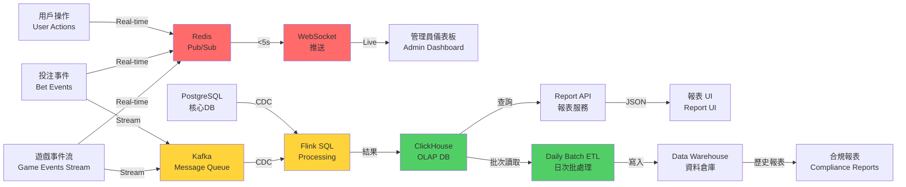

# 第 9 章：分析與報表技術架構

## 9.1 模組概述

本章節闡述完整的分析與報表技術架構，採用三路資料管道設計（Hot/Warm/Cold），充分滿足實時儀表板、近實時分析及合規性報表的多層需求。

核心技術棧：
- **ClickHouse**：OLAP 資料庫，支持秒級查詢性能
- **Apache Flink**：實時流處理引擎，CDC 和複雜計算
- **Redis**：超低延遲的熱資料緩存
- **Kafka**：訊息隊列，解耦生產者與消費者
- **Grafana / 自訂 React**：儀表板前端
- **S3**：長期檔案歸檔

權限架構：多角色、多租戶，PII 掩蓋應用於查詢層。

---

## 9.2 三路資料架構

### 架構圖



### Hot Path (實時路由)

**特性：** 超低延遲，用於即時監控和實時儀表板
- **延遲目標：** < 5 秒
- **資料源：** Game Events、Bet Events、User Actions (Redis Pub/Sub)
- **消費端：** WebSocket 推送至管理員儀表板

**實現細節：**
```
1. Game Service 發送事件至 Redis (LPUSH)
2. Dashboard Service 訂閱特定 Redis channel (SUBSCRIBE)
3. 事件即時推送至前端 WebSocket
4. 前端更新 UI (Active Players, Current Bets, Live Revenue)
```

**使用場景：**
- 實時玩家計數
- 當前投注金額
- 即時營收監控
- 警報觸發

**Redis Pub/Sub 主題結構：**
```
analytics:live:players:{tenant_id}
analytics:live:revenue:{tenant_id}
analytics:live:events:{tenant_id}
analytics:alerts:{tenant_id}
```

### Warm Path (近實時路由)

**特性：** 平衡延遲與複雜度，用於業務分析和儀表板展示
- **延遲目標：** 5-60 秒
- **資料源：** Kafka (Game Events、Financial Events) + PostgreSQL CDC
- **處理引擎：** Apache Flink SQL
- **存儲：** ClickHouse

**資料流：**
```
PostgreSQL WAL
  ↓ (Debezium CDC Connector)
Kafka (topic: cdc.players, cdc.financial_records, etc.)
  ↓ (Flink CDC Source)
Flink SQL Engine (聚合、轉換)
  ↓ (Sink)
ClickHouse (hourly_game_metrics, daily_financial_summary)
```

**核心計算：**
- 5 分鐘滑動窗口：投注總額、中獎總額、GGR
- 1 小時滾動窗口：玩家活躍度、遊戲表現
- 玩家狀態：存款/提現計數、會話數

**容錯機制：**
- Flink Checkpoint：精確一次語義 (Exactly-Once)
- Kafka Transaction：確保訊息不重複
- ClickHouse ReplacingMergeTree：自動去重

### Cold Path (離線批處理)

**特性：** 高保真歷史分析，用於合規報表和長期趨勢
- **延遲目標：** T+1（次日可用）
- **執行時間：** 每日 02:00 UTC
- **資料源：** ClickHouse (Warm Path) 或直接從業務系統抽取
- **存儲：** 資料倉庫（維度模型）

**批處理流程：**
```
Daily Batch Job (Airflow / Spring Batch)
  ↓
1. 抽取前一天完整事件（Game、Financial、User）
2. 轉換（星型模型）
3. 加載至 Data Warehouse
4. 更新物化視圖
5. 生成合規報表（UKGC、稅務）
```

**資料保留：**
- 活躍資料（近 1 年）：ClickHouse + 資料倉庫
- 歸檔資料（7+ 年）：S3 (Parquet format, 壓縮)

---

## 9.3 ClickHouse 資料模型

### 表設計原則

- **分區：** 按月份 (PARTITION BY toYYYYMM)
- **排序：** 按查詢維度 (tenant_id, date, player_id)
- **合併樹：** ReplacingMergeTree 用於去重，AggregatingMergeTree 用於預聚合

### 核心表結構

#### 1. 每日玩家匯總表 (daily_player_summary)

```sql
CREATE TABLE analytics.daily_player_summary (
    date Date,
    tenant_id UInt64,
    player_id UInt64,
    total_bets Decimal(19,4),
    total_wins Decimal(19,4),
    net_revenue Decimal(19,4),
    deposit_count UInt32,
    withdrawal_count UInt32,
    game_sessions UInt32,
    average_session_duration UInt32,
    unique_games_played UInt16,
    max_bet UInt32,
    min_bet UInt32,
    sign_version UInt64
) ENGINE = ReplacingMergeTree(sign_version)
PARTITION BY toYYYYMM(date)
ORDER BY (tenant_id, date, player_id)
SETTINGS index_granularity = 8192;
```

**欄位說明：**
- `sign_version`：版本號，用於 ReplacingMergeTree 去重
- `net_revenue`：總營收 = total_bets - total_wins
- `PARTITION BY toYYYYMM(date)`：按月分區，方便刪除過期資料

#### 2. 小時遊戲指標表 (hourly_game_metrics)

```sql
CREATE TABLE analytics.hourly_game_metrics (
    event_hour DateTime,
    tenant_id UInt64,
    game_id UInt32,
    total_bets Decimal(19,4),
    total_wins Decimal(19,4),
    bet_count UInt64,
    session_count UInt32,
    active_players UInt32,
    rtp Decimal(5,4),
    sign_version UInt64
) ENGINE = ReplacingMergeTree(sign_version)
PARTITION BY toYYYYMM(event_hour)
ORDER BY (tenant_id, event_hour, game_id);
```

**計算規則：**
- `rtp` = total_wins / total_bets (Return To Player)
- 每小時聚合一次

#### 3. 每日財務匯總表 (daily_financial_summary)

```sql
CREATE TABLE analytics.daily_financial_summary (
    date Date,
    tenant_id UInt64,
    currency String,
    deposit_amount Decimal(19,4),
    withdrawal_amount Decimal(19,4),
    deposit_count UInt32,
    withdrawal_count UInt32,
    deposit_player_count UInt32,
    withdrawal_player_count UInt32,
    payment_method String,
    sign_version UInt64
) ENGINE = ReplacingMergeTree(sign_version)
PARTITION BY toYYYYMM(date)
ORDER BY (tenant_id, date, currency);
```

#### 4. 月代理佣金表 (monthly_agent_commission)

```sql
CREATE TABLE analytics.monthly_agent_commission (
    year_month Date,
    tenant_id UInt64,
    agent_id UInt64,
    player_count UInt32,
    total_ggr Decimal(19,4),
    commission_rate Decimal(5,4),
    commission_amount Decimal(19,4),
    sign_version UInt64
) ENGINE = ReplacingMergeTree(sign_version)
PARTITION BY toYYYYMM(year_month)
ORDER BY (tenant_id, year_month, agent_id);
```

#### 5. 風險事件日誌表 (risk_event_log)

```sql
CREATE TABLE analytics.risk_event_log (
    event_timestamp DateTime,
    tenant_id UInt64,
    player_id UInt64,
    event_type String,  -- 'suspicious_bet', 'rapid_withdrawal', 'aml_match', etc.
    risk_score Decimal(5,2),
    action_taken String,  -- 'none', 'review', 'suspend', 'block'
    details String  -- JSON
) ENGINE = MergeTree()
PARTITION BY toYYYYMM(event_timestamp)
ORDER BY (tenant_id, event_timestamp)
TTL event_timestamp + INTERVAL 180 DAY;
```

**注意：** 使用 MergeTree 而非 ReplacingMergeTree，因為事件不需去重；設置 TTL 自動刪除舊資料。

#### 6. 玩家狀態表 (player_state_snapshot)

```sql
CREATE TABLE analytics.player_state_snapshot (
    snapshot_date Date,
    tenant_id UInt64,
    player_id UInt64,
    status String,  -- 'active', 'dormant', 'suspended', 'closed'
    total_deposits Decimal(19,4),
    total_withdrawals Decimal(19,4),
    account_balance Decimal(19,4),
    last_game_date Date,
    lifetime_games UInt32,
    lifetime_revenue Decimal(19,4),
    risk_level String,  -- 'low', 'medium', 'high'
    sign_version UInt64
) ENGINE = ReplacingMergeTree(sign_version)
PARTITION BY toYYYYMM(snapshot_date)
ORDER BY (tenant_id, snapshot_date, player_id);
```

### 字典和維度表

使用 ClickHouse Dictionary 進行低延遲連接：

```sql
-- 遊戲維度字典
CREATE TABLE analytics.dim_games (
    game_id UInt32,
    game_name String,
    game_type String,  -- 'slot', 'table', 'live'
    provider String,
    base_rtp Decimal(5,4)
) ENGINE = ReplacingMergeTree()
ORDER BY game_id;

-- 構建字典（外部訪問優化）
CREATE DICTIONARY analytics.games_dict (
    game_id UInt32,
    game_name String,
    game_type String
)
PRIMARY KEY game_id
SOURCE(CLICKHOUSE(QUERY 'SELECT game_id, game_name, game_type FROM analytics.dim_games'))
LAYOUT(HASHED())
LIFETIME(MIN 300 MAX 3600);
```

---

## 9.4 Flink SQL 管線

### 即時營收計算

```sql
-- 5 分鐘滾動窗口營收統計
CREATE TEMPORARY VIEW real_time_revenue AS
SELECT
    tenant_id,
    TUMBLE_START(event_time, INTERVAL '5' MINUTE) AS window_start,
    TUMBLE_END(event_time, INTERVAL '5' MINUTE) AS window_end,
    SUM(bet_amount) AS total_bets,
    SUM(win_amount) AS total_wins,
    SUM(bet_amount) - SUM(win_amount) AS ggr,
    COUNT(DISTINCT player_id) AS active_players,
    COUNT(DISTINCT game_id) AS games_played,
    MAX(bet_amount) AS max_bet
FROM game_events
GROUP BY tenant_id, TUMBLE(event_time, INTERVAL '5' MINUTE);

-- 寫入 ClickHouse
INSERT INTO analytics.hourly_game_metrics
SELECT
    window_start AS event_hour,
    tenant_id,
    game_id,
    total_bets,
    total_wins,
    CAST(COUNT(*) AS UInt64) AS bet_count,
    COUNT(DISTINCT session_id) AS session_count,
    active_players,
    CAST(total_wins / total_bets AS Decimal(5,4)) AS rtp,
    1 AS sign_version
FROM real_time_revenue
GROUP BY window_start, tenant_id, game_id;
```

### 玩家狀態更新管線

```sql
-- 即時玩家狀態
CREATE TEMPORARY VIEW player_activity_stream AS
SELECT
    player_id,
    tenant_id,
    CURRENT_TIMESTAMP AS event_time,
    CASE
        WHEN SUM(bet_amount) OVER (PARTITION BY player_id ORDER BY event_timestamp RANGE BETWEEN INTERVAL '1' DAY PRECEDING AND CURRENT ROW) > 1000 THEN 'high_value'
        WHEN SUM(bet_amount) OVER (PARTITION BY player_id ORDER BY event_timestamp RANGE BETWEEN INTERVAL '7' DAY PRECEDING AND CURRENT ROW) = 0 THEN 'dormant'
        ELSE 'regular'
    END AS player_segment,
    ROW_NUMBER() OVER (PARTITION BY player_id ORDER BY event_timestamp DESC) AS rn
FROM game_events;

-- 檢測風險事件
CREATE TEMPORARY VIEW risk_events AS
SELECT
    event_timestamp,
    tenant_id,
    player_id,
    CASE
        WHEN bet_amount > 10000 THEN 'large_bet'
        WHEN withdrawal_amount > 50000 THEN 'large_withdrawal'
        WHEN SUM(bet_amount) OVER (PARTITION BY player_id ORDER BY event_timestamp RANGE BETWEEN INTERVAL '1' HOUR PRECEDING AND CURRENT ROW) > 100000 THEN 'rapid_betting'
        ELSE NULL
    END AS event_type,
    CASE
        WHEN event_type IS NOT NULL THEN CAST(50 + RANDOM() * 50 AS DECIMAL(5,2))
        ELSE 0
    END AS risk_score
FROM financial_events
WHERE event_type IS NOT NULL;
```

### CDC 管線 (Debezium + Flink)

```sql
-- PostgreSQL 變更資料流
CREATE TEMPORARY VIEW cdc_players AS
SELECT
    *
FROM kafka.`cdc-players` (
    connector = 'kafka',
    topic = 'postgresql.public.players',
    properties.bootstrap.servers = 'kafka:9092',
    value.format = 'debezium-json'
);

-- 應用變更至 ClickHouse
INSERT INTO analytics.player_state_snapshot
SELECT
    CAST(CURRENT_DATE AS Date) AS snapshot_date,
    tenant_id,
    player_id,
    status,
    total_deposits,
    total_withdrawals,
    account_balance,
    last_game_date,
    lifetime_games,
    lifetime_revenue,
    CASE
        WHEN lifetime_revenue > 100000 THEN 'low'
        WHEN lifetime_revenue > 10000 THEN 'medium'
        ELSE 'high'
    END AS risk_level,
    1 AS sign_version
FROM cdc_players
WHERE op_type IN ('c', 'u');  -- insert or update
```

### 容錯和一致性保證

**Exactly-Once 語義實現：**

```java
// Flink Job Configuration
StreamExecutionEnvironment env = StreamExecutionEnvironment.getExecutionEnvironment();

// 啟用檢查點（Checkpoint）
env.enableCheckpointing(60000);  // 每 60 秒
env.getCheckpointConfig().setCheckpointingMode(CheckpointingMode.EXACTLY_ONCE);
env.getCheckpointConfig().setMinPauseBetweenCheckpoints(30000);
env.getCheckpointConfig().setCheckpointTimeout(600000);  // 10 分鐘超時
env.getCheckpointConfig().setMaxConcurrentCheckpoints(1);

// Kafka 消費配置
Properties kafkaProps = new Properties();
kafkaProps.setProperty("bootstrap.servers", "kafka:9092");
kafkaProps.setProperty("group.id", "flink-analytics-consumer");
kafkaProps.setProperty("isolation.level", "read_committed");  // 只讀已提交事務

// ClickHouse Sink 配置
ClickHouseSink<String> clickhouseSink = new ClickHouseSink<>(
    "jdbc:clickhouse://clickhouse:8123/analytics",
    "INSERT INTO hourly_game_metrics VALUES (?, ?, ?, ...)",
    3,  // 批量大小
    60000  // 批次超時時間 ms
);
```

**去重策略：**
- ClickHouse 側：ReplacingMergeTree 根據 sign_version 自動去重
- 應用層：檢查 Flink 狀態，避免重複消費

---

## 9.5 報表分類

### 1. 財務報表 (Financial Reports)

**用途：** 營收追蹤、支付核對、稅務申報

| 報表名稱 | 粒度 | 內容 | 用戶 |
|---------|------|------|------|
| 每日營收匯總 | 日 | GGR、NGR、稅金、手續費 | CFO、會計 |
| 支付方式分析 | 日 | 按支付方法的存提總額、交易數、手續費 | CFO、支付運營 |
| 玩家生命週期價值 | 月 | 累計存款、累計中獎、淨利潤 | 市場、CFO |
| 代理佣金統計 | 月 | 代理人數、GGR、佣金率、佣金額 | 代理商、財務 |
| 稅務申報表 | 月 | 應稅收入、稅金繳納、累計稅金 | 財務、合規 |

**Sample Query - 每日營收：**
```sql
SELECT
    toDate(event_time) AS revenue_date,
    tenant_id,
    SUM(bet_amount) AS total_bets,
    SUM(win_amount) AS total_wins,
    SUM(bet_amount - win_amount) AS ggr,
    SUM(payment_fee) AS fees,
    SUM(ggr) - SUM(payment_fee) * 0.15 AS ngr  -- 假設稅率 15%
FROM analytics.daily_financial_summary
WHERE event_time >= toDateTime(CAST(today() - 1 AS DateTime))
GROUP BY revenue_date, tenant_id
ORDER BY revenue_date DESC;
```

### 2. 運營報表 (Operational Reports)

**用途：** 玩家監控、遊戲表現、用戶留存

| 報表名稱 | 粒度 | 內容 | 用戶 |
|---------|------|------|------|
| 活躍玩家指標 | 日 | DAU、MAU、新增、留存率 | 運營、產品 |
| 遊戲表現報表 | 日 | 各遊戲的投注、中獎、RTP | 遊戲運營、開發 |
| 玩家細分分析 | 周 | 按投注額、遊戲偏好、登入頻率分段 | 市場、運營 |
| 群隊分析報表 | 周 | 用戶獲取、啟用、參與、留存、推薦轉化 | 運營、增長 |

**Sample Query - DAU/MAU：**
```sql
SELECT
    toDate(event_time) AS event_date,
    tenant_id,
    COUNT(DISTINCT player_id) AS dau,
    COUNT(DISTINCT player_id) FILTER (WHERE event_time >= CAST(today() - 30 AS DateTime)) AS mau_30d,
    COUNT(DISTINCT CASE WHEN is_new_player = 1 THEN player_id END) AS new_players,
    ROUND(100 * COUNT(DISTINCT CASE WHEN had_prev_activity = 1 THEN player_id END) / COUNT(DISTINCT player_id), 2) AS retention_rate
FROM analytics.daily_player_summary
WHERE event_time >= toDateTime(CAST(today() - 90 AS DateTime))
GROUP BY event_date, tenant_id
ORDER BY event_date DESC;
```

### 3. 風險報表 (Risk Reports)

**用途：** 欺詐檢測、AML 合規、風險監控

| 報表名稱 | 粒度 | 內容 | 用戶 |
|---------|------|------|------|
| 詐欺警報儀表板 | 實時 | 異常投注、快速提現、重複註冊 | 風險團隊 |
| AML 監控報表 | 日 | 高風險玩家、異常交易、受制裁人士匹配 | 合規、風險 |
| 風險分數分佈 | 周 | 高危玩家數、詐欺指標、AML 命中數 | 管理層、風險 |
| 違反政策報告 | 月 | 政策違反事件、處理行動、上訴案例 | 合規、法律 |

**Sample Query - 異常投注檢測：**
```sql
SELECT
    event_timestamp,
    tenant_id,
    player_id,
    event_type,
    risk_score,
    action_taken,
    details
FROM analytics.risk_event_log
WHERE event_timestamp >= CAST(now() - INTERVAL '24' HOUR AS DateTime)
  AND event_type IN ('suspicious_bet', 'rapid_withdrawal', 'aml_match')
  AND risk_score > 50
ORDER BY risk_score DESC
LIMIT 1000;
```

### 4. 合規報表 (Compliance Reports)

**用途：** 監管申報、審計、政策遵守

| 報表名稱 | 粒度 | 內容 | 提交對象 |
|---------|------|------|---------|
| UKGC Returns | 月 | 營收、玩家損失、自排除、投訴 | UKGC |
| 稅務申報表 | 月 | 應稅收入、稅金繳納、調整項 | 稅務機關 |
| 審計報告 | 年 | 財務對賬、內控評估、風險評估 | 審計方 |
| 自排除記錄 | 實時 | 玩家自排除申請、解除、追蹤 | 合規、玩家服務 |

**Sample Query - UKGC Returns：**
```sql
SELECT
    toDate(event_date) AS report_month,
    tenant_id,
    SUM(total_bets) AS total_staked,
    SUM(total_wins) AS total_returned,
    SUM(total_bets - total_wins) AS customer_loss,
    COUNT(DISTINCT player_id) AS active_players,
    COUNT(DISTINCT CASE WHEN self_excluded = 1 THEN player_id END) AS self_excluded_count,
    COUNT(DISTINCT CASE WHEN complaint_filed = 1 THEN player_id END) AS complaints
FROM analytics.daily_player_summary
WHERE toYYYYMM(event_date) = toYYYYMM(today())
GROUP BY report_month, tenant_id;
```

---

## 9.6 角色權限矩陣

### 權限對照表

| 角色 | 財務報表 | 運營報表 | 風險報表 | 合規報表 | PII 處理 |
|------|---------|---------|---------|---------|---------|
| **超級管理員** | 全部 | 全部 | 全部 | 全部 | 無掩蓋 |
| **品牌管理員** | 品牌級 | 品牌級 | 摘要 | 摘要 | 掩蓋 |
| **租戶管理員** | 租戶 | 租戶 | 租戶 | 租戶 | 掩蓋 |
| **財務經理** | 全部（租戶） | 摘要 | 無 | 稅務/審計 | 掩蓋 |
| **風險分析師** | 摘要 | 行為分析 | 全部 | AML | 有條件無掩蓋 |
| **客服主管** | 無 | 玩家級 | 無 | 無 | 掩蓋 |
| **代理** | 無 | 自有玩家 | 無 | 無 | 掩蓋 |

### 實現細節

#### ClickHouse 行級安全 (Row-Level Security)

```sql
-- 為每個角色建立視圖，自動篩選資料
CREATE VIEW finance_view_daily_summary AS
SELECT
    date,
    tenant_id,
    total_bets,
    total_wins,
    net_revenue,
    deposit_count,
    withdrawal_count
FROM analytics.daily_player_summary
WHERE tenant_id IN (
    SELECT tenant_id FROM user_tenant_mapping
    WHERE user_id = currentUser()
);

-- PII 掩蓋視圖（用於非風險角色）
CREATE VIEW masked_player_summary AS
SELECT
    date,
    tenant_id,
    CONCAT(SUBSTRING(player_id, 1, 4), '****') AS player_id_masked,
    total_bets,
    total_wins,
    deposit_count
FROM analytics.daily_player_summary
WHERE tenant_id IN (
    SELECT tenant_id FROM user_tenant_mapping
    WHERE user_id = currentUser()
);

-- 無掩蓋視圖（限風險團隊、需批准）
CREATE VIEW unmasked_player_summary AS
SELECT
    date,
    tenant_id,
    player_id,
    total_bets,
    total_wins,
    deposit_count
FROM analytics.daily_player_summary
WHERE tenant_id IN (
    SELECT tenant_id FROM user_tenant_mapping
    WHERE user_id = currentUser() AND has_unmasked_pii_access = 1
);
```

#### 應用層實現（Spring Security）

```java
@Service
public class ReportAccessControl {

    @Autowired
    private UserService userService;
    @Autowired
    private ClickHouseQuery clickhouseQuery;

    public List<DailyPlayerSummary> getPlayerReport(String reportType) {
        User user = userService.getCurrentUser();
        String role = user.getRole();  // e.g., "FINANCE", "RISK", "AGENT"

        String query = buildQuery(reportType, user);
        return clickhouseQuery.execute(query);
    }

    private String buildQuery(String reportType, User user) {
        switch(user.getRole()) {
            case "FINANCE":
                return "SELECT * FROM finance_view_daily_summary WHERE tenant_id = " + user.getTenantId();
            case "RISK":
                if (user.isApprovedForUnmaskedPII()) {
                    return "SELECT * FROM unmasked_player_summary WHERE tenant_id = " + user.getTenantId();
                }
                return "SELECT * FROM masked_player_summary WHERE tenant_id = " + user.getTenantId();
            case "AGENT":
                return "SELECT * FROM agent_player_summary WHERE agent_id = " + user.getAgentId();
            default:
                throw new AccessDeniedException("Unauthorized role");
        }
    }
}
```

### PII 掩蓋規則

| 欄位 | 掩蓋規則 | 例外角色 |
|------|---------|---------|
| player_id | 顯示前 4 位 + **\*\*\*\*** | 超級管理員、風險 |
| email | 顯示用戶名首字母 + @ + 域 | 超級管理員 |
| phone | 首 3 位 + **\*\*\*\*\*** + 末 2 位 | 超級管理員 |
| account_balance | 不顯示 | 帳戶所有者、財務、超級管理員 |
| ip_address | 掩蓋末位 | 超級管理員、風險 |

---

## 9.7 匯出功能

### 設計目標
- 支持多種格式 (Excel、PDF、CSV)
- 限制單次匯出規模，防止大資料查詢阻塞系統
- 非同步処理大規模匯出，提供下載連結

### 匯出策略

| 條件 | 策略 | 延遲 | 交付方式 |
|------|------|------|---------|
| ≤ 100K 行 | 同步匯出 | < 30秒 | 直接下載 |
| > 100K 行 | 非同步匯出 | 5-30分鐘 | 郵件通知 + 下載連結 |
| > 1M 行 | 拒絕 / 分批 | - | 建議分批匯出 |

### 速率限制
- 每個用戶每小時最多 10 次匯出
- 超過限制時返回 HTTP 429 (Too Many Requests)

### 實現細節

#### 同步匯出（Spring MVC）

```java
@RestController
@RequestMapping("/api/reports")
public class ReportExportController {

    @Autowired
    private ReportService reportService;
    @Autowired
    private ExportService exportService;

    @PostMapping("/export/sync")
    public ResponseEntity<byte[]> exportSync(
            @RequestBody ReportRequest request,
            HttpServletResponse response) {

        // 檢查行數
        long rowCount = reportService.getRowCount(request);
        if (rowCount > 100_000) {
            return ResponseEntity.status(HttpStatus.PAYLOAD_TOO_LARGE)
                    .body("Export size exceeds limit. Please use async export.".getBytes());
        }

        // 檢查速率限制
        if (!reportService.checkRateLimit(getCurrentUser(), 10, 3600)) {
            return ResponseEntity.status(HttpStatus.TOO_MANY_REQUESTS)
                    .body("Export limit exceeded. Max 10 per hour.".getBytes());
        }

        // 執行匯出
        byte[] data = exportService.export(request, request.getFormat());
        response.setHeader("Content-Disposition",
            "attachment; filename=\"report.xlsx\"");
        return ResponseEntity.ok(data);
    }

    @PostMapping("/export/async")
    public ResponseEntity<?> exportAsync(
            @RequestBody ReportRequest request) {

        // 檢查行數
        long rowCount = reportService.getRowCount(request);
        if (rowCount > 1_000_000) {
            return ResponseEntity.badRequest()
                    .body("Export size too large. Max 1M rows.");
        }

        // 檢查速率限制
        if (!reportService.checkRateLimit(getCurrentUser(), 10, 3600)) {
            return ResponseEntity.status(HttpStatus.TOO_MANY_REQUESTS)
                    .body("Export limit exceeded");
        }

        // 投遞至隊列
        String exportId = UUID.randomUUID().toString();
        reportService.queueExport(exportId, request, getCurrentUser());

        return ResponseEntity.accepted()
                .body(new ExportResponse(exportId, "Queued", "Notification will be sent."));
    }
}
```

#### 非同步匯出（Kafka + Flink）

```java
@Service
public class AsyncExportService {

    @Autowired
    private KafkaTemplate<String, ExportTask> kafkaTemplate;

    public void queueExport(String exportId, ReportRequest request, User user) {
        ExportTask task = new ExportTask(
            exportId,
            request,
            user.getId(),
            user.getEmail(),
            System.currentTimeMillis()
        );
        kafkaTemplate.send("export-queue", exportId, task);
    }
}

// Flink Consumer
public class ExportProcessor {
    public static void main(String[] args) {
        StreamExecutionEnvironment env = StreamExecutionEnvironment.getExecutionEnvironment();

        DataStream<ExportTask> tasks = env.addSource(new FlinkKafkaConsumer<>(
            "export-queue",
            new KafkaEventDeserializer(),
            properties
        ));

        tasks.process(new ProcessFunction<ExportTask, ExportResult>() {
            @Override
            public void processElement(ExportTask task, Context ctx, Collector<ExportResult> out) {
                try {
                    // 從 ClickHouse 讀取資料
                    byte[] data = exportData(task);

                    // 上傳至 S3
                    String s3Key = "exports/" + task.getExportId() + ".xlsx";
                    String presignedUrl = s3Client.uploadAndGetPresignedUrl(
                        s3Key, data, 7 * 24 * 3600  // 7 天有效期
                    );

                    // 發送通知郵件
                    sendNotificationEmail(task.getUserEmail(), presignedUrl);

                    out.collect(new ExportResult(task.getExportId(), "COMPLETED", presignedUrl));
                } catch (Exception e) {
                    out.collect(new ExportResult(task.getExportId(), "FAILED", e.getMessage()));
                }
            }
        }).addSink(new RedisSink());  // 存儲結果供 API 查詢
    }
}
```

#### 匯出服務實現

```java
@Service
public class ExportService {

    @Autowired
    private ClickHouseDataSource dataSource;

    public byte[] export(ReportRequest request, String format) throws Exception {
        // 1. 查詢資料
        List<Map<String, Object>> data = queryData(request);

        // 2. 轉換格式
        switch(format.toLowerCase()) {
            case "xlsx":
                return exportToExcel(data);
            case "csv":
                return exportToCsv(data);
            case "pdf":
                return exportToPdf(data);
            default:
                throw new IllegalArgumentException("Unsupported format: " + format);
        }
    }

    private byte[] exportToExcel(List<Map<String, Object>> data) throws IOException {
        Workbook workbook = new XSSFWorkbook();
        Sheet sheet = workbook.createSheet("Report");

        // 寫入標題行
        Row headerRow = sheet.createRow(0);
        int colIndex = 0;
        for (String header : data.get(0).keySet()) {
            headerRow.createCell(colIndex++).setCellValue(header);
        }

        // 寫入資料行
        int rowIndex = 1;
        for (Map<String, Object> row : data) {
            Row excelRow = sheet.createRow(rowIndex++);
            colIndex = 0;
            for (Object value : row.values()) {
                excelRow.createCell(colIndex++).setCellValue(value.toString());
            }
        }

        // 輸出至字節陣列
        ByteArrayOutputStream outputStream = new ByteArrayOutputStream();
        workbook.write(outputStream);
        return outputStream.toByteArray();
    }

    private List<Map<String, Object>> queryData(ReportRequest request) {
        String sql = buildQuery(request);
        return dataSource.query(sql);
    }
}
```

---

## 9.8 儀表板架構

### 儀表板分類與核心 KPI

#### CEO 儀表板

**更新頻率：** 每 15 分鐘

**核心 KPI：**
```
┌─────────────────────────────────────────────┐
│  營收面板                                     │
├─────────────────────────────────────────────┤
│ 今日 GGR: $1.2M       vs 昨日: $1.15M (+4%)  │
│ 本月 GGR: $28M        vs 上月: $26M (+8%)    │
│ 實時 NGR: $850K       運營成本占比: 35%     │
│ 應收帳款: $120K       逾期帳款: $5K          │
├─────────────────────────────────────────────┤
│  成長趨勢（圖表）                             │
│  ├─ 月營收趨勢                                │
│  ├─ 新用戶增長率                              │
│  └─ 玩家留存曲線                              │
├─────────────────────────────────────────────┤
│  風險指標                                     │
│  ├─ 詐欺率: 0.2% (目標: <0.5%)              │
│  ├─ 違規帳戶: 12 個                           │
│  └─ AML 命中: 0                              │
└─────────────────────────────────────────────┘
```

**技術實現：** Grafana Dashboard (使用 ClickHouse 資料源)

#### 運營儀表板

**更新頻率：** 每 5 分鐘

**核心指標：**
```
┌──────────────────────────────────────┐
│  實時玩家活動                         │
├──────────────────────────────────────┤
│ DAU: 15,234  MAU: 125,640           │
│ 線上玩家: 3,456   新增今日: 234      │
│ 平均會話: 32 分鐘  中位投注: $50     │
├──────────────────────────────────────┤
│  遊戲表現 TOP 5                       │
│  ┌─────────────────┬─────┬──────┐   │
│  │遊戲名稱          │投注量│RTP   │   │
│  ├─────────────────┼─────┼──────┤   │
│  │Wild West Show   │$50K │95.2% │   │
│  │Lightning Spins  │$45K │94.8% │   │
│  │Roulette Master  │$40K │97.1% │   │
│  └─────────────────┴─────┴──────┘   │
├──────────────────────────────────────┤
│  玩家狀態分佈                         │
│  ├─ 活躍: 45% (黃色)                 │
│  ├─ 休眠: 35% (灰色)                 │
│  ├─ 高價值: 15% (綠色)                │
│  └─ 風險: 5% (紅色)                  │
└──────────────────────────────────────┘
```

#### 財務儀表板

**更新頻率：** 每 30 分鐘

**核心指標：**
```
├──────────────────────────────────┐
│  現金流概覽                       │
├──────────────────────────────────┤
│ 今日存款: $850K   昨日: $920K     │
│ 今日提現: $750K   昨日: $810K     │
│ 淨流入: $100K     周均: $95K      │
├──────────────────────────────────┤
│  支付方法分佈 (圓餅圖)            │
│  ├─ 信用卡: 45% ($382.5K)        │
│  ├─ 電子錢包: 30% ($255K)        │
│  ├─ 銀行轉帳: 20% ($170K)        │
│  └─ 加密貨幣: 5% ($42.5K)        │
├──────────────────────────────────┤
│  對賬狀態                         │
│  ├─ 已對賬: $950K (95%)          │
│  ├─ 待審查: $50K (5%)            │
│  └─ 差異: $0 (0%)                │
└──────────────────────────────────┘
```

#### 風險儀表板（即時警報）

**更新頻率：** 實時（< 5 秒）

```
┌──────────────────────────────────────────┐
│  警報訊息流（FIFO 隊列）                  │
├──────────────────────────────────────────┤
│ [12:35] 🔴 大額投注: 玩家#4521, $25,000  │
│ [12:30] 🟠 快速提現: 玩家#2134, $50,000  │
│ [12:25] 🟡 AML 命中: 玩家#9876, 名單匹配  │
│ [12:20] 🔴 異常登入: 玩家#5555, IP:新    │
├──────────────────────────────────────────┤
│  風險評分分佈                             │
│  0-30   (低):    1,200 玩家  ▓░░░░░      │
│  30-60  (中):      450 玩家  ▓▓░░░░      │
│  60-90  (高):       80 玩家  ▓▓▓░░░      │
│  90-100 (極高):      5 玩家  ▓▓▓▓░░      │
├──────────────────────────────────────────┤
│  AML 及違規追蹤                           │
│  ├─ 待審查案件: 8 個 ⏳                   │
│  ├─ 已處理案件: 234 個 ✓                 │
│  ├─ 上訴中案件: 2 個 🔄                   │
│  └─ 已結案: 150 個 ✓                     │
└──────────────────────────────────────────┘
```

**實時數據推送實現：**

```typescript
// React + WebSocket 儀表板
interface RiskAlert {
    timestamp: number;
    severity: 'low' | 'medium' | 'high' | 'critical';
    playerId: number;
    alertType: string;
    details: string;
}

export const RiskDashboard: React.FC = () => {
    const [alerts, setAlerts] = useState<RiskAlert[]>([]);

    useEffect(() => {
        const ws = new WebSocket('wss://api.example.com/ws/alerts');

        ws.onmessage = (event) => {
            const alert = JSON.parse(event.data) as RiskAlert;
            setAlerts(prev => [alert, ...prev.slice(0, 99)]);  // 保留最新 100 條
        };

        return () => ws.close();
    }, []);

    return (
        <div className="risk-dashboard">
            <AlertStream alerts={alerts} />
            <RiskScoreDistribution />
            <AMLTracker />
        </div>
    );
};
```

#### 代理儀表板

**更新頻率：** 每天 1 次（月底詳細）

```
┌──────────────────────────────────────┐
│  代理業績                             │
├──────────────────────────────────────┤
│ 下級玩家: 456 個     活躍: 234 個     │
│ 本月 GGR: $45,000    上月: $42,000    │
│ 當月佣金: $2,250 (5%)                │
│ 待支付佣金: $4,500                   │
├──────────────────────────────────────┤
│  玩家表現 TOP 10                      │
│  ┌─────┬──────────┬────────┐        │
│  │排名│玩家      │本月GGR│         │
│  ├─────┼──────────┼────────┤        │
│  │  1  │Player123 │$2,500 │        │
│  │  2  │Player456 │$2,200 │        │
│  └─────┴──────────┴────────┘        │
├──────────────────────────────────────┤
│  佣金支付歷史                         │
│  ├─ 2月: $2,100 ✓ (已支付)          │
│  ├─ 1月: $1,950 ✓ (已支付)          │
│  └─ 3月: $2,250 ⏳ (待支付)          │
└──────────────────────────────────────┘
```

### 技術堆棧

**內部儀表板 (IT/Finance/Risk)：**
- Grafana + ClickHouse
- 支持自訂 SQL 查詢
- 支持告警規則 (Alert Rules)

**玩家面板 (Player-Facing)：**
- React + TypeScript
- Redux 狀態管理
- WebSocket 實時更新（投注、帳戶餘額、獎勵）

**配置示例（Grafana）：**

```yaml
# grafana-dashboard.yaml
dashboard:
  title: "CEO Revenue Dashboard"
  panels:
    - id: 1
      title: "Daily GGR Trend"
      targets:
        - datasource: "ClickHouse"
          query: |
            SELECT
              date AS time,
              SUM(net_revenue) AS value
            FROM analytics.daily_financial_summary
            WHERE date >= today() - 90
            GROUP BY date
            ORDER BY date

    - id: 2
      title: "Real-time Active Players"
      targets:
        - datasource: "ClickHouse"
          query: |
            SELECT
              COUNT(DISTINCT player_id) AS active_players
            FROM analytics.daily_player_summary
            WHERE event_time >= now() - INTERVAL '5' MINUTE

    - id: 3
      title: "Risk Alerts"
      targets:
        - datasource: "ClickHouse"
          query: |
            SELECT
              event_timestamp,
              COUNT(*) AS alert_count
            FROM analytics.risk_event_log
            WHERE event_timestamp >= now() - INTERVAL '1' HOUR
            GROUP BY event_timestamp
```

---

## 9.9 資料保留策略

### 分層存儲模型

| 層級 | 資料顆粒度 | 保留期限 | 存儲介質 | 查詢延遲 | 成本 |
|------|----------|--------|--------|--------|------|
| **Hot** | 5 分鐘 | 24 小時 | Redis 記憶體 | < 100ms | 高 |
| **Warm** | 1 小時 | 3 個月 | ClickHouse SSD | < 1s | 中 |
| **Cold** | 1 天 | 1 年 | ClickHouse HDD (壓縮) | < 5s | 低 |
| **Archive** | 1 月 | 7+ 年 | S3 Glacier | 數小時 | 極低 |

### 實現細節

#### Hot Path (Redis)

```lua
-- Redis 過期策略
ZADD analytics:live:players:{tenant_id}:score CURRENT_TIMESTAMP player_id_1 player_id_2 ...
EXPIRE analytics:live:players:{tenant_id}:score 86400  -- 24 小時自動刪除

-- 佔用限制（使用 Redis 記憶體策略）
maxmemory 10gb
maxmemory-policy allkeys-lru  -- 淘汰最少使用的鍵
```

#### Warm Path (ClickHouse - 3 個月)

```sql
-- ClickHouse 自動 TTL 刪除
CREATE TABLE analytics.daily_player_summary (
    date Date,
    ...
    sign_version UInt64
) ENGINE = ReplacingMergeTree(sign_version)
PARTITION BY toYYYYMM(date)
ORDER BY (tenant_id, date, player_id)
TTL date + INTERVAL 3 MONTH DELETE;  -- 3 個月後自動刪除
```

#### Cold Path (ClickHouse - 1 年，壓縮存儲)

```sql
-- 使用 CodecDataType 壓縮
CREATE TABLE analytics.daily_player_summary_compressed (
    date Date CODEC(DoubleDelta, LZ4),
    tenant_id UInt64 CODEC(Delta, LZ4),
    player_id UInt64 CODEC(Delta, LZ4),
    total_bets Decimal(19,4) CODEC(T64, LZ4),
    total_wins Decimal(19,4) CODEC(T64, LZ4),
    ...
    sign_version UInt64
) ENGINE = MergeTree()
PARTITION BY toYYYYMM(date)
ORDER BY (tenant_id, date, player_id)
TTL date + INTERVAL 1 YEAR DELETE;

-- 定期遷移（例如 3 個月後數據從 SSD 移至 HDD）
ALTER TABLE daily_player_summary DETACH PARTITION '202403';
-- 將分區物理移動到 HDD 目錄
ALTER TABLE daily_player_summary ATTACH PARTITION '202403';
```

#### Archive Path (S3 Glacier)

```python
# Daily Archive Job (Airflow)
from datetime import datetime, timedelta
import boto3
import pandas as pd

def archive_monthly_data(**context):
    execution_date = context['execution_date']
    year_month = execution_date.strftime('%Y%m')

    # 從 ClickHouse 讀取一個月的數據
    query = f"""
    SELECT * FROM analytics.daily_player_summary
    WHERE toYYYYMM(date) = {year_month}
    """
    data = clickhouse_client.query(query)

    # 轉換為 Parquet 並壓縮
    df = pd.DataFrame(data)
    parquet_path = f"/tmp/archive_{year_month}.parquet"
    df.to_parquet(parquet_path, compression='snappy')

    # 上傳至 S3 Glacier
    s3 = boto3.client('s3')
    s3.upload_file(
        parquet_path,
        'analytics-archive',
        f'parquet/{year_month}/data.parquet',
        ExtraArgs={'StorageClass': 'GLACIER'}
    )

# DAG 配置
from airflow import DAG
from airflow.operators.python import PythonOperator

dag = DAG(
    'archive_analytics_data',
    start_date=datetime(2024, 1, 1),
    schedule_interval='0 2 1 * *',  # 每月 1 號凌晨 2 點
    default_args={'retries': 3}
)

archive_task = PythonOperator(
    task_id='archive_monthly_data',
    python_callable=archive_monthly_data,
    dag=dag
)
```

### 備份與復原策略

```bash
# ClickHouse 定期備份（每周）
*/0 3 * * 0 /opt/scripts/clickhouse_backup.sh

# 備份指令碼
#!/bin/bash
BACKUP_DATE=$(date +%Y%m%d)
BACKUP_PATH="/backup/clickhouse/${BACKUP_DATE}"

mkdir -p "${BACKUP_PATH}"

# 備份所有表
clickhouse-client --query "
BACKUP TABLE analytics.* TO S3('s3://backups/clickhouse/${BACKUP_DATE}/')
SETTINGS allow_s3_truncate=1
"

# 記錄備份時間戳
echo "${BACKUP_DATE}" > /backup/clickhouse/latest_backup.txt
```

---

## 9.10 監控指標

### SLA 目標

| 指標 | 目標 | 告警閾值 |
|------|------|---------|
| 儀表板載入時間 (p95) | < 3s | > 5s |
| 報表生成時間 (同步) | < 30s | > 45s |
| 報表生成時間 (非同步, p95) | < 15m | > 20m |
| 資料新鮮度 (Hot) | < 5s | > 10s |
| 資料新鮮度 (Warm) | < 60s | > 120s |
| 資料新鮮度 (Cold) | < 24h | > 48h |
| ClickHouse 查詢 p99 | < 5s | > 8s |
| Flink 管線延遲 (p95) | < 30s | > 60s |
| Redis 連線池可用率 | > 95% | < 80% |

### 監控實現

#### Prometheus 指標蒐集

```yaml
# prometheus.yml
global:
  scrape_interval: 15s

scrape_configs:
  - job_name: 'clickhouse'
    static_configs:
      - targets: ['clickhouse:8888']

  - job_name: 'flink'
    static_configs:
      - targets: ['flink-jobmanager:8081']

  - job_name: 'redis'
    static_configs:
      - targets: ['redis:6379']

  - job_name: 'kafka'
    static_configs:
      - targets: ['kafka:9092']

  - job_name: 'api'
    static_configs:
      - targets: ['api:8080']
```

#### ClickHouse 監控查詢

```sql
-- 查詢執行時間統計
SELECT
    query_kind,
    quantiles(0.50, 0.95, 0.99)(query_duration_ms) AS p50_p95_p99,
    COUNT(*) AS query_count,
    AVG(query_duration_ms) AS avg_duration
FROM system.query_log
WHERE query_start_time >= now() - INTERVAL '1' HOUR
GROUP BY query_kind;

-- 表大小和行數
SELECT
    database,
    table,
    bytes_allocated,
    rows,
    ROUND(bytes_allocated / pow(1024, 3), 2) AS size_gb
FROM system.tables
WHERE database = 'analytics'
ORDER BY bytes_allocated DESC;

-- 後台合併狀態
SELECT
    table,
    num_active_merges,
    num_queued_merges,
    total_parts
FROM system.merges
WHERE database = 'analytics';
```

#### Grafana 告警規則

```yaml
groups:
  - name: analytics_sla
    rules:
      - alert: ClickHouseSlowQuery
        expr: histogram_quantile(0.99, rate(clickhouse_query_duration_ms[5m])) > 5000
        for: 5m
        annotations:
          summary: "ClickHouse query p99 > 5s"

      - alert: FlinkHighLatency
        expr: flink_taskmanager_job_task_operator_watermark_delay > 60000
        for: 10m
        annotations:
          summary: "Flink processing latency > 60s"

      - alert: ClickHouseReplicationLag
        expr: clickhouse_replication_replica_const_zookeeper_path_replica_is_readonly > 0
        for: 5m
        annotations:
          summary: "ClickHouse replica lag detected"
```

### 自訂應用指標

```java
// Spring Boot + Micrometer
@Component
public class AnalyticsMetrics {

    private final MeterRegistry meterRegistry;

    public AnalyticsMetrics(MeterRegistry meterRegistry) {
        this.meterRegistry = meterRegistry;
    }

    // 記錄儀表板載入時間
    public void recordDashboardLoadTime(long durationMs) {
        Timer.record(durationMs, () -> {
            meterRegistry.timer("dashboard.load.time")
                    .record(Duration.ofMillis(durationMs));
        });
    }

    // 記錄報表匯出大小
    public void recordExportSize(long rowCount, String format) {
        meterRegistry.counter("report.export.rows",
            "format", format)
            .increment(rowCount);
    }

    // 記錄資料新鮮度
    public void recordDataFreshness(String path, long delayMs) {
        meterRegistry.gauge("data.freshness.ms",
            Tags.of("path", path),
            delayMs);
    }
}
```

---

## 9.11 報表延遲 SLA 分級映射 (aligned with Requirements §9.2)

明確將業務 SLA 分級映射至技術資料路徑：

| SLA 類別 | 最大延遲 | 技術路徑 | 準確性 | 適用報表 |
|---------|---------|---------|--------|---------|
| **即時** | ≤ 5 秒 | Hot Path (Redis Pub/Sub → WebSocket) | 95% | 即時儀表板、風控監控、餘額查詢 |
| **準即時** | ≤ 1 分鐘 | Warm Path (Kafka → Flink → ClickHouse) | 98% | 營運報表、活動監控、客服 360° 視圖 |
| **批次** | ≤ 1 小時 | Warm Path (Flink 1-hour tumbling window) | 99% | GGR/NGR 小時報、遊戲表現 |
| **日結** | T+1 (次日 06:00 前) | Cold Path (Airflow/Spring Batch → DW) | 100% | 財務日報、合規日報、佣金計算 |

**SLA 監控**:
```java
@Component
public class ReportSlaMonitor {

    /** 每分鐘檢查各路徑延遲 */
    @Scheduled(fixedRate = 60_000)
    public void checkSlaCompliance() {
        // Hot Path: Redis → Dashboard 延遲
        Duration hotLatency = measureHotPathLatency();
        if (hotLatency.getSeconds() > 5) {
            alertService.fire("HOT_PATH_SLA_BREACH",
                "Hot path latency: " + hotLatency.getSeconds() + "s (SLA: ≤5s)");
        }

        // Warm Path: Kafka consumer lag → ClickHouse freshness
        long warmLagMs = kafkaConsumerLagService.getMaxLag("flink-analytics-consumer");
        if (warmLagMs > 60_000) {
            alertService.fire("WARM_PATH_SLA_BREACH",
                "Warm path lag: " + warmLagMs + "ms (SLA: ≤60s)");
        }

        // Cold Path: 檢查日結報表是否在 06:00 前完成
        if (LocalTime.now().isAfter(LocalTime.of(6, 0))) {
            if (!coldPathJobTracker.isYesterdayReportReady()) {
                alertService.fire("COLD_PATH_SLA_BREACH",
                    "T+1 report not ready by 06:00 deadline");
            }
        }
    }
}
```

**Prometheus 告警規則**:
```yaml
- alert: HotPathSLABreach
  expr: igaming_hot_path_latency_seconds > 5
  for: 1m
  labels: { severity: critical }
- alert: WarmPathSLABreach
  expr: igaming_kafka_consumer_lag_ms{group="flink-analytics-consumer"} > 60000
  for: 2m
  labels: { severity: warning }
- alert: ColdPathSLABreach
  expr: igaming_cold_path_report_ready == 0 and hour() >= 6
  labels: { severity: critical }
```

---

## 9.12 數據修正與 ETL Re-run (aligned with Requirements §9.8)

當發現數據異常時的追溯修正機制：

```java
@Service
public class DataCorrectionService {

    /**
     * 建立數據修正工單 + 影響範圍評估
     */
    @Transactional
    public CorrectionTicket createCorrectionRequest(DataCorrectionRequest request) {
        CorrectionTicket ticket = CorrectionTicket.builder()
            .reportType(request.getReportType())
            .affectedDateRange(request.getStartDate(), request.getEndDate())
            .reason(request.getReason())
            .requestedBy(SecurityContext.getCurrentUser())
            .status("PENDING_APPROVAL")
            .build();

        // 影響範圍評估
        ImpactAssessment impact = assessImpact(request);
        ticket.setImpactAssessment(impact);

        // 合規報表修正需 CFO 審批
        if (isComplianceReport(request.getReportType())) {
            ticket.setApprovalRequired("CFO");
        }

        return correctionTicketRepo.save(ticket);
    }

    /**
     * 執行 ETL re-run (追溯修正)
     * 保留原始值 + 記錄修正值 (審計要求: 不可覆蓋原始數據)
     */
    public void executeCorrection(Long ticketId) {
        CorrectionTicket ticket = correctionTicketRepo.findById(ticketId).orElseThrow();

        if ("PENDING_APPROVAL".equals(ticket.getStatus()) &&
            ticket.getApprovalRequired() != null) {
            throw new ApprovalRequiredException("CFO approval required");
        }

        ticket.setStatus("IN_PROGRESS");
        correctionTicketRepo.save(ticket);

        try {
            // Step 1: 備份原始數據 (snapshot)
            snapshotService.createSnapshot(
                ticket.getReportType(),
                ticket.getAffectedDateRange(),
                "BEFORE_CORRECTION:" + ticketId);

            // Step 2: 重跑 ETL Pipeline
            switch (ticket.getReportType()) {
                case "FINANCIAL_DAILY" -> rerunColdPathJob(ticket.getAffectedDateRange());
                case "GGR_HOURLY" -> rerunWarmPathAggregation(ticket.getAffectedDateRange());
                case "PLAYER_SUMMARY" -> rerunPlayerSummaryJob(ticket.getAffectedDateRange());
                default -> throw new UnsupportedCorrectionException(ticket.getReportType());
            }

            // Step 3: 標記報表「已修正」+ 修正時間
            reportMetadataService.markCorrected(
                ticket.getReportType(),
                ticket.getAffectedDateRange(),
                ticketId,
                Instant.now());

            // Step 4: 已對外發布的合規報表 → 通知監管機構
            if (isComplianceReport(ticket.getReportType()) &&
                isAlreadyPublished(ticket.getReportType(), ticket.getAffectedDateRange())) {
                notifyRegulatoryBody(ticket);
            }

            ticket.setStatus("COMPLETED");
        } catch (Exception e) {
            ticket.setStatus("FAILED");
            ticket.setErrorMessage(e.getMessage());
            throw e;
        } finally {
            correctionTicketRepo.save(ticket);
        }
    }

    private void rerunColdPathJob(DateRange range) {
        // 使用 Airflow 觸發歷史日期的 backfill
        airflowClient.triggerDagRun("daily_financial_etl", Map.of(
            "execution_date", range.getStartDate().toString(),
            "end_date", range.getEndDate().toString(),
            "is_backfill", "true"
        ));
    }
}
```

**t_data_correction_log** (修正審計記錄):

| 欄位 | 類型 | 說明 |
|------|------|------|
| id | BIGSERIAL | PK |
| ticket_id | BIGINT | 修正工單 ID |
| report_type | VARCHAR(50) | 報表類型 |
| affected_start | DATE | 影響起始日 |
| affected_end | DATE | 影響結束日 |
| original_snapshot_key | VARCHAR(255) | S3 原始數據快照 key |
| corrected_at | TIMESTAMP | 修正完成時間 |
| requested_by | BIGINT | 請求人 |
| approved_by | BIGINT | 審批人 (nullable) |
| status | VARCHAR(20) | PENDING_APPROVAL / IN_PROGRESS / COMPLETED / FAILED |

---

## 9.13 報表自動化等級 (aligned with Requirements §9.9)

| 報表 | 自動化等級 | 技術觸發方式 | 人工介入 |
|------|----------|------------|---------|
| GGR/NGR 日報 | **全自動** | Airflow DAG `daily_ggr_ngr` → Cold Path ETL → 自動歸檔 S3 | 異常時 Prometheus alert 觸發審查 |
| MGA 月度監管報表 | **半自動** | Airflow DAG `monthly_mga_report` → 生成草稿 → 發送至合規經理 approval queue | 合規經理 approve → 自動提交 |
| AML/KYC 月度指標 | **全自動** | Airflow DAG `monthly_aml_kpi` → ClickHouse 聚合 → 自動歸檔 | 閾值告警觸發審查 |
| UKGC SAR 統計 | **半自動** | Airflow DAG `monthly_sar_stats` → 草稿 → MLRO 審核 queue | MLRO approve + 手動提交 |
| 年度 PCI-DSS | **手動** | 管理員觸發 `DataExportService.exportPciDssData()` | QSA 全程手動稽核 |

```java
@Component
public class ReportAutomationScheduler {

    /** 全自動報表: Airflow 排程 + 異常告警 */
    @Scheduled(cron = "0 0 3 * * ?") // 每日 03:00
    public void triggerFullAutoReports() {
        airflowClient.triggerDagRun("daily_ggr_ngr", Map.of("date", yesterday()));
        airflowClient.triggerDagRun("daily_financial_summary", Map.of("date", yesterday()));
    }

    /** 半自動報表: 月初生成草稿至審核佇列 */
    @Scheduled(cron = "0 0 4 1 * ?") // 每月 1 日 04:00
    public void triggerSemiAutoReports() {
        // 生成上月合規報表草稿
        airflowClient.triggerDagRun("monthly_mga_report", Map.of("month", lastMonth()));
        airflowClient.triggerDagRun("monthly_sar_stats", Map.of("month", lastMonth()));

        // 發送審核通知
        notificationService.sendReportApprovalReminder("COMPLIANCE_MANAGER");
        notificationService.sendReportApprovalReminder("MLRO");
    }
}
```

---

## 9.14 對應業務文檔

> 更多詳細的業務需求、用例和驗收標準，請參閱：
> [`/requirements/09_Analytics_Reporting_分析與報表.md`](../requirements/09_Analytics_Reporting_分析與報表.md)

---

## 9.15 變更紀錄

### v2.1 (Sprint Sync)

| 項目 | 變更內容 | 需求來源 |
|------|---------|---------|
| §9.11 報表延遲 SLA 分級映射 | **新增** 四級 SLA (即時/準即時/批次/日結) 到技術路徑的明確映射 + `ReportSlaMonitor` + Prometheus 告警規則 | M-04 報表延遲 SLA |
| §9.12 數據修正與 ETL Re-run | **新增** `DataCorrectionService` — 修正工單 + 影響評估 + 原始備份 + Airflow backfill + 合規報表 CFO 審批 + 監管通知 + `t_data_correction_log` | M-11 數據修正 |
| §9.13 報表自動化等級 | **新增** 全自動/半自動/手動的技術觸發方式映射 + `ReportAutomationScheduler` (Airflow DAG 排程 + 審核佇列) | L-06 自動化等級 |

---

## 附錄：常見問題與故障排除

### Q1：ClickHouse 查詢變慢

**症狀：** 報表查詢耗時從 < 1s 變成 > 10s

**排查步驟：**
```sql
-- 1. 查看最近的慢查詢
SELECT
    query,
    query_duration_ms,
    read_rows,
    read_bytes
FROM system.query_log
WHERE query_start_time >= now() - INTERVAL '1' HOUR
ORDER BY query_duration_ms DESC
LIMIT 10;

-- 2. 檢查表分區是否過大
SELECT
    partition,
    count() AS parts_count,
    sum(bytes_on_disk) / pow(1024, 3) AS size_gb
FROM system.parts
WHERE table = 'daily_player_summary' AND active = 1
GROUP BY partition;

-- 3. 強制觸發合併
OPTIMIZE TABLE analytics.daily_player_summary FINAL;
```

### Q2：Flink 管線延遲增加

**症狀：** Hot/Warm Path 延遲從 < 30s 增加至 > 2m

**排查步驟：**
```bash
# 檢查 Kafka 消費延遲
kafka-consumer-groups --bootstrap-server kafka:9092 \
  --group flink-analytics-consumer \
  --describe

# 檢查 Flink JobManager 日誌
tail -f /opt/flink/logs/flink-*-jobmanager-*.log | grep -i "lag\|backpressure"

# 檢查 ClickHouse Sink 寫入速度
curl http://clickhouse:8123/?query="SELECT count() FROM analytics.hourly_game_metrics WHERE event_hour >= now() - INTERVAL '1' MINUTE"
```

### Q3：Redis 記憶體溢出

**症狀：** Redis 無法接受新鍵值，拋出 OOM 異常

**解決方案：**
```bash
# 檢查 Redis 記憶體使用
redis-cli INFO memory | grep used_memory

# 調整 maxmemory 策略
redis-cli CONFIG SET maxmemory 20gb
redis-cli CONFIG SET maxmemory-policy allkeys-lru
redis-cli CONFIG REWRITE  # 持久化配置

# 手動清理過期鍵
redis-cli EVAL "return redis.call('del', KEYS[1])" 0 analytics:live:*
```

---

**文檔版本：** v2.0
**最後更新：** 2026-03-24
**維護者：** Analytics & Reporting Team
