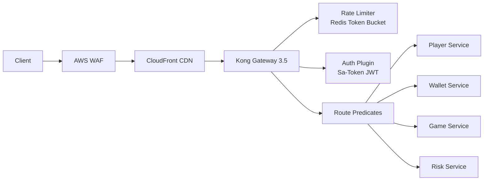
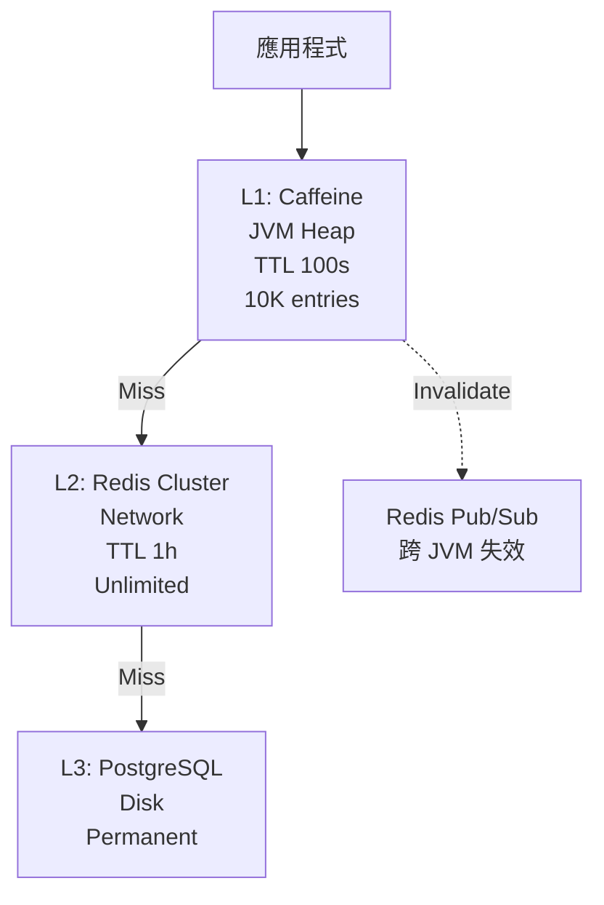
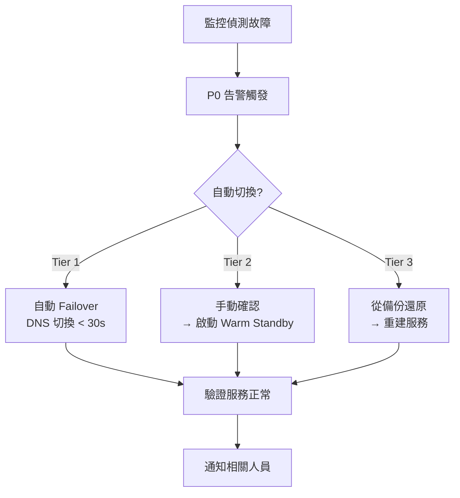
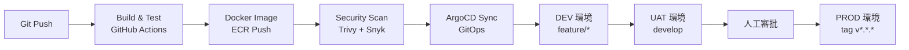

# 第 10 章：基礎設施技術架構

## 10.1 模組概述

本章涵蓋平台基礎設施的技術實作：容器編排、API 閘道、快取層、訊息佇列、監控告警及災難復原。所有元件皆部署於 Kubernetes 叢集，採用 GitOps 流程進行持續部署。

---

## 10.2 容器編排 (Kubernetes)

### 叢集規格

| 項目 | 規格 |
|------|------|
| 平台 | AWS EKS |
| Kubernetes | 1.29 |
| Helm | 3.13 |
| GitOps | ArgoCD 2.9 |
| IaC | Terraform 1.7 |
| Container Runtime | containerd (Docker 25.0 build) |

### Namespace 設計

```
igaming-prod/
├── gateway          # Kong, Spring Cloud Gateway
├── player-service   # 玩家相關服務
├── wallet-service   # 錢包與交易
├── game-service     # 遊戲整合
├── risk-service     # 風控引擎 (Go)
├── payment-service  # 支付閘道 (Go)
├── activity-service # 活動引擎
├── agent-service    # 代理系統
├── analytics        # Flink, ClickHouse
├── platform-core    # 多租戶核心
├── messaging        # Kafka, Redis
├── monitoring       # Prometheus, Grafana
└── infra            # cert-manager, external-dns
```

### 資源配額範例

```yaml
apiVersion: v1
kind: ResourceQuota
metadata:
  name: wallet-service-quota
  namespace: wallet-service
spec:
  hard:
    requests.cpu: "16"
    requests.memory: "32Gi"
    limits.cpu: "32"
    limits.memory: "64Gi"
    pods: "50"
```

### HPA 自動擴展

```yaml
apiVersion: autoscaling/v2
kind: HorizontalPodAutoscaler
metadata:
  name: wallet-service-hpa
spec:
  scaleTargetRef:
    apiVersion: apps/v1
    kind: Deployment
    name: wallet-service
  minReplicas: 3
  maxReplicas: 20
  metrics:
    - type: Resource
      resource:
        name: cpu
        target:
          type: Utilization
          averageUtilization: 70
    - type: Resource
      resource:
        name: memory
        target:
          type: Utilization
          averageUtilization: 80
  behavior:
    scaleUp:
      stabilizationWindowSeconds: 60
      policies:
        - type: Pods
          value: 4
          periodSeconds: 60
    scaleDown:
      stabilizationWindowSeconds: 300
      policies:
        - type: Pods
          value: 2
          periodSeconds: 120
```

---

## 10.3 API 閘道

### Kong Gateway 3.5



### 路由設定

```yaml
services:
  - name: wallet-service
    url: http://wallet-service.wallet-service.svc.cluster.local:8080
    routes:
      - name: wallet-api
        paths:
          - /api/v1/wallets
        strip_path: false
    plugins:
      - name: rate-limiting
        config:
          minute: 1000
          policy: redis
          redis_host: redis-cluster.messaging.svc
      - name: jwt
        config:
          key_claim_name: kid
      - name: request-transformer
        config:
          add:
            headers:
              - "X-Tenant-Id:$(jwt.tenant_id)"
```

### 限流策略

| 範圍 | 限制 | 演算法 |
|------|------|--------|
| 全域 (per IP) | 100 req/min | Token Bucket |
| 使用者 (per Player) | 1,000 req/min | Token Bucket |
| 登入端點 | 10 req/min per IP | Sliding Window |
| 提款端點 | 10 req/hr per Player | Fixed Window |
| 遊戲啟動 | 60 req/min per Player | Token Bucket |

### 回應標頭

```http
X-RateLimit-Limit: 1000
X-RateLimit-Remaining: 987
X-RateLimit-Reset: 1706346000
Retry-After: 60
```

---

## 10.4 快取層 (JetCache 2.7.5)

### 多級快取架構



| Level | Storage | TTL | Hit Rate | Latency | Capacity |
|-------|---------|-----|----------|---------|----------|
| L1 | Caffeine (JVM) | 100s | 95% | < 1ms | 10,000 entries |
| L2 | Redis 7.2 Cluster | 1h | 4.5% | 2–5ms | Unlimited |
| L3 | PostgreSQL 16 | — | 0.5% | 20–50ms | — |

### JetCache 設定

```yaml
jetcache:
  statIntervalMinutes: 15
  areaInCacheName: false
  local:
    default:
      type: caffeine
      limit: 10000
      keyConvertor: fastjson2
      expireAfterWriteInMillis: 100000
  remote:
    default:
      type: redis.lettuce
      keyPrefix: igaming:
      keyConvertor: fastjson2
      broadcastChannel: jetcache-invalidate
      valueEncoder: kryo5
      valueDecoder: kryo5
      expireAfterWriteInMillis: 3600000
      uri: redis://redis-cluster.messaging.svc:6379
```

### 使用模式

```java
// Manager 層 (ADR-013: 僅 Manager 可用 @Cached)
@Cached(name = "wallet:balance:",
        key = "#tenantId + ':' + #playerId",
        cacheType = CacheType.BOTH,
        localExpire = 100,
        expire = 3600)
public Option<WalletBalanceVO> getBalance(Long tenantId, Long playerId) {
    return Option.of(walletDao.selectBalance(tenantId, playerId))
            .map(WalletBalanceVO::fromEntity);
}

@CacheUpdate(name = "wallet:balance:",
             key = "#tenantId + ':' + #playerId",
             value = "#result")
@Transactional(rollbackFor = Throwable.class)
public WalletBalanceVO updateBalance(Long tenantId, Long playerId, BigDecimal amount) {
    // ... atomic update
}

@CacheInvalidate(name = "wallet:balance:",
                 key = "#tenantId + ':' + #playerId")
@Transactional(rollbackFor = Throwable.class)
public void closeWallet(Long tenantId, Long playerId) {
    // ... close operations
}
```

### 快取失效策略

| 場景 | 策略 |
|------|------|
| 錢包餘額變更 | @CacheUpdate 同步更新 + Redis Pub/Sub 跨 JVM |
| 玩家檔案修改 | @CacheInvalidate 失效 + 下次讀取重建 |
| 遊戲清單更新 | TTL 自然過期 (5min) + 管理後台手動清除 |
| 租戶設定變更 | 廣播失效 + 強制重載 |

---

## 10.5 訊息佇列 (Kafka 3.6 KRaft)

### 叢集架構

| 項目 | 規格 |
|------|------|
| 模式 | KRaft (無 ZooKeeper) |
| Broker | 6 nodes |
| Partition | 依 Topic 設定 |
| Replication | Factor = 3 |
| 保留期 | 7 天 (交易) / 30 天 (審計) |

### Topic 設計

| Topic | Partitions | Key | 用途 |
|-------|-----------|-----|------|
| igaming.wallet.events | 32 | tenant_id:player_id | 錢包交易事件 |
| igaming.game.events | 16 | tenant_id:game_session_id | 遊戲回合事件 |
| igaming.player.events | 16 | tenant_id:player_id | 玩家生命週期 |
| igaming.risk.events | 8 | tenant_id:player_id | 風控告警 |
| igaming.activity.events | 8 | tenant_id:activity_id | 活動觸發 |
| igaming.payment.events | 16 | tenant_id:transaction_id | 支付回調 |
| igaming.audit.log | 8 | tenant_id | 審計日誌 |
| igaming.dlq | 4 | original_topic | 死信佇列 |

### Producer 設定

```java
@Configuration
public class KafkaProducerConfig {
    @Bean
    public ProducerFactory<String, DomainEvent> producerFactory() {
        Map<String, Object> props = Map.of(
            ProducerConfig.BOOTSTRAP_SERVERS_CONFIG, kafkaBootstrapServers,
            ProducerConfig.KEY_SERIALIZER_CLASS_CONFIG, StringSerializer.class,
            ProducerConfig.VALUE_SERIALIZER_CLASS_CONFIG, JsonSerializer.class,
            ProducerConfig.ACKS_CONFIG, "all",
            ProducerConfig.RETRIES_CONFIG, 3,
            ProducerConfig.ENABLE_IDEMPOTENCE_CONFIG, true,
            ProducerConfig.MAX_IN_FLIGHT_REQUESTS_PER_CONNECTION, 5
        );
        return new DefaultKafkaProducerFactory<>(props);
    }
}
```

### Consumer 設定

```java
@KafkaListener(
    topics = "igaming.wallet.events",
    groupId = "risk-engine-group",
    containerFactory = "kafkaListenerContainerFactory"
)
public void onWalletEvent(
        @Payload DomainEvent event,
        @Header(KafkaHeaders.RECEIVED_KEY) String key,
        Acknowledgment ack) {
    Try.run(() -> riskService.evaluate(event))
       .onSuccess(v -> ack.acknowledge())
       .onFailure(e -> {
           log.error("Failed processing event: {}", event.getEventId(), e);
           dlqProducer.send(event); // 送入 DLQ
           ack.acknowledge();
       });
}
```

### 死信佇列 (DLQ) 處理

```
原始 Topic → Consumer 失敗 (3 次重試) → igaming.dlq
                                          ↓
                                    DLQ Consumer (延遲 5min 重試)
                                          ↓ (仍失敗)
                                    告警 + 人工介入
```

---

## 10.6 串流處理 (Apache Flink 1.18)

### 部署架構

```yaml
# Flink JobManager
apiVersion: apps/v1
kind: Deployment
metadata:
  name: flink-jobmanager
  namespace: analytics
spec:
  replicas: 2  # HA
  template:
    spec:
      containers:
        - name: flink
          image: flink:1.18.0-scala_2.12-java11
          resources:
            requests: { cpu: "2", memory: "4Gi" }
            limits: { cpu: "4", memory: "8Gi" }
          env:
            - name: FLINK_PROPERTIES
              value: |
                state.backend: rocksdb
                state.checkpoints.dir: s3://igaming-flink/checkpoints
                execution.checkpointing.interval: 60000
                execution.checkpointing.mode: EXACTLY_ONCE
```

### CDC 管線

```sql
-- PostgreSQL WAL 設定
-- wal_level = logical
-- max_wal_senders = 10
-- max_replication_slots = 10

CREATE TABLE wallet_cdc (
    tenant_id BIGINT,
    player_id BIGINT,
    balance DECIMAL(20, 4),
    lock_amount DECIMAL(20, 4),
    version BIGINT,
    update_time TIMESTAMP(3),
    WATERMARK FOR update_time AS update_time - INTERVAL '5' SECOND
) WITH (
    'connector' = 'postgres-cdc',
    'hostname' = 'postgres-master',
    'port' = '5432',
    'database-name' = 'igaming',
    'schema-name' = 'public',
    'table-name' = 't_wallet',
    'slot.name' = 'flink_wallet_slot',
    'decoding.plugin.name' = 'pgoutput'
);
```

### Exactly-Once 保證

| 流程 | 保證等級 | 機制 |
|------|---------|------|
| Flink CDC → Kafka | Exactly-Once | Flink Checkpoint + Kafka Transaction |
| Kafka → Flink SQL | Exactly-Once | Consumer Offset Management |
| Flink SQL → ClickHouse | At-Least-Once | ReplacingMergeTree 去重 |

---

## 10.7 SLA 分級架構

### 三級 SLA

| Tier | 服務 | SLA | 月停機上限 |
|------|------|-----|-----------|
| External | Player API, Game API, Payment | 99.9% | 43.8 min |
| Security | Risk Engine, Auth, AML | 99.95% | 21.9 min |
| Platform | K8s Control Plane, Database | 99.99% | 4.3 min |

### 健康檢查

```java
@Component
public class WalletHealthIndicator implements HealthIndicator {
    @Override
    public Health health() {
        boolean dbOk = walletDao.healthCheck();
        boolean redisOk = redisTemplate.hasKey("health:wallet");
        boolean kafkaOk = kafkaTemplate.partitionsFor("igaming.wallet.events") != null;

        if (dbOk && redisOk && kafkaOk) {
            return Health.up()
                .withDetail("database", "OK")
                .withDetail("redis", "OK")
                .withDetail("kafka", "OK")
                .build();
        }
        return Health.down()
            .withDetail("database", dbOk ? "OK" : "FAIL")
            .withDetail("redis", redisOk ? "OK" : "FAIL")
            .withDetail("kafka", kafkaOk ? "OK" : "FAIL")
            .build();
    }
}
```

---

## 10.8 災難復原 (DR)

### 三級 DR

| Tier | 服務範圍 | RPO | RTO | 策略 |
|------|---------|-----|-----|------|
| Tier 1 | Payment, Wallet | < 5 min | < 15 min | Active-Active (multi-AZ) |
| Tier 2 | Player, Game, CS | < 1 hr | < 4 hr | Warm Standby |
| Tier 3 | Analytics, Reports | < 24 hr | < 24 hr | Cold Backup + Restore |

### 備份策略

```
PostgreSQL:
  - WAL 持續歸檔 → S3 (RPO < 5min)
  - 每日全量 pg_basebackup (壓縮 + 加密)
  - 保留 30 天

Redis:
  - RDB snapshot 每 15 min
  - AOF 持續寫入
  - 跨 AZ replica

ClickHouse:
  - 每日分區 backup
  - 保留 90 天
```

### 故障切換流程



---

## 10.9 部署策略

### Blue-Green (無狀態服務)

適用：API Gateway, Game Service, Frontend

```
1. 部署新版本 (Blue) 至獨立 Pod 群
2. Smoke Test 通過
3. Kong 路由切換 Green → Blue
4. 監控 10 分鐘
5. 回滾時間 < 30 秒 (路由切回 Green)
6. Green 保留 24 小時後清理
```

### Canary (關鍵服務)

適用：Wallet Service, Payment Gateway, Risk Engine

```
Phase 1: 5% 流量   (T+0  → T+30min)  → 驗證錯誤率
Phase 2: 25% 流量  (T+30 → T+60min)  → 驗證延遲
Phase 3: 50% 流量  (T+60 → T+90min)  → 驗證業務指標
Phase 4: 100% 流量 (T+90 → T+120min) → 全量發布
```

自動回滾條件：
- 錯誤率 > 1%
- P99 延遲增加 > 50%
- 任何 P0 告警觸發

### CI/CD Pipeline



---

## 10.10 監控與告警

### 監控棧

| 工具 | 用途 |
|------|------|
| Prometheus | 指標收集 (Pull model) |
| Grafana | 儀表板視覺化 |
| Datadog / New Relic | APM 應用效能監控 |
| Elasticsearch 8.11 | 審計日誌搜尋 |
| PagerDuty | 告警路由與 On-call |

### 告警分級

| 等級 | 條件 | 回應時間 | 通知方式 |
|------|------|---------|---------|
| P0 Critical | 支付/錢包中斷、資料遺失 | < 5 min | 電話 + SMS + Slack |
| P1 High | API 錯誤率 > 5%、延遲 P99 > 500ms | < 15 min | SMS + Slack |
| P2 Medium | 非核心服務降級、佇列積壓 | < 1 hr | Slack + Email |
| P3 Low | 效能下降、磁碟使用 > 80% | < 4 hr | Email |

### 核心指標

```yaml
# Prometheus 自訂指標
igaming_wallet_transaction_total{tenant, type, status}       # Counter
igaming_wallet_transaction_duration_seconds{tenant, type}    # Histogram
igaming_wallet_balance_total{tenant, wallet_type}            # Gauge
igaming_api_request_total{service, method, path, status}     # Counter
igaming_api_request_duration_seconds{service, method, path}  # Histogram
igaming_kafka_consumer_lag{topic, group}                     # Gauge
igaming_risk_evaluation_total{tenant, layer, result}         # Counter
igaming_flink_checkpoint_duration_seconds{job}               # Histogram
```

---

## 10.11 效能目標

| 指標 | 目標 | 設計容量 |
|------|------|---------|
| 註冊用戶 | 100K | 500K |
| DAU | 10K | 50K |
| Peak Concurrent | 2K | 10K |
| Peak TPS | 120 | 300 |
| API P99 Latency | < 200ms | < 100ms |
| 資料儲存 (年) | ~1.5 TB | ~5 TB |

### 成本估算

| 項目 | 月成本 (USD) |
|------|-------------|
| AWS EKS + EC2 | $85,000 |
| RDS PostgreSQL + Citus | $45,000 |
| ElastiCache Redis | $18,000 |
| MSK Kafka | $22,000 |
| CloudFront CDN | $12,000 |
| S3 Storage | $8,000 |
| Monitoring (Datadog) | $15,000 |
| 其他 (WAF, DNS, etc.) | $49,000 |
| **月合計** | **$254,000** |
| **年合計** | **$3,048,000** |
| **每 DAU 成本** | **$2.89** |

---

## 10.12 DR 演練排程與驗證 (aligned with Requirements §10.4)

### 季度演練排程

| 季度 | 演練範圍 | 演練類型 | 驗證標準 |
|------|---------|---------|---------|
| Q1 | Tier 1 (支付/錢包) | 完整 Failover | RTO < 15 分鐘 + 餘額一致性 100% + 零交易遺失 |
| Q2 | Tier 1 + Tier 2 (玩家/遊戲) | 完整 Failover | Tier 1 + 玩家服務 RTO < 4 小時 + Session 恢復率 > 99% |
| Q3 | Tier 1 (支付/錢包) | 桌面推演 + 部分 Failover | 操作手冊完整性驗證 + 新團隊成員參與 |
| Q4 | 全系統 (Tier 1+2+3) | 完整 Failover | 年度全系統驗證，含報表恢復、合規數據完整性 |

### Failover 測試腳本框架

```java
@Component
public class DrDrillOrchestrator {

    /**
     * 執行 DR 演練 — 自動化 Failover + 驗證
     * 由 SRE 手動觸發 (非排程，因涉及服務中斷)
     */
    public DrDrillReport executeDrill(DrDrillRequest request) {
        DrDrillReport report = new DrDrillReport(request.getQuarter(), request.getScope());

        // Step 1: 演練前快照
        Instant drillStart = Instant.now();
        Map<String, BigDecimal> preBalances = walletSnapshotService.captureAllBalances();
        long preInFlightTxCount = transactionService.countInFlightTransactions();

        // Step 2: 模擬故障 (依範圍)
        switch (request.getScope()) {
            case TIER_1 -> simulateTier1Failure();  // 切斷主 DB + Redis 主節點
            case TIER_1_2 -> { simulateTier1Failure(); simulateTier2Failure(); }
            case FULL -> { simulateTier1Failure(); simulateTier2Failure(); simulateTier3Failure(); }
        }

        // Step 3: 等待自動 Failover
        Instant failoverComplete = waitForFailoverCompletion(request.getScope());
        Duration rtoActual = Duration.between(drillStart, failoverComplete);

        // Step 4: 驗證檢查清單
        report.setRtoActual(rtoActual);
        report.setRtoMet(rtoActual.compareTo(request.getExpectedRto()) <= 0);

        // 餘額一致性
        Map<String, BigDecimal> postBalances = walletSnapshotService.captureAllBalances();
        BigDecimal balanceDiff = compareBalances(preBalances, postBalances);
        report.setBalanceConsistency(balanceDiff.compareTo(BigDecimal.ZERO) == 0);

        // 交易連續性 — 所有 in-flight 交易有明確狀態
        long unresolvedTx = transactionService.countUnresolvedTransactions();
        report.setTransactionContinuity(unresolvedTx == 0);

        // 外部服務重連
        report.setPspReconnected(pspHealthChecker.isAllHealthy());
        report.setGpReconnected(gpHealthChecker.isAllHealthy());

        // 監控恢復
        report.setMonitoringRestored(prometheusHealthChecker.isHealthy());

        // Step 5: 恢復原始環境
        restoreOriginalEnvironment(request.getScope());

        // Step 6: 生成報告
        report.setOverallPass(report.isRtoMet() && report.isBalanceConsistency()
            && report.isTransactionContinuity());

        // 演練失敗處置: Tier 1 未通過 → 2 週內補充演練
        if (!report.isOverallPass() && request.getScope().includesTier1()) {
            alertService.fireCritical("DR_DRILL_FAILED",
                "Tier 1 DR drill failed. Schedule remediation within 2 weeks.");
            scheduleRemediationDrill(request, report);
        }

        drDrillReportRepository.save(report);
        return report;
    }
}
```

### 驗證檢查清單

| 驗證項目 | 通過標準 | 自動化 |
|---------|---------|--------|
| RTO 達成 | 各 Tier 恢復時間 ≤ 目標值 | ✅ 自動計時 |
| RPO 達成 | 數據遺失量 ≤ 目標值 | ✅ WAL position 比對 |
| 餘額一致性 | 恢復後錢包餘額與備份一致 (差異 = 0) | ✅ 快照比對 |
| 交易連續性 | 所有 in-flight 交易有明確狀態 (成功/回滾) | ✅ 未解決交易 = 0 |
| 外部服務重連 | PSP、GP 連線在 RTO 內恢復 | ✅ 健康檢查 |
| 監控恢復 | 告警系統、儀表板正常運作 | ✅ Prometheus check |
| 通知執行 | 相關人員收到通知 (時間戳記錄) | ⚠️ 人工確認 |

---

## 10.13 多租戶時區規範 (aligned with Requirements §10.10)

| 場景 | 時區規則 | 技術實作 |
|------|---------|---------|
| 數據存儲 | 一律 **UTC** | PostgreSQL 使用 `TIMESTAMPTZ`，禁止 `TIMESTAMP WITHOUT TIME ZONE` |
| 報表展示 | 依角色所屬租戶的本地時區 | `TimeZoneConverter.toTenantLocal(instant, tenantId)` |
| 紅利到期計算 | 依活動定義的時區（預設 UTC+8）| `BonusExpiryJob` 使用 `ZonedDateTime(activity.getTimezone())` |
| 日結/月結基準 | 依租戶配置的結算時區 | `TenantConfig.settlementTimezone` (預設 `Asia/Taipei` 03:00) |
| API 時間格式 | ISO 8601 + 時區偏移 | Jackson: `@JsonFormat(pattern = "yyyy-MM-dd'T'HH:mm:ssXXX")` |
| 跨時區報表對帳 | 轉換為 UTC 後比對 | ClickHouse: `toTimezone(event_time, 'UTC')` |

```java
/** 全局 JPA 設定: 強制 TIMESTAMPTZ */
@Configuration
public class JpaTimezoneConfig {

    @PostConstruct
    public void setDefaultTimezone() {
        TimeZone.setDefault(TimeZone.getTimeZone("UTC"));
    }
}

/** ArchUnit: 禁止使用 LocalDateTime 作為 Entity 欄位 (強制 Instant/ZonedDateTime) */
@ArchTest
public static final ArchRule no_local_datetime_in_entities =
    fields()
        .that().areDeclaredInClassesThat().areAnnotatedWith(Entity.class)
        .should().notHaveRawType(LocalDateTime.class)
        .as("Entity fields must use Instant or ZonedDateTime, not LocalDateTime");
```

---

## 10.14 CAP 定理取捨策略 (aligned with Requirements §10.11)

| 系統 | CAP 策略 | 分區時行為 | 技術實作 |
|------|---------|----------|---------|
| 錢包 / 支付 | **CP** (一致性優先) | 拒絕寫入，回傳錯誤 | PostgreSQL SERIALIZABLE + Citus 2PC |
| 風控引擎 | **CP** (一致性優先) | 寧可延遲也不漏判 | Flink Exactly-Once + Kafka Transaction |
| 遊戲大廳 / CMS | **AP** (可用性優先) | 允許短暫不一致 | Redis Cache + 最終一致性 (TTL 60s) |
| 報表 / 分析 | **AP** (可用性優先) | 最終一致即可 | ClickHouse ReplacingMergeTree |
| 客服系統 | **AP** (可用性優先) | 玩家可聯繫客服 | 多副本 + 異步同步 |

**設計原則**: 資金相關 = CP，體驗相關 = AP。分區時 CP 系統回傳明確錯誤碼 (`SERVICE_UNAVAILABLE`)，前端引導用戶稍後重試。

---

## 10.15 對應業務文檔

> 業務需求請參考 [requirements/10_Infrastructure_基礎設施需求.md](../requirements/10_Infrastructure_基礎設施需求.md)

---

## 10.16 變更紀錄

### v2.1 (Sprint Sync)

| 項目 | 變更內容 | 需求來源 |
|------|---------|---------|
| §10.12 DR 演練排程與驗證 | **新增** 季度演練排程表 + `DrDrillOrchestrator` 自動化 Failover 測試腳本 + 驗證檢查清單 + 演練失敗 2 週補充演練機制 | L-05 DR 演練 |
| §10.13 多租戶時區規範 | **新增** 6 場景時區規則 + PostgreSQL TIMESTAMPTZ 強制 + API ISO 8601 + ArchUnit 禁止 LocalDateTime | M-01 時區 |
| §10.14 CAP 定理取捨策略 | **新增** 5 系統 CP/AP 策略映射 + 分區時行為定義 + 技術實作方式 | M-02 CAP |
