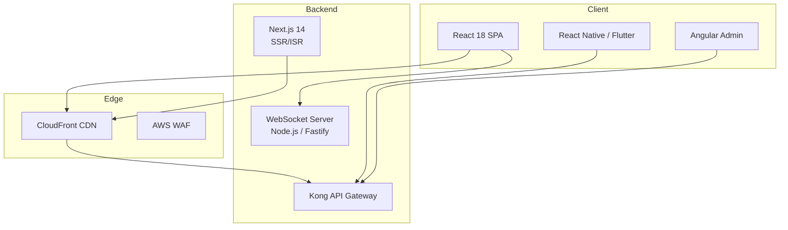
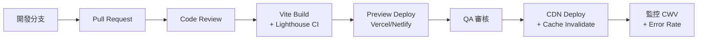

# 第 11 章：前端體驗技術架構

## 11.1 模組概述

前端技術架構涵蓋 Web 應用、行動 App、CMS 靜態站點生成及管理後台。採用 React 18 為主框架，搭配 Next.js 14 實現 SSR/ISR，並透過白標系統支援多品牌客製化。

---

## 11.2 技術棧

| 層級 | 技術 | 版本 | 用途 |
|------|------|------|------|
| Web 前台 | React 18 + TypeScript | 18.2 / 5.3 | 玩家端 SPA |
| Build | Vite | 5.x | 開發伺服器 + 打包 |
| SSR/ISR | Next.js | 14 | SEO 頁面 + CMS |
| Mobile | React Native / Flutter | 0.73 / 3.16 | iOS + Android |
| Admin | Angular | 17 | 營運後台 |
| State | Zustand | 4.x | 輕量狀態管理 |
| i18n | react-i18next | 13.x | 國際化 |
| Real-time | Socket.IO | 4.7 | WebSocket 連線 |

---

## 11.3 應用架構



---

## 11.4 國際化 (i18n)

### 支援語系

| 語言 | 代碼 | 方向 | 幣別預設 |
|------|------|------|---------|
| English | en-US | LTR | USD |
| 繁體中文 | zh-TW | LTR | TWD |
| 簡體中文 | zh-CN | LTR | CNY |
| 日本語 | ja-JP | LTR | JPY |
| Português | pt-BR | LTR | BRL |
| العربية | ar-SA | RTL | SAR |

### Fallback 邏輯

```
請求語系 → 完全匹配 → 使用
         → 語系匹配 (zh-TW → zh) → 使用
         → 無匹配 → 回退至 en-US
```

### 實作

```typescript
// i18n.config.ts
import i18n from 'i18next';
import { initReactI18next } from 'react-i18next';
import LanguageDetector from 'i18next-browser-languagedetector';
import HttpBackend from 'i18next-http-backend';

i18n
  .use(HttpBackend)
  .use(LanguageDetector)
  .use(initReactI18next)
  .init({
    fallbackLng: 'en-US',
    supportedLngs: ['en-US', 'zh-TW', 'zh-CN', 'ja-JP', 'pt-BR', 'ar-SA'],
    ns: ['common', 'game', 'wallet', 'promotion'],
    defaultNS: 'common',
    backend: {
      loadPath: '/locales/{{lng}}/{{ns}}.json',
    },
    detection: {
      order: ['querystring', 'cookie', 'localStorage', 'navigator'],
      caches: ['cookie'],
    },
    interpolation: { escapeValue: false },
  });
```

### RTL 支援

```typescript
// RTLProvider.tsx
const RTL_LANGUAGES = ['ar-SA'];

export const RTLProvider: React.FC<{ children: React.ReactNode }> = ({ children }) => {
  const { i18n } = useTranslation();
  const isRTL = RTL_LANGUAGES.includes(i18n.language);

  useEffect(() => {
    document.documentElement.dir = isRTL ? 'rtl' : 'ltr';
    document.documentElement.lang = i18n.language;
  }, [i18n.language, isRTL]);

  return <>{children}</>;
};
```

---

## 11.5 行動 App 架構

### Deep Linking

```
igaming://game/launch/{gameCode}
igaming://wallet/deposit
igaming://promotion/{promoId}
igaming://kyc/verify
```

### 推播通知

| 類型 | 觸發條件 | 優先級 |
|------|---------|--------|
| 交易完成 | 存款/提款到帳 | High |
| 促銷通知 | 新活動上線 | Normal |
| 帳戶安全 | 異常登入偵測 | High |
| 遊戲通知 | 免費旋轉到期提醒 | Normal |

### App 安全

```
SSL Pinning:
  - Certificate pinning (primary)
  - Public key pinning (backup)
  - Pin 失敗 → 阻斷連線 + 上報

Root/Jailbreak Detection:
  - SafetyNet (Android) / DeviceCheck (iOS)
  - 偵測到 → 限制支付功能

APK 大小目標: < 5 MB (base module)
  - Dynamic feature modules for games
  - On-demand download
```

### 離線支援

```typescript
// ServiceWorker 策略
const CACHE_STRATEGIES = {
  'api/v1/games/list':    'stale-while-revalidate', // 遊戲清單
  'api/v1/player/profile': 'network-first',          // 玩家檔案
  'static/':               'cache-first',             // 靜態資源
  'api/v1/wallet/':        'network-only',            // 錢包 (不快取)
};
```

---

## 11.6 SEO 架構 (Next.js 14)

### 渲染策略

| 頁面類型 | 渲染方式 | 重新驗證 |
|---------|---------|---------|
| 首頁 / 遊戲分類 | ISR (Incremental Static Regeneration) | 60s |
| 促銷頁面 | ISR | 300s |
| 遊戲詳情 | SSR | — |
| Blog / 幫助中心 | SSG (Static Generation) | Build time |
| 玩家個人頁面 | CSR (Client-side) | — |

### Core Web Vitals 目標

| 指標 | 目標 | 實作策略 |
|------|------|---------|
| LCP | < 2.5s | Image optimization (next/image), CDN, preload critical resources |
| FID / INP | < 100ms | Code splitting, lazy loading, Web Worker for heavy computation |
| CLS | < 0.1 | Explicit width/height, font-display: swap, skeleton screens |

### 結構化資料

```typescript
// GameSchema.tsx
export const GameJsonLd = ({ game }: { game: Game }) => (
  <script type="application/ld+json">
    {JSON.stringify({
      '@context': 'https://schema.org',
      '@type': 'SoftwareApplication',
      name: game.name,
      applicationCategory: 'GameApplication',
      operatingSystem: 'Web',
      offers: {
        '@type': 'Offer',
        price: '0',
        priceCurrency: 'USD',
      },
    })}
  </script>
);
```

---

## 11.7 白標系統

### 主題切換

```typescript
// ThemeProvider.tsx
interface BrandTheme {
  primaryColor: string;
  secondaryColor: string;
  logoUrl: string;
  fontFamily: string;
  borderRadius: string;
}

const ThemeContext = createContext<BrandTheme>(defaultTheme);

export const ThemeProvider: React.FC<{
  tenantId: string;
  children: React.ReactNode;
}> = ({ tenantId, children }) => {
  const [theme, setTheme] = useState<BrandTheme>(defaultTheme);

  useEffect(() => {
    fetch(`/api/v1/tenants/${tenantId}/theme`)
      .then(res => res.json())
      .then(setTheme);
  }, [tenantId]);

  return (
    <ThemeContext.Provider value={theme}>
      <div style={{
        '--primary': theme.primaryColor,
        '--secondary': theme.secondaryColor,
        '--font': theme.fontFamily,
        '--radius': theme.borderRadius,
      } as React.CSSProperties}>
        {children}
      </div>
    </ThemeContext.Provider>
  );
};
```

### No-Code Editor

管理後台提供視覺化編輯器，允許租戶自訂：
- Logo、配色、字型
- 首頁 Banner 輪播
- 導航選單結構
- 頁腳連結

設定存儲於 `t_tenant_theme (tenant_id, theme_config JSONB)` 表。

---

## 11.8 錢包模式 UI 適配

| 模式 | UI 差異 |
|------|---------|
| Seamless (單一錢包) | 隱藏遊戲內餘額切換、自動扣款 |
| Transfer (轉帳錢包) | 顯示 GP 子錢包、手動轉入/轉出按鈕 |
| Hybrid | 依 GP 設定動態切換 UI |

---

## 11.9 Banner 系統

### 投放邏輯

```typescript
interface BannerRule {
  id: string;
  priority: number;
  targeting: {
    vipTier?: string[];
    registrationAge?: { min?: number; max?: number }; // days
    lastDepositDays?: number;
    geoCountry?: string[];
    abTestGroup?: string;
  };
  content: {
    imageUrl: Record<string, string>; // locale → url
    linkUrl: string;
    startTime: string;
    endTime: string;
  };
}

// 匹配演算法
function matchBanners(player: PlayerProfile, banners: BannerRule[]): BannerRule[] {
  return banners
    .filter(b => isWithinTimeRange(b))
    .filter(b => matchesTargeting(player, b.targeting))
    .sort((a, b) => b.priority - a.priority)
    .slice(0, 5); // 最多 5 個輪播
}
```

### A/B 測試

```
分組: MurmurHash3(player_id) % 100
  0-49:  Group A (Control)
  50-99: Group B (Variant)

指標追蹤: 點擊率 (CTR), 轉換率, 存款金額
最小樣本: 1,000 per group
統計顯著性: p < 0.05
```

---

## 11.10 無障礙 (Accessibility)

### WCAG 2.1 AA 合規

| 要求 | 實作 |
|------|------|
| 鍵盤導航 | 所有互動元素 tabIndex + focus styles |
| 螢幕閱讀器 | aria-label, aria-describedby, role |
| 對比度 | 文字/背景 ≥ 4.5:1 (AA), 大字 ≥ 3:1 |
| 動畫 | prefers-reduced-motion 媒體查詢 |
| 字體大小 | 支援 200% 放大不破版 |

---

## 11.11 發布流程



Lighthouse CI 門檻：
- Performance ≥ 90
- Accessibility ≥ 90
- Best Practices ≥ 90
- SEO ≥ 90

---

## 11.12 對應業務文檔

> 業務需求請參考 [requirements/11_Frontend_Experience_前端體驗.md](../requirements/11_Frontend_Experience_前端體驗.md)
