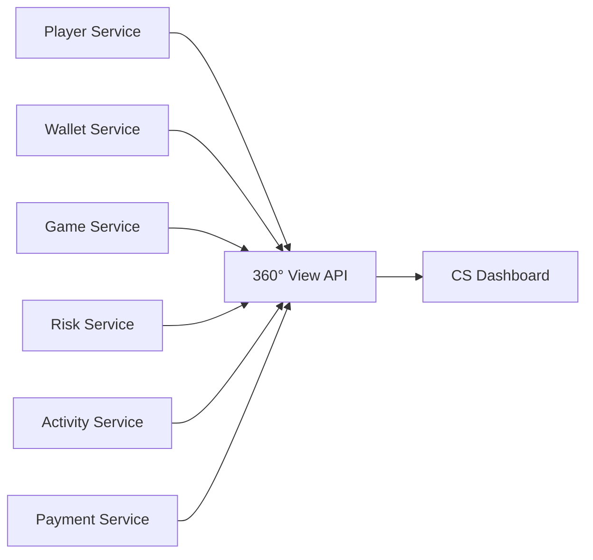
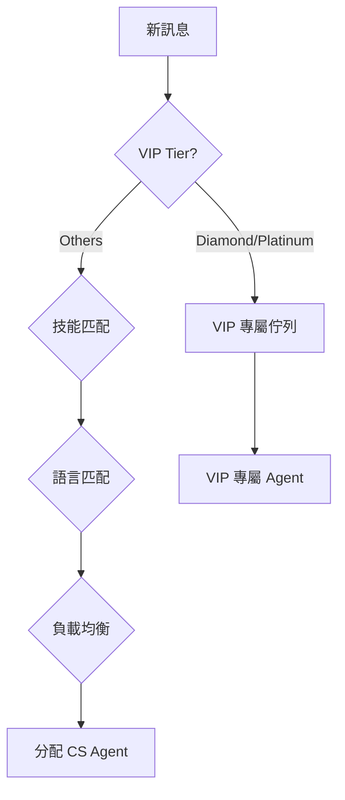

# 第 12 章：客戶服務技術架構

## 12.1 模組概述

客戶服務技術架構整合 360° 玩家視圖、多頻道支援（Live Chat / Telegram / Email / WhatsApp / Phone）、AI 聊天機器人、工單系統及知識庫。核心採用 SmartAdmin 四層架構實作，搭配 WebSocket 實現即時通訊。

---

## 12.2 資料模型

### 核心表結構

```sql
-- 工單表
CREATE TABLE t_cs_ticket (
    id              BIGSERIAL PRIMARY KEY,
    tenant_id       BIGINT NOT NULL,
    player_id       BIGINT NOT NULL,
    ticket_no       VARCHAR(32) NOT NULL UNIQUE,
    channel         VARCHAR(20) NOT NULL,    -- LIVE_CHAT, TELEGRAM, EMAIL, WHATSAPP, PHONE
    category        VARCHAR(30) NOT NULL,    -- ACCOUNT, PAYMENT, GAME, BONUS, TECHNICAL
    priority        VARCHAR(10) NOT NULL,    -- P0, P1, P2, P3, P4
    status          VARCHAR(20) NOT NULL,    -- OPEN, ASSIGNED, IN_PROGRESS, WAITING, RESOLVED, CLOSED
    subject         VARCHAR(500),
    assigned_to     BIGINT,
    vip_tier        VARCHAR(20),
    language        VARCHAR(10),
    sla_deadline    TIMESTAMP,
    first_response_at TIMESTAMP,
    resolved_at     TIMESTAMP,
    satisfaction    SMALLINT,               -- 1-5 CSAT
    created_at      TIMESTAMP NOT NULL DEFAULT NOW(),
    updated_at      TIMESTAMP NOT NULL DEFAULT NOW(),
    deleted         BOOLEAN NOT NULL DEFAULT FALSE
);

-- 訊息表
CREATE TABLE t_cs_message (
    id              BIGSERIAL PRIMARY KEY,
    tenant_id       BIGINT NOT NULL,
    ticket_id       BIGINT NOT NULL,
    sender_type     VARCHAR(10) NOT NULL,   -- PLAYER, AGENT, BOT, SYSTEM
    sender_id       BIGINT,
    content_type    VARCHAR(20) NOT NULL,   -- TEXT, IMAGE, FILE, TEMPLATE
    content         TEXT NOT NULL,
    metadata        JSONB,                  -- 附件 URL, 模板參數等
    created_at      TIMESTAMP NOT NULL DEFAULT NOW()
);

-- 知識庫文章
CREATE TABLE t_cs_knowledge_article (
    id              BIGSERIAL PRIMARY KEY,
    tenant_id       BIGINT NOT NULL,
    category        VARCHAR(50) NOT NULL,
    title           VARCHAR(500) NOT NULL,
    content         TEXT NOT NULL,
    language        VARCHAR(10) NOT NULL,
    permission      VARCHAR(20) NOT NULL,   -- PUBLIC, PLAYER, AGENT, INTERNAL
    tags            TEXT[],
    view_count      INTEGER DEFAULT 0,
    helpful_count   INTEGER DEFAULT 0,
    status          VARCHAR(20) NOT NULL,   -- DRAFT, PUBLISHED, ARCHIVED
    version         INTEGER NOT NULL DEFAULT 1,
    created_at      TIMESTAMP NOT NULL DEFAULT NOW(),
    updated_at      TIMESTAMP NOT NULL DEFAULT NOW()
);

CREATE INDEX idx_ticket_tenant_status ON t_cs_ticket(tenant_id, status);
CREATE INDEX idx_ticket_player ON t_cs_ticket(tenant_id, player_id);
CREATE INDEX idx_ticket_sla ON t_cs_ticket(tenant_id, sla_deadline) WHERE status NOT IN ('RESOLVED', 'CLOSED');
CREATE INDEX idx_message_ticket ON t_cs_message(ticket_id, created_at);
CREATE INDEX idx_knowledge_search ON t_cs_knowledge_article USING GIN(to_tsvector('english', title || ' ' || content));
```

---

## 12.3 360° 玩家視圖

### 資料聚合



### 聚合 API

```java
@RestController
@RequestMapping("/api/v1/cs/player-view")
@RequiredArgsConstructor
public class PlayerViewController {

    private final PlayerViewService playerViewService;

    @GetMapping("/{playerId}")
    @PreAuthorize("hasRole('CS_AGENT')")
    public ResponseDTO<PlayerViewVO> getPlayerView(
            @PathVariable Long playerId,
            @RequestHeader("X-Tenant-Id") Long tenantId) {
        return playerViewService.aggregatePlayerView(tenantId, playerId);
    }
}
```

### 聚合資料類別

| 類別 | 來源服務 | 資料內容 |
|------|---------|---------|
| 帳戶資訊 | Player Service | KYC 狀態、VIP 等級、標籤、狀態 |
| 財務摘要 | Wallet Service | 餘額、鎖定金額、待處理交易 |
| 遊戲歷史 | Game Service | 近期投注、偏好遊戲、RTP |
| 風控標記 | Risk Service | 風險分數、告警歷史、限制 |
| 促銷狀態 | Activity Service | 進行中紅利、流水進度 |
| 支付記錄 | Payment Service | 存提款歷史、慣用支付方式 |

### 操作面板

CS Agent 可直接從 360° 視圖執行：
- 手動加幣 / 扣幣（需審核）
- 凍結 / 解凍帳戶
- 重設密碼
- 觸發 KYC 審核
- 發放補償紅利

每項操作皆產生審計日誌 (`t_cs_operation_log`)。

---

## 12.4 即時通訊架構

### WebSocket 連線

```typescript
// CS Agent WebSocket 連線
const socket = io('wss://cs.igaming.com', {
  auth: { token: agentJwtToken },
  transports: ['websocket'],
  reconnection: true,
  reconnectionAttempts: 10,
  reconnectionDelay: 1000,
});

// 事件處理
socket.on('new_ticket', (ticket: TicketDTO) => {
  // 新工單分配通知
});

socket.on('player_message', (message: MessageDTO) => {
  // 玩家即時訊息
});

socket.on('ticket_transferred', (data: TransferDTO) => {
  // 工單轉接
});
```

### 訊息路由引擎



路由優先級：VIP 等級 → 技能標籤 → 語言偏好 → 當前負載（最少活躍工單）

---

## 12.5 AI 聊天機器人

### 意圖辨識

| 意圖 | 範例 | 自動處理 |
|------|------|---------|
| BALANCE_INQUIRY | "What is my balance?" | ✅ 直接查詢回覆 |
| DEPOSIT_STATUS | "Where is my deposit?" | ✅ 查詢交易狀態 |
| BONUS_INFO | "How much wagering left?" | ✅ 查詢流水進度 |
| PASSWORD_RESET | "I forgot my password" | ✅ 發送重設連結 |
| KYC_HELP | "How do I verify?" | ✅ 引導至 KYC 頁面 |
| WITHDRAWAL_ISSUE | "My withdrawal is stuck" | ⚠️ 查詢後可能轉人工 |

### 技術實作

```python
# AI Chatbot Service (FastAPI)
@app.post("/api/v1/chatbot/message")
async def handle_message(request: ChatRequest):
    # 1. 意圖分類
    intent = await intent_classifier.predict(request.message)

    # 2. 自動處理或轉人工
    if intent.confidence >= 0.90 and intent.category in AUTO_HANDLE_INTENTS:
        response = await auto_handler.process(intent, request.player_id)
        return ChatResponse(message=response, source="bot")
    else:
        # 轉人工 + 提供上下文
        ticket = await ticket_service.create_or_update(
            player_id=request.player_id,
            intent=intent,
            context=request.conversation_history[-5:]  # 最近 5 條訊息
        )
        return ChatResponse(
            message=localize("connecting_agent", request.language),
            source="bot",
            ticket_id=ticket.id
        )
```

### 效能指標

| 指標 | 目標 |
|------|------|
| 意圖辨識準確率 | ≥ 90% |
| 自動解決率 | ≥ 40% |
| 首次回應時間 (Bot) | < 3 秒 |
| 轉人工率 | ≤ 60% |

---

## 12.6 工單 SLA 管理

### SLA 規則

| 類別 | 首次回應 | 解決時限 |
|------|---------|---------|
| P0 Critical (支付中斷) | 15 min | 2 hr |
| P1 High (帳戶鎖定) | 30 min | 4 hr |
| P2 Medium (紅利問題) | 2 hr | 24 hr |
| P3 Low (一般詢問) | 4 hr | 48 hr |
| P4 Info (功能建議) | 24 hr | 7 days |

### VIP 差異化 SLA

| VIP Tier | 首次回應加速 |
|----------|-------------|
| Diamond | 5 min (專屬 Agent) |
| Platinum | 10 min |
| Gold | 15 min |
| Silver | 30 min |
| Bronze | 2 hr (標準) |

### SLA 監控

```java
@Scheduled(fixedRate = 60_000) // 每分鐘檢查
public void checkSlaBreaches() {
    List<CsTicket> nearBreach = ticketDao.findNearingSla(
        Instant.now().plus(15, ChronoUnit.MINUTES)
    );
    nearBreach.forEach(ticket -> {
        // 即將違反 SLA → 升級
        if (ticket.getSlaDeadline().isBefore(Instant.now().plus(10, ChronoUnit.MINUTES))) {
            escalationService.escalate(ticket);
            notificationService.alertSupervisor(ticket);
        }
    });
}
```

### 自動關閉規則

| 狀態 | 條件 | 動作 |
|------|------|------|
| WAITING (等待玩家) | 72 hr 無回應 | 自動 RESOLVED |
| RESOLVED | 24 hr 無重開 | 自動 CLOSED |
| CLOSED | — | 發送 CSAT 問卷 |

---

## 12.7 知識庫架構

### 文章管理

| 特性 | 實作 |
|------|------|
| 文章數量 | 145+ 篇 (持續增長) |
| 語言版本 | 6 語系 |
| 全文搜尋 | PostgreSQL Full-Text Search + Elasticsearch |
| 權限分級 | PUBLIC (玩家可見) / PLAYER (登入後) / AGENT (CS 專用) / INTERNAL (內部) |
| 版本控制 | 每次編輯產生新版本 |

### 搜尋 API

```java
@GetMapping("/api/v1/cs/knowledge/search")
public ResponseDTO<PageResult<ArticleVO>> search(
        @RequestParam String query,
        @RequestParam(defaultValue = "en-US") String language,
        @RequestParam(defaultValue = "PUBLIC") String permission,
        @RequestParam(defaultValue = "1") int page,
        @RequestParam(defaultValue = "10") int size) {
    return knowledgeService.search(query, language, permission, page, size);
}
```

---

## 12.8 多頻道整合

| 頻道 | 整合方式 | 特點 |
|------|---------|------|
| Live Chat | WebSocket (自建) | 即時、支援富文本 |
| Telegram | Bot API webhook | 自動回覆 + 轉人工 |
| Email | SMTP/IMAP 整合 | 支援模板、附件 |
| WhatsApp | WhatsApp Business API | 模板訊息、多媒體 |
| Phone | VoIP 整合 (Twilio) | 通話錄音、IVR |

所有頻道統一映射為 `t_cs_message` 記錄，確保跨頻道工單追蹤。

---

## 12.9 API 端點

| Method | Path | Auth | Description |
|--------|------|------|-------------|
| GET | /api/v1/cs/tickets | CS Agent | 工單列表 (分頁 + 篩選) |
| POST | /api/v1/cs/tickets | Player/Bot | 建立工單 |
| PUT | /api/v1/cs/tickets/{id}/assign | CS Agent | 指派工單 |
| PUT | /api/v1/cs/tickets/{id}/resolve | CS Agent | 解決工單 |
| POST | /api/v1/cs/tickets/{id}/messages | Any | 發送訊息 |
| GET | /api/v1/cs/player-view/{playerId} | CS Agent | 360° 玩家視圖 |
| POST | /api/v1/cs/player-view/{playerId}/credit | CS Supervisor | 手動加幣 |
| GET | /api/v1/cs/knowledge/search | Any | 知識庫搜尋 |
| POST | /api/v1/chatbot/message | Player | AI 聊天機器人 |

---

## 12.10 監控指標

```yaml
# Prometheus 指標
igaming_cs_ticket_total{tenant, channel, category, status}    # Counter
igaming_cs_first_response_seconds{tenant, priority}           # Histogram
igaming_cs_resolution_seconds{tenant, priority}               # Histogram
igaming_cs_sla_breach_total{tenant, priority}                 # Counter
igaming_cs_csat_score{tenant}                                 # Gauge
igaming_cs_bot_auto_resolve_total{tenant, intent}             # Counter
igaming_cs_agent_active_tickets{tenant, agent_id}             # Gauge
```

---

## 12.11 SLA 違反自動補償 (aligned with Requirements §12.5)

### 補償規則表

| 違反類型 | 預設補償金 | VIP Diamond 倍率 | 需審批 | 備註 |
|---------|----------|-----------------|--------|------|
| 首次回應逾期 | $0 (道歉 + 優先處理) | — | 否 | 系統自動升級工單 |
| 解決時限逾期 | $5 信用金 | ×2 ($10) | Maker-Checker | 金額可配置 |
| VIP Diamond 任何逾期 | $10 信用金 | 固定 | Maker-Checker + VP 通知 | 另觸發客戶經理致電 |

**限額**: 每月每玩家累計補償上限 $50（可配置）。

### 資料模型

```sql
-- SLA 補償記錄
CREATE TABLE t_cs_sla_compensation (
    id                  BIGSERIAL PRIMARY KEY,
    tenant_id           BIGINT NOT NULL,
    ticket_id           BIGINT NOT NULL REFERENCES t_cs_ticket(id),
    player_id           BIGINT NOT NULL,
    breach_type         VARCHAR(30) NOT NULL,   -- FIRST_RESPONSE_OVERDUE, RESOLUTION_OVERDUE
    vip_tier            VARCHAR(20),
    base_amount         DECIMAL(10,2) NOT NULL,
    multiplier          DECIMAL(3,1) NOT NULL DEFAULT 1.0,
    final_amount        DECIMAL(10,2) NOT NULL,
    status              VARCHAR(20) NOT NULL DEFAULT 'PENDING',  -- PENDING, APPROVED, REJECTED, DISBURSED, CAPPED
    approved_by         BIGINT,                 -- Maker-Checker: checker user_id
    created_by          BIGINT NOT NULL,        -- Maker: system or agent user_id
    disbursed_at        TIMESTAMP,
    rejection_reason    VARCHAR(500),
    created_at          TIMESTAMP NOT NULL DEFAULT NOW(),
    updated_at          TIMESTAMP NOT NULL DEFAULT NOW()
);

CREATE INDEX idx_sla_comp_tenant_player ON t_cs_sla_compensation(tenant_id, player_id, created_at);
CREATE INDEX idx_sla_comp_status ON t_cs_sla_compensation(tenant_id, status) WHERE status = 'PENDING';
```

### 自動補償 Job

```java
@Component
@RequiredArgsConstructor
public class SlaCompensationJob {

    private final CsTicketDao ticketDao;
    private final SlaCompensationDao compensationDao;
    private final WalletServiceClient walletClient;
    private final NotificationService notificationService;

    /**
     * 每 5 分鐘掃描 SLA 違反工單，自動建立補償申請。
     * 已處理的違反 (已有 compensation 記錄) 不重複建立。
     */
    @Scheduled(fixedRate = 300_000)
    @Transactional
    public void processSlaPenalties() {
        List<CsTicket> breachedTickets = ticketDao.findSlaBreachedUncompensated();

        for (CsTicket ticket : breachedTickets) {
            // Step 1: 計算補償金額
            CompensationCalc calc = calculateCompensation(ticket);
            if (calc.finalAmount().compareTo(BigDecimal.ZERO) <= 0) {
                continue; // 首次回應逾期 = 道歉 + 優先處理，無金額補償
            }

            // Step 2: 月度上限檢查
            BigDecimal monthlyTotal = compensationDao.getMonthlyTotal(
                ticket.getTenantId(), ticket.getPlayerId()
            );
            BigDecimal monthlyCap = configService.getMonthlyCap(ticket.getTenantId()); // 預設 $50
            if (monthlyTotal.compareTo(monthlyCap) >= 0) {
                compensationDao.save(SlaCompensation.builder()
                    .tenantId(ticket.getTenantId())
                    .ticketId(ticket.getId())
                    .playerId(ticket.getPlayerId())
                    .breachType(calc.breachType())
                    .baseAmount(calc.baseAmount())
                    .multiplier(calc.multiplier())
                    .finalAmount(calc.finalAmount())
                    .status("CAPPED")
                    .createdBy(SYSTEM_USER_ID)
                    .build());
                continue;
            }

            // Step 3: 建立待審核補償 (Maker-Checker)
            SlaCompensation comp = compensationDao.save(SlaCompensation.builder()
                .tenantId(ticket.getTenantId())
                .ticketId(ticket.getId())
                .playerId(ticket.getPlayerId())
                .breachType(calc.breachType())
                .baseAmount(calc.baseAmount())
                .multiplier(calc.multiplier())
                .finalAmount(BigDecimal.valueOf(
                    Math.min(calc.finalAmount().doubleValue(),
                             monthlyCap.subtract(monthlyTotal).doubleValue())))
                .status("PENDING")
                .createdBy(SYSTEM_USER_ID)
                .build());

            // Step 4: VIP Diamond → 額外通知 VP + 觸發客戶經理致電
            if ("DIAMOND".equals(ticket.getVipTier())) {
                notificationService.alertVpCustomerSuccess(ticket, comp);
                notificationService.triggerAccountManagerCallback(ticket);
            }
        }
    }

    /**
     * 補償金發放 — 由 Checker 審批通過後觸發。
     */
    @Transactional
    public void disburseCompensation(Long compensationId, Long approvedBy) {
        SlaCompensation comp = compensationDao.findById(compensationId)
            .orElseThrow(() -> new NotFoundException("Compensation not found"));

        if (!"PENDING".equals(comp.getStatus())) {
            throw new IllegalStateException("Only PENDING compensation can be approved");
        }

        // 發放至玩家 CASH 錢包
        walletClient.credit(CreditRequest.builder()
            .tenantId(comp.getTenantId())
            .playerId(comp.getPlayerId())
            .amount(comp.getFinalAmount())
            .walletType("CASH")
            .transactionType("SLA_COMPENSATION")
            .referenceId("SLA-COMP-" + comp.getId())
            .build());

        comp.setStatus("DISBURSED");
        comp.setApprovedBy(approvedBy);
        comp.setDisbursedAt(Instant.now());
        compensationDao.save(comp);

        // 通知玩家
        notificationService.notifyPlayerCompensation(comp);
    }

    private CompensationCalc calculateCompensation(CsTicket ticket) {
        String breachType = determineBreachType(ticket);
        BigDecimal baseAmount = configService.getCompensationAmount(
            ticket.getTenantId(), breachType); // 預設: RESOLUTION_OVERDUE = $5
        BigDecimal multiplier = "DIAMOND".equals(ticket.getVipTier())
            ? BigDecimal.valueOf(2.0) : BigDecimal.ONE;
        return new CompensationCalc(breachType, baseAmount, multiplier,
            baseAmount.multiply(multiplier));
    }

    private record CompensationCalc(
        String breachType, BigDecimal baseAmount,
        BigDecimal multiplier, BigDecimal finalAmount) {}
}
```

### 補償 API

| Method | Path | Auth | Description |
|--------|------|------|-------------|
| GET | /api/v1/cs/compensations | CS Supervisor | 待審核補償列表 |
| POST | /api/v1/cs/compensations/{id}/approve | CS Manager | 審批通過 (Checker) |
| POST | /api/v1/cs/compensations/{id}/reject | CS Manager | 審批拒絕 |

---

## 12.12 AI Chatbot 健康檢查與降級 (aligned with Requirements §12.4)

### 降級狀態機

```
NORMAL ──[P99>3s OR error>5%]──→ DEGRADED
DEGRADED ──[service down]──→ UNAVAILABLE
DEGRADED ──[3 consecutive healthy]──→ RECOVERING
UNAVAILABLE ──[3 consecutive healthy]──→ RECOVERING
RECOVERING ──[25%→50%→100% success]──→ NORMAL
RECOVERING ──[failure at any stage]──→ DEGRADED
```

### 階段行為表

| 階段 | 觸發條件 | AI 流量 | 行為 | 備註 |
|------|---------|---------|------|------|
| NORMAL | AI P99 ≤ 3s 且 error ≤ 5% | 100% | 正常 AI 應答流程 | — |
| DEGRADED | AI P99 > 3s 或 error > 5% | 0% | 跳過 AI，直接路由人工客服 | 發送告警至 Slack/PagerDuty |
| UNAVAILABLE | AI 服務完全中斷 (連線失敗) | 0% | 預設快速回覆模板 + 即時排入人工佇列 | 升級至 P0 incident |
| RECOVERING | 連續 3 次健康檢查通過 | 25%→50%→100% | 逐步恢復 AI 流量，每階段觀察 5 分鐘 | 任一階段失敗→回退至 DEGRADED |

### 技術實作

```java
@Component
@RequiredArgsConstructor
public class ChatbotHealthMonitor {

    private final ChatbotClient chatbotClient;
    private final MeterRegistry meterRegistry;
    private final NotificationService notificationService;

    private volatile ChatbotStatus currentStatus = ChatbotStatus.NORMAL;
    private final AtomicInteger consecutiveHealthy = new AtomicInteger(0);
    private final AtomicInteger recoveryStage = new AtomicInteger(0); // 0=25%, 1=50%, 2=100%
    private Instant lastStageAdvance = Instant.now();

    public enum ChatbotStatus { NORMAL, DEGRADED, UNAVAILABLE, RECOVERING }

    /**
     * 每 30 秒執行健康檢查。
     * 檢查 AI 服務 P99 延遲及錯誤率，驅動狀態機轉換。
     */
    @Scheduled(fixedRate = 30_000)
    public void healthCheck() {
        HealthResult result = probeChatbot();

        switch (currentStatus) {
            case NORMAL -> {
                if (result.isDown()) {
                    transition(ChatbotStatus.UNAVAILABLE, "AI service unreachable");
                } else if (result.p99Ms() > 3000 || result.errorRate() > 0.05) {
                    transition(ChatbotStatus.DEGRADED,
                        String.format("P99=%dms, errorRate=%.2f%%",
                            result.p99Ms(), result.errorRate() * 100));
                }
            }
            case DEGRADED -> {
                if (result.isDown()) {
                    transition(ChatbotStatus.UNAVAILABLE, "AI service unreachable");
                } else if (result.isHealthy()) {
                    advanceHealthyCount();
                } else {
                    consecutiveHealthy.set(0);
                }
            }
            case UNAVAILABLE -> {
                if (result.isHealthy()) {
                    advanceHealthyCount();
                } else {
                    consecutiveHealthy.set(0);
                }
            }
            case RECOVERING -> {
                if (result.isDown() || !result.isHealthy()) {
                    transition(ChatbotStatus.DEGRADED, "Recovery failed, falling back");
                    recoveryStage.set(0);
                } else if (Duration.between(lastStageAdvance, Instant.now()).toMinutes() >= 5) {
                    // 每階段觀察 5 分鐘，成功則進入下一階段
                    int stage = recoveryStage.incrementAndGet();
                    if (stage >= 3) {
                        transition(ChatbotStatus.NORMAL, "Full recovery complete");
                        recoveryStage.set(0);
                    } else {
                        lastStageAdvance = Instant.now();
                        log.info("Chatbot recovery advanced to stage {} ({}% traffic)",
                            stage, getTrafficPercent(stage));
                    }
                }
            }
        }

        // Prometheus gauge
        meterRegistry.gauge("igaming_cs_chatbot_status",
            Tags.of("status", currentStatus.name()), currentStatus.ordinal());
    }

    private void advanceHealthyCount() {
        if (consecutiveHealthy.incrementAndGet() >= 3) {
            transition(ChatbotStatus.RECOVERING, "3 consecutive healthy checks");
            recoveryStage.set(0);
            lastStageAdvance = Instant.now();
            consecutiveHealthy.set(0);
        }
    }

    /**
     * 路由決策：根據當前狀態決定是否將訊息發送至 AI。
     */
    public boolean shouldRouteToAi() {
        return switch (currentStatus) {
            case NORMAL -> true;
            case DEGRADED, UNAVAILABLE -> false;
            case RECOVERING -> {
                int percent = getTrafficPercent(recoveryStage.get());
                yield ThreadLocalRandom.current().nextInt(100) < percent;
            }
        };
    }

    private int getTrafficPercent(int stage) {
        return switch (stage) {
            case 0 -> 25;
            case 1 -> 50;
            default -> 100;
        };
    }

    private void transition(ChatbotStatus newStatus, String reason) {
        ChatbotStatus old = currentStatus;
        currentStatus = newStatus;
        log.warn("Chatbot status transition: {} → {} (reason: {})", old, newStatus, reason);

        if (newStatus == ChatbotStatus.UNAVAILABLE) {
            notificationService.createIncident("P0", "AI Chatbot Unavailable: " + reason);
        } else if (newStatus == ChatbotStatus.DEGRADED) {
            notificationService.alertSlack("#cs-ops",
                "AI Chatbot degraded: " + reason + ". All traffic routed to human agents.");
        } else if (newStatus == ChatbotStatus.NORMAL) {
            notificationService.alertSlack("#cs-ops",
                "AI Chatbot fully recovered. Resuming 100% AI traffic.");
        }
    }

    private HealthResult probeChatbot() {
        try {
            long start = System.currentTimeMillis();
            chatbotClient.healthCheck(); // /health endpoint
            long latency = System.currentTimeMillis() - start;
            double errorRate = meterRegistry.find("igaming_cs_bot_error_rate")
                .gauge().value();
            double p99 = meterRegistry.find("igaming_cs_bot_latency_p99")
                .gauge().value();
            return new HealthResult(false, (long) p99, errorRate);
        } catch (Exception e) {
            return new HealthResult(true, -1, 1.0); // service down
        }
    }

    private record HealthResult(boolean isDown, long p99Ms, double errorRate) {
        boolean isHealthy() { return !isDown && p99Ms <= 3000 && errorRate <= 0.05; }
    }
}
```

### Chatbot 訊息路由整合

```python
# AI Chatbot Service (FastAPI) — 更新後的入口 (aligned with Requirements §12.4)
@app.post("/api/v1/chatbot/message")
async def handle_message(request: ChatRequest):
    # Step 0: 檢查 AI 降級狀態 (由 Java 側 ChatbotHealthMonitor 透過 Redis 共享)
    chatbot_status = await redis.get("chatbot:status")  # NORMAL/DEGRADED/UNAVAILABLE/RECOVERING

    if chatbot_status in ("DEGRADED", "UNAVAILABLE"):
        # 跳過 AI，使用預設模板 + 排入人工佇列
        template = get_degradation_template(request.language, chatbot_status)
        ticket = await ticket_service.create_or_update(
            player_id=request.player_id,
            intent=Intent(category="AI_UNAVAILABLE", confidence=0.0),
            context=request.conversation_history[-5:],
            priority="HIGH"  # AI 不可用時提高工單優先級
        )
        return ChatResponse(message=template, source="system", ticket_id=ticket.id)

    if chatbot_status == "RECOVERING":
        # 依 recovery stage 決定是否路由至 AI
        recovery_percent = int(await redis.get("chatbot:recovery_percent") or 0)
        if random.randint(1, 100) > recovery_percent:
            template = get_degradation_template(request.language, "RECOVERING")
            ticket = await ticket_service.create_or_update(
                player_id=request.player_id,
                intent=Intent(category="AI_RECOVERING", confidence=0.0),
                context=request.conversation_history[-5:]
            )
            return ChatResponse(message=template, source="system", ticket_id=ticket.id)

    # Step 1: 正常 AI 意圖分類
    intent = await intent_classifier.predict(request.message)

    # Step 2: 自動處理或轉人工
    if intent.confidence >= 0.90 and intent.category in AUTO_HANDLE_INTENTS:
        response = await auto_handler.process(intent, request.player_id)
        return ChatResponse(message=response, source="bot")
    else:
        ticket = await ticket_service.create_or_update(
            player_id=request.player_id,
            intent=intent,
            context=request.conversation_history[-5:]
        )
        return ChatResponse(
            message=localize("connecting_agent", request.language),
            source="bot",
            ticket_id=ticket.id
        )
```

### 監控指標 (新增)

```yaml
# Prometheus — Chatbot 健康監控
igaming_cs_chatbot_status{tenant}                          # Gauge (0=NORMAL, 1=DEGRADED, 2=UNAVAILABLE, 3=RECOVERING)
igaming_cs_chatbot_recovery_stage{tenant}                  # Gauge (0=25%, 1=50%, 2=100%)
igaming_cs_chatbot_degradation_total{tenant, reason}       # Counter
igaming_cs_chatbot_recovery_total{tenant}                  # Counter
igaming_cs_sla_compensation_total{tenant, breach_type}     # Counter
igaming_cs_sla_compensation_amount{tenant}                 # Gauge (monthly disbursed)
```

---

## 12.13 對應業務文檔

> 業務需求請參考 [requirements/12_Customer_Service_客戶服務.md](../requirements/12_Customer_Service_客戶服務.md)

---

## 12.14 版本紀錄

| 版本 | 日期 | 變更內容 |
|------|------|---------|
| v2.0 | 2026-03-24 | 初始版本 — 360° 視圖、即時通訊、AI Chatbot、SLA 管理、知識庫 |
| v2.1 | 2026-03-24 | T-13 同步：§12.11 SLA 違反自動補償 Job (H-17)；§12.12 AI Chatbot 健康檢查與 3 階段降級 (M-08) |
