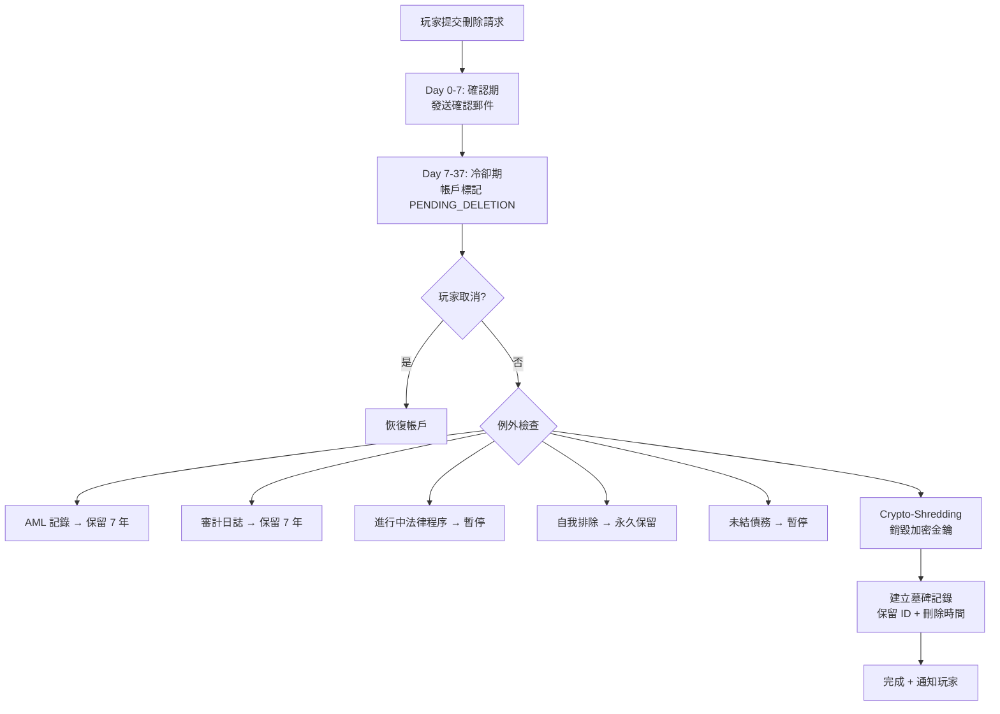
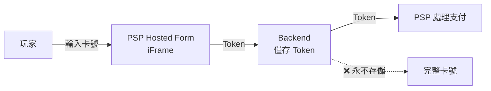

# 第 13 章：安全合規技術架構

## 13.1 模組概述

本章涵蓋平台安全技術實作：GDPR 資料主體權利、PCI-DSS Level 1 合規、PII 加密與遮罩、零信任架構、ISO 27001:2022 控制措施、會話安全及 MITM 防護。

---

## 13.2 GDPR 技術實作

### 資料主體權利 API

| 權利 | 端點 | SLA |
|------|------|-----|
| 存取 (Access) | GET /api/v1/gdpr/data-export/{playerId} | 30 天 |
| 更正 (Rectification) | PUT /api/v1/gdpr/rectify/{playerId} | 72 hr |
| 刪除 (Erasure) | POST /api/v1/gdpr/erasure-request/{playerId} | 37 天 |
| 可攜性 (Portability) | GET /api/v1/gdpr/portable-export/{playerId} | 30 天 |
| 反對 (Objection) | POST /api/v1/gdpr/object/{playerId} | 即時 |

### 37 天刪除流程



### GDPR vs AML 衝突解決服務

> **業務規則來源**: Ch13 需求 §13.2 GDPR vs AML 衝突解決優先級

```java
@Service
@RequiredArgsConstructor
public class GdprDeletionService {

    private final AmlInvestigationRepository amlRepo;
    private final LegalHoldRepository legalRepo;
    private final DebtRepository debtRepo;
    private final SelfExclusionRepository seRepo;
    private final CryptoShredder cryptoShredder;
    private final AuditLogService auditLog;
    private final NotificationService notificationService;

    /**
     * GDPR deletion orchestrator with AML conflict resolution.
     * Priority hierarchy (requirements §13.2):
     *   1. AML investigation active → SUSPEND deletion (AMLD/POCA > GDPR)
     *   2. AML investigation ended → resume deletion within 30 days
     *   3. AML data retention → anonymize PII, keep transaction records 5-7 years
     *   4. All suspend/resume actions logged to compliance audit trail
     */
    @Transactional
    public DeletionResult processDeletion(Long tenantId, Long playerId) {

        List<DeletionHold> holds = checkAllHolds(tenantId, playerId);

        if (!holds.isEmpty()) {
            // Suspend deletion — notify player without revealing investigation details
            DeletionRequest request = suspendDeletion(tenantId, playerId, holds);

            // Per GDPR: notify player that deletion is suspended for legal reasons
            // CRITICAL: Must NOT reveal AML investigation details
            notificationService.sendPlayerNotice(playerId,
                "因法律要求暫時無法處理您的刪除請求。法律要求解除後將自動恢復處理。");

            auditLog.logCompliance(tenantId, playerId, "GDPR_DELETION_SUSPENDED",
                Map.of("holds", holds.stream().map(DeletionHold::getType).toList()));

            return DeletionResult.suspended(holds);
        }

        // No holds — proceed with crypto-shredding
        cryptoShredder.shredPlayerData(tenantId, playerId);

        return DeletionResult.completed();
    }

    /**
     * Check all 5 deletion exception categories.
     */
    private List<DeletionHold> checkAllHolds(Long tenantId, Long playerId) {
        List<DeletionHold> holds = new ArrayList<>();

        // 1. Active AML investigation (AMLD > GDPR)
        if (amlRepo.hasActiveInvestigation(tenantId, playerId)) {
            holds.add(new DeletionHold("AML_INVESTIGATION",
                "Active AML investigation", Duration.ofDays(365)));
        }

        // 2. Active legal proceedings
        if (legalRepo.hasActiveLegalHold(tenantId, playerId)) {
            holds.add(new DeletionHold("LEGAL_PROCEEDINGS",
                "Active legal proceedings", null)); // Until proceedings end
        }

        // 3. Self-exclusion record (permanent retention)
        if (seRepo.isExcluded(tenantId, playerId)) {
            holds.add(new DeletionHold("SELF_EXCLUSION",
                "Self-exclusion record — permanent retention", null));
        }

        // 4. Outstanding debt
        BigDecimal debt = debtRepo.getOutstandingDebt(tenantId, playerId);
        if (debt.compareTo(BigDecimal.ZERO) > 0) {
            holds.add(new DeletionHold("OUTSTANDING_DEBT",
                "Balance: " + debt, Duration.ofDays(90)));
        }

        // 5. Tax audit period
        if (legalRepo.hasTaxAuditHold(tenantId, playerId)) {
            holds.add(new DeletionHold("TAX_AUDIT",
                "Under tax audit retention", Duration.ofDays(2555))); // ~7 years
        }

        return holds;
    }

    /**
     * Scheduled: resume suspended deletions when AML investigation ends.
     * Runs daily. Per requirements: resume within 30 days of investigation close.
     */
    @Scheduled(cron = "0 0 3 * * *") // Daily 03:00
    public void resumeSuspendedDeletions() {
        List<DeletionRequest> suspended = deletionRequestRepo
            .findByStatus("SUSPENDED");

        for (DeletionRequest req : suspended) {
            List<DeletionHold> currentHolds = checkAllHolds(
                req.getTenantId(), req.getPlayerId());

            if (currentHolds.isEmpty()) {
                // All holds lifted → resume deletion
                cryptoShredder.shredPlayerData(req.getTenantId(), req.getPlayerId());
                req.setStatus("COMPLETED");
                req.setCompletedAt(Instant.now());
                deletionRequestRepo.save(req);

                auditLog.logCompliance(req.getTenantId(), req.getPlayerId(),
                    "GDPR_DELETION_RESUMED_AND_COMPLETED", null);
            }
        }
    }
}
```

### Crypto-Shredding 實作

```java
@Component
@RequiredArgsConstructor
public class CryptoShredder {

    private final KeyManagementService kms;
    private final PlayerDao playerDao;
    private final AuditLogService auditLog;

    @Transactional(rollbackFor = Throwable.class)
    public void shredPlayerData(Long tenantId, Long playerId) {
        // 1. 取得玩家專屬加密金鑰 ID
        String keyId = playerDao.getEncryptionKeyId(tenantId, playerId);

        // 2. 銷毀 KMS 中的加密金鑰
        kms.scheduleKeyDeletion(keyId, 7); // 7 天等待期

        // 3. 清除明文欄位 (保留 tombstone)
        playerDao.anonymize(tenantId, playerId);

        // 4. Anonymize AML transaction records (keep 5-7 years, PII removed)
        playerDao.anonymizeTransactionRecords(tenantId, playerId);

        // 5. 建立墓碑記錄
        playerDao.createTombstone(tenantId, playerId, Instant.now());

        // 6. 審計日誌
        auditLog.log(tenantId, playerId, "GDPR_ERASURE_COMPLETED");
    }
}
```

### 5 種刪除例外

| 例外 | 保留期限 | 法規依據 |
|------|---------|---------|
| AML 交易記錄 | 5–7 年 | AMLD5 |
| 審計日誌 | 7 年 | 牌照要求 |
| 進行中法律程序 | 程序結束 | 法院命令 |
| 自我排除記錄 | 永久 | GamStop/OASIS |
| 未結債務 | 債務清償 | 合約義務 |

### 資料保留矩陣

| 資料類別 | 活躍期 | 關閉後 | 法規 |
|---------|--------|--------|------|
| PII (姓名、地址) | 帳戶存續期 | 刪除或匿名化 | GDPR Art.17 |
| KYC 文件 | 帳戶存續期 | 5 年 | AMLD5 |
| 交易記錄 | 帳戶存續期 | 7 年 | 牌照要求 |
| 遊戲歷史 | 3 年 (明細) | 匿名化聚合 | 牌照要求 |
| 行銷同意 | 同意存續期 | 刪除 | GDPR Art.7 |
| 審計日誌 | 7 年 | 7 年 | ISO 27001 |

---

## 13.3 PCI-DSS Level 1 合規

### Tokenization 架構



### 合規要點

| 要求 | 實作 |
|------|------|
| 卡號不落地 | PSP Hosted Form (iFrame) |
| Token 化 | PSP 回傳 token，平台僅存 token + last4 |
| 全 PAN 禁存 | 無任何系統存儲完整卡號 |
| 季度掃描 | Qualys ASV 外部漏洞掃描 |
| 年度稽核 | QSA 現場 Level 1 評估 |
| 日誌監控 | PCI CDE 環境獨立日誌 + 即時告警 |

---

## 13.4 PII 加密架構

### 加密方式

| 層級 | 方式 | 用途 |
|------|------|------|
| 傳輸加密 | TLS 1.3 | 所有 API 通訊 |
| 靜態加密 | AES-256-GCM | 資料庫 PII 欄位 |
| 密碼雜湊 | Argon2id | 玩家密碼 |
| 欄位級加密 | AES-256-GCM + per-player key | 敏感 PII |
| 金鑰管理 | AWS KMS | 主金鑰 + 資料金鑰 |

### 加密欄位

```sql
-- PII 欄位加密存儲結構
CREATE TABLE t_player_pii (
    player_id       BIGINT PRIMARY KEY,
    tenant_id       BIGINT NOT NULL,
    email_encrypted BYTEA NOT NULL,         -- AES-256-GCM
    email_blind_idx VARCHAR(64) NOT NULL,   -- HMAC-SHA256 (可搜尋)
    phone_encrypted BYTEA,
    phone_blind_idx VARCHAR(64),
    name_encrypted  BYTEA,
    id_doc_encrypted BYTEA,
    address_encrypted BYTEA,
    encryption_key_id VARCHAR(64) NOT NULL, -- KMS data key reference
    created_at      TIMESTAMP NOT NULL DEFAULT NOW(),
    updated_at      TIMESTAMP NOT NULL DEFAULT NOW()
);

CREATE UNIQUE INDEX idx_player_email_blind ON t_player_pii(tenant_id, email_blind_idx);
CREATE INDEX idx_player_phone_blind ON t_player_pii(tenant_id, phone_blind_idx);
```

### Blind Index 搜尋

```java
// 透過 Blind Index 搜尋加密 PII (不需解密)
@Component
@RequiredArgsConstructor
public class PlayerPiiSearchManager {

    private final BlindIndexService blindIndex;
    private final PlayerPiiDao playerPiiDao;
    private final EncryptionService encryption;

    public Option<PlayerPiiVO> findByEmail(Long tenantId, String email) {
        // 1. 計算 blind index
        String emailBlindIdx = blindIndex.compute("email", email);

        // 2. 透過 blind index 查詢
        return Option.of(playerPiiDao.findByEmailBlindIdx(tenantId, emailBlindIdx))
                // 3. 解密返回
                .map(entity -> encryption.decryptPlayerPii(entity));
    }
}
```

### 角色遮罩矩陣

| 欄位 | Super Admin | Risk | CS Agent | Agent |
|------|-------------|------|----------|-------|
| Email | Full | Full | j***@e***.com | *** |
| Phone | Full | Full | ****1234 | *** |
| 姓名 | Full | Full | J*** D*** | *** |
| 身分證 | Full | 核准後 | *** | *** |
| 銀行帳號 | Full | *** | *** | *** |
| 地址 | Full | Full | 城市+國家 | *** |
| IP | Full | Full | Full | *** |

遮罩在 Service 層透過 `@PiiMask(level)` 註解實施。

---

## 13.5 零信任架構

### 原則

```
1. 永不信任，始終驗證 (Never trust, always verify)
2. 最小權限原則 (Least privilege)
3. 假設已被入侵 (Assume breach)
```

### 實作層次

| 層次 | 技術 |
|------|------|
| 網路 | Service Mesh (Istio) + mTLS |
| 身份 | JWT + MFA + Device Fingerprint |
| 裝置 | FingerprintJS (65K+ data points, 99.5% accuracy) |
| 應用 | RBAC + 屬性型存取控制 |
| 資料 | 欄位級加密 + Blind Index |

### Service Mesh (Istio)

```yaml
apiVersion: security.istio.io/v1beta1
kind: PeerAuthentication
metadata:
  name: default
  namespace: igaming-prod
spec:
  mtls:
    mode: STRICT  # 所有服務間通訊強制 mTLS
```

---

## 13.6 會話安全

### 會話綁定

```java
@Component
public class SessionBindingFilter extends OncePerRequestFilter {

    @Override
    protected void doFilterInternal(HttpServletRequest request,
                                     HttpServletResponse response,
                                     FilterChain chain) {
        String sessionDeviceFingerprint = getSessionAttribute("device_fingerprint");
        String currentFingerprint = request.getHeader("X-Device-Fingerprint");

        if (sessionDeviceFingerprint != null
                && !sessionDeviceFingerprint.equals(currentFingerprint)) {
            // 裝置指紋不匹配 → 強制登出
            SecurityContextHolder.clearContext();
            response.setStatus(HttpServletResponse.SC_UNAUTHORIZED);
            return;
        }

        chain.doFilter(request, response);
    }
}
```

### 會話管理策略

| 策略 | 規則 |
|------|------|
| 單裝置登入 | Player 預設單一活躍會話 |
| 並行登入 | Admin 允許最多 2 個會話 |
| 閒置超時 | Player 30min / Admin 15min |
| 絕對超時 | Player 24hr / Admin 8hr |
| Token Rotation | 每次 Refresh 產生新 token pair |

---

## 13.7 MITM 防護

### 六大威脅與對策

| 威脅 | 對策 |
|------|------|
| SSL Stripping | HSTS header + preload list |
| Certificate Spoofing | Certificate Pinning (Mobile) |
| DNS Spoofing | DNSSEC + DNS over HTTPS |
| ARP Spoofing | 伺服器端 N/A，用戶端教育 |
| Replay Attack | Nonce + Timestamp (5min tolerance) |
| Man-in-the-Browser | CSP header + SRI (Subresource Integrity) |

### HTTP 安全標頭

```
Strict-Transport-Security: max-age=31536000; includeSubDomains; preload
Content-Security-Policy: default-src 'self'; script-src 'self' 'nonce-{random}'; style-src 'self' 'unsafe-inline'
X-Content-Type-Options: nosniff
X-Frame-Options: DENY
Referrer-Policy: strict-origin-when-cross-origin
Permissions-Policy: camera=(), microphone=(), geolocation=()
```

---

## 13.8 ISO 27001:2022 關鍵控制

| 控制項 | 編號 | 實作 |
|--------|------|------|
| 資產管理 | A.5.9 | CMDB + 自動發現 |
| 存取控制 | A.5.15 | RBAC + MFA + IP 限制 |
| 密碼學 | A.8.24 | AES-256-GCM + KMS |
| 安全開發 | A.8.25 | SAST/DAST + 依賴掃描 |
| 事件管理 | A.5.24 | SIEM + 自動告警 |
| 業務連續 | A.5.30 | DR 三級方案 |
| 供應商管理 | A.5.19 | 年度供應商安全評估 |
| 日誌監控 | A.8.15 | 集中日誌 + 7 年保留 |
| 漏洞管理 | A.8.8 | 每週掃描 + 30 天修復 SLA |
| 人員安全 | A.6.1 | 背景調查 + 安全培訓 |

---

## 13.9 UK RTS Section 4 合規

| 要求 | 實作 |
|------|------|
| 資金隔離 | 玩家資金獨立信託帳戶 |
| 帳戶保護 | MFA 強制 (提款 + 設定變更) |
| 安全通訊 | 對外 TLS 1.2+ / 內部 TLS 1.3 (見 §13.12) |
| 存取控制 | 角色型 + 最小權限 |
| 審計追蹤 | 所有操作可追溯 |
| 系統韌性 | DR + 定期演練 |

---

## 13.10 安全監控

```yaml
# SIEM 告警規則
rules:
  - name: brute_force_login
    condition: "failed_login_count > 10 in 5min from same IP"
    severity: HIGH
    action: block_ip + alert_security

  - name: privilege_escalation
    condition: "role_change without approval_ticket"
    severity: CRITICAL
    action: revert + alert_security + lock_account

  - name: data_exfiltration
    condition: "bulk_export > 10000 records in 1hr"
    severity: HIGH
    action: throttle + alert_security

  - name: impossible_travel
    condition: "login from 2 countries < 2hr apart"
    severity: MEDIUM
    action: mfa_challenge + alert_risk
```

---

## 13.11 加密金鑰輪替作業 (Key Rotation Job)

> **業務規則來源**: Ch13 需求 §13.4 加密金鑰輪替策略

### 輪替週期彙總

| 金鑰類型 | 輪替週期 | 方式 | 雙金鑰共存 |
|---------|---------|------|-----------|
| Master Key (KEK) | 365 天 | 手動，CISO + CTO 雙人審批 | 是 |
| Per-Player DEK | 90 天 | 自動批次 | 是 |
| Blind Index Salt | 180 天 | 批次重建，低峰窗口 | 是 |
| TLS 證書 | 90 天 | 自動 (Let's Encrypt / ACM) | N/A |

### Per-Player DEK Rotation Job

```java
@Service
@RequiredArgsConstructor
public class DekRotationJob {

    private static final int BATCH_SIZE = 1000;
    private static final Duration DEK_ROTATION_INTERVAL = Duration.ofDays(90);
    private static final double FAILURE_THRESHOLD = 0.001; // 0.1%

    private final KeyManagementService kms;
    private final PlayerPiiDao playerPiiDao;
    private final EncryptionService encryption;
    private final AuditLogService auditLog;
    private final MetricsService metrics;

    /**
     * Scheduled DEK rotation: runs daily at 03:00.
     * Processes players whose DEK is older than 90 days.
     * Batch size: 1000 records per batch.
     * Dual-key mode: old + new key both valid during transition.
     */
    @Scheduled(cron = "0 0 3 * * *")
    public void rotateDeks() {
        Instant cutoff = Instant.now().minus(DEK_ROTATION_INTERVAL);
        long totalEligible = playerPiiDao.countByKeyOlderThan(cutoff);
        long processed = 0;
        long failed = 0;

        log.info("DEK rotation started: {} players eligible", totalEligible);

        while (processed < totalEligible) {
            List<PlayerPii> batch = playerPiiDao
                .findByKeyOlderThan(cutoff, PageRequest.of(0, BATCH_SIZE));

            if (batch.isEmpty()) break;

            for (PlayerPii player : batch) {
                try {
                    rotatePlayerDek(player);
                    processed++;
                } catch (Exception e) {
                    failed++;
                    log.error("DEK rotation failed for player {}: {}",
                        player.getPlayerId(), e.getMessage());
                    metrics.incrementCounter("dek_rotation_failure");

                    // Check failure threshold
                    if (processed > 0 && (double) failed / processed > FAILURE_THRESHOLD) {
                        log.error("DEK rotation aborted: failure rate {:.2f}% exceeds threshold",
                            (double) failed / processed * 100);
                        auditLog.log(0L, 0L, "DEK_ROTATION_ABORTED",
                            Map.of("processed", processed, "failed", failed,
                                "failureRate", (double) failed / processed));
                        alertService.sendCritical("DEK rotation aborted: failure rate exceeded");
                        return;
                    }
                }
            }

            // Configurable inter-batch delay (default 100ms)
            sleep(rotationConfig.getBatchIntervalMs());
        }

        auditLog.log(0L, 0L, "DEK_ROTATION_COMPLETED",
            Map.of("processed", processed, "failed", failed));
        metrics.recordGauge("dek_rotation_progress", 100.0);
    }

    /**
     * Rotate single player's DEK.
     * Dual-key mode: both old and new DEK valid until re-encryption completes.
     */
    @Transactional
    private void rotatePlayerDek(PlayerPii player) {
        String oldKeyId = player.getEncryptionKeyId();

        // 1. Generate new DEK via KMS
        String newKeyId = kms.generateDataKey(player.getTenantId(), player.getPlayerId());

        // 2. Decrypt with old key, re-encrypt with new key
        byte[] emailPlain = encryption.decrypt(player.getEmailEncrypted(), oldKeyId);
        byte[] phonePlain = player.getPhoneEncrypted() != null
            ? encryption.decrypt(player.getPhoneEncrypted(), oldKeyId) : null;
        byte[] namePlain = player.getNameEncrypted() != null
            ? encryption.decrypt(player.getNameEncrypted(), oldKeyId) : null;
        byte[] idDocPlain = player.getIdDocEncrypted() != null
            ? encryption.decrypt(player.getIdDocEncrypted(), oldKeyId) : null;
        byte[] addressPlain = player.getAddressEncrypted() != null
            ? encryption.decrypt(player.getAddressEncrypted(), oldKeyId) : null;

        player.setEmailEncrypted(encryption.encrypt(emailPlain, newKeyId));
        if (phonePlain != null) player.setPhoneEncrypted(encryption.encrypt(phonePlain, newKeyId));
        if (namePlain != null) player.setNameEncrypted(encryption.encrypt(namePlain, newKeyId));
        if (idDocPlain != null) player.setIdDocEncrypted(encryption.encrypt(idDocPlain, newKeyId));
        if (addressPlain != null) player.setAddressEncrypted(encryption.encrypt(addressPlain, newKeyId));

        // 3. Update key reference
        player.setEncryptionKeyId(newKeyId);
        player.setUpdatedAt(Instant.now());
        playerPiiDao.save(player);

        // 4. Schedule old key for deferred deletion (7 days grace for rollback)
        kms.scheduleKeyDeletion(oldKeyId, 7);

        metrics.incrementCounter("dek_rotation_success");
    }
}
```

### Blind Index Salt Rotation

```java
@Service
public class BlindIndexRotationJob {

    /**
     * Blind Index Salt rotation (180 days).
     * Must rebuild ALL blind indices — scheduled in low-traffic window.
     * Dual-salt mode: queries check both old and new index during transition.
     */
    @Scheduled(cron = "0 0 2 1 */6 *") // Every 6 months, 1st day, 02:00
    public void rotateSalt() {
        String oldSalt = blindIndexService.getCurrentSalt();
        String newSalt = blindIndexService.generateNewSalt();

        // Enable dual-index mode: queries check both old and new blind index
        blindIndexService.enableDualIndexMode(oldSalt, newSalt);

        // Rebuild all blind indices in batches
        long total = playerPiiDao.count();
        long processed = 0;

        while (processed < total) {
            List<PlayerPii> batch = playerPiiDao.findAll(
                PageRequest.of((int)(processed / BATCH_SIZE), BATCH_SIZE));

            for (PlayerPii player : batch) {
                // Decrypt and recompute blind indices with new salt
                String emailPlain = encryption.decryptToString(
                    player.getEmailEncrypted(), player.getEncryptionKeyId());
                String newEmailIdx = blindIndexService.compute("email", emailPlain, newSalt);
                player.setEmailBlindIdx(newEmailIdx);

                if (player.getPhoneEncrypted() != null) {
                    String phonePlain = encryption.decryptToString(
                        player.getPhoneEncrypted(), player.getEncryptionKeyId());
                    player.setPhoneBlindIdx(
                        blindIndexService.compute("phone", phonePlain, newSalt));
                }

                playerPiiDao.save(player);
                processed++;
            }

            sleep(rotationConfig.getBatchIntervalMs());
        }

        // Disable dual-index mode, activate new salt only
        blindIndexService.activateNewSalt(newSalt);
        blindIndexService.disableDualIndexMode();

        auditLog.log(0L, 0L, "BLIND_INDEX_SALT_ROTATED",
            Map.of("records_rebuilt", processed));
    }
}
```

---

## 13.12 TLS 分層策略

> **業務規則來源**: Ch13 需求 §13.5 控制項 8.20

### TLS 版本分離

| 流量類型 | 最低 TLS 版本 | 原因 |
|---------|-------------|------|
| **對外 API** (玩家、GP、PSP) | TLS 1.2+ | 相容舊版設備 (iOS 12-, Android 7-) |
| **內部服務間** (Service Mesh) | TLS 1.3 only | 最高安全性，無需相容性考量 |
| **管理後台** (Admin Portal) | TLS 1.3 only | 可控環境，強制現代瀏覽器 |

### Istio Service Mesh 配置 (內部 TLS 1.3)

```yaml
apiVersion: networking.istio.io/v1beta1
kind: DestinationRule
metadata:
  name: internal-tls-strict
  namespace: igaming-prod
spec:
  host: "*.igaming-prod.svc.cluster.local"
  trafficPolicy:
    tls:
      mode: ISTIO_MUTUAL
      # Internal: TLS 1.3 only
      minProtocolVersion: TLSV1_3
```

### Nginx Ingress 配置 (對外 TLS 1.2+)

```nginx
# External-facing API gateway
server {
    listen 443 ssl http2;
    server_name api.example.com;

    # External: TLS 1.2+ for legacy device compatibility
    ssl_protocols TLSv1.2 TLSv1.3;
    ssl_ciphers ECDHE-ECDSA-AES256-GCM-SHA384:ECDHE-RSA-AES256-GCM-SHA384:ECDHE-ECDSA-CHACHA20-POLY1305;
    ssl_prefer_server_ciphers on;

    # HSTS with preload
    add_header Strict-Transport-Security "max-age=31536000; includeSubDomains; preload" always;
}
```

```nginx
# Admin portal — TLS 1.3 only
server {
    listen 443 ssl http2;
    server_name admin.example.com;

    # Admin: TLS 1.3 only — controlled environment
    ssl_protocols TLSv1.3;
    ssl_ciphers TLS_AES_256_GCM_SHA384:TLS_CHACHA20_POLY1305_SHA256;
}
```

### TLS 監控

```yaml
# Prometheus alerting for TLS version usage
- alert: TLS12HighTraffic
  expr: |
    sum(rate(nginx_ssl_handshakes_total{protocol="TLSv1.2"}[1h]))
    / sum(rate(nginx_ssl_handshakes_total[1h])) > 0.3
  for: 7d
  labels:
    severity: info
  annotations:
    summary: ">30% traffic still using TLS 1.2 — review device compatibility timeline"
```

---

## 13.13 對應業務文檔

> 業務需求請參考 [requirements/13_Security_Compliance_安全合規.md](../requirements/13_Security_Compliance_安全合規.md)

**v2.1 新增/變更清單**:
- §13.2 GDPR: 新增 GdprDeletionService (GDPR vs AML 衝突解決 4 步驟優先級)
- §13.2 CryptoShredder: 新增 AML 交易記錄匿名化步驟
- §13.11 加密金鑰輪替: DEK Rotation Job (90天週期, batch 1000, 0.1% 失敗率熔斷) + Blind Index Salt Rotation (180天)
- §13.12 TLS 分層: 對外 TLS 1.2+ / 內部 TLS 1.3 / Admin TLS 1.3, Istio + Nginx 配置
