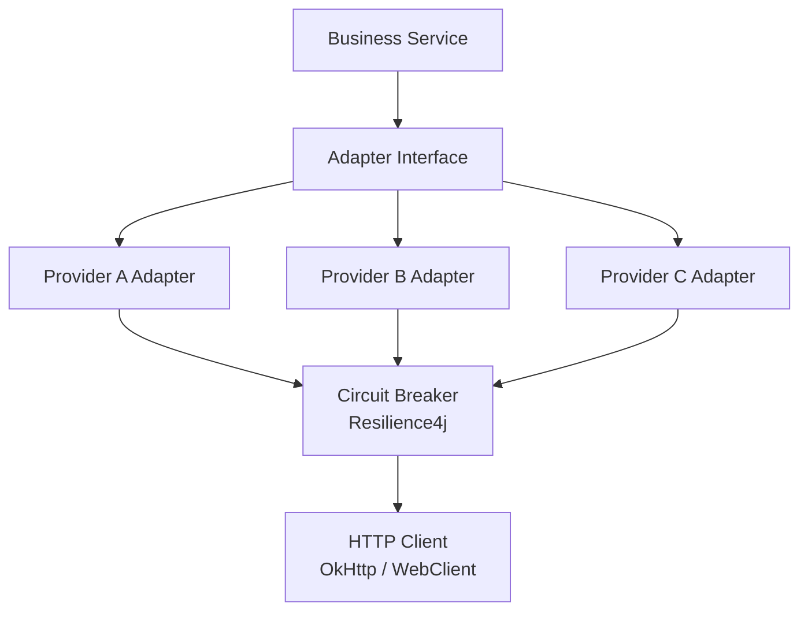
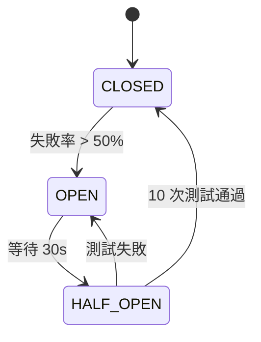
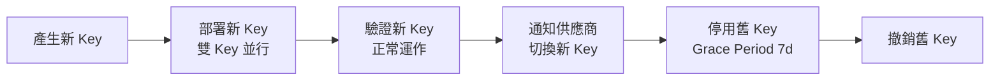

# 第 14 章：第三方整合技術架構

## 14.1 模組概述

本章定義第三方服務整合的技術標準：統一 Adapter 模式、熔斷與降級機制、Webhook 重試策略、API Key 管理及供應商監控。所有外部整合透過 Adapter 抽象層隔離，確保可替換性。

---

## 14.2 統一 Adapter 架構

### 設計模式



### Adapter 介面定義

```java
// 通用 Adapter 介面
public interface ThirdPartyAdapter<REQ, RES> {
    String getProviderCode();
    RES execute(REQ request) throws AdapterException;
    boolean healthCheck();
}

// PSP Adapter 範例
public interface PspAdapter extends ThirdPartyAdapter<PaymentRequest, PaymentResponse> {
    PaymentResponse deposit(DepositRequest request);
    PaymentResponse withdraw(WithdrawalRequest request);
    TransactionStatus queryStatus(String transactionId);
    void handleWebhook(WebhookPayload payload);
}

// Game Provider Adapter
public interface GameProviderAdapter extends ThirdPartyAdapter<GameRequest, GameResponse> {
    AuthResult authenticate(String token, String gameCode);
    DebitResult debit(DebitRequest request);
    CreditResult credit(CreditRequest request);
    RollbackResult rollback(RollbackRequest request);
    BigDecimal getBalance(String playerId);
}
```

### Adapter 工廠

```java
@Component
@RequiredArgsConstructor
public class AdapterFactory {

    private final Map<String, PspAdapter> pspAdapters;
    private final Map<String, GameProviderAdapter> gpAdapters;

    public PspAdapter getPspAdapter(String providerCode) {
        return Option.of(pspAdapters.get(providerCode))
            .getOrElseThrow(() -> new AdapterNotFoundException(providerCode));
    }

    public GameProviderAdapter getGpAdapter(String providerCode) {
        return Option.of(gpAdapters.get(providerCode))
            .getOrElseThrow(() -> new AdapterNotFoundException(providerCode));
    }
}
```

---

## 14.3 熔斷與降級 (Resilience4j)

### 設定

```yaml
resilience4j:
  circuitbreaker:
    instances:
      psp-nuvei:
        slidingWindowType: COUNT_BASED
        slidingWindowSize: 100
        failureRateThreshold: 50
        slowCallRateThreshold: 80
        slowCallDurationThreshold: 5s
        waitDurationInOpenState: 30s
        permittedNumberOfCallsInHalfOpenState: 10
        minimumNumberOfCalls: 20
      gp-pragmatic:
        slidingWindowSize: 50
        failureRateThreshold: 60
        waitDurationInOpenState: 60s

  retry:
    instances:
      psp-default:
        maxAttempts: 3
        waitDuration: 1s
        exponentialBackoffMultiplier: 2
        retryExceptions:
          - java.net.SocketTimeoutException
          - java.net.ConnectException

  timelimiter:
    instances:
      psp-default:
        timeoutDuration: 10s
      gp-default:
        timeoutDuration: 5s
```

### 熔斷狀態機



### 降級策略

| 服務類型 | 降級優先級 | 降級行為 |
|---------|-----------|---------|
| 支付 (PSP) | Level 1 (最高) | 切換至備用 PSP |
| 遊戲供應商 | Level 2 | 暫停該 GP 遊戲，顯示維護中 |
| KYC 供應商 | Level 3 | 排隊等待恢復 |
| 行銷平台 | Level 4 | 跳過，不影響核心功能 |
| 數據分析 | Level 5 (最低) | 延後處理 |

---

## 14.4 Webhook 處理

### 接收架構

```java
@RestController
@RequestMapping("/api/v1/webhooks")
@RequiredArgsConstructor
public class WebhookController {

    private final WebhookVerifier verifier;
    private final WebhookProcessor processor;

    @PostMapping("/{providerCode}")
    public ResponseEntity<String> receive(
            @PathVariable String providerCode,
            @RequestBody String rawBody,
            @RequestHeader Map<String, String> headers) {

        // 1. 簽名驗證
        if (!verifier.verify(providerCode, rawBody, headers)) {
            return ResponseEntity.status(401).body("Invalid signature");
        }

        // 2. 冪等檢查 (aligned with Requirements §14.4)
        // PSP/GP 整合強制要求 idempotency_key，缺少則 400
        String idempotencyKey = headers.get("X-Idempotency-Key");
        if (idempotencyKey == null || idempotencyKey.isBlank()) {
            return ResponseEntity.badRequest().body("Missing X-Idempotency-Key header");
        }
        // Redis SET + TTL 24h 去重
        if (processor.isDuplicate(idempotencyKey)) {
            return ResponseEntity.ok(processor.getCachedResult(idempotencyKey));
        }

        // 3. 非同步處理 (快速回應 200)
        processor.enqueue(providerCode, webhookId, rawBody);
        return ResponseEntity.ok("Accepted");
    }
}
```

### 重試策略 (出站 Webhook)

| 嘗試次數 | 延遲 | 累計時間 |
|---------|------|---------|
| 1st | 即時 | 0s |
| 2nd | 30s | 30s |
| 3rd | 2 min | 2.5 min |
| 4th | 10 min | 12.5 min |
| 5th | 30 min | 42.5 min |
| 6th | 2 hr | 2 hr 42.5 min |
| 失敗 | → DLQ | 人工介入 |

指數退避公式：`delay = min(baseDelay × 2^(attempt-1), maxDelay)`

### DLQ 處理

```
Webhook 失敗 (6 次) → igaming.webhook.dlq
                       ↓
                 DLQ Consumer (每 5 min)
                       ↓
                 重試 or 告警 + 人工處理
```

### Webhook 簽名版本協商 (aligned with Requirements §14.5)

支援漸進式簽名演算法升級，確保零停機過渡：

```java
@Component
public class WebhookSignatureVerifier {

    /** 支援的簽名版本 */
    private static final Map<String, SignatureAlgorithm> ALGORITHMS = Map.of(
        "v1", new HmacSha256Algorithm(),
        "v2", new HmacSha512Algorithm()  // 未來升級
    );

    /**
     * 驗證 Webhook 簽名，支援版本協商。
     * Header: X-Signature-Version: v1 (或 v2)
     * 過渡期 (90 天): 同時接受 v1 和 v2
     */
    public boolean verify(String providerCode, String rawBody, Map<String, String> headers) {
        String signatureVersion = headers.getOrDefault("X-Signature-Version", "v1");
        String signature = headers.get("X-Webhook-Signature");

        if (signature == null) return false;

        // 嘗試指定版本
        SignatureAlgorithm algorithm = ALGORITHMS.get(signatureVersion);
        if (algorithm != null && algorithm.verify(getSecret(providerCode), rawBody, signature)) {
            return true;
        }

        // 過渡期: 如果指定版本失敗，嘗試其他版本
        if (isInTransitionPeriod(providerCode)) {
            for (var entry : ALGORITHMS.entrySet()) {
                if (!entry.getKey().equals(signatureVersion)) {
                    if (entry.getValue().verify(getSecret(providerCode), rawBody, signature)) {
                        // 記錄版本不匹配 (監控用)
                        metrics.counter("webhook.signature.version_fallback",
                            "provider", providerCode,
                            "expected", signatureVersion,
                            "actual", entry.getKey()).increment();
                        return true;
                    }
                }
            }
        }

        return false;
    }

    /** 過渡期: 新版發布後 90 天內 */
    private boolean isInTransitionPeriod(String providerCode) {
        Instant v2ActivatedAt = signatureConfigRepo
            .getVersionActivationDate(providerCode, "v2");
        if (v2ActivatedAt == null) return false;
        return Instant.now().isBefore(v2ActivatedAt.plus(90, ChronoUnit.DAYS));
    }
}
```

**自動回退**: 若 v2 驗證失敗率 > 1% (5 分鐘滾動窗口)，自動回退至 v1 並發送告警。

### PSP 自動備援路由 (aligned with Requirements §14.3)

```java
@Service
@RequiredArgsConstructor
public class PspRoutingService {

    private final Map<String, PspAdapter> pspAdapters;
    private final CircuitBreakerRegistry circuitBreakerRegistry;
    private final AtomicInteger trafficWeight = new AtomicInteger(0); // 恢復流量百分比

    /**
     * 智能 PSP 路由: 主 PSP 熔斷時自動切換至備用
     */
    public PspAdapter getActivePsp(String tenantId) {
        TenantPspConfig config = tenantConfigService.getPspConfig(tenantId);
        String primaryCode = config.getPrimaryPsp();
        String backupCode = config.getBackupPsp();

        CircuitBreaker primaryCb = circuitBreakerRegistry.circuitBreaker(primaryCode);

        if (primaryCb.getState() == CircuitBreaker.State.OPEN) {
            // 主 PSP 熔斷 → 路由至備用 (< 30 秒切換)
            log.warn("Primary PSP {} circuit OPEN, routing to backup {}", primaryCode, backupCode);
            return pspAdapters.get(backupCode);
        }

        if (primaryCb.getState() == CircuitBreaker.State.HALF_OPEN) {
            // 恢復中 → 漸進式流量回切 (25% → 50% → 100%)
            int weight = trafficWeight.get();
            if (ThreadLocalRandom.current().nextInt(100) < weight) {
                return pspAdapters.get(primaryCode);  // 部分流量回主 PSP
            }
            return pspAdapters.get(backupCode);
        }

        return pspAdapters.get(primaryCode);
    }

    /**
     * 漸進式恢復: 連續 3 次健康檢查通過 → 25% → 50% → 100%
     * 每階段觀察 5 分鐘，成功率 > 99% 才進下一階段
     */
    @Scheduled(fixedRate = 300_000) // 每 5 分鐘
    public void evaluateRecovery() {
        for (var entry : pspAdapters.entrySet()) {
            CircuitBreaker cb = circuitBreakerRegistry.circuitBreaker(entry.getKey());
            if (cb.getState() == CircuitBreaker.State.HALF_OPEN) {
                CircuitBreaker.Metrics m = cb.getMetrics();
                float successRate = m.getSuccessRate();

                int currentWeight = trafficWeight.get();
                if (successRate >= 99.0f) {
                    int newWeight = switch (currentWeight) {
                        case 0 -> 25;
                        case 25 -> 50;
                        case 50 -> 100;
                        default -> 100;
                    };
                    trafficWeight.set(newWeight);
                    log.info("PSP {} recovery: traffic weight {}% → {}%",
                        entry.getKey(), currentWeight, newWeight);

                    if (newWeight == 100) {
                        // 完全恢復
                        trafficWeight.set(0);
                        alertService.sendRecoveryNotice(entry.getKey());
                    }
                } else {
                    // 成功率不足 → 重置，繼續使用備用
                    trafficWeight.set(0);
                    log.warn("PSP {} recovery failed, success rate {}%", entry.getKey(), successRate);
                }
            }
        }
    }
}
```

---

## 14.5 API Key 管理

### Key 類型

| 類型 | 用途 | 輪替週期 | 存儲 |
|------|------|---------|------|
| Master API Key | 內部服務認證 | 90 天 | AWS KMS |
| Provider API Key | PSP/GP 整合 | 依供應商 | Vault + DB |
| Webhook Secret | 簽名驗證 | 180 天 | Vault + DB |
| Encryption Key | 資料加密 | 365 天 | AWS KMS |

### Key 輪替流程



### 資料模型

```sql
CREATE TABLE t_api_key (
    id              BIGSERIAL PRIMARY KEY,
    tenant_id       BIGINT NOT NULL,
    provider_code   VARCHAR(50) NOT NULL,
    key_type        VARCHAR(20) NOT NULL,    -- MASTER, PROVIDER, WEBHOOK, ENCRYPTION
    api_key         VARCHAR(200) NOT NULL,   -- 加密存儲
    secret_key      VARCHAR(200) NOT NULL,   -- 加密存儲
    ip_whitelist    JSONB,
    status          VARCHAR(20) NOT NULL,    -- ACTIVE, DEPRECATED, REVOKED
    expires_at      TIMESTAMP,
    rotated_at      TIMESTAMP,
    created_at      TIMESTAMP NOT NULL DEFAULT NOW(),
    CONSTRAINT uk_api_key UNIQUE (tenant_id, provider_code, key_type, status)
);
```

### API Key 自動輪替 Job (aligned with Requirements §14.5)

```java
@Component
public class ApiKeyRotationJob {

    /** 每日 04:00 檢查即將過期的 API Key */
    @Scheduled(cron = "0 0 4 * * ?")
    public void rotateExpiringKeys() {
        // 查詢 7 天內到期的 ACTIVE key
        List<ApiKey> expiringKeys = apiKeyRepository
            .findByStatusAndExpiresAtBefore("ACTIVE",
                Instant.now().plus(7, ChronoUnit.DAYS));

        for (ApiKey oldKey : expiringKeys) {
            try {
                // Step 1: 產生新 Key (Vault + DB)
                ApiKey newKey = generateNewKey(oldKey);
                newKey.setStatus("ACTIVE");
                apiKeyRepository.save(newKey);

                // Step 2: 雙 Key 並行 — 舊 key 改為 DEPRECATED (7 天 grace period)
                oldKey.setStatus("DEPRECATED");
                oldKey.setDeprecatedAt(Instant.now());
                apiKeyRepository.save(oldKey);

                // Step 3: 通知供應商切換新 Key (若支援自動)
                if (supportsAutoRotation(oldKey.getProviderCode())) {
                    providerNotificationService.notifyKeyRotation(
                        oldKey.getProviderCode(), newKey);
                } else {
                    // 手動通知 — 發送至管理員
                    alertService.sendKeyRotationReminder(oldKey);
                }

                log.info("API key rotated: provider={}, type={}, oldId={}, newId={}",
                    oldKey.getProviderCode(), oldKey.getKeyType(),
                    oldKey.getId(), newKey.getId());

            } catch (Exception e) {
                log.error("Key rotation failed: {}", oldKey.getId(), e);
                alertService.sendKeyRotationFailure(oldKey);
            }
        }
    }

    /** 清理已過 grace period 的 DEPRECATED key */
    @Scheduled(cron = "0 0 5 * * ?")
    public void revokeDeprecatedKeys() {
        List<ApiKey> deprecated = apiKeyRepository
            .findByStatusAndDeprecatedAtBefore("DEPRECATED",
                Instant.now().minus(7, ChronoUnit.DAYS));

        for (ApiKey key : deprecated) {
            key.setStatus("REVOKED");
            apiKeyRepository.save(key);
            vaultService.revokeKey(key.getVaultPath());
        }
    }
}
```

---

## 14.6 供應商 SLA 監控

### SLA 定義

| 服務類型 | 可用性 | 回應時間 | 錯誤率 |
|---------|--------|---------|--------|
| PSP (支付) | 99.95% | < 3s | < 1% |
| GP (遊戲) | 99.9% | < 2s | < 2% |
| KYC | 99.5% | < 10s | < 5% |
| SMS/Email | 99% | < 5s | < 3% |
| Fraud Detection | 99.9% | < 500ms | < 1% |

### 健康檢查

```java
@Scheduled(fixedRate = 30_000) // 每 30 秒
public void healthCheckAllProviders() {
    adapterRegistry.getAllAdapters().forEach(adapter -> {
        Try.of(() -> adapter.healthCheck())
           .onSuccess(ok -> {
               if (ok) {
                   healthTracker.recordSuccess(adapter.getProviderCode());
                   if (healthTracker.isRecovering(adapter.getProviderCode())) {
                       // 連續 3 次成功 → 恢復
                       if (healthTracker.consecutiveSuccesses(adapter.getProviderCode()) >= 3) {
                           circuitBreakerManager.close(adapter.getProviderCode());
                           alertService.sendRecoveryNotice(adapter.getProviderCode());
                       }
                   }
               }
           })
           .onFailure(e -> {
               healthTracker.recordFailure(adapter.getProviderCode());
               log.warn("Health check failed: {}", adapter.getProviderCode(), e);
           });
    });
}
```

### 恢復偵測

```
健康檢查 (每 30s) → 連續 3 次成功 → 標記恢復中
                                      ↓
                              熔斷器 HALF_OPEN → 流量測試
                                      ↓ (通過)
                              熔斷器 CLOSED → 完全恢復
                                      ↓
                              發送恢復通知
```

---

## 14.7 監控儀表板

### Prometheus 指標

```yaml
igaming_adapter_request_total{provider, method, status}          # Counter
igaming_adapter_request_duration_seconds{provider, method}       # Histogram
igaming_adapter_circuit_state{provider}                          # Gauge (0=CLOSED, 1=OPEN, 2=HALF_OPEN)
igaming_webhook_received_total{provider, event_type}             # Counter
igaming_webhook_retry_total{provider, attempt}                   # Counter
igaming_webhook_dlq_total{provider}                              # Counter
igaming_adapter_health_status{provider}                          # Gauge (0=DOWN, 1=UP)
```

### 告警規則

| 條件 | 嚴重度 | 動作 |
|------|--------|------|
| 供應商熔斷器 OPEN | P1 | 通知 + 切換備用 |
| Webhook DLQ 深度 > 100 | P2 | 通知 + 檢查 |
| 供應商回應 P99 > 5s | P2 | 通知 |
| 供應商錯誤率 > 5% | P1 | 通知 + 準備降級 |
| API Key 即將過期 (7d) | P3 | 通知輪替 |

---

## 14.8 API 端點

| Method | Path | Auth | Description |
|--------|------|------|-------------|
| POST | /api/v1/webhooks/{providerCode} | Signature | 接收供應商 Webhook |
| GET | /api/v1/admin/providers | Admin | 供應商列表 |
| GET | /api/v1/admin/providers/{code}/health | Admin | 供應商健康狀態 |
| POST | /api/v1/admin/providers/{code}/api-keys/rotate | Admin | 輪替 API Key |
| GET | /api/v1/admin/providers/{code}/metrics | Admin | 供應商指標 |

---

## 14.9 對應業務文檔

> 業務需求請參考 [requirements/14_Third_Party_Integration_第三方整合.md](../requirements/14_Third_Party_Integration_第三方整合.md)

---

## 14.10 變更紀錄

### v2.1 (Sprint Sync)

| 項目 | 變更內容 | 需求來源 |
|------|---------|---------|
| §14.4 WebhookController | `X-Webhook-Id` (可選 + SHA256 fallback) → `X-Idempotency-Key` (強制要求，缺少回 400)；Redis SET + TTL 24h 去重 | H-12 Webhook 冪等 |
| §14.4 Webhook 簽名版本協商 | **新增** `WebhookSignatureVerifier` — `X-Signature-Version` header 版本協商、90 天過渡期雙版本接受、v2 失敗率 > 1% 自動回退 | M-12 簽名升級 |
| §14.4 PSP 自動備援路由 | **新增** `PspRoutingService` — 主 PSP 熔斷 < 30s 自動切備用；漸進恢復 25%→50%→100%，每階段 5 分鐘觀察 | H-13 PSP 降級 |
| §14.5 API Key 自動輪替 | **新增** `ApiKeyRotationJob` — 每日 04:00 掃描 7 天內到期 key，自動產生新 key + 雙 key 並行 + 7 天 grace period + 自動撤銷 | M-12 |
