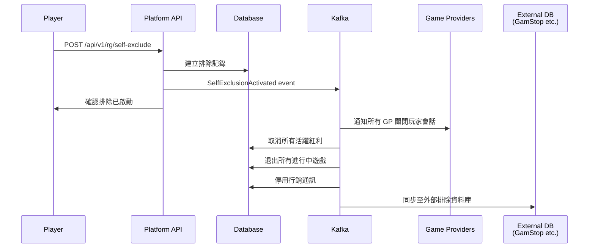

# 第 15 章：負責任博彩技術架構

## 15.1 模組概述

負責任博彩技術架構涵蓋自我排除系統、存款/損失限額管理、會話保護、UKGC 可負擔性評估及行銷限制。本模組橫跨多個服務，透過事件驅動實現即時響應。

---

## 15.2 資料模型

```sql
-- 自我排除記錄
CREATE TABLE t_self_exclusion (
    id              BIGSERIAL PRIMARY KEY,
    tenant_id       BIGINT NOT NULL,
    player_id       BIGINT NOT NULL,
    exclusion_type  VARCHAR(20) NOT NULL,   -- TEMPORARY, MEDIUM, PERMANENT
    source          VARCHAR(30) NOT NULL,   -- SELF, GAMSTOP, OASIS, ROFUS, SPELPAUS, MANUAL
    duration_days   INTEGER,               -- NULL = permanent
    start_date      DATE NOT NULL,
    end_date        DATE,                  -- NULL = permanent
    status          VARCHAR(20) NOT NULL,   -- ACTIVE, EXPIRED, CANCELLED
    external_ref    VARCHAR(100),           -- 外部系統參考號
    reason          TEXT,
    created_at      TIMESTAMP NOT NULL DEFAULT NOW(),
    cancelled_at    TIMESTAMP
);

-- 存款限額
CREATE TABLE t_deposit_limit (
    id              BIGSERIAL PRIMARY KEY,
    tenant_id       BIGINT NOT NULL,
    player_id       BIGINT NOT NULL,
    period          VARCHAR(10) NOT NULL,   -- DAILY, WEEKLY, MONTHLY
    limit_amount    DECIMAL(19,4) NOT NULL,
    current_used    DECIMAL(19,4) NOT NULL DEFAULT 0,
    period_start    DATE NOT NULL,
    period_end      DATE NOT NULL,
    pending_change  JSONB,                 -- 待生效的調整
    created_at      TIMESTAMP NOT NULL DEFAULT NOW(),
    updated_at      TIMESTAMP NOT NULL DEFAULT NOW(),
    CONSTRAINT uk_deposit_limit UNIQUE (tenant_id, player_id, period)
);

-- 損失限額
CREATE TABLE t_loss_limit (
    id              BIGSERIAL PRIMARY KEY,
    tenant_id       BIGINT NOT NULL,
    player_id       BIGINT NOT NULL,
    period          VARCHAR(10) NOT NULL,   -- DAILY, WEEKLY, MONTHLY
    limit_amount    DECIMAL(19,4) NOT NULL,
    current_net_loss DECIMAL(19,4) NOT NULL DEFAULT 0,
    period_start    DATE NOT NULL,
    period_end      DATE NOT NULL,
    warning_sent    BOOLEAN NOT NULL DEFAULT FALSE,
    created_at      TIMESTAMP NOT NULL DEFAULT NOW(),
    updated_at      TIMESTAMP NOT NULL DEFAULT NOW(),
    CONSTRAINT uk_loss_limit UNIQUE (tenant_id, player_id, period)
);

-- 會話記錄
CREATE TABLE t_gaming_session (
    id              BIGSERIAL PRIMARY KEY,
    tenant_id       BIGINT NOT NULL,
    player_id       BIGINT NOT NULL,
    start_time      TIMESTAMP NOT NULL,
    end_time        TIMESTAMP,
    duration_minutes INTEGER,
    total_bets      DECIMAL(19,4) DEFAULT 0,
    total_wins      DECIMAL(19,4) DEFAULT 0,
    net_result      DECIMAL(19,4) DEFAULT 0,
    reality_checks  INTEGER DEFAULT 0,     -- 現實檢查次數
    forced_break    BOOLEAN DEFAULT FALSE,
    cooling_off_type VARCHAR(20),           -- 24H, 48H, 7D, 30D, 60D, 90D, 180D
    jurisdiction    VARCHAR(10) NOT NULL
);

-- UKGC 可負擔性評估
CREATE TABLE t_affordability_assessment (
    id              BIGSERIAL PRIMARY KEY,
    tenant_id       BIGINT NOT NULL,
    player_id       BIGINT NOT NULL,
    tier            VARCHAR(20) NOT NULL,   -- BASIC, ENHANCED, FULL
    trigger_reason  VARCHAR(50) NOT NULL,   -- NET_DEPOSIT_THRESHOLD, MANUAL, PERIODIC
    net_deposit_30d DECIMAL(19,4) NOT NULL,
    assessment_data JSONB,                 -- 評估資料
    result          VARCHAR(20) NOT NULL,   -- PASS, FAIL, PENDING
    action_taken    VARCHAR(50),
    assessed_by     BIGINT,                -- NULL = system
    created_at      TIMESTAMP NOT NULL DEFAULT NOW()
);

CREATE INDEX idx_exclusion_player ON t_self_exclusion(tenant_id, player_id, status);
CREATE INDEX idx_exclusion_source ON t_self_exclusion(source, status);
CREATE INDEX idx_deposit_limit_player ON t_deposit_limit(tenant_id, player_id);
CREATE INDEX idx_session_player ON t_gaming_session(tenant_id, player_id, start_time);
```

---

## 15.3 自我排除系統

### 排除類型

| 類型 | 期間 | 提前解除 | 冷卻期 |
|------|------|---------|--------|
| TEMPORARY | 24h – 6 個月 | 不可 | 到期後 24h |
| MEDIUM | 6 個月 – 5 年 | 申請後 24h 等待 | 到期後 7d |
| PERMANENT | 永久 | 不可 | N/A |

### 外部資料庫整合

| 系統 | 管轄區 | 整合方式 | 檢查頻率 |
|------|--------|---------|---------|
| GamStop | 英國 (UKGC) | REST API | 註冊 + 每日批次 |
| OASIS | 德國 | SOAP API | 註冊 + 每日批次 |
| ROFUS | 丹麥 | REST API | 註冊 + 每週批次 |
| Spelpaus | 瑞典 | REST API | 註冊 + 即時 webhook |
| CRUKS | 荷蘭 | REST API | 註冊 + 每日批次 |

### 啟動流程



### Self-Exclusion Token Revocation Handler (6-Step)

> **業務規則來源**: Ch15 需求 §15.2 排除生效時 Token 與 Session 撤銷

```java
@Service
@RequiredArgsConstructor
@Slf4j
public class SelfExclusionActivationHandler {

    private static final Duration GP_NOTIFY_TIMEOUT = Duration.ofSeconds(30);
    private static final Duration ROUND_SETTLEMENT_TIMEOUT = Duration.ofMinutes(5);

    private final GameSessionRepository sessionRepo;
    private final GameProviderNotifier gpNotifier;
    private final WalletService walletService;
    private final AgentCreditService agentCreditService;
    private final GameRoundRepository roundRepo;
    private final BonusService bonusService;
    private final MarketingService marketingService;
    private final AuditLogService auditLog;

    /**
     * 6-step activation handler, triggered by SelfExclusionActivated Kafka event.
     * Each step is idempotent for retry safety.
     *
     * Step 1: Revoke all active GP tokens (broadcast) — immediate
     * Step 2: Notify all GPs player is excluded — ≤ 30s
     * Step 3: Wait for in-progress rounds to settle — ≤ 5 min
     * Step 4: Force rollback unsettled rounds after timeout — automatic
     * Step 5: Freeze all wallets (CASH/BONUS/CREDIT) — immediate
     * Step 6: Block agent credit channel (Ch8 sync) — immediate
     */
    @KafkaListener(topics = "responsible_gaming.self_exclusion_activated")
    @Transactional
    public void handleActivation(SelfExclusionActivatedEvent event) {
        Long tenantId = event.getTenantId();
        Long playerId = event.getPlayerId();

        log.info("Self-exclusion activation started: tenant={}, player={}", tenantId, playerId);

        // Step 1: Revoke all active GP tokens — immediate
        List<GameSession> activeSessions = sessionRepo
            .findByPlayerIdAndStatus(tenantId, playerId, SessionStatus.ACTIVE);

        for (GameSession session : activeSessions) {
            session.setStatus(SessionStatus.CLOSED);
            session.setEndedAt(Instant.now());
            session.setCloseReason("SELF_EXCLUSION");
            sessionRepo.save(session);

            // Invalidate token in Redis cache
            redisTemplate.delete("game:token:" + session.getToken());
        }

        auditLog.log(tenantId, playerId, "SE_STEP1_TOKENS_REVOKED",
            Map.of("sessions_closed", activeSessions.size()));

        // Step 2: Notify all connected GPs — ≤ 30s
        Set<String> affectedProviders = activeSessions.stream()
            .map(GameSession::getProviderCode)
            .collect(Collectors.toSet());

        CompletableFuture<?>[] gpNotifications = affectedProviders.stream()
            .map(providerCode -> gpNotifier.notifyPlayerExcluded(
                providerCode, tenantId, playerId, GP_NOTIFY_TIMEOUT))
            .toArray(CompletableFuture[]::new);

        try {
            CompletableFuture.allOf(gpNotifications)
                .get(GP_NOTIFY_TIMEOUT.toMillis(), TimeUnit.MILLISECONDS);
        } catch (TimeoutException e) {
            log.warn("Some GPs did not acknowledge exclusion within 30s: {}",
                affectedProviders);
            // Continue — GPs will reject future requests via blacklist check
        }

        auditLog.log(tenantId, playerId, "SE_STEP2_GPS_NOTIFIED",
            Map.of("providers", affectedProviders));

        // Step 3: Wait for in-progress rounds to settle — ≤ 5 min
        List<GameRound> openRounds = roundRepo
            .findByPlayerIdAndStatusIn(tenantId, playerId,
                List.of(RoundStatus.OPEN, RoundStatus.PENDING_REVIEW));

        if (!openRounds.isEmpty()) {
            log.info("Waiting for {} open rounds to settle", openRounds.size());

            Instant deadline = Instant.now().plus(ROUND_SETTLEMENT_TIMEOUT);

            // Poll until settled or timeout
            while (Instant.now().isBefore(deadline)) {
                long unsettled = roundRepo.countByPlayerIdAndStatusIn(
                    tenantId, playerId,
                    List.of(RoundStatus.OPEN, RoundStatus.PENDING_REVIEW));

                if (unsettled == 0) break;

                try { Thread.sleep(5000); } catch (InterruptedException ie) { break; }
            }
        }

        auditLog.log(tenantId, playerId, "SE_STEP3_SETTLEMENT_WAIT_COMPLETE", null);

        // Step 4: Force rollback any still-unsettled rounds
        List<GameRound> stillOpen = roundRepo
            .findByPlayerIdAndStatusIn(tenantId, playerId,
                List.of(RoundStatus.OPEN, RoundStatus.PENDING_REVIEW));

        for (GameRound round : stillOpen) {
            // Force rollback + refund bet amount
            walletService.rollback(WalletRollbackRequest.builder()
                .tenantId(tenantId)
                .playerId(playerId)
                .amount(round.getTotalBet())
                .transactionType(TransactionType.SE_FORCED_ROLLBACK)
                .referenceId("SE_RB_" + round.getRoundId())
                .build());

            round.setStatus(RoundStatus.CANCELLED);
            round.setSettledAt(Instant.now());
            roundRepo.save(round);

            log.warn("Force-rolled back round {} for self-excluded player {}",
                round.getRoundId(), playerId);
        }

        auditLog.log(tenantId, playerId, "SE_STEP4_FORCED_ROLLBACK",
            Map.of("rounds_rolled_back", stillOpen.size()));

        // Step 5: Freeze all wallets (CASH / BONUS / CREDIT)
        walletService.freezeAllWallets(tenantId, playerId, "SELF_EXCLUSION");

        // Cancel all active bonuses
        bonusService.cancelAllActiveBonuses(tenantId, playerId, "SELF_EXCLUSION");

        auditLog.log(tenantId, playerId, "SE_STEP5_WALLETS_FROZEN", null);

        // Step 6: Block agent credit channel (Ch8 sync)
        agentCreditService.blockPlayerCredit(tenantId, playerId, "SELF_EXCLUSION");

        // Also suppress all marketing
        marketingService.addToSuppressionList(tenantId, playerId, "SELF_EXCLUSION");

        auditLog.log(tenantId, playerId, "SE_STEP6_AGENT_CREDIT_BLOCKED", null);

        log.info("Self-exclusion activation completed: tenant={}, player={}, " +
            "sessions={}, gps={}, forcedRollbacks={}",
            tenantId, playerId, activeSessions.size(),
            affectedProviders.size(), stillOpen.size());
    }
}
```

### GP Token Blacklist (immediate rejection for excluded players)

```java
/**
 * Callback middleware: check self-exclusion before processing any GP callback.
 * This ensures even if GP doesn't acknowledge the exclusion notification,
 * the platform still rejects their callbacks for excluded players.
 */
@Component
@Order(1) // Run before other callback processors
public class SelfExclusionCallbackFilter {

    public boolean isExcluded(Long tenantId, Long playerId) {
        // Redis SET check — O(1), < 1ms
        return redisTemplate.opsForSet().isMember(
            "se:excluded:" + tenantId, playerId.toString());
    }

    public CallbackResponse rejectExcluded(Long playerId) {
        return CallbackResponse.builder()
            .status("error")
            .code("PLAYER_EXCLUDED")
            .message("Player is self-excluded")
            .build();
    }
}
```

---

### Affordability Assessment Decision Framework

> **業務規則來源**: Ch15 需求 + Ch6 需求 §6.15 可負擔性評估

```java
/**
 * Decision framework integrating behavioral signals with financial thresholds.
 * Extends the basic tier assessment with proactive intervention triggers.
 */
@Service
@RequiredArgsConstructor
public class AffordabilityDecisionFramework {

    /**
     * Proactive triggers (beyond threshold-based assessment).
     * These can trigger assessment even before deposit thresholds are reached.
     */
    public enum ProactiveTrigger {
        RAPID_DEPOSIT_ESCALATION,    // Deposit amounts increasing >50% week-over-week
        LATE_NIGHT_DEPOSITS,         // >3 deposits between 00:00-05:00 in 7 days
        CHASING_LOSSES,              // Immediate re-deposit after large loss (within 1h)
        DEPOSIT_AFTER_COOLING_OFF,   // First deposit after cooling-off period ends
        FAMILY_AGGREGATE_THRESHOLD   // Verified family household exceeds combined threshold
    }

    /**
     * Enhanced assessment that combines threshold + behavioral signals.
     */
    public AssessmentDecision evaluate(Long tenantId, Long playerId,
                                        BigDecimal depositAmount) {

        BigDecimal netDeposit30d = walletService.getNetDeposit30Days(tenantId, playerId);
        BigDecimal projectedTotal = netDeposit30d.add(depositAmount);

        // 1. Check proactive behavioral triggers (regardless of amount)
        List<ProactiveTrigger> behavioralTriggers = checkProactiveTriggers(
            tenantId, playerId, depositAmount);

        // 2. Check family-level aggregation (UKGC requirement)
        BigDecimal familyTotal = calculateFamilyHouseholdTotal(tenantId, playerId);

        // 3. Determine effective threshold (individual or family, whichever is higher)
        BigDecimal effectiveTotal = projectedTotal.max(familyTotal);

        // 4. Determine tier based on effective total
        AffordabilityTier tier = determineTier(effectiveTotal);

        // 5. If behavioral triggers fired, escalate tier by one level
        if (!behavioralTriggers.isEmpty() && tier.ordinal() < AffordabilityTier.FULL.ordinal()) {
            tier = AffordabilityTier.values()[tier.ordinal() + 1];
        }

        // 6. Execute tier-specific assessment
        return executeAssessment(tenantId, playerId, tier, behavioralTriggers, effectiveTotal);
    }

    /**
     * Family household aggregation (UKGC 2025+).
     * Verified family accounts' deposits/losses are combined for threshold checks.
     */
    private BigDecimal calculateFamilyHouseholdTotal(Long tenantId, Long playerId) {
        List<Long> familyMembers = familyAccountRepo
            .findVerifiedFamilyMembers(tenantId, playerId);

        if (familyMembers.isEmpty()) {
            return BigDecimal.ZERO;
        }

        BigDecimal familyTotal = BigDecimal.ZERO;
        for (Long memberId : familyMembers) {
            familyTotal = familyTotal.add(
                walletService.getNetDeposit30Days(tenantId, memberId));
        }

        return familyTotal;
    }

    private List<ProactiveTrigger> checkProactiveTriggers(Long tenantId,
                                                           Long playerId,
                                                           BigDecimal depositAmount) {
        List<ProactiveTrigger> triggers = new ArrayList<>();

        // Rapid escalation: weekly deposit amount increasing >50%
        if (depositPatternAnalyzer.hasRapidEscalation(tenantId, playerId, 30)) {
            triggers.add(ProactiveTrigger.RAPID_DEPOSIT_ESCALATION);
        }

        // Late night: >3 deposits between 00:00-05:00 in 7 days
        if (depositPatternAnalyzer.hasExcessiveLateNight(tenantId, playerId, 7)) {
            triggers.add(ProactiveTrigger.LATE_NIGHT_DEPOSITS);
        }

        // Chasing losses: re-deposit within 1h of large loss
        if (behaviorAnalyzer.isChasingLosses(tenantId, playerId, 1)) {
            triggers.add(ProactiveTrigger.CHASING_LOSSES);
        }

        // Post cooling-off: first deposit after cooling-off period
        if (sessionDao.isFirstDepositAfterCoolingOff(tenantId, playerId)) {
            triggers.add(ProactiveTrigger.DEPOSIT_AFTER_COOLING_OFF);
        }

        return triggers;
    }

    private AffordabilityTier determineTier(BigDecimal amount) {
        // UKGC 2025+ thresholds (GBP)
        if (amount.compareTo(new BigDecimal("125")) < 0) return AffordabilityTier.NONE;
        if (amount.compareTo(new BigDecimal("500")) < 0) return AffordabilityTier.BASIC;
        if (amount.compareTo(new BigDecimal("2000")) < 0) return AffordabilityTier.ENHANCED;
        return AffordabilityTier.FULL;
    }
}
```

---

### 反規避偵測

```java
@Component
@RequiredArgsConstructor
public class AntiCircumventionDetector {

    private final DeviceFingerprintService fingerprint;
    private final SelfExclusionDao exclusionDao;

    public boolean checkForCircumvention(Long tenantId, RegistrationRequest request) {
        // 1. 裝置指紋比對
        List<Long> excludedByDevice = exclusionDao.findActiveByDeviceFingerprint(
            tenantId, request.getDeviceFingerprint()
        );

        // 2. 支付方式比對
        List<Long> excludedByPayment = exclusionDao.findActiveByPaymentMethod(
            tenantId, request.getPaymentMethods()
        );

        // 3. 地址 + 姓名模糊比對
        List<Long> excludedByProfile = exclusionDao.findActiveBySimilarProfile(
            tenantId, request.getName(), request.getAddress(), 0.85 // 85% 相似度
        );

        boolean circumvention = !excludedByDevice.isEmpty()
            || !excludedByPayment.isEmpty()
            || !excludedByProfile.isEmpty();

        if (circumvention) {
            alertService.flagPotentialCircumvention(tenantId, request,
                excludedByDevice, excludedByPayment, excludedByProfile);
        }

        return circumvention;
    }
}
```

---

## 15.4 存款限額管理

### 限額調整規則

| 方向 | 生效時間 | 原因 |
|------|---------|------|
| 降低 | 即時生效 | 保護玩家 |
| 提高 (MGA) | 24 小時延遲 | 冷卻期 |
| 提高 (UKGC) | 24 小時延遲 | 冷卻期 |
| 提高 (瑞典) | 72 小時延遲 | 更嚴格的冷卻期 |

### 實作

```java
@Component
@RequiredArgsConstructor
public class DepositLimitManager {

    @Transactional(rollbackFor = Throwable.class)
    public void adjustLimit(Long tenantId, Long playerId,
                           String period, BigDecimal newAmount) {
        DepositLimit current = limitDao.findByPlayerAndPeriod(tenantId, playerId, period);

        if (newAmount.compareTo(current.getLimitAmount()) < 0) {
            // 降低 → 即時生效
            current.setLimitAmount(newAmount);
            limitDao.update(current);
            eventPublisher.publish(DepositLimitChanged.of(tenantId, playerId, period, newAmount));
        } else {
            // 提高 → 延遲生效
            int delayHours = jurisdictionService.getCoolingOffHours(tenantId);
            JsonNode pendingChange = JsonNodeFactory.instance.objectNode()
                .put("newAmount", newAmount.toString())
                .put("effectiveAt", Instant.now().plus(delayHours, ChronoUnit.HOURS).toString());
            current.setPendingChange(pendingChange);
            limitDao.update(current);

            // 排程任務
            scheduler.schedule(() -> applyPendingChange(tenantId, playerId, period),
                delayHours, TimeUnit.HOURS);
        }
    }

    // 存款時檢查限額
    public boolean checkDepositAllowed(Long tenantId, Long playerId, BigDecimal amount) {
        List<DepositLimit> limits = limitDao.findByPlayer(tenantId, playerId);
        return limits.stream().allMatch(limit ->
            limit.getCurrentUsed().add(amount).compareTo(limit.getLimitAmount()) <= 0
        );
    }
}
```

---

## 15.5 損失限額管理

### 淨損失追蹤

```
Net Loss = Total Deposits - Total Withdrawals - Current Balance
```

Flink 即時計算：

```sql
SELECT
    tenant_id, player_id,
    SUM(CASE WHEN type = 'DEPOSIT' THEN amount ELSE 0 END)
    - SUM(CASE WHEN type = 'WITHDRAWAL' THEN amount ELSE 0 END)
    - LAST_VALUE(balance) AS net_loss
FROM player_financial_events
WHERE event_time >= CURRENT_DATE - INTERVAL '30' DAY
GROUP BY tenant_id, player_id;
```

### 警告觸發

| 閾值 | 動作 |
|------|------|
| 80% of limit | 發送警告通知 (push + email) |
| 100% of limit | 阻止進一步投注 + 通知 |

---

## 15.6 會話保護

### 冷卻期類型

| 類型 | 期間 | 觸發方式 |
|------|------|---------|
| Quick Cool | 24 小時 | 玩家自行選擇 |
| Short Break | 48 小時 | 玩家自行選擇 |
| Weekly | 7 天 | 玩家自行選擇 |
| Monthly | 30 天 | 玩家/系統建議 |
| Extended | 60 天 | 玩家/系統建議 |
| Quarterly | 90 天 | 玩家/系統建議 |
| Half Year | 180 天 | 玩家自行選擇 |

### 強制休息 (依管轄區)

| 管轄區 | 規則 |
|--------|------|
| 瑞典 | 每 60 分鐘強制暫停 + 確認對話框 |
| 英國 | 每 60 分鐘 Reality Check 通知 |
| 西班牙 | Slots 每 60 分鐘強制暫停 |

### Reality Check 實作

```typescript
// Frontend Reality Check Timer
class RealityCheckManager {
  private intervalMinutes: number;
  private timer: NodeJS.Timer | null = null;
  private sessionStart: Date;

  start(jurisdiction: string) {
    this.sessionStart = new Date();
    this.intervalMinutes = this.getInterval(jurisdiction);
    this.timer = setInterval(() => this.showCheck(), this.intervalMinutes * 60_000);
  }

  private showCheck() {
    const elapsed = Math.floor((Date.now() - this.sessionStart.getTime()) / 60_000);
    const stats = await api.getSessionStats();

    showModal({
      title: t('reality_check.title'),
      message: t('reality_check.message', {
        minutes: elapsed,
        bets: stats.totalBets,
        netResult: stats.netResult,
      }),
      actions: [
        { label: t('continue'), action: 'CONTINUE' },
        { label: t('take_break'), action: 'BREAK' },
        { label: t('session_history'), action: 'HISTORY' },
      ],
    });
  }

  private getInterval(jurisdiction: string): number {
    const intervals: Record<string, number> = {
      'UKGC': 60, 'MGA': 60, 'SWEDEN': 60,
      'SPAIN': 60, 'DEFAULT': 60,
    };
    return intervals[jurisdiction] ?? intervals['DEFAULT'];
  }
}
```

---

## 15.7 UKGC 可負擔性評估

### 三級框架

| Tier | 觸發條件 (30 天淨存款) | 評估內容 |
|------|----------------------|---------|
| Basic | £125 – £500 | 自動化：存款模式、頻率、時段分析 |
| Enhanced | £500 – £2,000 | 半自動：Basic + 收入申報、消費模式 |
| Full | > £2,000 | 人工：Enhanced + 收入證明、資產證明 |

### 自動評估引擎

```java
@Component
@RequiredArgsConstructor
public class AffordabilityAssessmentManager {

    @Transactional(rollbackFor = Throwable.class)
    public AssessmentResult assess(Long tenantId, Long playerId) {
        BigDecimal netDeposit30d = walletService.getNetDeposit30Days(tenantId, playerId);
        String tier = determineTier(netDeposit30d);

        AffordabilityAssessment assessment = new AffordabilityAssessment();
        assessment.setTenantId(tenantId);
        assessment.setPlayerId(playerId);
        assessment.setTier(tier);
        assessment.setNetDeposit30d(netDeposit30d);

        switch (tier) {
            case "BASIC":
                return runBasicAssessment(assessment);
            case "ENHANCED":
                return runEnhancedAssessment(assessment);
            case "FULL":
                assessment.setResult("PENDING");
                assessmentDao.insert(assessment);
                notifyComplianceTeam(assessment);
                return AssessmentResult.pending(assessment.getId());
            default:
                return AssessmentResult.pass();
        }
    }

    private AssessmentResult runBasicAssessment(AffordabilityAssessment assessment) {
        // 自動化檢查
        boolean rapidEscalation = depositPatternAnalyzer.hasRapidEscalation(
            assessment.getTenantId(), assessment.getPlayerId(), 30);
        boolean lateNightDeposits = depositPatternAnalyzer.hasExcessiveLateNight(
            assessment.getTenantId(), assessment.getPlayerId(), 30);
        boolean chasingLosses = behaviorAnalyzer.isChasingLosses(
            assessment.getTenantId(), assessment.getPlayerId(), 7);

        boolean pass = !rapidEscalation && !lateNightDeposits && !chasingLosses;
        assessment.setResult(pass ? "PASS" : "FAIL");
        assessmentDao.insert(assessment);

        if (!pass) {
            // 啟動 Enhanced 評估
            return runEnhancedAssessment(assessment);
        }
        return AssessmentResult.pass();
    }
}
```

### 失敗動作

| 評估結果 | 動作 |
|---------|------|
| Basic FAIL | 升級至 Enhanced |
| Enhanced FAIL | 設定臨時存款上限 + 要求補充資料 |
| Full FAIL | 帳戶限制 + 通知合規團隊 |

---

## 15.8 行銷限制

### 排除名單同步

```java
@Scheduled(cron = "0 0 * * * *") // 每小時
public void syncMarketingExclusionList() {
    // 1. 自我排除玩家
    List<Long> excluded = exclusionDao.findAllActivePlayerIds();

    // 2. 冷卻期中的玩家
    List<Long> coolingOff = sessionDao.findPlayersInCoolingOff();

    // 3. 可負擔性評估失敗的玩家
    List<Long> affordabilityFailed = assessmentDao.findRecentFails(30);

    // 4. 合併排除名單
    Set<Long> allExcluded = new HashSet<>();
    allExcluded.addAll(excluded);
    allExcluded.addAll(coolingOff);
    allExcluded.addAll(affordabilityFailed);

    // 5. 同步至行銷平台
    marketingPlatformAdapter.updateExclusionList(allExcluded);
}
```

---

## 15.9 API 端點

| Method | Path | Auth | Description |
|--------|------|------|-------------|
| POST | /api/v1/rg/self-exclude | Player | 啟動自我排除 |
| GET | /api/v1/rg/self-exclude/status | Player | 查詢排除狀態 |
| PUT | /api/v1/rg/deposit-limits | Player | 設定/調整存款限額 |
| GET | /api/v1/rg/deposit-limits | Player | 查詢當前限額 |
| PUT | /api/v1/rg/loss-limits | Player | 設定/調整損失限額 |
| POST | /api/v1/rg/cooling-off | Player | 啟動冷卻期 |
| GET | /api/v1/rg/session/stats | Player | 當前會話統計 |
| POST | /api/v1/admin/rg/affordability/assess | Admin | 觸發可負擔性評估 |
| GET | /api/v1/admin/rg/affordability/{id} | Admin | 評估詳情 |
| PUT | /api/v1/admin/rg/affordability/{id}/review | Compliance | 人工審核評估 |

---

## 15.10 監控指標

```yaml
igaming_rg_self_exclusion_total{tenant, type, source}         # Counter
igaming_rg_deposit_limit_breach_total{tenant, period}         # Counter
igaming_rg_loss_limit_warning_total{tenant, period}           # Counter
igaming_rg_session_forced_break_total{tenant, jurisdiction}   # Counter
igaming_rg_reality_check_total{tenant, action}                # Counter
igaming_rg_affordability_total{tenant, tier, result}          # Counter
igaming_rg_circumvention_detected_total{tenant}               # Counter
```

---

## 15.11 跨模組邊界情境 (Cross-Module Boundary Scenarios)

The following boundary scenarios describe interactions between Responsible Gambling and other modules when edge cases occur. For complete boundary scenario specifications, refer to [Technical_Cross_Module_Boundary_Scenarios_跨模組邊界情境技術規格.md](./Technical_Cross_Module_Boundary_Scenarios_跨模組邊界情境技術規格.md).

| BS ID | Scenario | Decision |
|-------|----------|----------|
| BS-04 | 自我排除 × 代理信用額度 | Active bets settle normally, then full account exclusion; agent credit frozen immediately on exclusion activation |
| BS-05 | 提款 × 流水驗證 | Withdrawal blocked until wagering verification complete; all active wagering requirements must satisfy thresholds before payout approval |

**Cross-references**: [§BS-04](./Technical_Cross_Module_Boundary_Scenarios_跨模組邊界情境技術規格.md#bs-04-自我排除--代理信用額度), [§BS-05](./Technical_Cross_Module_Boundary_Scenarios_跨模組邊界情境技術規格.md#bs-05-提款--流水驗證)

---

## 15.12 對應業務文檔

> 業務需求請參考 [requirements/15_Responsible_Gambling_負責任博彩.md](../requirements/15_Responsible_Gambling_負責任博彩.md)

**v2.1 新增/變更清單**:
- §15.3 自我排除: 新增 SelfExclusionActivationHandler (6 步驟 Token 撤銷流程)
- §15.3 自我排除: 新增 SelfExclusionCallbackFilter (GP callback 即時攔截)
- §15.3 自我排除: 新增 AffordabilityDecisionFramework (行為觸發 + 家庭戶口聚合)
