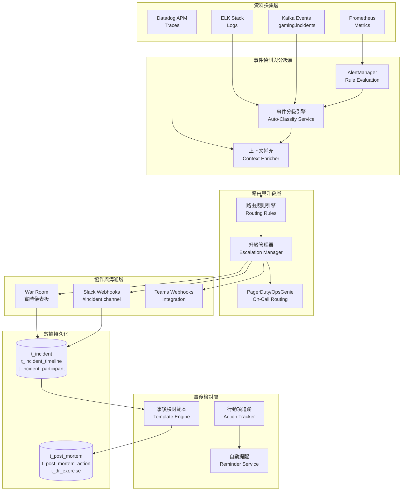

# 第 16 章：事件回應技術架構

## 16.1 模組概述

本章涵蓋事件回應系統的技術實作，包括自動化事件分級、告警路由升級、實時 War Room 協作平台、事後檢討工作流及災難恢復演練框架。該模組與 Ch10 (Infrastructure) 協作，利用 Kubernetes 的 Pod 故障偵測、Prometheus 的多維度指標及 Kafka 事件流完成端到端的事件生命週期管理。

**核心職責**:
- 事件自動分級 (P0–P4) 及嚴重度動態調整
- 告警路由、升級鏈 (escalation chains) 與 PagerDuty/OpsGenie 整合
- War Room 動態建立、即時協作面板、溝通自動化
- 事後檢討範本引擎、行動項追蹤與完成度報告
- 混沌工程實驗 (Chaos Monkey/LitmusChaos) 及 DR 演練自動化

---

## 16.2 事件管理系統架構

### 系統總體架構



### 技術棧

| 元件 | 技術選型 | 版本 | 用途 |
|------|---------|------|------|
| **事件源** | Prometheus + AlertManager | 2.48 | 指標告警、規則評估 |
| **日誌聚合** | ELK Stack (Elasticsearch) | 8.11 | 根本原因診斷、錯誤追蹤 |
| **分佈追蹤** | Datadog APM / Jaeger | 2.0 | 延遲分析、異常偵測 |
| **事件流** | Kafka | 3.6 | 異步事件發布、去耦合 |
| **分級引擎** | Spring Boot + Drools/JEXL | 3.1 | 可配置規則、動態評估 |
| **升級管理** | PagerDuty / OpsGenie | API v2 | On-Call 路由、電話/SMS |
| **協作平台** | Slack / MS Teams | API v1 | 即時通知、 War Room 協作 |
| **儀表板** | Grafana + 自建面板 | 10.2 | 實時狀態、時間線視覺化 |
| **資料庫** | PostgreSQL 16 | 16 | 事件/事後檢討持久化 |
| **消息隊列** | Redis (發布/訂閱) | 7.2 | War Room 即時更新、廣播 |

---

## 16.3 資料模型

### 核心表結構

#### t_incident (事件表)

```sql
CREATE TABLE t_incident (
    incident_id BIGSERIAL PRIMARY KEY,
    incident_key VARCHAR(100) UNIQUE NOT NULL,  -- P0-2026032501 全平台唯一
    title VARCHAR(256) NOT NULL,
    description TEXT,
    severity_level CHAR(2) NOT NULL,  -- P0, P1, P2, P3, P4
    initial_severity CHAR(2) NOT NULL,  -- 初始分級
    current_severity CHAR(2) NOT NULL,  -- 動態調整後
    service_id BIGINT NOT NULL REFERENCES t_service(service_id),
    service_name VARCHAR(100),
    affected_component VARCHAR(255),
    root_cause VARCHAR(512),

    -- 時間戳
    detected_at TIMESTAMP WITH TIME ZONE NOT NULL,
    declared_at TIMESTAMP WITH TIME ZONE,
    resolved_at TIMESTAMP WITH TIME ZONE,
    created_at TIMESTAMP WITH TIME ZONE DEFAULT CURRENT_TIMESTAMP,
    updated_at TIMESTAMP WITH TIME ZONE DEFAULT CURRENT_TIMESTAMP,

    -- 當事人
    ic_user_id BIGINT REFERENCES t_user(user_id),  -- Incident Commander
    ic_name VARCHAR(100),
    detector_system VARCHAR(50),  -- "prometheus", "manual", "pagerduty"

    -- 影響範圍
    affected_player_count INT DEFAULT 0,
    affected_transactions INT DEFAULT 0,
    financial_impact_usd DECIMAL(15,2),

    -- 狀態
    status VARCHAR(20) NOT NULL,  -- "detected", "acknowledged", "resolved", "closed"
    is_war_room_active BOOLEAN DEFAULT FALSE,
    escalation_level INT DEFAULT 0,  -- 已升級層級數

    -- 標籤
    incident_type VARCHAR(50),  -- "outage", "degradation", "security", "data-issue"
    tags JSONB,  -- {"env": "prod", "region": "eu-west-1", "business_impact": "high"}

    CONSTRAINT pk_incident_id PRIMARY KEY (incident_id),
    INDEX idx_incident_severity (severity_level, detected_at DESC),
    INDEX idx_incident_service (service_id, status),
    INDEX idx_incident_time (detected_at DESC)
);
```

#### t_incident_timeline (事件時間線表)

```sql
CREATE TABLE t_incident_timeline (
    timeline_id BIGSERIAL PRIMARY KEY,
    incident_id BIGINT NOT NULL REFERENCES t_incident(incident_id) ON DELETE CASCADE,
    event_type VARCHAR(50) NOT NULL,
    -- "alert_triggered", "severity_updated", "acknowledged", "war_room_started",
    -- "root_cause_identified", "mitigation_started", "resolved", "verified"

    event_time TIMESTAMP WITH TIME ZONE NOT NULL,
    actor_user_id BIGINT REFERENCES t_user(user_id),
    actor_name VARCHAR(100),
    action_description TEXT,

    -- 上下文
    old_value VARCHAR(255),
    new_value VARCHAR(255),
    metric_data JSONB,  -- {"error_rate": 15.3, "latency_p99": 8500}

    created_at TIMESTAMP WITH TIME ZONE DEFAULT CURRENT_TIMESTAMP,

    INDEX idx_timeline_incident (incident_id, event_time),
    INDEX idx_timeline_type (event_type, event_time DESC)
);
```

#### t_incident_participant (參與者表)

```sql
CREATE TABLE t_incident_participant (
    participant_id BIGSERIAL PRIMARY KEY,
    incident_id BIGINT NOT NULL REFERENCES t_incident(incident_id) ON DELETE CASCADE,
    user_id BIGINT NOT NULL REFERENCES t_user(user_id),
    user_name VARCHAR(100),
    user_email VARCHAR(100),
    role VARCHAR(50),  -- "ic" (Incident Commander), "tl" (Tech Lead), "cl" (Comms Lead), "recorder"

    joined_at TIMESTAMP WITH TIME ZONE DEFAULT CURRENT_TIMESTAMP,
    left_at TIMESTAMP WITH TIME ZONE,
    is_active BOOLEAN DEFAULT TRUE,

    PRIMARY KEY (participant_id),
    UNIQUE (incident_id, user_id),
    INDEX idx_participant_user (user_id, incident_id)
);
```

#### t_post_mortem (事後檢討表)

```sql
CREATE TABLE t_post_mortem (
    postmortem_id BIGSERIAL PRIMARY KEY,
    incident_id BIGINT NOT NULL UNIQUE REFERENCES t_incident(incident_id) ON DELETE CASCADE,

    -- 基本資訊
    title VARCHAR(256) NOT NULL,
    executive_summary TEXT,
    duration_minutes INT,  -- MTTR
    detection_to_resolution_minutes INT,  -- MTTD + MTTR

    -- 根本原因
    root_cause_analysis TEXT,  -- 5-Why 或魚骨圖分析
    root_cause_category VARCHAR(50),
    -- "config_error", "code_defect", "infrastructure", "external_dependency",
    -- "process_breakdown", "human_error"

    -- 影響評估
    affected_player_count INT,
    affected_transactions INT,
    revenue_impact_usd DECIMAL(15,2),
    compliance_impact TEXT,

    -- 內容
    timeline_summary TEXT,
    what_went_well TEXT,
    what_could_improve TEXT,
    additional_context TEXT,

    -- 狀態與簽署
    status VARCHAR(20),  -- "draft", "review", "approved", "published"
    created_by BIGINT REFERENCES t_user(user_id),
    approved_by BIGINT REFERENCES t_user(user_id),
    published_at TIMESTAMP WITH TIME ZONE,
    created_at TIMESTAMP WITH TIME ZONE DEFAULT CURRENT_TIMESTAMP,
    updated_at TIMESTAMP WITH TIME ZONE DEFAULT CURRENT_TIMESTAMP,

    PRIMARY KEY (postmortem_id),
    INDEX idx_pm_incident (incident_id),
    INDEX idx_pm_status (status, published_at DESC)
);
```

#### t_post_mortem_action (行動項表)

```sql
CREATE TABLE t_post_mortem_action (
    action_id BIGSERIAL PRIMARY KEY,
    postmortem_id BIGINT NOT NULL REFERENCES t_post_mortem(postmortem_id) ON DELETE CASCADE,

    title VARCHAR(256) NOT NULL,
    description TEXT,
    priority VARCHAR(10),  -- "critical", "high", "medium", "low"
    owner_user_id BIGINT REFERENCES t_user(user_id),
    owner_name VARCHAR(100),

    due_date DATE NOT NULL,
    status VARCHAR(20),  -- "pending", "in_progress", "completed", "wont_fix"
    completion_date DATE,

    -- 連結到相關系統
    jira_ticket_id VARCHAR(50),
    github_issue_id INT,

    created_at TIMESTAMP WITH TIME ZONE DEFAULT CURRENT_TIMESTAMP,
    updated_at TIMESTAMP WITH TIME ZONE DEFAULT CURRENT_TIMESTAMP,

    PRIMARY KEY (action_id),
    INDEX idx_action_pm (postmortem_id, status),
    INDEX idx_action_owner (owner_user_id, due_date)
);
```

#### t_dr_exercise (災難復原演練表)

```sql
CREATE TABLE t_dr_exercise (
    exercise_id BIGSERIAL PRIMARY KEY,

    exercise_name VARCHAR(256) NOT NULL,
    exercise_type VARCHAR(30),  -- "tabletop", "failover", "full_dr"
    description TEXT,

    planned_date DATE NOT NULL,
    scheduled_start_time TIME,
    scheduled_duration_minutes INT,

    -- 實際執行
    actual_start_at TIMESTAMP WITH TIME ZONE,
    actual_end_at TIMESTAMP WITH TIME ZONE,
    actual_duration_minutes INT,

    -- 結果
    status VARCHAR(20),  -- "scheduled", "in_progress", "completed", "cancelled"
    success BOOLEAN,
    rto_achieved_minutes INT,
    rpo_achieved_minutes INT,
    rto_target_minutes INT,
    rpo_target_minutes INT,

    findings TEXT,  -- 發現的問題與改進空間
    lessons_learned TEXT,

    -- 參與者
    participants JSONB,  -- [{"user_id": 123, "role": "ic"}, ...]

    created_by BIGINT REFERENCES t_user(user_id),
    created_at TIMESTAMP WITH TIME ZONE DEFAULT CURRENT_TIMESTAMP,
    updated_at TIMESTAMP WITH TIME ZONE DEFAULT CURRENT_TIMESTAMP,

    PRIMARY KEY (exercise_id),
    INDEX idx_exercise_date (planned_date DESC),
    INDEX idx_exercise_status (status)
);
```

---

## 16.4 事件分級自動判定

### 分級引擎架構

事件分級採用多維度評分模型，結合指標閾值、業務影響及技術因素。

```
分級邏輯流程:

1. 獲取告警信號 (Prometheus AlertManager)
   ↓
2. 收集上下文數據 (錯誤率、延遲、可用性、影響用戶數)
   ↓
3. 計算分級分數 (0-100)
   ↓
4. 映射至嚴重度等級 (P0-P4)
   ↓
5. 觸發路由與升級 (PagerDuty, Slack)
```

### 分級規則引擎 (Drools + Spring Boot)

```java
// IncidentClassificationService.java
@Service
public class IncidentClassificationService {

    @Autowired
    private KieContainer kieContainer;

    @Autowired
    private IncidentRepository incidentRepository;

    @Autowired
    private MetricsService metricsService;

    /**
     * 自動分級事件
     */
    public void classifyIncident(IncidentDetectionEvent event) {
        // 1. 收集指標
        MetricsContext metricsContext = collectMetrics(event.getServiceId());

        // 2. 構建分級上下文
        IncidentClassificationContext context = IncidentClassificationContext.builder()
            .incidentKey(event.getIncidentKey())
            .serviceName(event.getServiceName())
            .errorRate(metricsContext.getErrorRate())
            .latencyP99Ms(metricsContext.getLatencyP99())
            .availabilityPercent(metricsContext.getAvailability())
            .affectedPlayerCount(metricsContext.getAffectedPlayerCount())
            .isCoreService(metricsContext.isCoreService())
            .isPaymentRelated(metricsContext.isPaymentRelated())
            .detectedAt(event.getDetectedAt())
            .build();

        // 3. 執行 Drools 規則
        KieSession session = kieContainer.newKieSession();
        session.insert(context);
        session.fireAllRules();

        // 4. 取得分級結果
        SeverityLevel severity = context.getDeterminedSeverity();

        // 5. 持久化
        Incident incident = Incident.builder()
            .incidentKey(event.getIncidentKey())
            .title(event.getTitle())
            .severity(severity)
            .detectedAt(event.getDetectedAt())
            .status("detected")
            .build();

        incidentRepository.save(incident);

        // 6. 發布事件 (觸發後續流程)
        publishIncidentDetectedEvent(incident);

        session.dispose();
    }

    private MetricsContext collectMetrics(Long serviceId) {
        // 從 Prometheus 查詢過去 5 分鐘的聚合指標
        PrometheusResponse response = metricsService.queryRange(
            String.format(
                "rate(http_requests_total{service_id='%d', status=~'5..',}[5m]) / " +
                "rate(http_requests_total{service_id='%d'}[5m])",
                serviceId, serviceId
            ),
            Duration.ofMinutes(5)
        );

        double errorRate = response.getValues().isEmpty() ? 0 :
            Double.parseDouble(response.getValues().get(0).getValue());

        // 類似查詢延遲、可用性等
        double latencyP99 = metricsService.queryLatencyPercentile(serviceId, 0.99);
        double availability = metricsService.queryAvailability(serviceId);
        int affectedPlayers = metricsService.queryAffectedPlayerCount(serviceId);

        return MetricsContext.builder()
            .errorRate(errorRate)
            .latencyP99(latencyP99)
            .availability(availability)
            .affectedPlayerCount(affectedPlayers)
            .coreService(isServiceCore(serviceId))
            .paymentRelated(isServicePaymentRelated(serviceId))
            .build();
    }
}
```

### Drools 規則檔案 (incident-classification.drl)

```drools
package com.igaming.incident.classification

import com.igaming.incident.model.IncidentClassificationContext;
import com.igaming.incident.model.SeverityLevel;

// ===== P0 規則 =====

rule "P0_Core_Service_Down"
    when
        context: IncidentClassificationContext(
            isCoreService == true,
            availability < 50  // 可用性 < 50%
        )
    then
        context.setDeterminedSeverity(SeverityLevel.P0);
        context.setReason("核心服務可用性 < 50%");
end

rule "P0_Payment_System_Failed"
    when
        context: IncidentClassificationContext(
            isPaymentRelated == true,
            errorRate > 0.10  // 錯誤率 > 10%
        )
    then
        context.setDeterminedSeverity(SeverityLevel.P0);
        context.setReason("支付系統錯誤率 > 10%");
end

rule "P0_Wallet_Transactions_Blocked"
    when
        context: IncidentClassificationContext(
            serviceName in ("wallet-service", "payment-service"),
            affectedPlayerCount > 10000
        )
    then
        context.setDeterminedSeverity(SeverityLevel.P0);
        context.setReason("錢包系統影響 > 10K 玩家");
end

// ===== P1 規則 =====

rule "P1_Core_Service_Degraded"
    when
        context: IncidentClassificationContext(
            isCoreService == true,
            latencyP99Ms > 5000  // P99 延遲 > 5秒
        )
    then
        context.setDeterminedSeverity(SeverityLevel.P1);
        context.setReason("核心服務延遲 > 5 秒");
end

rule "P1_High_Error_Rate"
    when
        context: IncidentClassificationContext(
            errorRate > 0.05  // 錯誤率 > 5%
        )
    then
        context.setDeterminedSeverity(SeverityLevel.P1);
        context.setReason("全平台錯誤率 > 5%");
end

rule "P1_Large_Player_Impact"
    when
        context: IncidentClassificationContext(
            affectedPlayerCount > 5000
        )
    then
        context.setDeterminedSeverity(SeverityLevel.P1);
        context.setReason("影響 > 5K 玩家");
end

// ===== P2 規則 =====

rule "P2_Moderate_Degradation"
    when
        context: IncidentClassificationContext(
            latencyP99Ms > 2000 && latencyP99Ms <= 5000,
            errorRate > 0.01 && errorRate <= 0.05
        )
    then
        context.setDeterminedSeverity(SeverityLevel.P2);
        context.setReason("中等降級：延遲 2–5 秒或錯誤率 1–5%");
end

rule "P2_Limited_Feature_Impact"
    when
        context: IncidentClassificationContext(
            isCoreService == false,
            affectedPlayerCount > 1000
        )
    then
        context.setDeterminedSeverity(SeverityLevel.P2);
        context.setReason("非核心服務影響 > 1K 玩家");
end

// ===== P3 規則 =====

rule "P3_Minor_Issue"
    when
        context: IncidentClassificationContext(
            latencyP99Ms <= 2000,
            errorRate <= 0.01,
            affectedPlayerCount < 1000
        )
    then
        context.setDeterminedSeverity(SeverityLevel.P3);
        context.setReason("輕微問題：延遲 < 2 秒且錯誤率 < 1%");
end

// ===== P4 規則 =====

rule "P4_Informational"
    when
        context: IncidentClassificationContext(
            errorRate < 0.001,
            affectedPlayerCount == 0
        )
    then
        context.setDeterminedSeverity(SeverityLevel.P4);
        context.setReason("資訊性警告或邊界情況");
end
```

### 可配置參數

分級規則的各項閾值均可配置，儲存在 PRD_Configurable_Parameters_Registry：

| 參數鍵 | 預設值 | 說明 |
|-------|--------|------|
| `ch16.p0.core_availability_threshold` | 50% | P0 判定：核心服務可用性下限 |
| `ch16.p0.payment_error_rate` | 10% | P0 判定：支付系統錯誤率上限 |
| `ch16.p0.affected_player_count` | 10000 | P0 判定：影響玩家數上限 |
| `ch16.p1.latency_p99_threshold_ms` | 5000 | P1 判定：P99 延遲上限 |
| `ch16.p1.error_rate_threshold` | 5% | P1 判定：錯誤率上限 |
| `ch16.p1.affected_player_count` | 5000 | P1 判定：影響玩家數上限 |
| `ch16.p2.latency_p99_threshold_ms` | 2000 | P2 判定：P99 延遲上限 |
| `ch16.p2.error_rate_threshold` | 1% | P2 判定：錯誤率上限 |
| `ch16.p3.affected_player_count` | 1000 | P3 判定：影響玩家數上限 |

---

## 16.5 告警路由與升級自動化

### 路由引擎

```java
@Service
public class AlertRoutingService {

    @Autowired
    private PagerDutyClient pagerDutyClient;

    @Autowired
    private SlackClient slackClient;

    @Autowired
    private EscalationPolicyRepository escalationPolicyRepository;

    /**
     * 路由事件至相應通知渠道與 On-Call 人員
     */
    @Transactional
    public void routeIncident(IncidentDetectedEvent event) {
        Incident incident = incidentRepository.findByIncidentKey(event.getIncidentKey());

        // 1. 查詢路由規則 (按服務 + 嚴重度)
        List<RoutingRule> rules = routingRuleRepository.findApplicable(
            incident.getServiceId(),
            incident.getSeverityLevel()
        );

        for (RoutingRule rule : rules) {
            // 2. 判斷是否應該路由至此規則 (根據 CEL 表達式)
            if (evaluateCondition(rule.getCondition(), incident)) {

                // 3. 執行路由動作
                if (rule.getTargetType().equals("pagerduty")) {
                    routeToPagerDuty(incident, rule);
                }
                if (rule.getTargetType().equals("slack")) {
                    routeToSlack(incident, rule);
                }
                if (rule.getTargetType().equals("email")) {
                    routeToEmail(incident, rule);
                }

                // 4. 記錄路由歷史
                logRoutingAction(incident, rule);
            }
        }
    }

    /**
     * 路由至 PagerDuty，觸發 On-Call 升級鏈
     */
    private void routeToPagerDuty(Incident incident, RoutingRule rule) {
        // 1. 查詢該服務的 On-Call schedule
        String scheduleId = rule.getPagerDutyScheduleId();

        // 2. 建立 Incident
        PagerDutyIncidentRequest request = PagerDutyIncidentRequest.builder()
            .title(incident.getTitle())
            .description(incident.getDescription())
            .urgency(mapSeverityToUrgency(incident.getSeverityLevel()))
            .serviceId(scheduleId)
            .additionalDetails(Map.of(
                "incident_id", incident.getIncidentId().toString(),
                "service_name", incident.getServiceName(),
                "war_room_url", generateWarRoomUrl(incident.getIncidentId()),
                "metrics_dashboard", generateMetricsDashboardUrl(incident.getServiceId())
            ))
            .build();

        PagerDutyIncidentResponse response = pagerDutyClient.createIncident(request);

        // 3. 儲存 PagerDuty Incident ID 供後續追蹤
        incident.setPagerDutyIncidentId(response.getIncidentId());
        incident.setPagerDutyStatus("triggered");
        incidentRepository.save(incident);

        // 4. 如果是 P0，直接 escalate (略過標準升級延遲)
        if (incident.getSeverityLevel() == SeverityLevel.P0) {
            Thread.sleep(2000);  // 等待首次確認
            pagerDutyClient.escalateIncident(response.getIncidentId());
        }
    }

    /**
     * 路由至 Slack
     */
    private void routeToSlack(Incident incident, RoutingRule rule) {
        String slackChannelId = rule.getSlackChannelId();

        SlackMessage message = SlackMessage.builder()
            .channel(slackChannelId)
            .blocks(List.of(
                // 標題區塊
                SlackBlock.header(
                    String.format("[%s] %s",
                        incident.getSeverityLevel(),
                        incident.getTitle()
                    )
                ),
                // 詳情區塊
                SlackBlock.section(Map.of(
                    "Service", incident.getServiceName(),
                    "Severity", incident.getSeverityLevel().toString(),
                    "Detected", formatTime(incident.getDetectedAt()),
                    "Impact", String.format("%d players affected",
                        incident.getAffectedPlayerCount())
                )),
                // 動作按鈕
                SlackBlock.actions(List.of(
                    SlackAction.button("Open War Room",
                        generateWarRoomUrl(incident.getIncidentId())),
                    SlackAction.button("View Runbook",
                        generateRunbookUrl(incident.getServiceName()))
                ))
            ))
            .build();

        slackClient.sendMessage(message);
    }

    private String mapSeverityToUrgency(SeverityLevel severity) {
        return switch(severity) {
            case P0 -> "high";
            case P1 -> "high";
            case P2 -> "low";
            case P3, P4 -> "low";
        };
    }
}
```

### 升級鏈配置

升級鏈定義由運維人員在配置系統中維護，支持動態調整。例：

```yaml
escalation_policies:
  # 錢包服務 P0
  - policy_id: "wallet_p0"
    service_id: "wallet-service"
    severity: "P0"
    escalation_levels:
      - level: 0
        delay_minutes: 0
        notify:
          - type: "pagerduty_schedule"
            schedule_id: "wallet_on_call"
          - type: "slack_channel"
            channel: "#incident"
      - level: 1
        delay_minutes: 5
        notify:
          - type: "pagerduty_schedule"
            schedule_id: "wallet_lead"
          - type: "slack_user"
            user: "@cto"
      - level: 2
        delay_minutes: 15
        notify:
          - type: "email"
            recipients: ["ceo@company.com", "cfo@company.com"]
          - type: "teams_channel"
            channel: "executive-alerts"

  # 錢包服務 P1
  - policy_id: "wallet_p1"
    service_id: "wallet-service"
    severity: "P1"
    escalation_levels:
      - level: 0
        delay_minutes: 0
        notify:
          - type: "pagerduty_schedule"
            schedule_id: "wallet_on_call"
          - type: "slack_channel"
            channel: "#incident"
      - level: 1
        delay_minutes: 30
        notify:
          - type: "pagerduty_schedule"
            schedule_id: "wallet_lead"
```

---

## 16.6 War Room 技術實作

### War Room 實時儀表板

```java
@RestController
@RequestMapping("/api/v1/war-room")
public class WarRoomController {

    @Autowired
    private WarRoomService warRoomService;

    @Autowired
    private SimpMessagingTemplate simpMessagingTemplate;

    /**
     * 啟動 War Room
     */
    @PostMapping("/{incidentId}/activate")
    public ResponseEntity<WarRoomDTO> activateWarRoom(
            @PathVariable Long incidentId,
            @RequestParam String iCName) {

        WarRoom warRoom = warRoomService.activateWarRoom(incidentId, iCName);

        // 1. 自動建立 Slack 頻道
        String slackChannelName = String.format("incident-%d-war-room", incidentId);
        String slackChannelId = slackService.createChannel(slackChannelName);
        warRoom.setSlackChannelId(slackChannelId);

        // 2. 邀請參與者至 Slack 頻道
        Incident incident = incidentRepository.findById(incidentId).orElseThrow();
        List<String> participantEmails = notificationService.getRecipientsForSeverity(
            incident.getSeverityLevel()
        );
        slackService.inviteUsersToChannel(slackChannelId, participantEmails);

        // 3. 發送 War Room 起始消息
        slackService.postMessage(slackChannelId,
            formatWarRoomStartMessage(incident, iCName)
        );

        // 4. 啟用即時更新 (WebSocket)
        warRoomService.enableRealtimeUpdates(incidentId);

        // 5. 啟動自動時間線記錄
        warRoomService.startTimelineRecording(incidentId);

        return ResponseEntity.ok(WarRoomDTO.from(warRoom));
    }

    /**
     * WebSocket: 訂閱即時事件更新
     */
    @MessageMapping("/war-room/{incidentId}/subscribe")
    @SendTo("/topic/war-room/{incidentId}")
    public WarRoomStatusUpdate handleSubscribe(@DestinationVariable Long incidentId) {
        WarRoom warRoom = warRoomService.getActiveWarRoom(incidentId);
        Incident incident = incidentRepository.findById(incidentId).orElseThrow();

        return WarRoomStatusUpdate.builder()
            .incidentId(incidentId)
            .title(incident.getTitle())
            .severity(incident.getSeverityLevel())
            .status(incident.getStatus())
            .icName(warRoom.getIcName())
            .participantCount(warRoom.getParticipantCount())
            .uptime(Duration.between(warRoom.getActivatedAt(), Instant.now()))
            .latestMetrics(getLatestMetrics(incident.getServiceId()))
            .timeline(getRecentTimeline(incidentId))
            .build();
    }

    /**
     * 更新事件狀態 (自動廣播至所有訂閱者)
     */
    @PostMapping("/{incidentId}/update-status")
    public void updateStatus(@PathVariable Long incidentId, @RequestBody StatusUpdateRequest req) {
        Incident incident = incidentRepository.findById(incidentId).orElseThrow();

        // 1. 更新資料庫
        incident.setStatus(req.getNewStatus());
        incidentRepository.save(incident);

        // 2. 記錄至時間線
        IncidentTimeline timeline = IncidentTimeline.builder()
            .incidentId(incidentId)
            .eventType("status_updated")
            .eventTime(Instant.now())
            .oldValue(req.getOldStatus())
            .newValue(req.getNewStatus())
            .actionDescription(req.getDescription())
            .actorName(req.getActorName())
            .build();
        incidentTimelineRepository.save(timeline);

        // 3. 廣播至 WebSocket 訂閱者
        simpMessagingTemplate.convertAndSend(
            "/topic/war-room/" + incidentId,
            WarRoomStatusUpdate.builder()
                .incidentId(incidentId)
                .status(req.getNewStatus())
                .updatedAt(Instant.now())
                .timeline(getRecentTimeline(incidentId))
                .build()
        );

        // 4. 發送 Slack 通知
        String message = String.format(
            "Status updated: `%s` → `%s`\nNote: %s\n— %s",
            req.getOldStatus(), req.getNewStatus(),
            req.getDescription(), req.getActorName()
        );
        slackService.postMessage(warRoom.getSlackChannelId(), message);
    }

    /**
     * 獲取最新 15 條時間線項目
     */
    private List<TimelineItemDTO> getRecentTimeline(Long incidentId) {
        return incidentTimelineRepository
            .findByIncidentIdOrderByEventTimeDesc(incidentId, PageRequest.of(0, 15))
            .map(TimelineItemDTO::from)
            .getContent();
    }
}
```

### 自動時間線記錄

War Room 啟動時，所有事件自動記錄至 `t_incident_timeline`：

```java
@Service
public class TimelineRecordingService {

    @Autowired
    private IncidentTimelineRepository timelineRepository;

    @Autowired
    private ApplicationEventPublisher eventPublisher;

    /**
     * 監聽系統事件並自動記錄至時間線
     */
    @EventListener
    public void onIncidentStatusChanged(IncidentStatusChangedEvent event) {
        recordTimelineEvent(
            event.getIncidentId(),
            "status_updated",
            event.getNewStatus(),
            event.getOldStatus(),
            event.getDescription()
        );
    }

    @EventListener
    public void onSeverityEscalated(SeverityEscalatedEvent event) {
        recordTimelineEvent(
            event.getIncidentId(),
            "severity_escalated",
            event.getNewSeverity().toString(),
            event.getOldSeverity().toString(),
            "Severity automatically escalated due to metric thresholds"
        );
    }

    @EventListener
    public void onParticipantJoined(ParticipantJoinedEvent event) {
        recordTimelineEvent(
            event.getIncidentId(),
            "participant_joined",
            event.getParticipantName(),
            null,
            String.format("Role: %s", event.getRole())
        );
    }

    private void recordTimelineEvent(Long incidentId, String eventType,
            String newValue, String oldValue, String description) {
        IncidentTimeline timeline = IncidentTimeline.builder()
            .incidentId(incidentId)
            .eventType(eventType)
            .eventTime(Instant.now())
            .newValue(newValue)
            .oldValue(oldValue)
            .actionDescription(description)
            .build();

        timelineRepository.save(timeline);
    }
}
```

---

## 16.7 事後檢討工作流

### 事後檢討範本引擎

```java
@Service
public class PostMortemService {

    @Autowired
    private PostMortemRepository postMortemRepository;

    @Autowired
    private PostMortemActionRepository actionRepository;

    @Autowired
    private IncidentRepository incidentRepository;

    /**
     * 基於事件自動初始化事後檢討草稿
     */
    public PostMortem initiateDraft(Long incidentId) {
        Incident incident = incidentRepository.findById(incidentId).orElseThrow();

        // 1. 計算 MTTR
        Duration mttr = Duration.between(incident.getDetectedAt(), incident.getResolvedAt());

        // 2. 收集事件數據
        List<IncidentTimeline> timeline = incidentTimelineRepository
            .findByIncidentIdOrderByEventTime(incidentId);

        // 3. 建立草稿
        PostMortem postMortem = PostMortem.builder()
            .incidentId(incidentId)
            .title(generateTitle(incident))
            .executiveSummary(generateExecutiveSummary(incident, mttr))
            .durationMinutes((int) mttr.toMinutes())
            .status("draft")
            .createdBy(getCurrentUser().getId())
            .build();

        PostMortem saved = postMortemRepository.save(postMortem);

        // 4. 自動生成事件時間線摘要
        String timelineSummary = generateTimelineSummary(timeline);
        saved.setTimelineSummary(timelineSummary);

        // 5. 根據事件類型預填根本原因分析模板
        String rcaTemplate = generateRCATemplate(incident.getIncidentType());
        saved.setRootCauseAnalysis(rcaTemplate);

        // 6. 建立行動項佔位符
        createActionItemPlaceholders(saved);

        return postMortemRepository.save(saved);
    }

    /**
     * 提交事後檢討供審查
     */
    @Transactional
    public void submitForReview(Long postMortemId, String submitterName) {
        PostMortem pm = postMortemRepository.findById(postMortemId).orElseThrow();

        // 1. 驗證必填欄位
        validatePostMortemCompleteness(pm);

        // 2. 更新狀態
        pm.setStatus("review");
        postMortemRepository.save(pm);

        // 3. 通知審查者
        List<User> reviewers = notificationService.getReviewersForSeverity(
            pm.getIncident().getSeverityLevel()
        );

        for (User reviewer : reviewers) {
            sendReviewNotification(pm, reviewer);
        }
    }

    /**
     * 批准並發布事後檢討
     */
    @Transactional
    public void approve(Long postMortemId, String approverName) {
        PostMortem pm = postMortemRepository.findById(postMortemId).orElseThrow();

        // 1. 更新狀態
        pm.setStatus("approved");
        pm.setApprovedBy(approverName);
        pm.setPublishedAt(Instant.now());
        postMortemRepository.save(pm);

        // 2. 發布至內部知識庫 (例：Confluence, Git Repo)
        publishToKnowledgeBase(pm);

        // 3. 安排行動項截止日期的自動提醒
        scheduleActionItemReminders(pm);

        // 4. 發送完成通知
        notificationService.notifyPostMortemPublished(pm);
    }

    /**
     * 自動建立與追蹤行動項
     */
    @Transactional
    public PostMortemAction createAction(Long postMortemId, ActionItemRequest req) {
        PostMortem pm = postMortemRepository.findById(postMortemId).orElseThrow();

        // 1. 建立行動項
        PostMortemAction action = PostMortemAction.builder()
            .postmortemId(postMortemId)
            .title(req.getTitle())
            .description(req.getDescription())
            .priority(req.getPriority())
            .ownerUserId(req.getOwnerUserId())
            .dueDate(req.getDueDate())
            .status("pending")
            .build();

        PostMortemAction saved = actionRepository.save(action);

        // 2. 若指定 JIRA，建立對應票證
        if (req.getCreateJiraTicket()) {
            String jiraTicketId = jiraService.createTicket(
                "POSTMORTEM",
                req.getTitle(),
                req.getDescription(),
                "postmortem-action"
            );
            saved.setJiraTicketId(jiraTicketId);
        }

        // 3. 通知負責人
        notificationService.notifyActionItemAssigned(saved);

        // 4. 安排截止日期前 3 天提醒
        scheduleReminder(saved, Duration.ofDays(3));

        return actionRepository.save(saved);
    }
}
```

### 事後檢討報告範本

```
# 事後檢討報告：{{incident.title}}

## 執行摘要

**事件 ID**: {{incident.incident_key}}
**嚴重度**: {{incident.severity_level}}
**持續時間**: {{mttr}} 分鐘
**影響玩家數**: {{incident.affected_player_count}}
**財務影響**: ${{incident.financial_impact_usd}}

---

## 事件時間線

| 時間 | 事件 | 行動者 | 備註 |
|------|------|--------|------|
{{#timeline}}
| {{event_time}} | {{event_type}} | {{actor_name}} | {{description}} |
{{/timeline}}

---

## 根本原因分析 (5-Why)

1. **為什麼服務宕機？** {{root_cause_level_1}}
2. **為什麼會發生？** {{root_cause_level_2}}
3. **為什麼沒被預防？** {{root_cause_level_3}}
4. **為什麼檢測延遲？** {{root_cause_level_4}}
5. **為什麼恢復緩慢？** {{root_cause_level_5}}

**根本原因類別**: {{root_cause_category}}

---

## 影響評估

- **受影響玩家**: {{affected_players}}
- **受影響交易**: {{affected_transactions}}
- **營收損失**: ${{revenue_impact_usd}}
- **合規影響**: {{compliance_impact}}

---

## 做得好的

- {{what_went_well_1}}
- {{what_went_well_2}}
- {{what_went_well_3}}

---

## 可改進的

- {{improvement_1}}
- {{improvement_2}}
- {{improvement_3}}

---

## 行動項

| 序號 | 標題 | 優先級 | 負責人 | 截止日 | 狀態 |
|------|------|--------|--------|---------|------|
{{#action_items}}
| {{idx}} | {{title}} | {{priority}} | {{owner}} | {{due_date}} | {{status}} |
{{/action_items}}

---

**報告編製者**: {{created_by}} | **批准者**: {{approved_by}} | **發布日期**: {{published_at}}
```

---

## 16.8 韌性演練框架

### 混沌工程集成 (Chaos Monkey + LitmusChaos)

```java
@Service
public class ChaosEngineeringService {

    @Autowired
    private LitmusChaosClient litmusClient;

    @Autowired
    private KubernetesClient k8sClient;

    @Autowired
    private DrExerciseRepository drExerciseRepository;

    /**
     * 啟動故障注入實驗 (例：隨機關閉 Pod)
     */
    @Scheduled(cron = "0 0 2 ? * MON")  // 每週一凌晨 2 點
    public void runWeeklyPodChaosExperiment() {
        String experimentName = "pod-delete-" + System.currentTimeMillis();

        // 1. 定義實驗 (Kubernetes CRD)
        ChaosExperiment experiment = ChaosExperiment.builder()
            .name(experimentName)
            .namespace("chaos-engineering")
            .spec(Map.of(
                "engineTemplate", Map.of(
                    "appInfo", Map.of(
                        "appNs", "wallet-service",
                        "appLabel", "app=wallet-service"
                    )
                ),
                "experiments", List.of(
                    Map.of(
                        "name", "pod-delete",
                        "spec", Map.of(
                            "components", Map.of(
                                "env", List.of(
                                    Map.of("name", "TOTAL_CHAOS_DURATION", "value", "60"),
                                    Map.of("name", "CHAOS_INTERVAL", "value", "30"),
                                    Map.of("name", "KILL_COUNT", "value", "1"),
                                    Map.of("name", "FORCE", "value", "true")
                                )
                            )
                        )
                    )
                )
            ))
            .build();

        // 2. 執行實驗
        ChaosExperimentResult result = litmusClient.runExperiment(experiment);

        // 3. 監控期間 (60 分鐘)
        monitorExperiment(experimentName, Duration.ofMinutes(60));

        // 4. 收集結果
        ChaosResult chaosResult = litmusClient.getResult(experimentName);

        // 5. 記錄至 t_dr_exercise
        DrExercise exercise = DrExercise.builder()
            .exerciseName(experimentName)
            .exerciseType("chaos-engineering")
            .description("Pod deletion chaos experiment on wallet-service")
            .actualStartAt(Instant.now())
            .actualEndAt(Instant.now().plus(Duration.ofMinutes(60)))
            .status(chaosResult.getVerdictString())  // "Pass" or "Fail"
            .success(chaosResult.isPass())
            .findings(generateFindings(chaosResult))
            .lessonsLearned(generateLessons(chaosResult))
            .build();

        drExerciseRepository.save(exercise);

        // 6. 若實驗失敗，自動升級為事件
        if (!chaosResult.isPass()) {
            escalateToIncident(exercise);
        }
    }

    /**
     * 完整 DR 演練 (模擬主資料中心故障)
     */
    @Transactional
    public void runFullDRDrill() {
        DrExercise exercise = DrExercise.builder()
            .exerciseName("DR-Drill-" + LocalDate.now())
            .exerciseType("full_dr")
            .description("Full datacenter failover simulation")
            .plannedDate(LocalDate.now())
            .rtoTargetMinutes(15)
            .rpoTargetMinutes(5)
            .status("in_progress")
            .build();

        DrExercise saved = drExerciseRepository.save(exercise);

        try {
            // 1. 禁用主資料中心連接
            disablePrimaryDatacenter(Duration.ofMinutes(30));
            Instant primaryFailureTime = Instant.now();

            // 2. 監控 DNS 切換 (應在 30 秒內完成)
            long dnsSwitchTimeMs = monitorDNSSwitchTime();

            // 3. 監控 DR 資料庫恢復
            long dbRecoveryTimeMs = monitorDatabaseRecovery();

            // 4. 執行 smoke test
            boolean smokeTestPassed = runSmokeTests();

            // 5. 計算實現的 RTO/RPO
            int actualRtoMinutes = (int) ((dnsSwitchTimeMs + dbRecoveryTimeMs) / 60000);
            int actualRpoMinutes = calculateActualRPO();  // 基於日誌檢查

            // 6. 更新記錄
            saved.setActualStartAt(primaryFailureTime);
            saved.setActualEndAt(Instant.now());
            saved.setActualDurationMinutes(
                (int) Duration.between(primaryFailureTime, Instant.now()).toMinutes()
            );
            saved.setRtoAchievedMinutes(actualRtoMinutes);
            saved.setRpoAchievedMinutes(actualRpoMinutes);
            saved.setStatus("completed");
            saved.setSuccess(
                actualRtoMinutes <= saved.getRtoTargetMinutes() &&
                actualRpoMinutes <= saved.getRpoTargetMinutes() &&
                smokeTestPassed
            );

            // 7. 發送報告
            generateDRDrillReport(saved);

        } catch (Exception e) {
            saved.setStatus("failed");
            saved.setFindings("DR drill failed: " + e.getMessage());
        }

        drExerciseRepository.save(saved);

        // 8. 恢復主資料中心
        restorePrimaryDatacenter();
    }
}
```

---

## 16.9 API 規格

### Incident CRUD API

```yaml
endpoints:
  # 建立事件 (通常由系統自動觸發)
  POST /api/v1/incidents
    Request:
      {
        "incident_key": "P0-2026032501",
        "title": "Wallet Service Down",
        "description": "Connection timeout to wallet-service pods",
        "severity_level": "P0",
        "service_id": 123,
        "service_name": "wallet-service",
        "affected_component": "user balance endpoint",
        "detector_system": "prometheus"
      }
    Response:
      {
        "incident_id": 4567,
        "incident_key": "P0-2026032501",
        "status": "detected",
        "created_at": "2026-03-25T14:30:00Z"
      }

  # 查詢事件詳情
  GET /api/v1/incidents/{incident_id}
    Response:
      {
        "incident_id": 4567,
        "incident_key": "P0-2026032501",
        "title": "Wallet Service Down",
        "severity_level": "P0",
        "status": "resolved",
        "service_name": "wallet-service",
        "detected_at": "2026-03-25T14:30:00Z",
        "resolved_at": "2026-03-25T15:15:00Z",
        "affected_player_count": 15000,
        "financial_impact_usd": 50000.00,
        "ic_name": "Alice Chen",
        "is_war_room_active": true
      }

  # 更新事件狀態
  PATCH /api/v1/incidents/{incident_id}
    Request:
      {
        "status": "resolved",
        "root_cause": "Memory leak in connection pool",
        "resolved_at": "2026-03-25T15:15:00Z"
      }
    Response:
      {
        "incident_id": 4567,
        "status": "resolved",
        "updated_at": "2026-03-25T15:15:00Z"
      }

  # 列表查詢 (支持篩選、分頁)
  GET /api/v1/incidents?severity=P0&service_id=123&limit=10&offset=0
    Response:
      {
        "total": 42,
        "incidents": [...]
      }
```

### Timeline API

```yaml
endpoints:
  # 新增時間線項目
  POST /api/v1/incidents/{incident_id}/timeline
    Request:
      {
        "event_type": "root_cause_identified",
        "action_description": "Found memory leak in wallet service connection pool",
        "metric_data": {
          "memory_usage_percent": 95,
          "connection_pool_exhausted": true
        }
      }
    Response:
      {
        "timeline_id": 89,
        "incident_id": 4567,
        "event_type": "root_cause_identified",
        "event_time": "2026-03-25T14:52:00Z"
      }

  # 查詢時間線
  GET /api/v1/incidents/{incident_id}/timeline
    Response:
      {
        "timeline": [
          {
            "timeline_id": 89,
            "event_type": "root_cause_identified",
            "event_time": "2026-03-25T14:52:00Z",
            "action_description": "Found memory leak..."
          },
          ...
        ]
      }
```

### Escalation API

```yaml
endpoints:
  # 手動升級
  POST /api/v1/incidents/{incident_id}/escalate
    Request:
      {
        "new_severity": "P0",
        "reason": "Error rate exceeded 20%"
      }
    Response:
      {
        "incident_id": 4567,
        "severity_level": "P0",
        "escalation_level": 2,
        "escalated_at": "2026-03-25T14:45:00Z"
      }

  # 查詢升級歷史
  GET /api/v1/incidents/{incident_id}/escalations
    Response:
      {
        "escalations": [
          {
            "escalation_id": 1,
            "timestamp": "2026-03-25T14:30:00Z",
            "old_severity": "P1",
            "new_severity": "P0",
            "reason": "..."
          }
        ]
      }
```

### Post-Mortem API

```yaml
endpoints:
  # 建立事後檢討草稿
  POST /api/v1/incidents/{incident_id}/postmortem
    Response:
      {
        "postmortem_id": 789,
        "incident_id": 4567,
        "status": "draft",
        "created_at": "2026-03-26T09:00:00Z"
      }

  # 更新草稿
  PATCH /api/v1/postmortems/{postmortem_id}
    Request:
      {
        "root_cause_analysis": "...",
        "what_went_well": "...",
        "what_could_improve": "..."
      }

  # 提交審查
  POST /api/v1/postmortems/{postmortem_id}/submit-review
    Response:
      {
        "postmortem_id": 789,
        "status": "review"
      }

  # 批准並發布
  POST /api/v1/postmortems/{postmortem_id}/approve
    Response:
      {
        "postmortem_id": 789,
        "status": "approved",
        "published_at": "2026-03-28T10:00:00Z"
      }

  # 行動項管理
  POST /api/v1/postmortems/{postmortem_id}/actions
    Request:
      {
        "title": "Implement circuit breaker for payment gateway",
        "priority": "critical",
        "owner_user_id": 123,
        "due_date": "2026-04-15",
        "create_jira_ticket": true
      }
```

---

## 16.10 可配置參數

所有關鍵參數均可通過 PRD_Configurable_Parameters_Registry 動態調整，無需重新部署：

| 參數鍵 | 型別 | 預設值 | 說明 | 影響範圍 |
|-------|------|--------|------|---------|
| `ch16.p0.response_time_minutes` | int | 15 | P0 響應目標時間 | SLA 報告 |
| `ch16.p0.core_availability_threshold` | double | 0.50 | 核心服務可用性下限 | 分級引擎 |
| `ch16.p0.payment_error_rate` | double | 0.10 | 支付錯誤率上限 | 分級引擎 |
| `ch16.p1.latency_p99_ms` | int | 5000 | P99 延遲上限 | 分級引擎 |
| `ch16.p2.latency_p99_ms` | int | 2000 | P99 延遲上限 | 分級引擎 |
| `ch16.escalation.p0.level1_delay_min` | int | 0 | P0 首層升級延遲 | 升級管理器 |
| `ch16.escalation.p0.level2_delay_min` | int | 5 | P0 二層升級延遲 | 升級管理器 |
| `ch16.escalation.p0.level3_delay_min` | int | 15 | P0 三層升級延遲 | 升級管理器 |
| `ch16.postmortem.p0_completion_days` | int | 5 | P0 事後檢討完成期限 | 工作流 |
| `ch16.postmortem.p1_completion_days` | int | 10 | P1 事後檢討完成期限 | 工作流 |
| `ch16.dr_exercise.rto_target_minutes` | int | 15 | DR 演練 RTO 目標 | 演練管理 |
| `ch16.dr_exercise.rpo_target_minutes` | int | 5 | DR 演練 RPO 目標 | 演練管理 |
| `ch16.chaos.pod_delete_interval_hours` | int | 24 | Pod 刪除實驗頻率 | 混沌工程 |
| `ch16.pagerduty.api_key` | string | — | PagerDuty 認證 | 升級管理器 |
| `ch16.slack.webhook_url_incident` | string | — | Slack #incident webhook | 通知服務 |

---

## 16.11 跨模組邊界情境

### 場景：帳戶凍結 + 未結賭注 (BS-08 from Appendix E)

```
觸發事件: 事件回應系統偵測到玩家帳戶異常鎖定

工作流:
  1. Ch16 偵測: 帳戶凍結 API (Ch2) 短時間內大量調用
     → 自動分級為 P1 (影響多個玩家的錢包訪問)

  2. War Room 啟動:
     - 邀請: Ch2 錢包團隊, Ch15 責任博彩團隊, 合規長
     - 告警至 Slack: "账户冻结批量事件" + runbook 鏈接

  3. Ch15 責任博彩整合:
     - 檢查: 是否觸發責任博彩限制 (自我排斥, 冷靜期)
     - 若是 → 凍結係由合規系統觸發，不是故障
     - 若否 → 可能是 Ch2 業務邏輯缺陷或 Ch6 風控誤判

  4. Ch2 錢包影響:
     - 凍結狀態持續 → 玩家無法提款
     - 系統時間線自動記錄: "帳戶凍結狀態確認"

  5. 根本原因診斷:
     - 若由風控 (Ch6) 阻止 → 檢查 Ch6 規則是否誤配
     - 若由責任博彩 (Ch15) 觸發 → 自動驗證玩家自我排斥申請合法性

  6. 事後檢討行動項:
     - "改進帳戶凍結 API 速率限制" (Ch2 負責)
     - "增強風控-責任博彩聯動測試" (Ch6/Ch15 合作)
```

### 場景：支付閘道故障 + 錢包餘額不一致

```
觸發事件: Stripe/PayPal 離線，支付隊列堆積

工作流:
  1. Ch16 分級:
     - 錯誤率: 100% (所有出金失敗)
     - 受影響玩家: 5000+
     → P0 自動分級

  2. War Room:
     - IC 協調 Ch3 支付 + Ch2 錢包 + 財務團隊
     - 啟動 Kafka 死信隊列監控 (Ch10 訊息層)

  3. Ch2 錢包同步:
     - 已扣款但未能傳遞至外部 PSP
     → 建立補償交易隊列
     → 等待 PSP 恢復後回放

  4. 玩家溝通 (Ch16 自動):
     - "出金系統暫時故障，已提交的請求將優先處理"
     - 自動發送 Email + 推送通知

  5. 恢復步驟:
     - PSP 連接恢復
     - 自動 replay 死信隊列中的交易
     - Ch2 對賬驗證 (支付系統記錄 vs 錢包餘額)
     - 發現差異 → 自動記錄調查票

  6. 事後檢討:
     - "實裝 PSP 健康檢查異常降級" (Ch3)
     - "建立支付失敗自動補償機制" (Ch2 + Ch3)
```

---

## 16.12 對應業務文檔

本章技術實作對應 **Part 1 (Requirements) Chapter 16**：

- **16.1–16.4** → 本章 16.2–16.5 (事件分級、路由升級)
- **16.5–16.6** → 本章 16.6–16.7 (War Room、事後檢討)
- **16.7–16.8** → 本章 16.8 (運營韌性演練)
- **16.9 KPI** → 所有 API 及資料模型支撐 KPI 追蹤
- **16.10 成功指標** → 事後檢討報告、DR 演練結果記錄

---

## 附錄：監控與儀表板

事件回應系統與 Ch10 Infrastructure 監控層深度整合：

```
Prometheus 告警規則 (片段):

groups:
  - name: incident_response
    interval: 15s
    rules:
      # P0: 核心服務完全宕機
      - alert: CoreServiceDown
        expr: up{job="wallet-service"} == 0
        for: 30s
        annotations:
          severity: P0
          incident_type: "outage"

      # P1: 高錯誤率
      - alert: HighErrorRate
        expr: rate(http_requests_total{status=~"5.."}[5m]) > 0.05
        for: 5m
        annotations:
          severity: P1

      # P2: 高延遲
      - alert: HighLatency
        expr: histogram_quantile(0.99, http_request_duration_seconds) > 2
        for: 10m
        annotations:
          severity: P2
```

---

**文檔版本**: v1.0
**最後更新**: 2026-03-25
**維護團隊**: DevOps + SRE
**相關文檔**: Ch10 (Infrastructure), Ch2 (Wallet), Ch3 (Payments)
