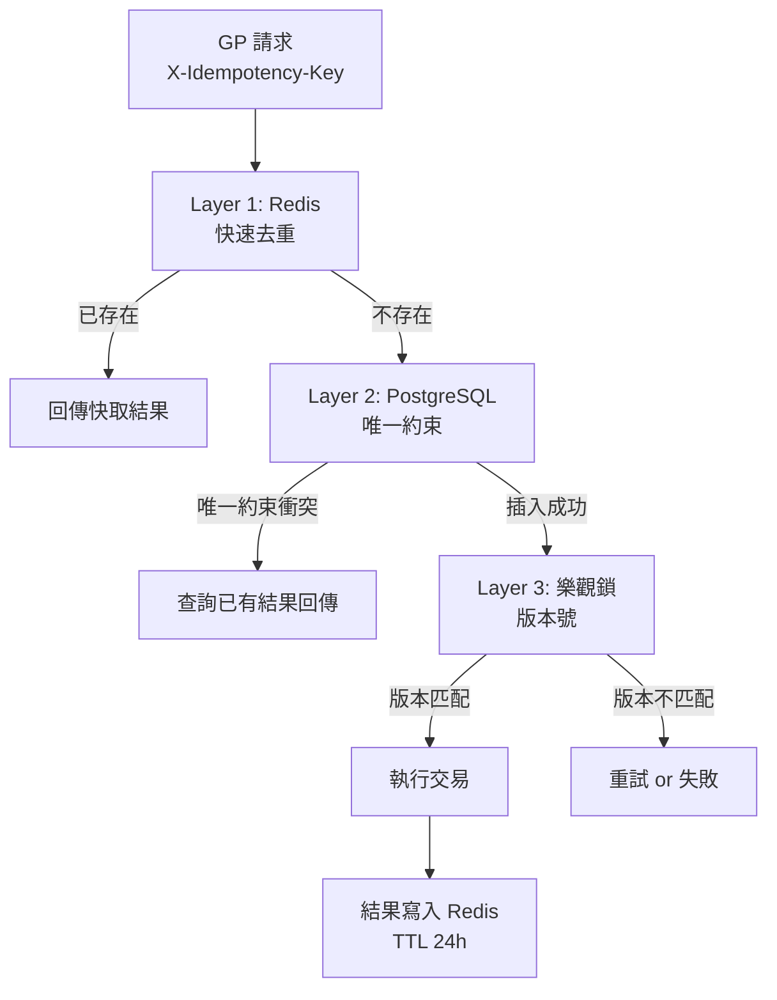

# ADR-015: 三層冪等防護

## 狀態

已接受 (Accepted)

## 背景

Seamless Wallet API 面對遊戲供應商重試、網路超時、併發請求等場景，必須保證交易冪等性——同一交易 ID 無論重試幾次，只執行一次扣款/加款。

單層冪等（如純 Redis 檢查）存在以下風險：
1. Redis 宕機時冪等保護失效
2. Redis ↔ DB 一致性問題
3. 高併發下 Redis check-and-set 非原子

## 決策

### 三層冪等架構



### Layer 1: Redis 快速去重

```java
@Component
@RequiredArgsConstructor
public class IdempotencyRedisChecker {

    private final RedisTemplate<String, String> redisTemplate;
    private static final Duration IDEMPOTENCY_TTL = Duration.ofHours(24);

    /**
     * 檢查並鎖定冪等 Key
     * @return 已存在的快取結果，或 empty 表示首次請求
     */
    public Option<String> checkAndLock(String idempotencyKey) {
        String key = "idempotency:" + idempotencyKey;

        // SET NX: 原子性設定 (不存在才設定)
        Boolean acquired = redisTemplate.opsForValue()
            .setIfAbsent(key, "PROCESSING", IDEMPOTENCY_TTL);

        if (Boolean.FALSE.equals(acquired)) {
            // Key 已存在 → 查詢已有結果
            String cached = redisTemplate.opsForValue().get(key);
            if (!"PROCESSING".equals(cached)) {
                return Option.of(cached); // 回傳快取結果
            }
            // 仍在處理中 → 等待或重試
            throw new ConcurrentProcessingException(idempotencyKey);
        }

        return Option.none(); // 首次請求，繼續處理
    }

    public void cacheResult(String idempotencyKey, String result) {
        redisTemplate.opsForValue().set(
            "idempotency:" + idempotencyKey, result, IDEMPOTENCY_TTL);
    }
}
```

### Layer 2: PostgreSQL 唯一約束

```sql
CREATE TABLE t_transaction (
    id              BIGSERIAL PRIMARY KEY,
    tenant_id       BIGINT NOT NULL,
    player_id       BIGINT NOT NULL,
    idempotency_key VARCHAR(64) NOT NULL,
    type            VARCHAR(20) NOT NULL,   -- DEBIT, CREDIT, ROLLBACK
    amount          DECIMAL(19,4) NOT NULL,
    balance_before  DECIMAL(19,4) NOT NULL,
    balance_after   DECIMAL(19,4) NOT NULL,
    status          VARCHAR(20) NOT NULL,
    reference_id    VARCHAR(100),
    created_at      TIMESTAMP NOT NULL DEFAULT NOW(),
    -- 唯一約束保證冪等
    CONSTRAINT uk_transaction_idempotency UNIQUE (tenant_id, idempotency_key)
);
```

當 Redis 不可用或 check-and-set 競態時，PostgreSQL 唯一約束作為最終防線：

```java
@Transactional(rollbackFor = Throwable.class)
public TransactionResult executeDebit(DebitRequest request) {
    try {
        // 嘗試插入交易記錄
        transactionDao.insert(TransactionEntity.from(request));
        // 插入成功 → 執行扣款
        walletDao.debit(request.getTenantId(), request.getPlayerId(), request.getAmount());
        return TransactionResult.success(...);
    } catch (DuplicateKeyException e) {
        // 唯一約束衝突 → 冪等重複請求
        return transactionDao.findByIdempotencyKey(
            request.getTenantId(), request.getIdempotencyKey()
        ).map(TransactionResult::fromExisting)
         .getOrElseThrow(() -> new IllegalStateException("Phantom duplicate"));
    }
}
```

### Layer 3: 樂觀鎖

```sql
-- 錢包表帶版本號
CREATE TABLE t_wallet (
    id          BIGSERIAL PRIMARY KEY,
    tenant_id   BIGINT NOT NULL,
    player_id   BIGINT NOT NULL,
    wallet_type VARCHAR(10) NOT NULL,
    balance     DECIMAL(19,4) NOT NULL DEFAULT 0,
    lock_amount DECIMAL(19,4) NOT NULL DEFAULT 0,
    version     BIGINT NOT NULL DEFAULT 0,  -- 樂觀鎖版本
    updated_at  TIMESTAMP NOT NULL DEFAULT NOW(),
    CONSTRAINT uk_wallet UNIQUE (tenant_id, player_id, wallet_type)
);

-- 樂觀鎖更新
UPDATE t_wallet
SET balance = balance - #{amount},
    version = version + 1,
    updated_at = NOW()
WHERE tenant_id = #{tenantId}
  AND player_id = #{playerId}
  AND wallet_type = #{walletType}
  AND balance >= #{amount}
  AND version = #{expectedVersion};
-- 返回 affected rows: 0 = 餘額不足或版本衝突
```

### 完整流程

```
1. GP 發送 Debit 請求 (帶 X-Idempotency-Key)
2. Layer 1: Redis SETNX → 已存在? 返回快取結果
3. Layer 2: INSERT t_transaction → 唯一約束衝突? 返回已有結果
4. Layer 3: UPDATE t_wallet WHERE version = ? → 0 rows? 重試或失敗
5. 成功 → 結果寫回 Redis (TTL 24h)
6. 回傳結果給 GP
```

## 後果

- 正向：三層遞進保護，任一層失效仍有下層兜底
- 正向：Redis 宕機時 PostgreSQL 仍能保證冪等
- 正向：高併發下樂觀鎖避免悲觀鎖的效能瓶頸
- 負向：實作複雜度增加
- 負向：Redis + DB 雙寫帶來一致性管理成本

## 相關

- ADR-013: 三層冪等邏輯位於 Manager 層 (WalletManager)
- Seamless Wallet 5 端點全部適用此設計
