# 跨模組邊界情境技術規格

> **目的**: 提供 BS-01~BS-12 的詳細實作規範，包括序列圖、API 契約、狀態機、錯誤處理和測試場景
> **適用對象**: 後端架構師、開發團隊、QA 自動化
> **版本**: v1.0 (2026-03-25)

---

## BS-01：Token 過期 × 流水進度 — Resettlement 補發流程

**決策**: 流水照計，Credit 走 Resettlement 人工補發路徑（Ch4 §4.3 預留）

### 序列圖

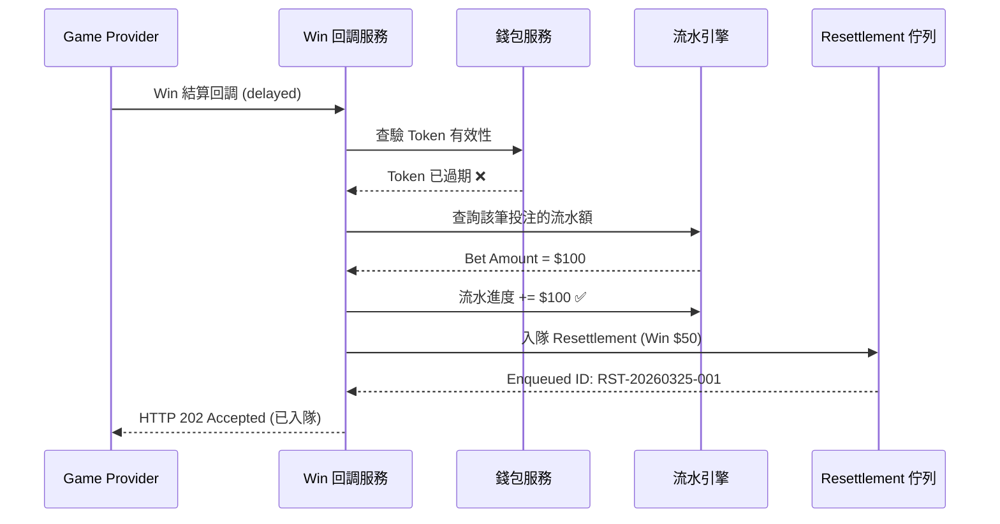
```mermaid
sequenceDiagram
    participant GP as Game Provider
    participant Callback as Win 回調服務
    participant WalletSvc as 錢包服務
    participant WageringEngine as 流水引擎
    participant ResettlementQueue as Resettlement 佇列

    GP->>Callback: Win 結算回調 (delayed)
    Callback->>WalletSvc: 查驗 Token 有效性
    WalletSvc-->>Callback: Token 已過期 ❌
    Callback->>WageringEngine: 查詢該筆投注的流水額
    WageringEngine-->>Callback: Bet Amount = $100
    Callback->>WageringEngine: 流水進度 += $100 ✅
    Callback->>ResettlementQueue: 入隊 Resettlement (Win $50)
    ResettlementQueue-->>Callback: Enqueued ID: RST-20260325-001
    Callback-->>GP: HTTP 202 Accepted (已入隊)
```

### API 契約

#### 1. Win 回調接收

```yaml
POST /api/seamless/win-callback
Content-Type: application/json

Request:
  gameRoundId: "GP-20260325-1234"
  playerId: 12345
  token: "tok_expired_abc123"
  winAmount: 50.00
  currency: "USD"
  timestamp: 1711357200

Response (Token 有效):
  status: 200
  body:
    success: true
    newBalance: 450.00
    transactionId: "txn_20260325_1"

Response (Token 過期):
  status: 202
  body:
    success: false
    reason: "token_expired"
    resettlementId: "rst_20260325_001"
    wagering:
      incrementedBy: 100.00
      newProgressPercent: 45
    action: "MANUAL_RESETTLEMENT_QUEUED"
```

#### 2. Resettlement 查詢

```yaml
GET /api/resettlement/{resettlementId}
Response:
  resettlementId: "rst_20260325_001"
  playerId: 12345
  status: "PENDING" | "APPROVED" | "PAID" | "REJECTED"
  amount: 50.00
  wagingCredit: 100.00
  approvedAt: "2026-03-26T10:00:00Z"
  paidAt: "2026-03-26T14:30:00Z"
  notes: "Win 到達於 Token 過期後，已計流水，待 CS 審批 Credit"
```

### 狀態機

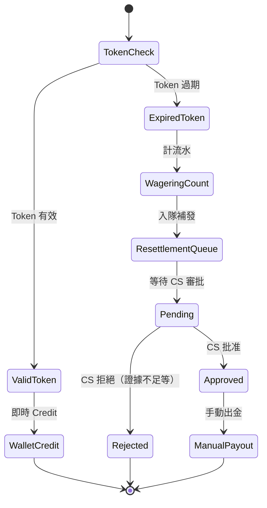
```mermaid
stateDiagram-v2
    [*] --> TokenCheck
    TokenCheck --> ValidToken: Token 有效
    TokenCheck --> ExpiredToken: Token 過期

    ValidToken --> WalletCredit: 即時 Credit
    WalletCredit --> [*]

    ExpiredToken --> WageringCount: 計流水
    WageringCount --> ResettlementQueue: 入隊補發
    ResettlementQueue --> Pending: 等待 CS 審批
    Pending --> Approved: CS 批准
    Pending --> Rejected: CS 拒絕（證據不足等）
    Approved --> ManualPayout: 手動出金
    Rejected --> [*]
    ManualPayout --> [*]
```

### 錯誤處理與回滾

| 錯誤場景 | 觸發條件 | 恢復行為 |
|---------|---------|--------|
| Wagering Count 失敗 | 流水引擎不可達 | 回調重試（最多 3 次，退避策略） |
| Resettlement Queue 滿 | 訊息佇列溢出 | 轉 Dead Letter Queue (DLQ)，告警財務團隊 |
| 重複回調 | 同一 gameRoundId 多次接收 | 依 idempotency key 確保單次計流、單次入隊 |

### 測試場景

```gherkin
Scenario: BS-01-T01 正常流程 — Token 過期後 Win 回調補發
  Given 玩家進行流水 (進度 30%)
  And Token 設置在 10 分鐘後過期
  When 15 分鐘後接收 Win 回調 ($50)
  Then 流水進度應更新為 30% + $100/$15000 = 30.67%
  And Resettlement 應入隊 (status=PENDING, amount=$50)

Scenario: BS-01-T02 多次重複回調的冪等性
  Given BS-01-T01 的狀態
  When 收到相同 gameRoundId 的第 2 次 Win 回調
  Then 流水進度應保持不變 (已計過)
  And 不應重複入隊

Scenario: BS-01-T03 Resettlement CS 審批流程
  Given Resettlement ID = rst_20260325_001
  When CS 審核後調用 POST /api/resettlement/rst_20260325_001/approve
  Then 系統應觸發手動出金 (paymentId=pmt_xxx)
  And 玩家收到通知: "您的贏額已由管理員補發"
```

---

## BS-02：紅利過期 × 未結算投注結算 — 錢包路由邏輯

**決策**: Win 歸 CASH，免除流水要求

### 序列圖

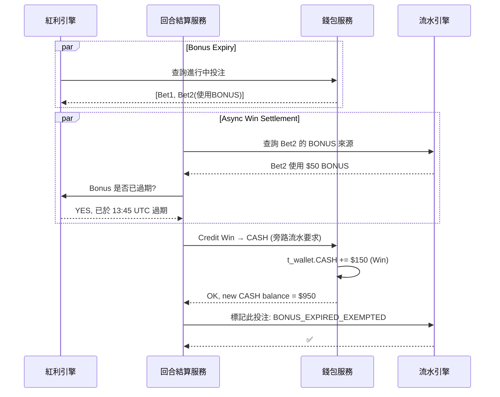
```mermaid
sequenceDiagram
    participant BonusEngine as 紅利引擎
    participant RoundSettlement as 回合結算服務
    participant WalletSvc as 錢包服務
    participant WageringEngine as 流水引擎

    par Bonus Expiry
        BonusEngine->>WalletSvc: 查詢進行中投注
        WalletSvc-->>BonusEngine: [Bet1, Bet2(使用BONUS)]
    end
    par Async Win Settlement
        RoundSettlement->>WageringEngine: 查詢 Bet2 的 BONUS 來源
        WageringEngine-->>RoundSettlement: Bet2 使用 $50 BONUS
        RoundSettlement->>BonusEngine: Bonus 是否已過期?
        BonusEngine-->>RoundSettlement: YES, 已於 13:45 UTC 過期
    end
    RoundSettlement->>WalletSvc: Credit Win → CASH (旁路流水要求)
    WalletSvc->>WalletSvc: t_wallet.CASH += $150 (Win)
    WalletSvc-->>RoundSettlement: OK, new CASH balance = $950
    RoundSettlement->>WageringEngine: 標記此投注: BONUS_EXPIRED_EXEMPTED
    WageringEngine-->>RoundSettlement: ✅
```

### API 契約

#### 1. Win 結算檢查

```yaml
POST /api/round-settlement/settle-with-routing
Request:
  gameRoundId: "gp-20260325-5678"
  playerId: 12345
  result:
    status: "WIN"
    amount: 150.00
  checkBonusExpiry: true

Response:
  status: 200
  body:
    success: true
    settlement:
      roundId: "gp-20260325-5678"
      targetWallet: "CASH"  # 路由決策：應為 BONUS，但 BONUS 已過期
      winAmount: 150.00
      wageringExemption: true  # 免除流水檢查
      routingReason: "BONUS_EXPIRED_BEFORE_SETTLEMENT"
      newBalances:
        CASH: 950.00
        BONUS: 0.00
        CREDIT: 0.00
      exemptionExpiry: "2026-04-24T23:59:59Z"  # 提款 30 天內有效
```

#### 2. 提款時驗證

```yaml
POST /api/withdrawal/verify-exemption
Request:
  playerId: 12345
  withdrawalAmount: 150.00
  withdrawalCurrency: "USD"

Response:
  status: 200
  body:
    success: true
    exemptionApplies: true
    message: "該筆 Win 無流水要求，允許提款"
    exemptionExpiry: "2026-04-24T23:59:59Z"
```

### 狀態轉移

```
User Bet (BONUS 資金) → Round In Progress → Bonus Expires
                                               ↓
                                    Win Settlement Triggered
                                               ↓
                          Check: Bonus 已過期 → YES
                                               ↓
                           Route Win → CASH + EXEMPTION_FLAG
                                               ↓
                       Withdrawal (無流水檢查) → Success
```

### 錯誤處理與回滾

| 錯誤 | 條件 | 恢復 |
|-----|------|------|
| Bonus 過期判定延遲 | BonusEngine 滯後 | Win 先入 BONUS 臨時轉帳，后續 cleanup 轉 CASH |
| EXEMPTION_FLAG 丟失 | 資料庫事務中斷 | 依 Win 來源 (gameRoundId) 重建，查 BONUS 狀態 |
| 提款超過 30 天 | 玩家延遲提款 | 拒絕提款，告知流水要求適用 |

### 測試場景

```gherkin
Scenario: BS-02-T01 紅利過期，投注結算為 WIN
  Given 玩家持有 $500 BONUS，流水 30% (需 $15,000)
  And 投注 $50 BONUS，投注額 = $50
  And BONUS 於 13:45 UTC 過期
  When 15:00 UTC 投注結算，Win = $150
  Then Win 應入 CASH (旁路 BONUS)
  And 流水不應計算
  And EXEMPTION_FLAG 有效期至 2026-04-24

Scenario: BS-02-T02 超過豁免期提款
  Given BS-02-T01 的結算
  And 當前時間 = 2026-04-25 10:00 UTC
  When 玩家嘗試提款 $150
  Then 系統應拒絕，告知「流水不足 (0% / 100%)」

Scenario: BS-02-T03 多筆 BONUS 投注結算
  Given 玩家有 2 筆使用 BONUS 的投注
  Bet1 ($50): 於 14:00 UTC 結算 WIN ($100)，此時 BONUS 已過期
  Bet2 ($30): 於 16:00 UTC 結算 LOSS，此時 BONUS 已過期
  Then Bet1 Win ($100) → CASH + EXEMPTION_FLAG
  And Bet2 Loss → BONUS 不扣（已為 0）
```

---

## BS-03：GP 維護 × 回合超時 — 優先級邏輯

**決策**: GP 計畫維護 → 5 分鐘結算優先；非計畫中斷 → 2 小時超時；5 分鐘到期未結算 → 強制回滾

### 序列圖

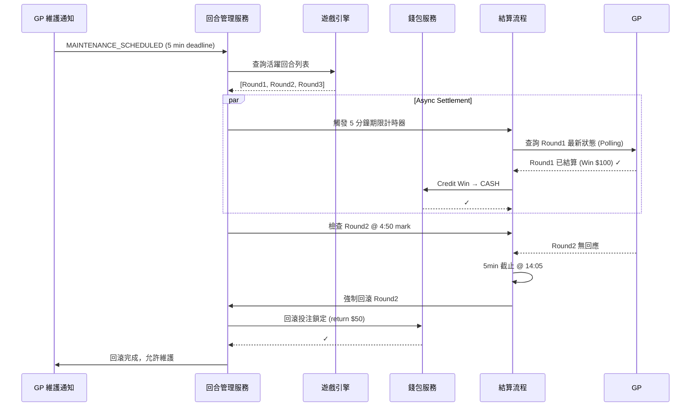
```mermaid
sequenceDiagram
    participant GPnotif as GP 維護通知
    participant RoundMgr as 回合管理服務
    participant GameEngine as 遊戲引擎
    participant Wallet as 錢包服務
    participant Settlement as 結算流程

    GPnotif->>RoundMgr: MAINTENANCE_SCHEDULED (5 min deadline)
    RoundMgr->>GameEngine: 查詢活躍回合列表
    GameEngine-->>RoundMgr: [Round1, Round2, Round3]

    par Async Settlement
        RoundMgr->>Settlement: 觸發 5 分鐘期限計時器
        Settlement->>GP: 查詢 Round1 最新狀態 (Polling)
        GP-->>Settlement: Round1 已結算 (Win $100) ✓
        Settlement->>Wallet: Credit Win → CASH
        Wallet-->>Settlement: ✓
    end

    RoundMgr->>Settlement: 檢查 Round2 @ 4:50 mark
    GP-->>Settlement: Round2 無回應
    Settlement->>Settlement: 5min 截止 @ 14:05
    Settlement->>RoundMgr: 強制回滾 Round2
    RoundMgr->>Wallet: 回滾投注鎖定 (return $50)
    Wallet-->>RoundMgr: ✓
    RoundMgr->>GPnotif: 回滾完成，允許維護
```

### API 契約

#### 1. 維護通知

```yaml
POST /api/gp/maintenance-schedule
Request:
  gpId: "gp_evolution"
  startAt: "2026-03-25T14:00:00Z"
  endAt: "2026-03-25T14:30:00Z"
  plannedMaintenance: true
  deadlineSeconds: 300  # 5 分鐘

Response:
  status: 200
  body:
    maintenanceId: "mnt_20260325_001"
    gracePeriodMs: 300000
    affectedRounds: 7
    settlementStrategy: "PLANNED_MAINTENANCE"
```

#### 2. 回合結算狀態查詢（帶 timeout）

```yaml
GET /api/rounds/{roundId}/settle-status?deadline=2026-03-25T14:05:00Z
Response (結算成功):
  status: 200
  body:
    roundId: "round_123"
    gpStatus: "SETTLED"
    winAmount: 100.00
    settledAt: "2026-03-25T14:02:15Z"

Response (結算超時):
  status: 408
  body:
    error: "SETTLEMENT_TIMEOUT"
    action: "AUTO_ROLLBACK_INITIATED"
    betAmount: 50.00
    refundedAt: "2026-03-25T14:05:01Z"
```

### 狀態機

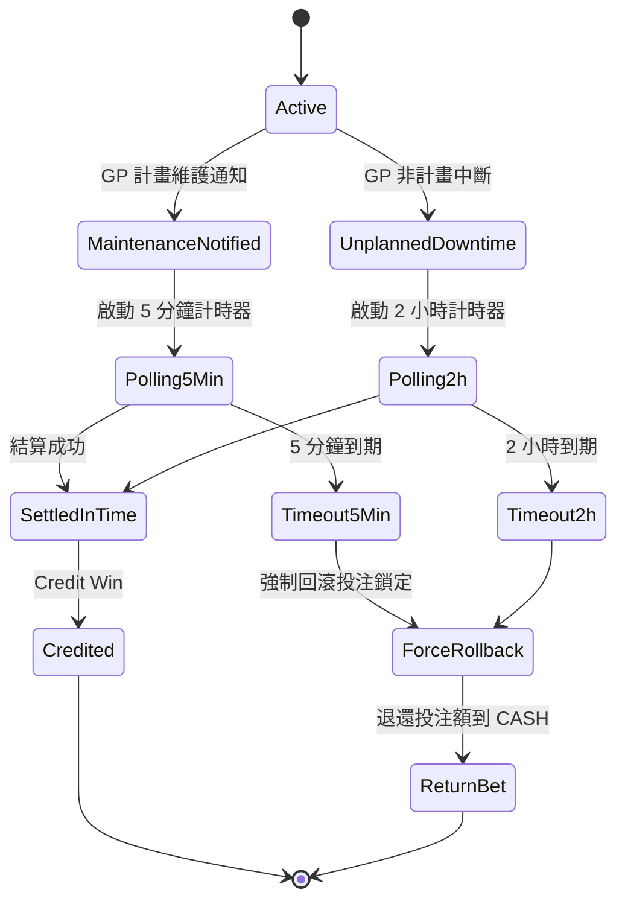
```mermaid
stateDiagram-v2
    [*] --> Active
    Active --> MaintenanceNotified: GP 計畫維護通知
    Active --> UnplannedDowntime: GP 非計畫中斷

    MaintenanceNotified --> Polling5Min: 啟動 5 分鐘計時器
    Polling5Min --> SettledInTime: 結算成功
    Polling5Min --> Timeout5Min: 5 分鐘到期

    SettledInTime --> Credited: Credit Win
    Credited --> [*]

    Timeout5Min --> ForceRollback: 強制回滾投注鎖定
    ForceRollback --> ReturnBet: 退還投注額到 CASH
    ReturnBet --> [*]

    UnplannedDowntime --> Polling2h: 啟動 2 小時計時器
    Polling2h --> SettledInTime
    Polling2h --> Timeout2h: 2 小時到期
    Timeout2h --> ForceRollback
```

### 錯誤處理與回滾

| 場景 | 處理 |
|------|------|
| 回滾失敗（錢包不可達） | 重試 3 次，最後入 DLQ 由財務手動處理 |
| GP 詐稱維護完成但仍不可用 | 繼續適用 2 小時超時（不信任 GP 信號） |
| 回合已部分結算（某些回合成功，某些超時） | 個別處理，分別 Credit 或 Rollback |

### 測試場景

```gherkin
Scenario: BS-03-T01 計畫維護，回合及時結算
  Given GP 維護通知 (deadline=5min)
  And 3 個活躍回合
  When Round1 @ 3min 結算 (Win=$100)
  And Round2 @ 6min 無回應（超過 5 min deadline）
  Then Round1 → Credit Win ✓
  And Round2 → 強制回滾，退還 $50 到 CASH

Scenario: BS-03-T02 非計畫中斷，2 小時超時
  Given GP 非計畫中斷
  And Round3 未結算
  When 等待 120 分鐘
  Then Round3 → 強制回滾

Scenario: BS-03-T03 維護期間多回合混合結果
  Given 5 個活躍回合
  When 4 個在 5 min 內結算，1 個超時
  Then 4 個應逐一 Credit
  And 1 個應回滾
  And 回合管理服務應標記維護狀態 CLEANUP_COMPLETE
```

---

## BS-04：自我排除 × 代理信用結算中投注 — 等待結算狀態機

**決策**: 等待結算完成後凍結（不強制回滾）

### 序列圖

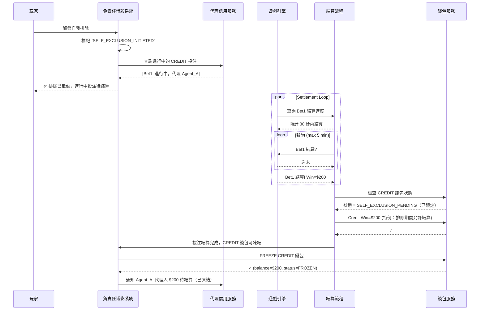
```mermaid
sequenceDiagram
    participant Player as 玩家
    participant RGSystem as 負責任博彩系統
    participant CreditSystem as 代理信用服務
    participant GameEngine as 遊戲引擎
    participant Settlement as 結算流程
    participant Wallet as 錢包服務

    Player->>RGSystem: 觸發自我排除
    RGSystem->>RGSystem: 標記 `SELF_EXCLUSION_INITIATED`
    RGSystem->>CreditSystem: 查詢進行中的 CREDIT 投注
    CreditSystem-->>RGSystem: [Bet1: 進行中，代理 Agent_A]
    RGSystem-->>Player: ✅ 排除已啟動，進行中投注待結算

    par Settlement Loop
        GameEngine->>Settlement: 查詢 Bet1 結算進度
        Settlement-->>GameEngine: 預計 30 秒內結算
        loop 輪詢 (max 5 min)
            Settlement->>GameEngine: Bet1 結算?
            GameEngine-->>Settlement: 還未
        end
        GameEngine-->>Settlement: Bet1 結算! Win=$200
    end

    Settlement->>Wallet: 檢查 CREDIT 錢包狀態
    Wallet-->>Settlement: 狀態 = SELF_EXCLUSION_PENDING（已鎖定）
    Settlement->>Wallet: Credit Win=$200 (特例：排除期間允許結算)
    Wallet-->>Settlement: ✓
    Settlement->>RGSystem: 投注結算完成，CREDIT 錢包可凍結
    RGSystem->>Wallet: FREEZE CREDIT 錢包
    Wallet-->>RGSystem: ✓ (balance=$200, status=FROZEN)
    RGSystem->>CreditSystem: 通知 Agent_A: 代理人 $200 待結算（已凍結）
```

### API 契約

#### 1. 自我排除入口

```yaml
POST /api/responsible-gambling/self-exclude
Request:
  playerId: 12345
  reason: "personal_choice"
  excludePeriod: 30  # days

Response:
  status: 200
  body:
    exclusionId: "excl_20260325_001"
    status: "ACTIVE"
    appliedAt: "2026-03-25T10:30:00Z"
    expiresAt: "2026-04-24T23:59:59Z"
    creditWalletStatus: "WAITING_FOR_SETTLEMENT"
    inProgressBets:
      - betId: "bet_001"
        agentId: "agent_a"
        amount: 50.00
        estimatedSettlementTime: "30s"
```

#### 2. 結算完成後凍結

```yaml
POST /api/responsible-gambling/finalize-freeze
Request:
  exclusionId: "excl_20260325_001"
  creditWalletBalance: 200.00

Response:
  status: 200
  body:
    success: true
    frozenWallets: ["CREDIT"]  # CASH 和 BONUS 也凍結，但 CREDIT 特殊處理
    creditReleaseLink: "https://platform/agent-portal/credit-settlement/excl_001"
    message: "代理信用已凍結，待代理確認清算"
```

### 狀態機（Ch15 自我排除 SLA）

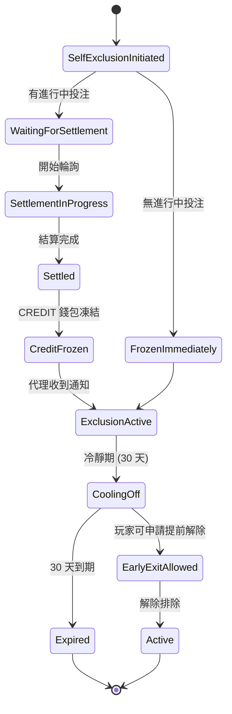
```mermaid
stateDiagram-v2
    [*] --> SelfExclusionInitiated
    SelfExclusionInitiated --> WaitingForSettlement: 有進行中投注
    SelfExclusionInitiated --> FrozenImmediately: 無進行中投注

    WaitingForSettlement --> SettlementInProgress: 開始輪詢
    SettlementInProgress --> Settled: 結算完成
    Settled --> CreditFrozen: CREDIT 錢包凍結

    CreditFrozen --> ExclusionActive: 代理收到通知
    FrozenImmediately --> ExclusionActive

    ExclusionActive --> CoolingOff: 冷靜期 (30 天)
    CoolingOff --> EarlyExitAllowed: 玩家可申請提前解除
    CoolingOff --> Expired: 30 天到期
    EarlyExitAllowed --> Active: 解除排除
    Expired --> [*]
    Active --> [*]
```

### 錯誤處理與回滾

| 錯誤 | 條件 | 恢復 |
|-----|------|------|
| 結算超時 (> 5 min) | GP 未返回結果 | 強制回滾投注（特例：與 BS-04 異）+ 凍結 CREDIT |
| 代理信用額度不足 | 結算時代理已清算 | 記錄負餘額，等代理月結補缴 |
| 凍結失敗 | 錢包服務不可達 | 重試，超過 3 次轉 DLQ |

### 測試場景

```gherkin
Scenario: BS-04-T01 代理信用投注待結算期間自我排除
  Given 玩家通過代理信用下注 ($50)
  And 投注處於「進行中」狀態 (還未結算)
  When 玩家啟動自我排除
  Then 系統應標記 WAITING_FOR_SETTLEMENT
  And 玩家應收到: "排除已啟動，進行中投注結算後生效"

  When 投注結算 (Win=$200)
  Then CREDIT 錢包應被凍結 (balance=$200, status=FROZEN)
  And Agent_A 應收到通知: "$200 代理信用待清算"

Scenario: BS-04-T02 結算超過 5 分鐘超時
  Given BS-04-T01 的狀態
  When 5 分鐘後投注仍未結算
  Then 系統應執行強制回滾 (return $50)
  And CREDIT 錢包應立即凍結 (balance=$0)
  And 記錄: SELF_EXCLUSION_TIMEOUT_ROLLBACK

Scenario: BS-04-T03 多筆 CREDIT 投注並發結算
  Given 玩家有 3 筆 CREDIT 投注進行中
  When 自我排除觸發
  And 3 筆投注在 2 秒內逐一結算
  Then 全部 3 筆應正常 Credit
  And CREDIT 錢包應於最後一筆結算後凍結
  And 凍結前鎖定額應為 0（無待結算投注）
```

---

## BS-05：出金請求 × 流水驗證時序 — 同步/非同步降級

**決策**: 同步驗證 (< 1s)，超時降級至非同步佇列（Ch2 §2.16）

### 序列圖

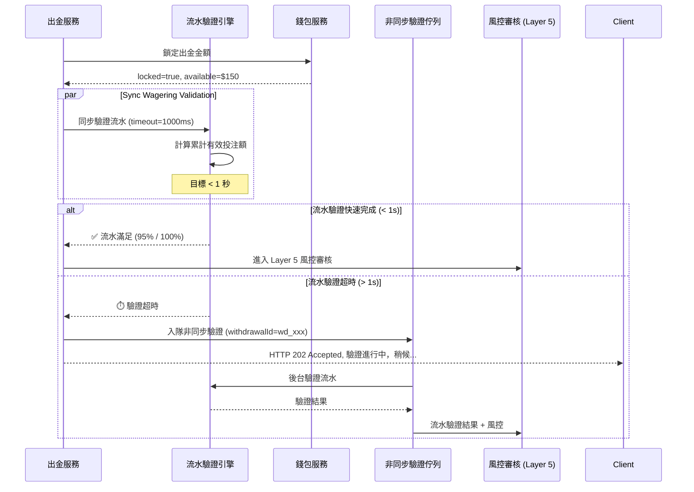
```mermaid
sequenceDiagram
    participant Withdrawal as 出金服務
    participant WageringValidator as 流水驗證引擎
    participant WalletSvc as 錢包服務
    participant AsyncQueue as 非同步驗證佇列
    participant RiskCheck as 風控審核 (Layer 5)

    Withdrawal->>WalletSvc: 鎖定出金金額
    WalletSvc-->>Withdrawal: locked=true, available=$150

    par Sync Wagering Validation
        Withdrawal->>WageringValidator: 同步驗證流水 (timeout=1000ms)
        WageringValidator->>WageringValidator: 計算累計有效投注額
        Note over WageringValidator: 目標 < 1 秒
    end

    alt 流水驗證快速完成 (< 1s)
        WageringValidator-->>Withdrawal: ✅ 流水滿足 (95% / 100%)
        Withdrawal->>RiskCheck: 進入 Layer 5 風控審核
    else 流水驗證超時 (> 1s)
        WageringValidator-->>Withdrawal: ⏱️ 驗證超時
        Withdrawal->>AsyncQueue: 入隊非同步驗證 (withdrawalId=wd_xxx)
        Withdrawal-->>Client: HTTP 202 Accepted, 驗證進行中，稍候...
        AsyncQueue->>WageringValidator: 後台驗證流水
        WageringValidator-->>AsyncQueue: 驗證結果
        AsyncQueue->>RiskCheck: 流水驗證結果 + 風控
    end
```

### API 契約

#### 1. 出金請求 — 同步優先

```yaml
POST /api/withdrawal/request
Request:
  playerId: 12345
  amount: 150.00
  currency: "USD"
  method: "bank_transfer"
  syncValidationTimeout: 1000  # ms

Response (流水驗證快速完成):
  status: 200
  body:
    withdrawalId: "wd_20260325_001"
    status: "PENDING_RISK_REVIEW"
    wageringCheck:
      status: "PASSED"
      progressPercent: 95
      requiredAmount: 15000
      fulfilledAmount: 14250
    estimatedPayout: "2026-03-25T16:00:00Z"  # VIP Diamond 15min SLA

Response (流水驗證超時):
  status: 202
  body:
    withdrawalId: "wd_20260325_002"
    status: "WAGERING_VALIDATION_PENDING"
    wageringCheck:
      status: "PENDING_ASYNC"
      asyncJobId: "job_wagering_001"
      estimatedCompletionMs: 3000
    message: "流水驗證進行中，將在後台完成，預計 3 秒"
```

#### 2. 非同步驗證狀態查詢

```yaml
GET /api/withdrawal/{withdrawalId}/async-status?jobId=job_wagering_001
Response:
  status: 200
  body:
    jobId: "job_wagering_001"
    status: "COMPLETED"
    result:
      wageringPassed: true
      progressPercent: 95
    nextAction: "FORWARDED_TO_RISK_REVIEW"
```

### 狀態轉移圖

```
出金請求到達
    ↓
[鎖定金額]
    ↓
流水驗證 (1s timeout)
    ├─ < 1s ✅ → 風控審核 (Layer 5) → 處理出金
    └─ > 1s ⏱️ → 入隊非同步驗證
         ↓
         玩家可提前查詢狀態
         ↓
         驗證完成 → 風控審核 → 處理出金
         ↓
         驗證失敗 → 拒絕出金，釋放鎖定
```

### 錯誤處理與回滾

| 錯誤 | 觸發 | 恢復 |
|-----|------|------|
| 流水計算異常 | DB 不可達、計算邏輯錯誤 | 入隊 DLQ，財務手動驗證 |
| 鎖定超時未解除 | 風控審核掛起 | 24 小時自動解除鎖定 + 告警 |
| 非同步驗證丟失 | 訊息佇列崩潰 | 依 withdrawalId 查詢並重新驗證 |

### 測試場景

```gherkin
Scenario: BS-05-T01 快速同步流水驗證
  Given 玩家流水進度 95%
  When 發起出金請求 ($150)
  Then 響應時間應 < 1.5s
  And 狀態應為 PENDING_RISK_REVIEW
  And 流水驗證應顯示 PASSED

Scenario: BS-05-T02 流水驗證超時降級至非同步
  Given 流水引擎響應延遲 (模擬 2s)
  When 發起出金請求
  Then 響應應為 HTTP 202 Accepted
  And 包含 asyncJobId
  And 玩家應能持續遊玩（出金不阻斷遊戲）

Scenario: BS-05-T03 非同步驗證失敗，出金拒絕
  Given BS-05-T02 的狀態
  When 非同步驗證返回: 流水進度 = 30% (不滿足)
  Then 系統應拒絕出金
  And 釋放鎖定金額
  And 通知玩家: "流水不足，還需 $X 投注額"

Scenario: BS-05-T04 多個並發出金請求
  Given 玩家可下注餘額 = $500
  When 同時發起 2 個 $250 出金請求
  Then 第 1 個應鎖定 $250，第 2 個應失敗 (insufficient)
  Or 若兩個都在驗證隊列，應串行處理，只允許 1 個
```

---

## BS-06：VIP 降級 × 進行中紅利 — 紅利隔離生命週期

**決策**: 已領取紅利繼續有效至原定過期日，不因降級沒收

### 序列圖

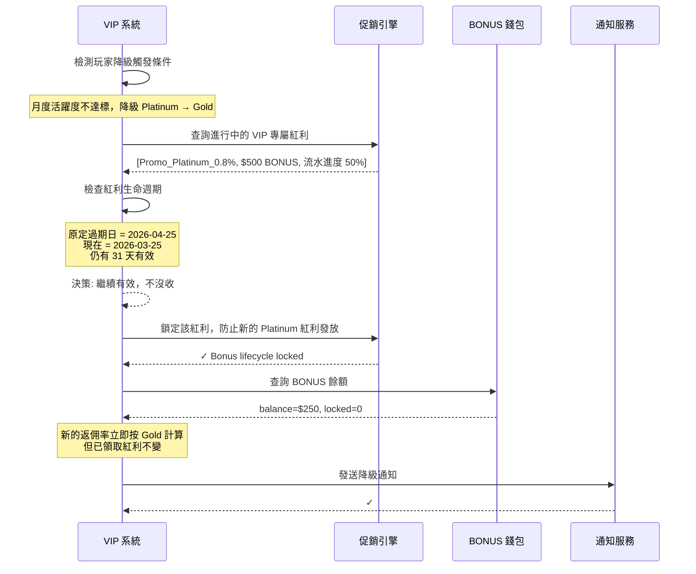
```mermaid
sequenceDiagram
    participant VIPSystem as VIP 系統
    participant PromotionEngine as 促銷引擎
    participant BonusWallet as BONUS 錢包
    participant NotificationSvc as 通知服務

    VIPSystem->>VIPSystem: 檢測玩家降級觸發條件
    Note over VIPSystem: 月度活躍度不達標，降級 Platinum → Gold

    VIPSystem->>PromotionEngine: 查詢進行中的 VIP 專屬紅利
    PromotionEngine-->>VIPSystem: [Promo_Platinum_0.8%, $500 BONUS, 流水進度 50%]

    VIPSystem->>VIPSystem: 檢查紅利生命週期
    Note over VIPSystem: 原定過期日 = 2026-04-25<br/>現在 = 2026-03-25<br/>仍有 31 天有效

    VIPSystem-->>VIPSystem: 決策: 繼續有效，不沒收

    VIPSystem->>PromotionEngine: 鎖定該紅利，防止新的 Platinum 紅利發放
    PromotionEngine-->>VIPSystem: ✓ Bonus lifecycle locked

    VIPSystem->>BonusWallet: 查詢 BONUS 餘額
    BonusWallet-->>VIPSystem: balance=$250, locked=0

    Note over VIPSystem: 新的返佣率立即按 Gold 計算<br/>但已領取紅利不變

    VIPSystem->>NotificationSvc: 發送降級通知
    NotificationSvc-->>VIPSystem: ✓
```

### API 契約

#### 1. 降級觸發與紅利隔離

```yaml
POST /api/vip/tier-change
Request:
  playerId: 12345
  newTier: "GOLD"
  reason: "insufficient_monthly_activity"

Response:
  status: 200
  body:
    tierId: "tier_change_20260325_001"
    oldTier: "PLATINUM"
    newTier: "GOLD"
    effectiveAt: "2026-03-26T00:00:00Z"
    bonusLifecycle:
      - promotionId: "promo_plat_0.8_cashback"
        status: "LOCKED_CONTINUE"  # 不沒收，繼續有效
        bonusBalance: 250.00
        originalExpiryDate: "2026-04-25"
        reason: "降級前已獲得，保護期內"
      - promotionId: "new_gold_promo"
        status: "ELIGIBLE_AFTER_TRANSITION"
        firstAvailableAt: "2026-03-26T00:00:00Z"
    newCommissionRate: 0.7  # Gold level，立即生效
    oldCommissionRate: 0.8
```

#### 2. 紅利狀態查詢

```yaml
GET /api/promotions/player/{playerId}/active-bonuses
Response:
  status: 200
  body:
    bonuses:
      - bonusId: "bonus_001"
        name: "Platinum 0.8% Cashback"
        status: "ACTIVE_LOCKED"  # 鎖定但有效
        balance: 250.00
        wageringProgress: 50
        expiryDate: "2026-04-25"
        tierLocked: true
        message: "降級後該紅利保護至原定過期日"
```

### 狀態機

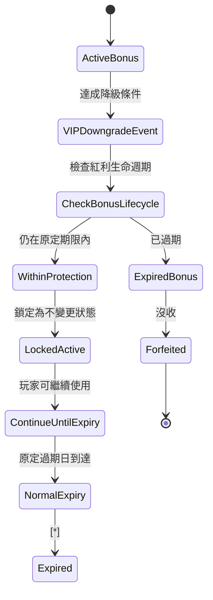
```mermaid
stateDiagram-v2
    [*] --> ActiveBonus
    ActiveBonus --> VIPDowngradeEvent: 達成降級條件

    VIPDowngradeEvent --> CheckBonusLifecycle: 檢查紅利生命週期
    CheckBonusLifecycle --> WithinProtection: 仍在原定期限內
    CheckBonusLifecycle --> ExpiredBonus: 已過期

    WithinProtection --> LockedActive: 鎖定為不變更狀態
    ExpiredBonus --> Forfeited: 沒收

    LockedActive --> ContinueUntilExpiry: 玩家可繼續使用
    ContinueUntilExpiry --> NormalExpiry: 原定過期日到達

    NormalExpiry --> Expired: [*]
    Forfeited --> [*]
```

### 錯誤處理與回滾

| 錯誤 | 條件 | 恢復 |
|-----|------|------|
| 紅利鎖定失敗 | PromotionEngine 不可達 | 重試，降級後禁止新紅利發放 (safe) |
| 返佣率更新延遲 | 計算引擎未同步 | 週期性對帳，發現差異後反向調整 |
| 升級後重新回到原級別 | 玩家回升至 Platinum | 原鎖定紅利繼續有效，新 Platinum 紅利可並行 |

### 測試場景

```gherkin
Scenario: BS-06-T01 降級，進行中紅利保護
  Given 玩家 Tier=PLATINUM，持有 Platinum 0.8% Cashback ($500, 流水 50%)
  And BONUS 過期日 = 2026-04-25
  When 玩家月度活躍度不達標，觸發降級
  Then 系統應檢測紅利仍在有效期內
  And 應標記該紅利 `LOCKED_CONTINUE`
  And 玩家應能繼續使用該紅利至原定過期日

Scenario: BS-06-T02 降級，已過期紅利沒收
  Given 玩家 Tier=PLATINUM，持有舊紅利 (過期日 2026-02-01)
  When 降級事件發生
  Then 系統應沒收該過期紅利
  And 不應產生客訴（已過期）

Scenario: BS-06-T03 返佣率立即更新
  Given 玩家降級 PLATINUM → GOLD
  And 舊返佣率 = 0.8%
  When 降級生效
  Then 新返佣率應立即為 0.7%
  And 現有投注應按 0.7% 計算返佣

Scenario: BS-06-T04 升級回原級別
  Given 玩家降級後 GOLD，持有鎖定的 PLATINUM 紅利
  When 玩家升級回 PLATINUM
  Then 原鎖定紅利應繼續有效（無新沒收）
  And 新的 PLATINUM 紅利應可並行發放
```

---

## BS-07：KYC 升級觸發 × 進行中交易 — KYC_UPGRADE_PENDING 狀態

**決策**: 不中斷進行中遊戲，回合結束後限制新投注/存款，允許提款

### 序列圖

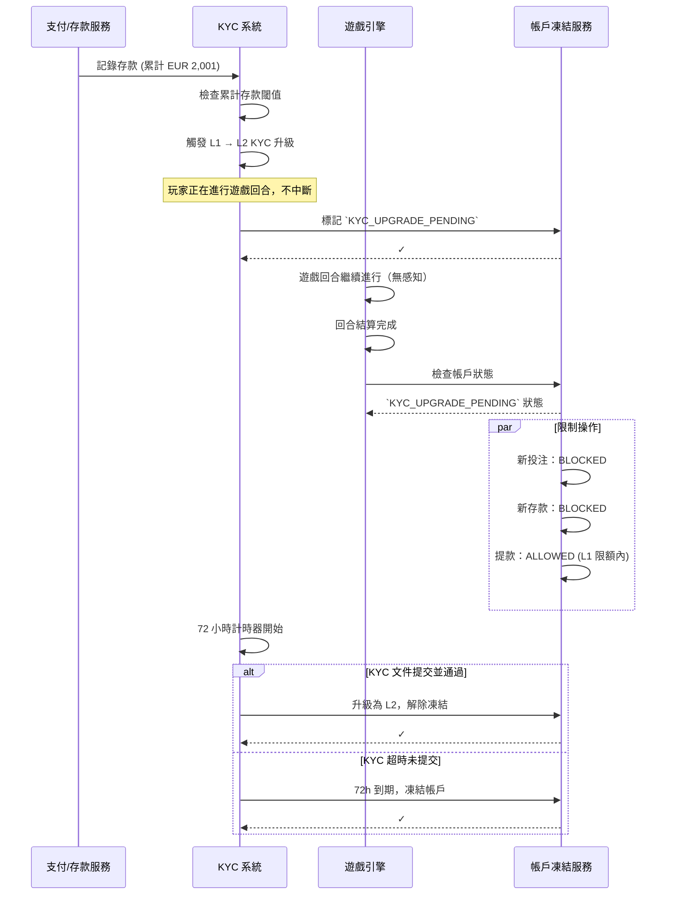
```mermaid
sequenceDiagram
    participant PaymentSvc as 支付/存款服務
    participant KYCSystem as KYC 系統
    participant GameEngine as 遊戲引擎
    participant AccountFreezer as 帳戶凍結服務

    PaymentSvc->>KYCSystem: 記錄存款 (累計 EUR 2,001)
    KYCSystem->>KYCSystem: 檢查累計存款閾值
    KYCSystem->>KYCSystem: 觸發 L1 → L2 KYC 升級

    Note over KYCSystem: 玩家正在進行遊戲回合，不中斷

    KYCSystem->>AccountFreezer: 標記 `KYC_UPGRADE_PENDING`
    AccountFreezer-->>KYCSystem: ✓

    GameEngine->>GameEngine: 遊戲回合繼續進行（無感知）
    GameEngine->>GameEngine: 回合結算完成

    GameEngine->>AccountFreezer: 檢查帳戶狀態
    AccountFreezer-->>GameEngine: `KYC_UPGRADE_PENDING` 狀態

    par 限制操作
        AccountFreezer->>AccountFreezer: 新投注：BLOCKED
        AccountFreezer->>AccountFreezer: 新存款：BLOCKED
        AccountFreezer->>AccountFreezer: 提款：ALLOWED (L1 限額內)
    end

    KYCSystem->>KYCSystem: 72 小時計時器開始

    alt KYC 文件提交並通過
        KYCSystem->>AccountFreezer: 升級為 L2，解除凍結
        AccountFreezer-->>KYCSystem: ✓
    else KYC 超時未提交
        KYCSystem->>AccountFreezer: 72h 到期，凍結帳戶
        AccountFreezer-->>KYCSystem: ✓
    end
```

### API 契約

#### 1. KYC 升級觸發

```yaml
POST /api/kyc/check-upgrade-trigger
Request:
  playerId: 12345
  cumulativeDeposits: 2001.00
  currency: "EUR"

Response:
  status: 200
  body:
    upgradeRequired: true
    currentLevel: "L1"
    nextLevel: "L2"
    trigger: "CUMULATIVE_DEPOSIT_THRESHOLD"
    requiredDocuments:
      - "proof_of_identity"
      - "proof_of_address"
    deadline: "2026-03-28T10:30:00Z"
    accountStatus: "KYC_UPGRADE_PENDING"
    restrictions:
      canPlay: true  # 進行中回合可完成
      canBet: false  # 新投注禁止
      canDeposit: false  # 新存款禁止
      canWithdraw: true  # 允許提款 (L1 限額內)
```

#### 2. 新投注檢查

```yaml
POST /api/games/place-bet
Request:
  playerId: 12345
  amount: 50.00

Response (KYC_UPGRADE_PENDING):
  status: 403
  body:
    error: "KYC_UPGRADE_PENDING"
    message: "帳戶升級 KYC 驗證中，新投注已禁止"
    deadline: "2026-03-28T10:30:00Z"
    action: "SUBMIT_KYC_DOCUMENTS"
```

### 狀態機

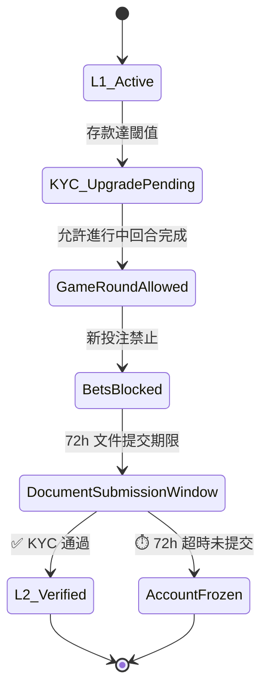
```mermaid
stateDiagram-v2
    [*] --> L1_Active
    L1_Active --> KYC_UpgradePending: 存款達閾值

    KYC_UpgradePending --> GameRoundAllowed: 允許進行中回合完成
    GameRoundAllowed --> BetsBlocked: 新投注禁止

    BetsBlocked --> DocumentSubmissionWindow: 72h 文件提交期限
    DocumentSubmissionWindow --> L2_Verified: ✅ KYC 通過
    DocumentSubmissionWindow --> AccountFrozen: ⏱️ 72h 超時未提交

    L2_Verified --> [*]
    AccountFrozen --> [*]
```

### 錯誤處理與回滾

| 錯誤 | 條件 | 恢復 |
|-----|------|------|
| KYC 升級標記丟失 | 資料庫故障 | 依 cumulative deposits 重新檢測並重新標記 |
| 文件驗證系統遲緩 | KYC provider API 延遲 | 允許 72h + 24h 寬限期，超期後凍結 |
| 提款超過 L1 限額 | 玩家嘗試提取超額 | 拒絕，告知 L1 日提限 (如 €2,000) |

### 測試場景

```gherkin
Scenario: BS-07-T01 進行中遊戲不中斷，回合後限制
  Given 玩家 KYC L1，累計存款 EUR 1,999
  And 玩家在遊戲進行中
  When 支付 EUR 2（累計 EUR 2,001，觸發 L2 升級）
  Then 進行中的遊戲回合應正常完成
  And 回合結束後新投注應被禁止
  And 狀態應顯示 `KYC_UPGRADE_PENDING`

Scenario: BS-07-T02 KYC 升級期間允許提款 (L1 限額)
  Given BS-07-T01 的狀態
  And 玩家可下注餘額 = EUR 3,000
  And L1 日提限 = EUR 2,000
  When 玩家申請提款 EUR 1,500
  Then 應允許提款

  When 玩家申請提款 EUR 2,500
  Then 應拒絕，告知 L1 限額 EUR 2,000

Scenario: BS-07-T03 KYC 文件提交並通過
  Given BS-07-T01 的狀態，KYC_UPGRADE_PENDING
  When 玩家上傳 proof of identity + proof of address
  And KYC provider 驗證通過
  Then 帳戶應升級至 L2
  And 新投注應解除禁止
  And 新存款應解除禁止
  And 日提限應升級 (如 EUR 10,000)

Scenario: BS-07-T04 KYC 72h 超時未提交
  Given KYC_UPGRADE_PENDING 狀態
  When 72 小時後仍未提交文件
  Then 帳戶應凍結
  And 遊戲應禁止
  And 僅允許提款現有餘額
  And 應發送告警郵件給玩家
```

---

## BS-08：帳戶凍結 × 未結算投注 — 凍結狀態機與異常結算

**決策**: 進行中投注等待結算後凍結（同 BS-04），風控凍結同時禁止提款

### 序列圖

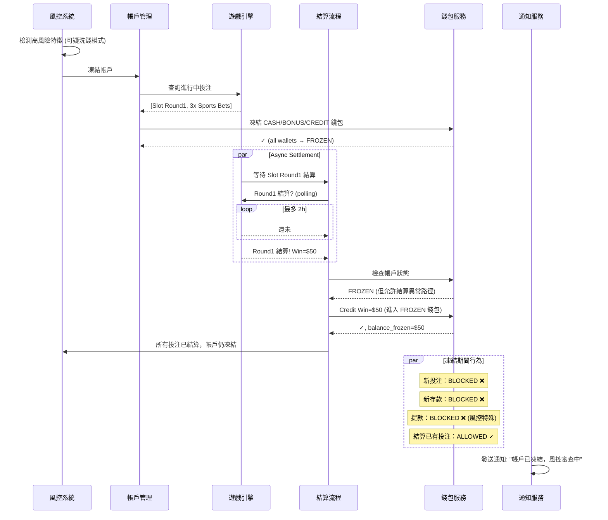
```mermaid
sequenceDiagram
    participant RiskControl as 風控系統
    participant AccountMgr as 帳戶管理
    participant GameEngine as 遊戲引擎
    participant Settlement as 結算流程
    participant Wallet as 錢包服務
    participant Notification as 通知服務

    RiskControl->>RiskControl: 檢測高風險特徵 (可疑洗錢模式)
    RiskControl->>AccountMgr: 凍結帳戶
    AccountMgr->>GameEngine: 查詢進行中投注
    GameEngine-->>AccountMgr: [Slot Round1, 3x Sports Bets]

    AccountMgr->>Wallet: 凍結 CASH/BONUS/CREDIT 錢包
    Wallet-->>AccountMgr: ✓ (all wallets → FROZEN)

    par Async Settlement
        GameEngine->>Settlement: 等待 Slot Round1 結算
        Settlement->>GameEngine: Round1 結算? (polling)
        loop 最多 2h
            GameEngine-->>Settlement: 還未
        end
        GameEngine-->>Settlement: Round1 結算! Win=$50
    end

    Settlement->>Wallet: 檢查帳戶狀態
    Wallet-->>Settlement: FROZEN (但允許結算異常路徑)
    Settlement->>Wallet: Credit Win=$50 (進入 FROZEN 錢包)
    Wallet-->>Settlement: ✓, balance_frozen=$50

    Settlement->>RiskControl: 所有投注已結算，帳戶仍凍結

    par 凍結期間行為
        Note over Wallet: 新投注：BLOCKED ❌
        Note over Wallet: 新存款：BLOCKED ❌
        Note over Wallet: 提款：BLOCKED ❌ (風控特殊)
        Note over Wallet: 結算已有投注：ALLOWED ✓
    end

    Notification->>Notification: 發送通知: "帳戶已凍結，風控審查中"
```

### API 契約

#### 1. 風控凍結指令

```yaml
POST /api/risk-control/freeze-account
Request:
  playerId: 12345
  reason: "SUSPICIOUS_MONEY_LAUNDERING"
  riskScore: 92
  evidence:
    - "rapid_deposits_10x_deposits_in_1h"
    - "pattern_deposit_cashout_cycles"

Response:
  status: 200
  body:
    freezeId: "frz_20260325_001"
    status: "ACTIVE"
    frozenAt: "2026-03-25T11:30:00Z"
    inProgressBets:
      - betId: "slot_round_1"
        type: "SLOT"
        amount: 50.00
        estimatedSettlementTime: "5min"
      - betId: "sports_bet_1"
        type: "SPORTS"
        amount: 100.00
        estimatedSettlementTime: "pending_match_result"
    restrictions:
      canBet: false
      canDeposit: false
      canWithdraw: false
      canSettleBets: true  # 特例
    walletStatus:
      CASH: "FROZEN"
      BONUS: "FROZEN"
      CREDIT: "FROZEN"
```

#### 2. 凍結期間投注結算

```yaml
POST /api/settlement/settle-frozen-account
Request:
  freezeId: "frz_20260325_001"
  betId: "slot_round_1"
  result: "WIN"
  winAmount: 150.00

Response:
  status: 200
  body:
    success: true
    settlement:
      betId: "slot_round_1"
      winAmount: 150.00
      credittedTo: "CASH_FROZEN"
      accountStatus: "FROZEN"
      message: "Win 已入帳，資金處於凍結狀態，待風控審查"
      walletBalance:
        CASH_FROZEN: 150.00
```

### 狀態機

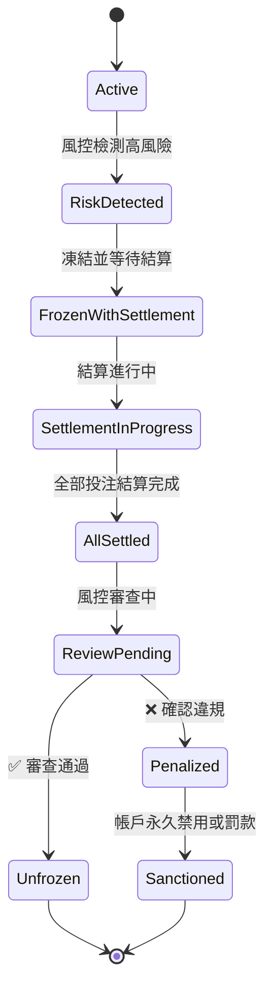
```mermaid
stateDiagram-v2
    [*] --> Active
    Active --> RiskDetected: 風控檢測高風險

    RiskDetected --> FrozenWithSettlement: 凍結並等待結算
    FrozenWithSettlement --> SettlementInProgress: 結算進行中
    SettlementInProgress --> AllSettled: 全部投注結算完成

    AllSettled --> ReviewPending: 風控審查中
    ReviewPending --> Unfrozen: ✅ 審查通過
    ReviewPending --> Penalized: ❌ 確認違規

    Unfrozen --> [*]
    Penalized --> Sanctioned: 帳戶永久禁用或罰款
    Sanctioned --> [*]
```

### 錯誤處理與回滾

| 錯誤 | 條件 | 恢復 |
|-----|------|------|
| 結算失敗（Win 計算異常） | 遊戲引擎故障 | DLQ，待人工審查 |
| 凍結誤報（誤判為高風險） | 風控規則過敏 | CS 可手動解凍，發起人工複審 |
| 提款請求強行繞過 | API 漏洞或客戶端攻擊 | 交易日誌審計，發現後撤銷提款 |

### 測試場景

```gherkin
Scenario: BS-08-T01 帳戶凍結，進行中投注正常結算
  Given 玩家帳戶被風控凍結
  And 有 1 個進行中的 Slot 投注 ($50 bet, 預期 Win $100)
  When Slot 投注結算
  Then Win $100 應入帳 (CASH_FROZEN)
  And 帳戶狀態應保持 FROZEN
  And 玩家應收通知: "Win 已入帳，待風控審查解凍"

Scenario: BS-08-T02 凍結期間禁止新操作
  Given BS-08-T01 的凍結狀態
  When 玩家嘗試:
    - 新投注 → BLOCKED ❌
    - 新存款 → BLOCKED ❌
    - 提款 → BLOCKED ❌
  Then 全部應返回 HTTP 403 Frozen

Scenario: BS-08-T03 風控審查通過，解凍
  Given BS-08-T01 的結算完成
  And 所有投注已結算 (Win 入帳為 $100)
  When 風控審查通過 (無違規)
  Then 帳戶應解凍
  And 所有凍結的 CASH 應變為可用
  And 玩家可重新進行所有操作

Scenario: BS-08-T04 多筆投注混合結果結算
  Given 帳戶凍結，有 3 筆進行中投注
    Bet1: Slot, 結算 LOSS
    Bet2: Sports, 結算 WIN $200
    Bet3: 長期未結算 (> 2h)
  When 結算逐一完成
  Then Bet1 → 損失正常扣除
  And Bet2 → Win $200 入帳 (CASH_FROZEN)
  And Bet3 @ 2h 超時 → 強制回滾，退還投注額
  And 帳戶仍凍結，等待風控最終決策
```

---

## BS-09：代理層級變更 × 結算週期中 — 日加權佣金分攤

**決策**: 按日加權分攤佣金；層級變更即時生效；不追溯調整

### 序列圖

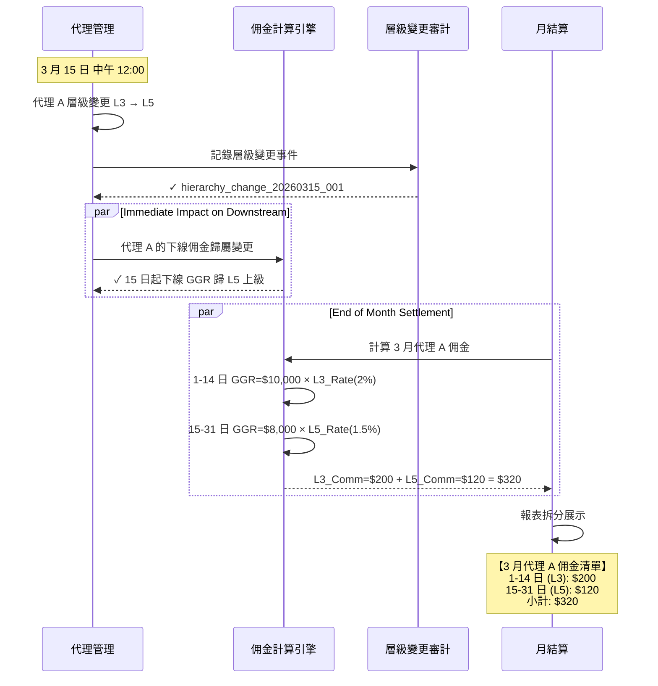
```mermaid
sequenceDiagram
    participant AgentMgmt as 代理管理
    participant CommissionEngine as 佣金計算引擎
    participant HierarchyAudit as 層級變更審計
    participant Settlement as 月結算

    Note over AgentMgmt: 3 月 15 日 中午 12:00
    AgentMgmt->>AgentMgmt: 代理 A 層級變更 L3 → L5
    AgentMgmt->>HierarchyAudit: 記錄層級變更事件
    HierarchyAudit-->>AgentMgmt: ✓ hierarchy_change_20260315_001

    par Immediate Impact on Downstream
        AgentMgmt->>CommissionEngine: 代理 A 的下線佣金歸屬變更
        CommissionEngine-->>AgentMgmt: ✓ 15 日起下線 GGR 歸 L5 上級
    end

    par End of Month Settlement
        Settlement->>CommissionEngine: 計算 3 月代理 A 佣金
        CommissionEngine->>CommissionEngine: 1-14 日 GGR=$10,000 × L3_Rate(2%)
        CommissionEngine->>CommissionEngine: 15-31 日 GGR=$8,000 × L5_Rate(1.5%)
        CommissionEngine-->>Settlement: L3_Comm=$200 + L5_Comm=$120 = $320
    end

    Settlement->>Settlement: 報表拆分展示
    Note over Settlement: 【3 月代理 A 佣金清單】<br/>1-14 日 (L3): $200<br/>15-31 日 (L5): $120<br/>小計: $320
```

### API 契約

#### 1. 層級變更

```yaml
POST /api/agent-management/change-hierarchy
Request:
  agentId: "agent_a_12345"
  newParentId: "l5_agent_999"
  effectiveAt: "2026-03-15T12:00:00Z"
  reason: "performance_promotion"

Response:
  status: 200
  body:
    changeId: "hier_change_20260315_001"
    agentId: "agent_a_12345"
    oldParent: "l3_agent_888"
    newParent: "l5_agent_999"
    oldRate: 2.0  # %
    newRate: 1.5
    effectiveAt: "2026-03-15T12:00:00Z"
    impactSummary:
      downlineCount: 5
      estimatedDownlineGGRImpact: "L5_takes_1.5% instead of L3_taking_2%"
      auditLog: "hierarchy_change_20260315_001"
```

#### 2. 月結算佣金計算

```yaml
GET /api/settlement/agent-commission?month=2026-03&agentId=agent_a_12345
Response:
  status: 200
  body:
    settlementMonth: "2026-03"
    agentId: "agent_a_12345"
    tiers:
      - tier: "L3"
        period: "2026-03-01 ~ 2026-03-14"
        ggr: 10000.00
        rate: 2.0
        commission: 200.00
      - tier: "L5"
        period: "2026-03-15 ~ 2026-03-31"
        ggr: 8000.00
        rate: 1.5
        commission: 120.00
    totalCommission: 320.00
    hierarchyChangeLog:
      - changeId: "hier_change_20260315_001"
        effectiveAt: "2026-03-15T12:00:00Z"
        oldTier: "L3"
        newTier: "L5"
```

### 狀態轉移

```
月初設置 (Agent A @ L3)
    ↓
累計 GGR (1-14 日)
    ↓
層級變更事件 (15 日 12:00)
    ↓
新層級即時生效 (下線 GGR 歸屬變更)
    ↓
繼續累計 GGR (15-31 日，按新層級)
    ↓
月結算 (按日加權分攤佣金)
    ↓
佣金發放 + 審計記錄
```

### 錯誤處理與回滾

| 錯誤 | 條件 | 恢復 |
|-----|------|------|
| 層級變更時序衝突 | 同時多個變更 | 依時間戳排序，順序執行 |
| 佣金計算邏輯錯誤 | 日期區間計算錯誤 | 人工複審月結單據，反向調整 |
| 下線 GGR 歸屬混亂 | 系統未及時更新下線映射 | 查詢 hierarchy_audit_log，重建歸屬 |

### 測試場景

```gherkin
Scenario: BS-09-T01 代理層級變更，佣金日加權分攤
  Given 代理 A 於 2026-03-01 層級 = L3 (佣金率 2%)
  And 1-14 日累計 GGR = $10,000
  When 2026-03-15 12:00 層級變更至 L5 (佣金率 1.5%)
  And 15-31 日累計 GGR = $8,000
  Then 月結算應顯示:
    L3 期間: $10,000 × 2% = $200
    L5 期間: $8,000 × 1.5% = $120
    合計: $320

Scenario: BS-09-T02 層級變更時下線收入即時歸屬變更
  Given 代理 A 有下線 B 和 C
  And 下線原上級佣金收入 % = 50% (分成)
  When 代理 A 層級變更至 L5
  Then 下線 B、C 的佣金歸屬應即時變更為新上級 (L5)
  And 15 日起的下線 GGR 應按新比例分成

Scenario: BS-09-T03 多個層級變更在同一月
  Given 代理 A:
    1-10 日: L2
    11-20 日: L4 (第 1 次變更)
    21-31 日: L3 (第 2 次變更)
  Then 月結算應分為 3 段:
    1-10 日 L2: $5,000 × L2_rate
    11-20 日 L4: $5,000 × L4_rate
    21-31 日 L3: $3,000 × L3_rate

Scenario: BS-09-T04 層級變更後無追溯調整
  Given 代理 A 1-10 日佣金已按 L2 計算並預支 $100
  When 11 日變更至 L4
  And 發現 1-10 日應按 L4 計算為 $120
  Then 系統 NOT 應追溯扣除再重算
  Instead 應記錄差異 $20 於單獨 line item (審計用)
  And 不應減少已預支的 $100
```

---

## BS-10：多幣種出金 × FX 匯率波動 — 匯率鎖定機制

**決策**: 鎖定申請時匯率；法幣 ≤0.5% 平台吸收；超出 50/50 分攤；加密貨幣不鎖定

### 序列圖

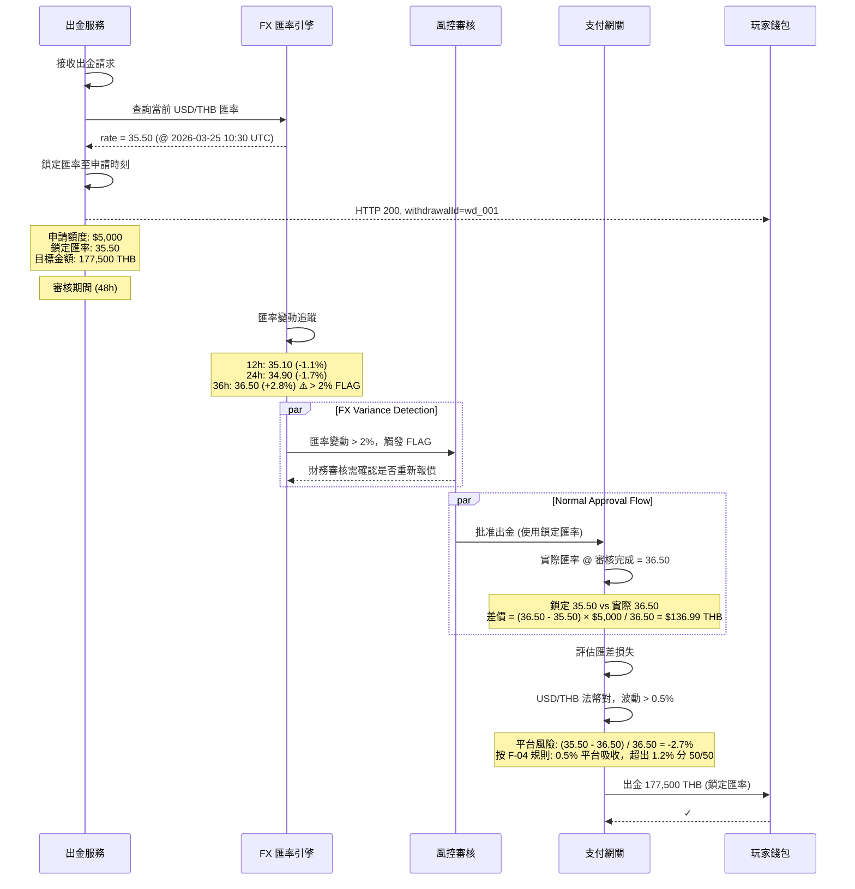
```mermaid
sequenceDiagram
    participant WithdrawalSvc as 出金服務
    participant FXEngine as FX 匯率引擎
    participant RiskControl as 風控審核
    participant PaymentGateway as 支付網關
    participant PlayerWallet as 玩家錢包

    WithdrawalSvc->>WithdrawalSvc: 接收出金請求
    WithdrawalSvc->>FXEngine: 查詢當前 USD/THB 匯率
    FXEngine-->>WithdrawalSvc: rate = 35.50 (@ 2026-03-25 10:30 UTC)

    WithdrawalSvc->>WithdrawalSvc: 鎖定匯率至申請時刻
    WithdrawalSvc-->>PlayerWallet: HTTP 200, withdrawalId=wd_001
    Note over WithdrawalSvc: 申請額度: $5,000<br/>鎖定匯率: 35.50<br/>目標金額: 177,500 THB

    Note over WithdrawalSvc: 審核期間 (48h)
    FXEngine->>FXEngine: 匯率變動追蹤
    Note over FXEngine: 12h: 35.10 (-1.1%)<br/>24h: 34.90 (-1.7%)<br/>36h: 36.50 (+2.8%) ⚠️ > 2% FLAG

    par FX Variance Detection
        FXEngine->>RiskControl: 匯率變動 > 2%，觸發 FLAG
        RiskControl-->>FXEngine: 財務審核需確認是否重新報價
    end

    par Normal Approval Flow
        RiskControl->>PaymentGateway: 批准出金 (使用鎖定匯率)
        PaymentGateway->>PaymentGateway: 實際匯率 @ 審核完成 = 36.50
        Note over PaymentGateway: 鎖定 35.50 vs 實際 36.50<br/>差價 = (36.50 - 35.50) × $5,000 / 36.50 = $136.99 THB
    end

    PaymentGateway->>PaymentGateway: 評估匯差損失
    PaymentGateway->>PaymentGateway: USD/THB 法幣對，波動 > 0.5%
    Note over PaymentGateway: 平台風險: (35.50 - 36.50) / 36.50 = -2.7%<br/>按 F-04 規則: 0.5% 平台吸收，超出 1.2% 分 50/50

    PaymentGateway->>PlayerWallet: 出金 177,500 THB (鎖定匯率)
    PlayerWallet-->>PaymentGateway: ✓
```

### API 契約

#### 1. 出金請求（匯率鎖定）

```yaml
POST /api/withdrawal/request
Request:
  playerId: 12345
  sourceAmount: 5000.00
  sourceCurrency: "USD"
  targetCurrency: "THB"
  method: "bank_transfer"

Response:
  status: 200
  body:
    withdrawalId: "wd_20260325_001"
    status: "PENDING_RISK_REVIEW"
    fxLock:
      lockedRate: 35.50
      lockedAt: "2026-03-25T10:30:00Z"
      sourceAmount: 5000.00
      sourceCurrency: "USD"
      targetCurrency: "THB"
      targetAmount: 177500.00  # 鎖定金額
      lockExpiresAt: "2026-04-25T10:30:00Z"  # 1 個月鎖定期
    estimatedPayoutTime: "2026-03-27T10:30:00Z"  # 48h SLA
    disclaimer: "最終出金金額為鎖定匯率，審核期間匯率變動不影響您的出金額度"
```

#### 2. FX 匯差計算 & F-04 應用

```yaml
GET /api/withdrawal/{withdrawalId}/fx-status
Response:
  status: 200
  body:
    withdrawalId: "wd_20260325_001"
    fxStatus:
      lockedRate: 35.50
      currentRate: 36.50  # 審核完成時的實際匯率
      variance: "+2.8%"  # > 2% FLAG
      fxVarianceFlag: true
      requiredAction: "MANUAL_FINANCE_REVIEW"
    fxRiskAllocation:
      currencyPair: "USD/THB"
      currencyType: "FIAT"  # 法幣，不是加密
      variance: 2.8
      platformAbsorption: 0.5  # %
      excess: 2.3
      platformShare: 1.15  # 50% of 2.3
      playerShare: 1.15  # 50% of 2.3
      recommendation: "APPROVE_AT_LOCKED_RATE"
```

### 狀態轉移

```
出金申請
    ↓
查詢即時匯率，鎖定申請時匯率
    ↓
進入風控審核 (最長 48h)
    ↓
匯率波動監控
    ├─ ≤ 2% → 自動批准 (使用鎖定匯率)
    └─ > 2% → FLAG，財務人工複審
         ├─ 批准 (鎖定匯率)
         └─ 拒絕或提出修改方案
    ↓
支付網關執行出金 (使用鎖定匯率)
```

### 錯誤處理與回滾

| 錯誤 | 條件 | 恢復 |
|-----|------|------|
| 匯率鎖定失敗 | FX 引擎不可達 | 重試，超過 3 次降級至非同步佇列 |
| 匯差計算異常 | 邏輯錯誤或浮點精度 | 人工複審，可申請反向調整 |
| 加密貨幣誤用法幣規則 | BTC/USD 等誤按 ≤0.5% 吸收 | 檢查幣種分類，應用無鎖定策略 |

### 測試場景

```gherkin
Scenario: BS-10-T01 法幣出金，匯率鎖定，小幅波動
  Given 玩家申請出金 USD 5,000 → THB
  And 鎖定匯率 = 35.50
  When 審核期間匯率變動至 35.60 (+0.28%, < 0.5%)
  Then 出金應批准，使用鎖定匯率 35.50
  And 平台吸收全部匯差損失

Scenario: BS-10-T02 匯率波動 > 0.5% 但 ≤ 2%
  Given BS-10-T01 的狀態
  When 匯率變動至 36.00 (+1.4%, > 0.5% 但 < 2%)
  Then 平台應吸收 0.5%
  And 超出 0.9% 的 50% ($22.5) 由玩家承擔
  And 超出 0.9% 的 50% ($22.5) 由平台承擔

Scenario: BS-10-T03 匯率波動 > 2%，觸發 FLAG
  Given BS-10-T01 的狀態
  When 匯率變動至 36.50 (+2.8%, > 2%)
  Then 系統應設置 FLAG，通知財務團隊
  And 財務可選擇:
    a) 批准 (按鎖定匯率)
    b) 拒絕並提出新報價
  And 應在 1h 內做出決策

Scenario: BS-10-T04 加密貨幣出金，無匯率鎖定
  Given 玩家申請出金 $1,000 USD → 0.025 BTC
  And BTC/USD @ 申請時 = 40,000
  When 審核期間 BTC/USD 漲至 42,000 (+5%)
  Then 系統應使用當時實際匯率 42,000（無鎖定）
  And 玩家收到的 BTC 應按 42,000 計算 (0.0238 BTC)
  And 應通知玩家: "加密貨幣實時匯率，非鎖定价格"

Scenario: BS-10-T05 極端匯率波動場景
  Given 突發市場事件，匯率在 1h 內波動 -8%
  When 出金請求處於審核中
  Then 系統應多次觸發 FLAG
  And 財務應有權利:
    - 取消出金並退還到玩家帳戶
    - 提出調整後的報價
  And 玩家應收到警告，確認是否仍然提款
```

---

## BS-11：GDPR 刪除 × 進行中紅利 — 刪除協調器與沒收規則

**決策**: 即時沒收 BONUS，CASH 提款窗口 7 天，Day 30 後轉信託帳戶，Day 37 加密銷毀

### 序列圖

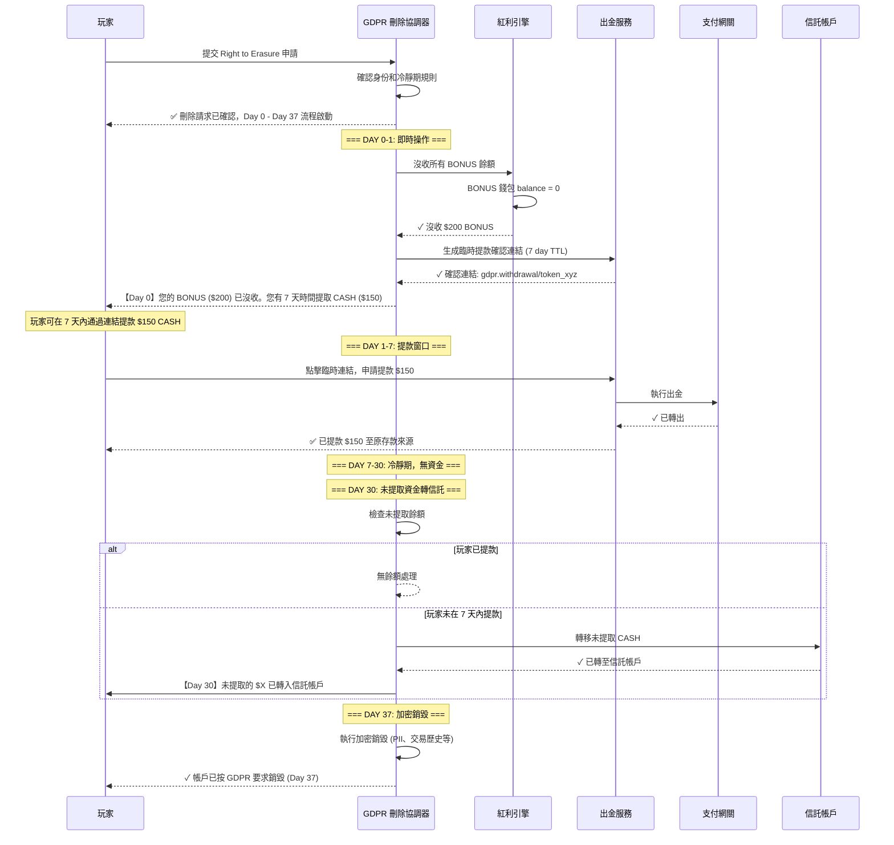
```mermaid
sequenceDiagram
    participant Player as 玩家
    participant GDPRSystem as GDPR 刪除協調器
    participant BonusEngine as 紅利引擎
    participant WithdrawalSvc as 出金服務
    participant PaymentGateway as 支付網關
    participant TrustAccount as 信託帳戶

    Player->>GDPRSystem: 提交 Right to Erasure 申請
    GDPRSystem->>GDPRSystem: 確認身份和冷靜期規則
    GDPRSystem-->>Player: ✅ 刪除請求已確認，Day 0 - Day 37 流程啟動

    Note over GDPRSystem: === DAY 0-1: 即時操作 ===
    GDPRSystem->>BonusEngine: 沒收所有 BONUS 餘額
    BonusEngine->>BonusEngine: BONUS 錢包 balance = 0
    BonusEngine-->>GDPRSystem: ✓ 沒收 $200 BONUS

    GDPRSystem->>WithdrawalSvc: 生成臨時提款確認連結 (7 day TTL)
    WithdrawalSvc-->>GDPRSystem: ✓ 確認連結: gdpr.withdrawal/token_xyz
    GDPRSystem-->>Player: 【Day 0】您的 BONUS ($200) 已沒收。您有 7 天時間提取 CASH ($150)
    Note over Player: 玩家可在 7 天內通過連結提款 $150 CASH

    Note over GDPRSystem: === DAY 1-7: 提款窗口 ===
    Player->>WithdrawalSvc: 點擊臨時連結，申請提款 $150
    WithdrawalSvc->>PaymentGateway: 執行出金
    PaymentGateway-->>WithdrawalSvc: ✓ 已轉出
    WithdrawalSvc-->>Player: ✅ 已提款 $150 至原存款來源

    Note over GDPRSystem: === DAY 7-30: 冷靜期，無資金 ===
    Note over GDPRSystem: === DAY 30: 未提取資金轉信託 ===
    GDPRSystem->>GDPRSystem: 檢查未提取餘額
    alt 玩家已提款
        GDPRSystem-->>GDPRSystem: 無餘額處理
    else 玩家未在 7 天內提款
        GDPRSystem->>TrustAccount: 轉移未提取 CASH
        TrustAccount-->>GDPRSystem: ✓ 已轉至信託帳戶
        GDPRSystem->>Player: 【Day 30】未提取的 $X 已轉入信託帳戶
    end

    Note over GDPRSystem: === DAY 37: 加密銷毀 ===
    GDPRSystem->>GDPRSystem: 執行加密銷毀 (PII、交易歷史等)
    GDPRSystem-->>Player: ✓ 帳戶已按 GDPR 要求銷毀 (Day 37)
```

### API 契約

#### 1. GDPR 刪除申請

```yaml
POST /api/gdpr/request-erasure
Request:
  playerId: 12345
  reason: "RIGHT_TO_ERASURE"
  confirmIdentity: true
  acceptTerms: true

Response:
  status: 200
  body:
    erasureId: "gdpr_20260325_001"
    status: "CONFIRMED"
    timeline:
      day0: "2026-03-25"
      day7_withdrawal_deadline: "2026-04-01"
      day30_trust_transfer: "2026-04-24"
      day37_crypto_destruction: "2026-05-01"
    actions:
      - action: "BONUS_FORFEITURE"
        status: "COMPLETED"
        amount: 200.00
        timestamp: "2026-03-25T10:30:00Z"
      - action: "CASH_WITHDRAWAL_WINDOW"
        status: "PENDING"
        amount: 150.00
        expiresAt: "2026-04-01T23:59:59Z"
        withdrawalLink: "https://gdpr.withdrawal/token_abc123xyz"
    notification: "BONUS 已沒收。請在 7 天內使用連結提取 CASH ($150)"
```

#### 2. GDPR 臨時提款確認

```yaml
GET /api/gdpr/withdrawal/{withdrawalToken}
Response:
  status: 200
  body:
    erasureId: "gdpr_20260325_001"
    playerId: 12345
    withdrawalAmount: 150.00
    tokenExpiresAt: "2026-04-01T23:59:59Z"
    status: "VALID"
    action: "CONFIRM_WITHDRAWAL"

POST /api/gdpr/confirm-withdrawal
Request:
  withdrawalToken: "token_abc123xyz"

Response:
  status: 200
  body:
    success: true
    withdrawalId: "gdpr_wd_001"
    amount: 150.00
    refundMethod: "ORIGINAL_DEPOSIT_SOURCE"
    estimatedArrival: "2026-03-27"
```

### 狀態機

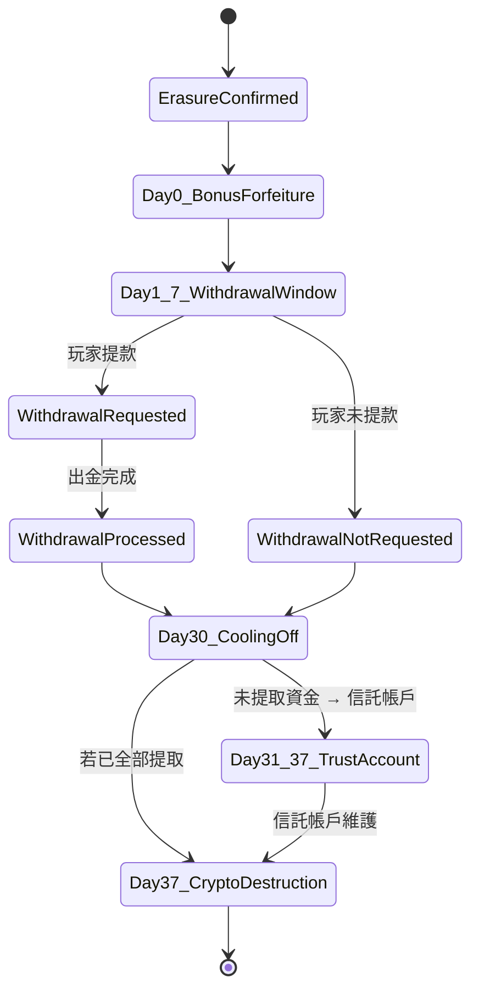
```mermaid
stateDiagram-v2
    [*] --> ErasureConfirmed
    ErasureConfirmed --> Day0_BonusForfeiture
    Day0_BonusForfeiture --> Day1_7_WithdrawalWindow

    Day1_7_WithdrawalWindow --> WithdrawalRequested: 玩家提款
    WithdrawalRequested --> WithdrawalProcessed: 出金完成
    WithdrawalProcessed --> Day30_CoolingOff

    Day1_7_WithdrawalWindow --> WithdrawalNotRequested: 玩家未提款
    WithdrawalNotRequested --> Day30_CoolingOff

    Day30_CoolingOff --> Day31_37_TrustAccount: 未提取資金 → 信託帳戶
    Day30_CoolingOff --> Day37_CryptoDestruction: 若已全部提取

    Day31_37_TrustAccount --> Day37_CryptoDestruction: 信託帳戶維護
    Day37_CryptoDestruction --> [*]
```

### 錯誤處理與回滾

| 錯誤 | 條件 | 恢復 |
|-----|------|------|
| BONUS 沒收失敗 | 錢包服務故障 | 重試，超過 3 次，拒絕 GDPR 申請，要求用戶重新提交 |
| 提款連結過期前未提款 | Day 7 到期 | 資金轉信託帳戶，玩家可在 Day 30 前申請轉出 |
| 加密銷毀失敗 | DB 刪除執行異常 | DLQ，由合規團隊手動驗證並銷毀 |

### 測試場景

```gherkin
Scenario: BS-11-T01 GDPR 刪除，玩家成功提取 CASH
  Given 玩家帳戶: BONUS=$200 (流水 60%), CASH=$150, 未結算投注=$50 (預期 Win $100)
  When 玩家提交 GDPR Right to Erasure
  Then Day 0:
    - BONUS 應沒收 ($200 → 0)
    - 臨時提款連結應生成 (7 day TTL)
    - 通知: "BONUS 已沒收，7 天內可提 CASH"

  When 未結算投注結算 (Win $100)
  Then Win 應入 CASH (變為 $250)
  And 玩家可通過臨時連結提取 $250

  When 玩家提取 $250
  Then Day 7: 轉出完成，提款連結失效

Scenario: BS-11-T02 玩家未在 7 天內提款
  Given BS-11-T01 的初始狀態
  When 玩家未在 7 天內操作
  Then Day 30:
    - 檢查未提取餘額 ($250)
    - 轉移至信託帳戶
    - 通知: "未提取資金已轉入信託帳戶"

  When 玩家 Day 35 要求取回
  Then 應從信託帳戶處理提款申請

Scenario: BS-11-T03 推薦獎金不受影響
  Given 玩家 A 推薦了玩家 B
  And 玩家 B 獲得推薦獎金 $50 (獨立 BONUS)
  When 玩家 A 啟動 GDPR 刪除
  Then 玩家 A 的 BONUS 應沒收
  But 玩家 B 的推薦獎金應保持不變 (獨立計算)

Scenario: BS-11-T04 加密銷毀驗證
  Given 刪除流程進行至 Day 37
  And 所有資金已處理 (提取或信託)
  When Day 37 加密銷毀執行
  Then 應執行:
    - 個人信息 (PII) 刪除
    - 交易歷史加密銷毀
    - 帳戶元數據銷毀
  And 應保留合規所需的最少記錄 (如審計日誌)
```

---

## BS-12：Chargeback × 進行中流水 — 完全回扣與玩家標記

**決策**: 沒收 BONUS 及流水進度，扣回 CASH，標記玩家，禁止 30 天新紅利

### 序列圖

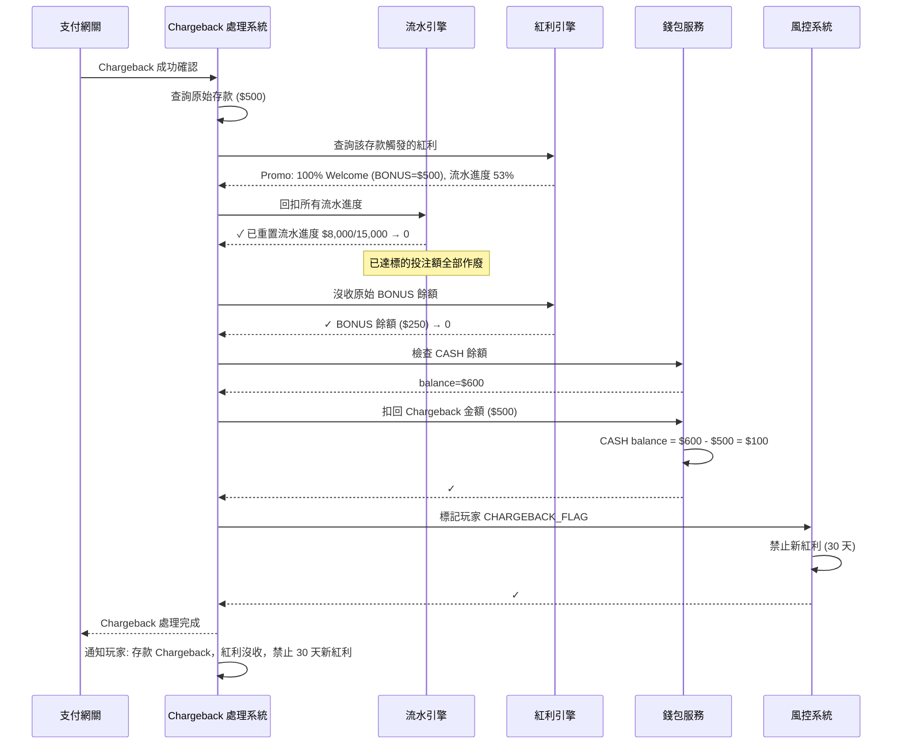
```mermaid
sequenceDiagram
    participant PaymentGateway as 支付網關
    participant ChargebackSystem as Chargeback 處理系統
    participant WageringEngine as 流水引擎
    participant BonusEngine as 紅利引擎
    participant WalletSvc as 錢包服務
    participant RiskControl as 風控系統

    PaymentGateway->>ChargebackSystem: Chargeback 成功確認
    ChargebackSystem->>ChargebackSystem: 查詢原始存款 ($500)
    ChargebackSystem->>BonusEngine: 查詢該存款觸發的紅利
    BonusEngine-->>ChargebackSystem: Promo: 100% Welcome (BONUS=$500), 流水進度 53%

    ChargebackSystem->>WageringEngine: 回扣所有流水進度
    WageringEngine-->>ChargebackSystem: ✓ 已重置流水進度 $8,000/15,000 → 0
    Note over WageringEngine: 已達標的投注額全部作廢

    ChargebackSystem->>BonusEngine: 沒收原始 BONUS 餘額
    BonusEngine-->>ChargebackSystem: ✓ BONUS 餘額 ($250) → 0

    ChargebackSystem->>WalletSvc: 檢查 CASH 餘額
    WalletSvc-->>ChargebackSystem: balance=$600

    ChargebackSystem->>WalletSvc: 扣回 Chargeback 金額 ($500)
    WalletSvc->>WalletSvc: CASH balance = $600 - $500 = $100
    WalletSvc-->>ChargebackSystem: ✓

    ChargebackSystem->>RiskControl: 標記玩家 CHARGEBACK_FLAG
    RiskControl->>RiskControl: 禁止新紅利 (30 天)
    RiskControl-->>ChargebackSystem: ✓

    ChargebackSystem-->>PaymentGateway: Chargeback 處理完成
    ChargebackSystem->>ChargebackSystem: 通知玩家: 存款 Chargeback，紅利沒收，禁止 30 天新紅利
```

### API 契約

#### 1. Chargeback 回調接收

```yaml
POST /api/payment/chargeback-notification
Request:
  chargebackId: "cb_20260325_001"
  depositId: "dep_20260315_001"
  playerId: 12345
  originalAmount: 500.00
  currency: "USD"
  chargebackAmount: 500.00  # 全額
  reason: "unauthorized"
  status: "chargeback_won"  # 玩家贏得 Chargeback

Response:
  status: 200
  body:
    processed: true
    actions:
      - action: "BONUS_FORFEITURE"
        amount: 250.00  # 剩餘 BONUS
        status: "COMPLETED"
      - action: "WAGERING_ROLLBACK"
        wageringAmount: 8000.00
        status: "COMPLETED"
        message: "全部 $8,000 流水進度已回扣"
      - action: "CASH_REVERSAL"
        amount: 500.00
        resultingBalance: 100.00  # $600 - $500
        status: "COMPLETED"
      - action: "PLAYER_FLAG"
        flagType: "CHARGEBACK_FLAG"
        duration: "30 days"
        expiresAt: "2026-04-24T10:30:00Z"
        status: "FLAGGED"
    playerNotification:
      title: "Chargeback 已處理"
      message: "原始存款被撤銷。紅利已沒收，流水進度已回扣。禁止 30 天內領取新紅利。"
```

#### 2. Chargeback 後紅利領取驗證

```yaml
POST /api/promotions/claim
Request:
  playerId: 12345
  promotionId: "promo_2026_04_new_offer"

Response (Chargeback 標記活躍):
  status: 403
  body:
    error: "CHARGEBACK_FLAG_ACTIVE"
    message: "您的帳戶因 Chargeback 被禁止領取新紅利"
    flagExpiresAt: "2026-04-24T10:30:00Z"
    remainingDays: 28
```

### 狀態轉移

```
玩家存款 $500 → 領取 100% Welcome Bonus ($500)
    ↓
進行投注，累計流水 $8,000 / $15,000 (53%)
    ↓
Chargeback 成功
    ↓
[1] 沒收 BONUS 餘額 ($250)
[2] 回扣全部流水進度 ($8,000 → 0)
[3] 扣回 CASH ($500)
[4] 標記玩家 CHARGEBACK_FLAG (30 day)
[5] 禁止新紅利 (直到 flag 過期)
```

### 錯誤處理與回滾

| 錯誤 | 條件 | 恢復 |
|-----|------|------|
| 部分回扣失敗 | 流水引擎或 BONUS 引擎不可達 | 重試，超過 3 次轉 DLQ，由財務手動處理 |
| CASH 不足以扣回全額 | 玩家已提款，餘額 < 扣回額 | 記錄負餘額，凍結帳戶，等玩家付款或司法裁決 |
| 未鎖定新紅利領取 | FLAG 未生效 | 週期檢查，補償性禁止+人工審查 |

### 測試場景

```gherkin
Scenario: BS-12-T01 Chargeback 成功，完全回扣
  Given 玩家:
    - 存款: $500 (已確認 Chargeback)
    - BONUS: $500 (領取 100% Welcome)
    - 流水進度: 53% ($8,000/$15,000)
    - CASH 餘額: $600 (包括 BONUS 轉換和投注盈利)

  When Chargeback 確認成功
  Then 系統應執行:
    1. BONUS $250 (剩餘) 沒收 → 0
    2. 流水進度 $8,000 → 0
    3. CASH 扣回 $500 → 餘額 $100
    4. 標記 CHARGEBACK_FLAG，禁止 30 天新紅利
    5. 通知玩家上述所有操作

Scenario: BS-12-T02 多個紅利並行，僅沒收相關紅利
  Given 玩家有 2 個紅利:
    Bonus1: 領自 $500 Chargeback 存款 (現 $250 餘額)
    Bonus2: 領自不同存款，無關 (現 $100 餘額)
  When Bonus1 所關聯的存款發生 Chargeback
  Then 應沒收 Bonus1 ($250)
  And Bonus2 應保持不變 ($100，無影響)
  And 流水回扣應僅涉及 Bonus1 的部分

Scenario: BS-12-T03 CASH 不足以扣回全額
  Given 玩家 CASH 餘額 = $300 (< Chargeback 金額 $500)
  When Chargeback 成功
  Then 系統應:
    1. 扣回 $300 → CASH = 0
    2. 記錄負餘額 $200
    3. 凍結帳戶 (FROZEN_CHARGEBACK_DEBT)
    4. 通知財務: "玩家欠款 $200，待司法或玩家付款"
    5. 玩家僅允許提款（如果有其他資金）

Scenario: BS-12-T04 Chargeback 標記禁止期內領取紅利
  Given BS-12-T01 的狀態，CHARGEBACK_FLAG 活躍 (29 天剩餘)
  When 玩家嘗試領取新紅利
  Then 系統應拒絕，返回:
    - error: CHARGEBACK_FLAG_ACTIVE
    - message: "禁止 Chargeback 期間領取新紅利"
    - expiresAt: 2026-04-24 10:30:00Z

  When 30 天後 FLAG 過期
  Then 玩家應可正常領取新紅利

Scenario: BS-12-T05 Chargeback 與未結算投注並行
  Given 玩家有進行中投注 (如 BS-04 類似)
  When Chargeback 成功觸發且投注同時結算
  Then 結算邏輯應遵循:
    1. 先結算投注 (進入 CASH)
    2. 再執行 Chargeback 回扣
    3. 流水和 BONUS 沒收應基於 Chargeback 時刻的狀態快照
```

---

## 整合測試模式

### 跨情境測試

```gherkin
Scenario: BS-01 + BS-05 Token 過期 + 流水驗證超時
  Given BS-01 Token 過期的 Resettlement 狀態
  And 玩家嘗試提款 (BS-05)
  When 流水驗證進行非同步隊列
  Then 提款應進入 PENDING_ASYNC，與 Resettlement 並行處理

Scenario: BS-04 + BS-08 自我排除 + 風控凍結
  Given 玩家同時觸發自我排除和風控凍結
  When 系統檢測到雙重凍結
  Then 應優先應用自我排除規則 (允許結算)
  And 風控凍結應作為次要層（禁止提款）

Scenario: BS-06 + BS-09 VIP 降級 + 代理層級變更
  Given 代理 A 降級，玩家同時為其下線
  When 玩家 VIP 降級觸發
  Then 代理佣金應按新層級計算
  And 玩家紅利應按原層級保護
```

---

**版本歷史**
- v1.0 (2026-03-25): 全部 12 情境技術規格完成，包括序列圖、API 契約、狀態機、錯誤處理、測試場景

**相關檔案**
- Appendix_E_Cross_Module_Boundary_Scenarios_跨模組邊界情境矩陣.md (業務決策)
- 02_Wallet_System_錢包系統.md (錢包狀態機)
- 04_Game_Integration_遊戲整合.md (GP 整合規則)
- 05_Promotions_VIP_促銷與VIP.md (紅利和 VIP 規則)
- 08_Agent_Operations_代理營運.md (代理佣金模型)
