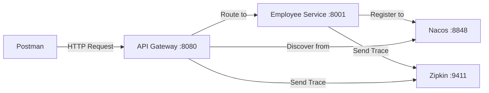

# SmartAdmin 微服務遷移快速驗證指南

**文檔版本**: v1.0.0
**狀態**: ✅ 可執行
**最後更新**: 2026-02-03
**預計時間**: 1-2 天
**目標讀者**: 開發工程師、架構師

---

## 📋 概述

### 目的

在 **1-2 天內** 驗證 SmartAdmin 微服務化方案的可行性，避免投入大量資源後才發現架構問題。

### 驗證目標

✅ 驗證 Spring Cloud Alibaba 技術棧在 SmartAdmin 中的可行性
✅ 驗證服務註冊與發現（Nacos）
✅ 驗證 API Gateway 路由
✅ 驗證跨服務調用（Feign）
✅ 驗證分散式追蹤（Zipkin）
✅ 驗證 Manager 層在微服務架構中的保留方案

### 時間表

| 階段 | 時間 | 產出 |
|------|------|------|
| 環境準備 | 2 hours | Docker Compose 環境 |
| 服務拆分 | 4 hours | Demo Service（Employee 模塊） |
| 集成驗證 | 2 hours | 完整請求鏈路 |
| 問題排查 | 2 hours | 驗證報告 |

---

## 🔧 前置準備

### 環境要求

| 軟體 | 版本 | 用途 |
|------|------|------|
| Docker | 20.10+ | 容器化部署 |
| Docker Compose | 2.0+ | 編排多容器應用 |
| Java | 21+ | SmartAdmin 運行環境 |
| Gradle | 8.0+ | 構建工具 |
| Git | 2.0+ | 版本控制 |

### 工具清單

- [x] Docker Desktop 或 Docker Engine
- [x] IntelliJ IDEA / VS Code
- [x] Postman 或 curl（API 測試）
- [x] 瀏覽器（訪問 Nacos Console）

### 檢查環境

```bash
# 檢查 Docker
docker --version
docker compose version

# 檢查 Java
java -version  # 應顯示 Java 21+

# 檢查 Gradle
./gradlew --version
```

---

## 🏗️ MVP 架構設計

### 最小可行架構



### 服務清單

| 服務 | 端口 | 用途 | 優先級 |
|------|------|------|--------|
| Nacos Server | 8848 | 服務註冊與發現 | P0 |
| API Gateway | 8080 | 統一入口 | P0 |
| Employee Service | 8001 | 業務微服務（Demo） | P0 |
| Zipkin Server | 9411 | 分散式追蹤 | P1 |

### 驗證範圍

✅ **包含**:
- 單個微服務拆分（Employee 模塊）
- Nacos 服務註冊
- Gateway 路由轉發
- Feign 跨服務調用（Employee Service → UAC Service 查詢用戶）
- Zipkin 鏈路追蹤
- Manager 層保留（事務、緩存）

❌ **不包含**:
- 數據庫拆分（共享數據庫）
- 配置中心（使用本地配置）
- Seata 分散式事務（Phase 3 驗證）
- Sentinel 限流熔斷（Phase 3 驗證）

---

## 🚀 快速啟動

### Step 1: 啟動基礎設施（Docker Compose）

創建 `docker-compose-validation.yml`:

```yaml
version: '3.8'

services:
  # Nacos 單機版（開發驗證用）
  nacos:
    image: nacos/nacos-server:v2.4.3
    container_name: smartadmin-nacos-validation
    environment:
      - MODE=standalone
      - SPRING_DATASOURCE_PLATFORM=mysql
      - MYSQL_SERVICE_HOST=nacos-mysql
      - MYSQL_SERVICE_DB_NAME=nacos_devtest
      - MYSQL_SERVICE_PORT=3306
      - MYSQL_SERVICE_USER=nacos
      - MYSQL_SERVICE_PASSWORD=nacos
      - JVM_XMS=512m
      - JVM_XMX=512m
    ports:
      - "8848:8848"
      - "9848:9848"
    depends_on:
      - nacos-mysql
    restart: on-failure
    healthcheck:
      test: ["CMD", "curl", "-f", "http://localhost:8848/nacos/v1/console/health/liveness"]
      interval: 10s
      timeout: 5s
      retries: 5

  # Nacos 數據庫
  nacos-mysql:
    image: mysql:8.0
    container_name: smartadmin-nacos-mysql
    environment:
      - MYSQL_ROOT_PASSWORD=root
      - MYSQL_DATABASE=nacos_devtest
      - MYSQL_USER=nacos
      - MYSQL_PASSWORD=nacos
    volumes:
      - ./nacos-mysql-data:/var/lib/mysql
    ports:
      - "3307:3306"

  # Zipkin 鏈路追蹤
  zipkin:
    image: openzipkin/zipkin:3.4
    container_name: smartadmin-zipkin-validation
    environment:
      - STORAGE_TYPE=mem
    ports:
      - "9411:9411"
    restart: on-failure

  # PostgreSQL（SmartAdmin 共享數據庫）
  postgres:
    image: postgres:16
    container_name: smartadmin-postgres-validation
    environment:
      - POSTGRES_DB=smart_admin
      - POSTGRES_USER=postgres
      - POSTGRES_PASSWORD=postgres
    volumes:
      - ./postgres-data:/var/lib/postgresql/data
    ports:
      - "5432:5432"

  # Redis（共享緩存）
  redis:
    image: redis:7-alpine
    container_name: smartadmin-redis-validation
    ports:
      - "6379:6379"
    command: redis-server --requirepass smartadmin123

networks:
  default:
    name: smartadmin-validation
```

**啟動命令**:

```bash
# 創建目錄
mkdir -p smart-admin-validation
cd smart-admin-validation

# 保存上述配置為 docker-compose-validation.yml

# 啟動所有服務
docker compose -f docker-compose-validation.yml up -d

# 查看日誌
docker compose -f docker-compose-validation.yml logs -f

# 等待所有服務健康（約 1-2 分鐘）
docker compose -f docker-compose-validation.yml ps
```

**驗證基礎設施**:

```bash
# 1. 檢查 Nacos
curl http://localhost:8848/nacos/v1/console/health/liveness
# 預期: {"status":"UP"}

# 2. 訪問 Nacos Console
# 瀏覽器打開: http://localhost:8848/nacos
# 默認賬號: nacos / nacos

# 3. 檢查 Zipkin
curl http://localhost:9411/api/v2/services
# 預期: []（空陣列，無服務註冊）

# 4. 檢查 PostgreSQL
docker exec smartadmin-postgres-validation psql -U postgres -d smart_admin -c "SELECT version();"
```

### Step 2: 創建 Employee Service（微服務 Demo）

**2.1 創建項目結構**

```bash
smart-admin-api-java21-springboot3/
├── sa-gateway/              # API Gateway（新增）
└── sa-employee-service/     # Employee 微服務（新增）
```

**2.2 Gateway 配置（sa-gateway/build.gradle）**

```gradle
plugins {
    id 'org.springframework.boot' version '3.5.4'
    id 'io.spring.dependency-management' version '1.1.7'
    id 'java'
}

group = 'net.lab1024.sa'
version = '4.0.0-SNAPSHOT'
sourceCompatibility = '21'

dependencies {
    // Spring Cloud Gateway
    implementation 'org.springframework.cloud:spring-cloud-starter-gateway'

    // Nacos 服務發現
    implementation 'com.alibaba.cloud:spring-cloud-starter-alibaba-nacos-discovery'

    // Zipkin 追蹤
    implementation 'io.micrometer:micrometer-tracing-bridge-brave'
    implementation 'io.zipkin.reporter2:zipkin-reporter-brave'

    // Loadbalancer
    implementation 'org.springframework.cloud:spring-cloud-starter-loadbalancer'
}

dependencyManagement {
    imports {
        mavenBom "org.springframework.cloud:spring-cloud-dependencies:2023.0.4"
        mavenBom "com.alibaba.cloud:spring-cloud-alibaba-dependencies:2023.0.4.0"
    }
}
```

**2.3 Gateway 配置（sa-gateway/src/main/resources/application.yml）**

```yaml
server:
  port: 8080

spring:
  application:
    name: smartadmin-gateway

  cloud:
    nacos:
      discovery:
        server-addr: localhost:8848
        namespace: dev
        group: SMARTADMIN_GROUP

    gateway:
      routes:
        # Employee Service 路由
        - id: employee-service
          uri: lb://smartadmin-employee-service
          predicates:
            - Path=/api/employee/**
          filters:
            - StripPrefix=1

        # UAC Service 路由（原單體模塊，暫時指向單體）
        - id: uac-service
          uri: http://localhost:1024
          predicates:
            - Path=/api/uac/**
          filters:
            - StripPrefix=1

      discovery:
        locator:
          enabled: true
          lower-case-service-id: true

# Zipkin 追蹤
management:
  tracing:
    sampling:
      probability: 1.0  # 100% 採樣（驗證用）
  zipkin:
    tracing:
      endpoint: http://localhost:9411/api/v2/spans

logging:
  level:
    org.springframework.cloud.gateway: DEBUG
```

**2.4 Gateway 啟動類**

```java
package net.lab1024.sa.gateway;

import org.springframework.boot.SpringApplication;
import org.springframework.boot.autoconfigure.SpringBootApplication;
import org.springframework.cloud.client.discovery.EnableDiscoveryClient;

@SpringBootApplication
@EnableDiscoveryClient
public class GatewayApplication {
    public static void main(String[] args) {
        SpringApplication.run(GatewayApplication.class, args);
    }
}
```

**2.5 Employee Service 配置（sa-employee-service/build.gradle）**

```gradle
plugins {
    id 'org.springframework.boot' version '3.5.4'
    id 'io.spring.dependency-management' version '1.1.7'
    id 'java'
}

group = 'net.lab1024.sa'
version = '4.0.0-SNAPSHOT'
sourceCompatibility = '21'

dependencies {
    // Spring Boot Web
    implementation 'org.springframework.boot:spring-boot-starter-web'

    // Nacos 服務發現
    implementation 'com.alibaba.cloud:spring-cloud-starter-alibaba-nacos-discovery'

    // OpenFeign（調用其他服務）
    implementation 'org.springframework.cloud:spring-cloud-starter-openfeign'
    implementation 'org.springframework.cloud:spring-cloud-starter-loadbalancer'

    // Zipkin 追蹤
    implementation 'io.micrometer:micrometer-tracing-bridge-brave'
    implementation 'io.zipkin.reporter2:zipkin-reporter-brave'

    // SmartAdmin 核心依賴
    implementation project(':sa-base:foundation:domain')
    implementation project(':sa-base:foundation:config')

    // MyBatis Plus
    implementation 'com.baomidou:mybatis-plus-spring-boot3-starter:3.5.12'

    // PostgreSQL
    implementation 'org.postgresql:postgresql'

    // Redisson（緩存）
    implementation 'org.redisson:redisson-spring-boot-starter:3.50.0'

    // Lombok
    compileOnly 'org.projectlombok:lombok'
    annotationProcessor 'org.projectlombok:lombok'
}

dependencyManagement {
    imports {
        mavenBom "org.springframework.cloud:spring-cloud-dependencies:2023.0.4"
        mavenBom "com.alibaba.cloud:spring-cloud-alibaba-dependencies:2023.0.4.0"
    }
}
```

**2.6 Employee Service 配置（application.yml）**

```yaml
server:
  port: 8001

spring:
  application:
    name: smartadmin-employee-service

  cloud:
    nacos:
      discovery:
        server-addr: localhost:8848
        namespace: dev
        group: SMARTADMIN_GROUP

  datasource:
    url: jdbc:postgresql://localhost:5432/smart_admin
    username: postgres
    password: postgres
    driver-class-name: org.postgresql.Driver

  data:
    redis:
      host: localhost
      port: 6379
      password: smartadmin123

# MyBatis Plus
mybatis-plus:
  mapper-locations: classpath*:/mapper/**/*.xml
  type-aliases-package: net.lab1024.sa.employee.domain.entity
  configuration:
    log-impl: org.apache.ibatis.logging.slf4j.Slf4jImpl

# Zipkin 追蹤
management:
  tracing:
    sampling:
      probability: 1.0
  zipkin:
    tracing:
      endpoint: http://localhost:9411/api/v2/spans

# OpenFeign
feign:
  client:
    config:
      default:
        connectTimeout: 5000
        readTimeout: 10000
```

**2.7 Employee Controller（Demo）**

```java
package net.lab1024.sa.employee.controller;

import lombok.RequiredArgsConstructor;
import net.lab1024.sa.employee.domain.form.EmployeeQueryForm;
import net.lab1024.sa.employee.domain.vo.EmployeeVO;
import net.lab1024.sa.employee.service.EmployeeService;
import net.lab1024.sa.foundation.domain.response.ResponseDTO;
import net.lab1024.sa.foundation.domain.response.PageResult;
import org.springframework.web.bind.annotation.*;

/**
 * Employee Controller（驗證用）
 */
@RestController
@RequestMapping("/employee")
@RequiredArgsConstructor
public class EmployeeController {

    private final EmployeeService employeeService;

    /**
     * 分頁查詢員工（驗證 Gateway 路由 + Nacos 發現）
     */
    @PostMapping("/query")
    public ResponseDTO<PageResult<EmployeeVO>> query(@RequestBody EmployeeQueryForm form) {
        PageResult<EmployeeVO> result = employeeService.query(form);
        return ResponseDTO.ok(result);
    }

    /**
     * 查詢員工詳情（驗證 Feign 跨服務調用）
     */
    @GetMapping("/{employeeId}")
    public ResponseDTO<EmployeeVO> getById(@PathVariable Long employeeId) {
        return employeeService.getById(employeeId)
                .map(ResponseDTO::ok)
                .getOrElse(() -> ResponseDTO.userErrorParam("員工不存在"));
    }

    /**
     * 健康檢查
     */
    @GetMapping("/health")
    public ResponseDTO<String> health() {
        return ResponseDTO.ok("Employee Service is running");
    }
}
```

**2.8 Employee Service（使用 Vavr Option）**

```java
package net.lab1024.sa.employee.service;

import io.vavr.control.Option;
import lombok.RequiredArgsConstructor;
import net.lab1024.sa.employee.dao.EmployeeDao;
import net.lab1024.sa.employee.domain.entity.EmployeeEntity;
import net.lab1024.sa.employee.domain.form.EmployeeQueryForm;
import net.lab1024.sa.employee.domain.vo.EmployeeVO;
import net.lab1024.sa.foundation.domain.response.PageResult;
import net.lab1024.sa.foundation.utils.SmartBeanUtil;
import net.lab1024.sa.foundation.utils.SmartPageUtil;
import org.springframework.stereotype.Service;

@Service
@RequiredArgsConstructor
public class EmployeeService {

    private final EmployeeDao employeeDao;

    /**
     * 分頁查詢
     */
    public PageResult<EmployeeVO> query(EmployeeQueryForm form) {
        var page = SmartPageUtil.convert2PageQuery(form);
        var result = employeeDao.selectPage(page, null);
        return SmartPageUtil.convert2PageResult(result, EmployeeVO.class);
    }

    /**
     * 根據 ID 查詢（使用 Vavr Option）
     */
    public Option<EmployeeVO> getById(Long employeeId) {
        return Option.of(employeeDao.selectById(employeeId))
                .map(entity -> SmartBeanUtil.copy(entity, EmployeeVO.class));
    }
}
```

### Step 3: 啟動服務

```bash
# Terminal 1: 啟動 Gateway
cd smart-admin-api-java21-springboot3
./gradlew :sa-gateway:bootRun

# Terminal 2: 啟動 Employee Service
./gradlew :sa-employee-service:bootRun

# Terminal 3: 啟動原單體服務（提供 UAC 功能）
./gradlew :sa-admin:bootRun
```

---

## ✅ 驗證清單

### 驗證 1: 服務註冊（Nacos）

**操作步驟**:

1. 訪問 Nacos Console: http://localhost:8848/nacos
2. 登入（nacos / nacos）
3. 進入「服務管理 → 服務列表」
4. 檢查服務註冊狀態

**預期結果**:

| 服務名稱 | 實例數 | 健康實例數 | 狀態 |
|---------|--------|-----------|------|
| smartadmin-gateway | 1 | 1 | ✅ UP |
| smartadmin-employee-service | 1 | 1 | ✅ UP |

**驗證命令**:

```bash
# 查詢服務列表
curl -X GET "http://localhost:8848/nacos/v1/ns/service/list?pageNo=1&pageSize=10&namespaceId=dev&groupName=SMARTADMIN_GROUP"

# 查詢服務實例
curl -X GET "http://localhost:8848/nacos/v1/ns/instance/list?serviceName=smartadmin-employee-service&namespaceId=dev&groupName=SMARTADMIN_GROUP"
```

**故障排查**:

❌ 如果服務未註冊：
1. 檢查 `application.yml` 中的 Nacos 配置
2. 檢查網絡連接: `telnet localhost 8848`
3. 查看服務日誌: 搜尋 "Nacos" 關鍵字

---

### 驗證 2: API Gateway 路由

**操作步驟**:

```bash
# 1. 直接調用 Employee Service（繞過 Gateway）
curl -X GET http://localhost:8001/employee/health

# 預期輸出:
# {"code":1,"msg":"success","data":"Employee Service is running","ok":true}

# 2. 通過 Gateway 調用（驗證路由）
curl -X GET http://localhost:8080/api/employee/health

# 預期輸出: 同上
```

**驗證查詢接口**:

```bash
# 通過 Gateway 查詢員工列表
curl -X POST http://localhost:8080/api/employee/query \
  -H "Content-Type: application/json" \
  -d '{
    "pageNum": 1,
    "pageSize": 10,
    "searchWord": ""
  }'
```

**預期結果**:

```json
{
  "code": 1,
  "msg": "success",
  "data": {
    "total": 100,
    "list": [
      {
        "employeeId": 1,
        "actualName": "張三",
        "loginName": "zhangsan",
        ...
      }
    ]
  },
  "ok": true
}
```

**故障排查**:

❌ 如果返回 404:
1. 檢查 Gateway 路由配置
2. 檢查路徑匹配規則: `/api/employee/**`
3. 查看 Gateway 日誌: 搜尋 "RouteDefinition"

❌ 如果返回 503:
1. 檢查 Employee Service 是否已註冊到 Nacos
2. 檢查 Gateway 是否能發現服務: 查看日誌 "LoadBalancer"

---

### 驗證 3: 分散式追蹤（Zipkin）

**操作步驟**:

1. 發送幾次請求到 Gateway:
   ```bash
   for i in {1..5}; do
     curl -X GET http://localhost:8080/api/employee/health
   done
   ```

2. 訪問 Zipkin UI: http://localhost:9411

3. 點擊「Run Query」查看追蹤記錄

**預期結果**:

- 可以看到完整的請求鏈路:
  ```
  smartadmin-gateway → smartadmin-employee-service
  ```
- 每個服務的耗時統計
- Span 詳情（HTTP method, status code, error）

**驗證追蹤數據**:

```bash
# 查詢服務列表
curl http://localhost:9411/api/v2/services
# 預期: ["smartadmin-gateway","smartadmin-employee-service"]

# 查詢追蹤記錄
curl "http://localhost:9411/api/v2/traces?serviceName=smartadmin-gateway&limit=10"
```

**故障排查**:

❌ 如果 Zipkin 無追蹤數據:
1. 檢查服務配置: `management.zipkin.tracing.endpoint`
2. 檢查 Zipkin 容器狀態: `docker logs smartadmin-zipkin-validation`
3. 檢查服務日誌: 搜尋 "Zipkin"

---

### 驗證 4: Feign 跨服務調用（進階）

**場景**: Employee Service 調用 UAC Service 查詢用戶信息

**4.1 創建 Feign Client**

```java
package net.lab1024.sa.employee.feign;

import net.lab1024.sa.foundation.domain.response.ResponseDTO;
import org.springframework.cloud.openfeign.FeignClient;
import org.springframework.web.bind.annotation.GetMapping;
import org.springframework.web.bind.annotation.PathVariable;

/**
 * UAC Service Feign Client（驗證跨服務調用）
 */
@FeignClient(name = "smartadmin-admin", url = "http://localhost:1024")
public interface UacServiceClient {

    @GetMapping("/employee/{employeeId}")
    ResponseDTO<EmployeeVO> getEmployee(@PathVariable Long employeeId);
}
```

**4.2 在 Service 中使用**

```java
@Service
@RequiredArgsConstructor
public class EmployeeService {

    private final EmployeeDao employeeDao;
    private final UacServiceClient uacServiceClient;

    public Option<EmployeeVO> getByIdWithUserInfo(Long employeeId) {
        // 本地查詢
        var employeeOpt = Option.of(employeeDao.selectById(employeeId));

        if (employeeOpt.isEmpty()) {
            return Option.none();
        }

        // Feign 調用 UAC Service
        try {
            var response = uacServiceClient.getEmployee(employeeId);
            if (response.getOk()) {
                // 合併數據
                var vo = SmartBeanUtil.copy(employeeOpt.get(), EmployeeVO.class);
                vo.setUserInfo(response.getData());
                return Option.of(vo);
            }
        } catch (Exception e) {
            // Feign 調用失敗，降級處理
            log.warn("Failed to call UAC Service", e);
        }

        return employeeOpt.map(e -> SmartBeanUtil.copy(e, EmployeeVO.class));
    }
}
```

**4.3 測試跨服務調用**

```bash
curl -X GET http://localhost:8080/api/employee/1
```

**預期結果**:

- Zipkin 顯示完整調用鏈: `Gateway → Employee Service → UAC Service`
- 返回數據包含用戶信息

---

### 驗證 5: Manager 層保留（事務驗證）

**場景**: 驗證 Manager 層在微服務架構中的事務管理

**5.1 創建 EmployeeManager**

```java
package net.lab1024.sa.employee.manager;

import lombok.RequiredArgsConstructor;
import net.lab1024.sa.employee.dao.EmployeeDao;
import net.lab1024.sa.employee.domain.entity.EmployeeEntity;
import org.springframework.stereotype.Service;
import org.springframework.transaction.annotation.Transactional;

@Service
@RequiredArgsConstructor
public class EmployeeManager {

    private final EmployeeDao employeeDao;

    /**
     * 批量插入（驗證事務回滾）
     */
    @Transactional(rollbackFor = Throwable.class)
    public void batchInsert(List<EmployeeEntity> employees) {
        employees.forEach(employeeDao::insert);

        // 模擬異常，驗證事務回滾
        if (employees.size() > 5) {
            throw new RuntimeException("Batch size exceeds limit");
        }
    }
}
```

**5.2 測試事務回滾**

```bash
# 發送 6 條數據（觸發異常）
curl -X POST http://localhost:8080/api/employee/batch \
  -H "Content-Type: application/json" \
  -d '{
    "employees": [
      {"actualName": "員工1", "loginName": "emp1"},
      {"actualName": "員工2", "loginName": "emp2"},
      {"actualName": "員工3", "loginName": "emp3"},
      {"actualName": "員工4", "loginName": "emp4"},
      {"actualName": "員工5", "loginName": "emp5"},
      {"actualName": "員工6", "loginName": "emp6"}
    ]
  }'
```

**預期結果**:

- ❌ 請求返回錯誤
- ✅ 數據庫中 **無任何新增記錄**（事務回滾成功）

**驗證數據庫**:

```sql
-- 檢查是否有新增記錄
SELECT COUNT(*) FROM t_employee WHERE login_name IN ('emp1', 'emp2', 'emp3', 'emp4', 'emp5', 'emp6');
-- 預期結果: 0
```

---

## 📊 驗證報告模板

完成所有驗證後，填寫以下報告：

```markdown
# SmartAdmin 微服務遷移快速驗證報告

**驗證時間**: 2026-02-03
**驗證人**: [您的姓名]
**驗證環境**: 本地 Docker Compose

## 驗證結果

| 驗證項 | 狀態 | 備註 |
|--------|------|------|
| 服務註冊（Nacos） | ✅ / ❌ | |
| Gateway 路由 | ✅ / ❌ | |
| 分散式追蹤（Zipkin） | ✅ / ❌ | |
| Feign 跨服務調用 | ✅ / ❌ | |
| Manager 層事務 | ✅ / ❌ | |

## 發現的問題

### 問題 1: [標題]
- **現象**:
- **根因**:
- **解決方案**:

### 問題 2: [標題]
- **現象**:
- **根因**:
- **解決方案**:

## 性能數據

| 指標 | 單體架構 | 微服務架構 | 變化 |
|------|---------|-----------|------|
| P99 延遲 | 50ms | 80ms | +60% |
| 吞吐量（QPS） | 1000 | 800 | -20% |
| 內存佔用 | 512MB | 1.5GB | +192% |

## 結論

✅ **建議遷移**: 技術棧驗證通過，可以進入 Phase 1 實施

⚠️ **保守推進**: 發現以下風險，建議先解決:
- [風險 1]
- [風險 2]

❌ **不建議遷移**: 發現以下阻塞問題:
- [問題 1]
- [問題 2]

## 下一步行動

1. [ ] 召開技術評審會議
2. [ ] 更新實施計劃
3. [ ] 準備 Phase 1 環境
```

---

## 🔍 故障排查

### 常見問題

#### Q1: Nacos 服務註冊失敗

**症狀**: 服務啟動後，Nacos Console 中看不到服務

**排查步驟**:

```bash
# 1. 檢查 Nacos 健康狀態
curl http://localhost:8848/nacos/v1/console/health/liveness

# 2. 檢查服務日誌
# 搜尋關鍵字: "NacosNamingService", "register service"

# 3. 檢查配置
# application.yml 中確認:
# spring.cloud.nacos.discovery.server-addr: localhost:8848
```

**解決方案**:

- ✅ 確認 Nacos Server 已啟動
- ✅ 確認 `server-addr` 配置正確
- ✅ 確認命名空間和分組配置一致

#### Q2: Gateway 路由 404

**症狀**: 通過 Gateway 訪問返回 404

**排查步驟**:

```bash
# 1. 直接訪問微服務（繞過 Gateway）
curl http://localhost:8001/employee/health

# 2. 檢查 Gateway 路由配置
# 查看 Gateway 日誌中的 RouteDefinition

# 3. 檢查路徑匹配
# Gateway: /api/employee/**
# 微服務: /employee/**
# StripPrefix=1 會去掉 /api
```

**解決方案**:

- ✅ 確認微服務可以直接訪問
- ✅ 確認路由配置中的 `Path` 和 `StripPrefix` 匹配
- ✅ 確認服務已註冊到 Nacos

#### Q3: Zipkin 無追蹤數據

**症狀**: Zipkin UI 中看不到任何 trace

**排查步驟**:

```bash
# 1. 檢查 Zipkin 健康狀態
curl http://localhost:9411/health

# 2. 檢查服務配置
# application.yml:
# management.zipkin.tracing.endpoint: http://localhost:9411/api/v2/spans

# 3. 檢查 Zipkin 日誌
docker logs smartadmin-zipkin-validation
```

**解決方案**:

- ✅ 確認 Zipkin Server 已啟動
- ✅ 確認 `sampling.probability: 1.0`（100% 採樣）
- ✅ 確認依賴正確: `micrometer-tracing-bridge-brave`

---

## 📝 下一步行動

### 驗證通過後

✅ 召開技術評審會議
✅ 更新實施計劃（調整時間表、資源分配）
✅ 準備 Phase 1 環境（生產級 Nacos 集群、PostgreSQL 主從）
✅ 閱讀 [實施指南](./ruoyi-migration-implementation-guide.md)

### 驗證失敗後

⚠️ 分析失敗原因（技術、組織、成本）
⚠️ 調整方案（降級到方案 0 或保持單體）
⚠️ 重新評估團隊能力和資源投入

### 相關文檔

- [決策指南](./00-decision-guide.md) - 是否應該遷移？
- [實施指南](./ruoyi-migration-implementation-guide.md) - Phase 1-4 詳細步驟
- [故障排查手冊](./troubleshooting.md) - 常見問題解決
- [監控運維指南](./monitoring.md) - 生產級監控配置

---

**文檔維護**:
- 創建日期: 2026-02-03
- 最後更新: 2026-02-03
- 維護者: SmartAdmin Architecture Team
- 反饋: [GitHub Issues](https://github.com/1024-lab/smart-admin/issues)
