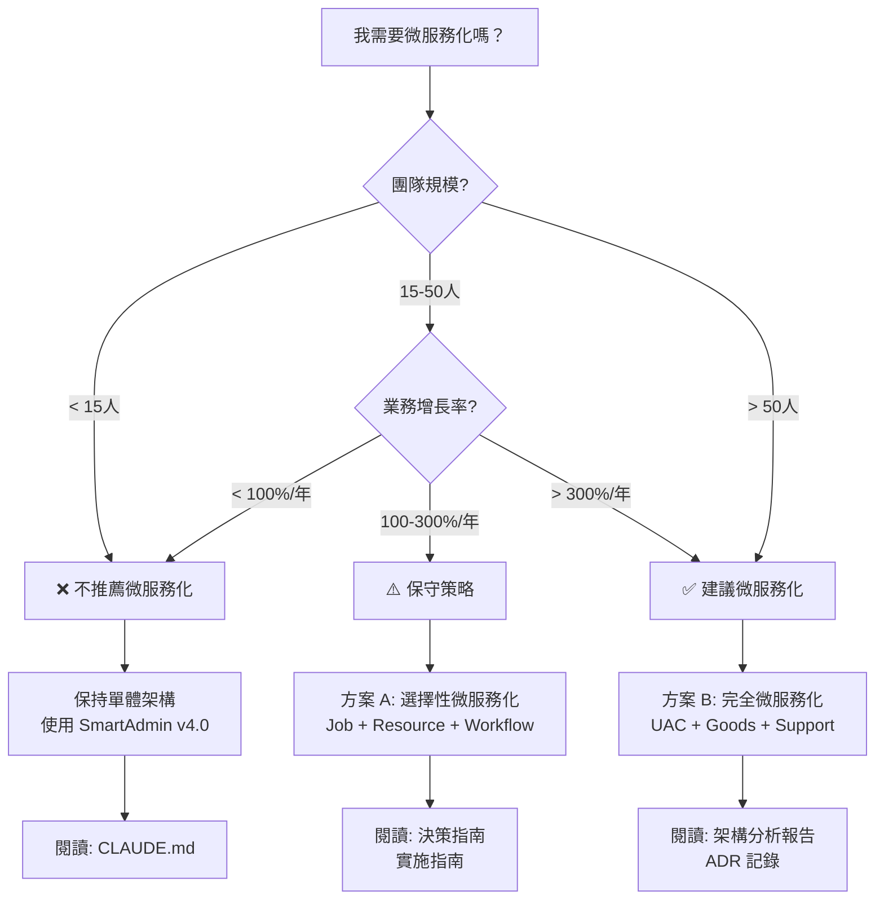

# SmartAdmin 微服務遷移文檔索引

本目錄包含 SmartAdmin 微服務遷移的完整決策支持、架構規劃、技術決策和實施指南文檔。

---

## ⏱️ 一分鐘自我評估

**快速判斷是否需要微服務化**，回答以下問題：

- [ ] 團隊規模 > 15 人
- [ ] 業務增長率 > 100%/年
- [ ] 需要獨立擴展某些模塊（如 Job Service、File Service）
- [ ] 有專職 DevOps 工程師或運維團隊
- [ ] 需要多語言異構系統集成
- [ ] 需要獨立發布週期（不同模塊獨立上線）

**評估結果**:
- ✅ **3+ 項**: 建議考慮微服務化 → 立即閱讀 [決策指南](./00-decision-guide.md)
- ⚠️ **1-2 項**: 保守策略，選擇性微服務化 → 閱讀 [架構分析報告](./ruoyi-cloud-plus-migration-analysis.md)
- ❌ **0 項**: 不推薦微服務化 → 繼續使用 SmartAdmin 單體架構

---

## 🌳 決策樹



---

## 📚 文檔導航

### 1. 目錄結構重組（推薦） ⭐

#### 🏗️ [SmartAdmin 目錄結構重組方案](./smartadmin-directory-restructure-plan.md)
**類型**: 架構重組方案
**狀態**: ✅ 需求確認完成
**創建日期**: 2026-02-02

**內容概要**:
- 保留所有 SmartAdmin 核心優勢（Manager + ArchUnit + Vavr + Java 21）
- 參考 RuoYi-Cloud-Plus 目錄組織（扁平化、命名統一）
- 創建 API 契約層（為未來微服務化準備）
- 細粒度模塊拆分（System/Business/OA 獨立）

**新目錄結構**:
```
smart-admin/
├── smartadmin-common/     # 公共基礎設施（20個模塊）
├── smartadmin-support/    # 業務支持模塊（17個模塊）
├── smartadmin-modules/    # 業務模塊（3個：System/Business/OA）
├── smartadmin-api/        # 🆕 API 契約層
├── smartadmin-starter/    # 🆕 啟動器模塊
└── smartadmin-app/        # 🆕 統一啟動入口
```

**核心優勢**:
- ✅ 100% 保留核心優勢
- ✅ 目錄更清晰（新人學習成本 ↓50%）
- ✅ 微服務就緒（未來拆分成本 ↓70%）
- ✅ 實施週期：6 weeks，成本：40人天

**目標讀者**: 架構師、開發團隊

---

### 2. 微服務遷移系列（參考）

#### 📊 [架構分析報告](./ruoyi-cloud-plus-migration-analysis.md)
**類型**: 技術分析報告
**狀態**: ✅ 完成
**創建日期**: 2026-02-02

**內容概要**:
- 執行摘要與核心結論
- SmartAdmin vs RuoYi-Cloud-Plus 架構深度對比
- 核心技術決策 (ADR-001, ADR-002)
- 成本效益分析
- 風險評估與緩解策略

**關鍵發現**:
- ⚠️ 直接遷移到 RuoYi-Cloud-Plus 會喪失 SmartAdmin 核心優勢
- ✅ 推薦方案 A: 保守策略 - 保留單體核心 + 選擇性微服務化
- 💰 成本對比: 方案 A ($16,000 + $2,000/年) vs 完全微服務化 ($84,000 + $112,000/年)

**目標讀者**: 架構師、技術主管、決策者

---

#### 🛠️ [實施指南](./ruoyi-migration-implementation-guide.md)
**類型**: 技術實施手冊
**狀態**: ✅ 完成
**創建日期**: 2026-02-02

**內容概要**:
- Phase 1: 基礎設施準備 (Week 1-2)
  - Nacos 2.5.3 部署
  - SmartAdmin 連接 Nacos
  - API Gateway 搭建
- Phase 2: Job Service 拆分 (Week 3-4)
  - 代碼遷移
  - 數據庫 Schema 遷移
  - Gateway 路由配置
- Phase 3: Resource Service 拆分 (Week 5-6)
- Phase 4: 測試與驗證 (Week 7-8)

**實施時間表**:
```
總週期: 8 weeks
├── M1: 基礎設施就緒 (Week 2)
├── M2: 首個微服務上線 (Week 4)
├── M3: 第二個微服務上線 (Week 6)
└── M4: 遷移完成 (Week 8)
```

**目標讀者**: 開發團隊、DevOps 工程師

---

#### 📋 [架構決策記錄 (ADR)](./architecture-decision-records.md)
**類型**: 架構決策記錄集合
**狀態**: ✅ 完成
**創建日期**: 2026-02-02

**ADR 索引**:
| ADR # | 標題 | 狀態 |
|-------|------|------|
| ADR-001 | Manager 層保留決策 | ✅ 已批准 |
| ADR-002 | ArchUnit 規則增強 | ✅ 已批准 |
| ADR-003 | Vavr Option 跨服務使用 | ✅ 已批准 |
| ADR-004 | 數據庫漸進式拆分 | ✅ 已批准 |
| ADR-005 | 構造器注入強制約束 | ✅ 已批准 |
| ADR-006 | 微服務拆分範圍界定 | ✅ 已批准 |

**目標讀者**: 架構師、技術主管

---

## 🎯 快速開始

### 如果你是...

#### 👔 決策者 / 技術主管
**你關心**: 成本、風險、ROI、團隊影響

**推薦閱讀順序** (總時間 ~30 分鐘):
1. [一分鐘自我評估](#⏱️-一分鐘自我評估) (1 min)
2. [決策指南](./00-decision-guide.md) (5 min) ⭐ **優先閱讀**
3. [執行摘要](./ruoyi-cloud-plus-migration-analysis.md#執行摘要) (10 min)
4. [成本效益分析](./ruoyi-cloud-plus-migration-analysis.md#成本效益分析) (15 min)

**關鍵問題快速導航**:
- ❓ 是否應該遷移到微服務架構？
  - ✅ **答案**: [決策指南](./00-decision-guide.md) - 視團隊規模和業務增長而定，90% 用戶應選擇方案 A
- ❓ 遷移成本是多少？
  - ✅ **答案**: [成本計算器](./cost-calculator.md) - 方案 A: $16,000 + $2,000/年，完全微服務化: $84,000 + $112,000/年
- ❓ 會喪失哪些優勢？
  - ✅ **答案**: [核心結論速查](#⚠️-關鍵發現) - Manager 層、ArchUnit、Vavr、Java 21 等核心優勢
- ❓ 風險有多大？
  - ✅ **答案**: [風險評估](./ruoyi-cloud-plus-migration-analysis.md#風險評估與緩解) - 技術風險、性能風險、運維風險評估

---

#### 🏗️ 架構師
**你關心**: 技術方案、架構決策、技術風險、實施細節

**推薦閱讀順序** (總時間 ~2 小時):
1. [架構深度對比](./ruoyi-cloud-plus-migration-analysis.md#架構深度對比) (20 min)
2. [全部 ADR](./architecture-decision-records.md) (30 min) ⭐ **核心文檔**
3. [技術方案](./spring-cloud-migration-plan.md) (60 min)
4. [關鍵文件路徑](./ruoyi-migration-implementation-guide.md#關鍵文件路徑) (10 min)

**關鍵問題快速導航**:
- ❓ Manager 層在微服務架構中如何工作？
  - ✅ **答案**: [ADR-001](./architecture-decision-records.md#adr-001-manager-層保留決策) - 每個微服務內部保留 Manager 層
- ❓ Sa-Token 如何整合到微服務？
  - ✅ **答案**: [技術方案 - Sa-Token](./spring-cloud-migration-plan.md#41-sa-token-微服務整合) - Gateway 統一認證 + Header 傳遞
- ❓ ArchUnit 規則如何適配微服務？
  - ✅ **答案**: [ADR-002](./architecture-decision-records.md#adr-002-archunit-規則增強) - 擴展規則驗證跨服務調用
- ❓ 數據庫如何拆分？
  - ✅ **答案**: [ADR-004](./architecture-decision-records.md#adr-004-數據庫漸進式拆分) - Phase 3 共享 → Phase 4 獨立
- ❓ 如何處理分散式事務？
  - ✅ **答案**: [技術方案 - 分散式事務](./spring-cloud-migration-plan.md#43-分散式事務處理) - Seata AT 模式

---

#### 👨‍💻 開發工程師
**你關心**: 如何實施、API 變更、代碼遷移、測試驗證

**推薦閱讀順序** (總時間 ~1 天):
1. [快速驗證指南](./01-quick-validation.md) (2 hours) ⭐ **動手實踐**
2. [Phase 1: 基礎設施準備](./ruoyi-migration-implementation-guide.md#phase-1-基礎設施準備-week-1-2) (1 day)
3. [故障排查手冊](./troubleshooting.md) (參考) 📖 **隨時查閱**
4. [實施檢查清單](./implementation-checklist.md) (使用) ✅ **追蹤進度**

**關鍵問題快速導航**:
- ❓ 如何快速驗證微服務方案可行性？
  - ✅ **答案**: [快速驗證指南](./01-quick-validation.md) - 2 天完成 MVP 驗證
- ❓ 如何部署 Nacos？
  - ✅ **答案**: [任務 1.1: 部署 Nacos 2.5.3](./ruoyi-migration-implementation-guide.md#任務-11-部署-nacos-253) - Docker Compose 一鍵啟動
- ❓ 如何創建首個微服務？
  - ✅ **答案**: [任務 3.1: 創建 Job Service 模塊](./ruoyi-migration-implementation-guide.md#任務-31-創建-job-service-模塊) - 代碼模板 + 配置示例
- ❓ Manager 層如何在微服務中使用？
  - ✅ **答案**: [ADR-001 - 微服務架構兼容性](./architecture-decision-records.md#4-微服務架構兼容性) - 保持原有設計模式
- ❓ 遇到問題怎麼辦？
  - ✅ **答案**: [故障排查手冊](./troubleshooting.md) - 30 分鐘內解決 80% 常見問題
- ❓ 如何追蹤實施進度？
  - ✅ **答案**: [實施檢查清單](./implementation-checklist.md) - Phase 1-4 完整 Checklist

---

#### 🔧 DevOps 工程師
**你關心**: 部署、監控、運維、故障排查、性能調優

**推薦閱讀順序** (總時間 ~1 天):
1. [基礎設施準備](./ruoyi-migration-implementation-guide.md#phase-1-基礎設施準備-week-1-2) (1 day) ⭐ **部署手冊**
2. [監控運維指南](./monitoring.md) (參考) 📊 **監控配置**
3. [故障排查手冊](./troubleshooting.md) (參考) 🔧 **問題診斷**

**關鍵問題快速導航**:
- ❓ 如何部署 Nacos 集群？
  - ✅ **答案**: [實施指南 - 任務 1.1](./ruoyi-migration-implementation-guide.md#任務-11-部署-nacos-253) - 3 節點高可用部署
- ❓ 如何配置 API Gateway？
  - ✅ **答案**: [實施指南 - 任務 1.2](./ruoyi-migration-implementation-guide.md#任務-12-部署-api-gateway) - Spring Cloud Gateway 配置
- ❓ 如何監控微服務？
  - ✅ **答案**: [監控運維指南](./monitoring.md) - Prometheus + Grafana + Zipkin
- ❓ 如何排查 Nacos 連接失敗？
  - ✅ **答案**: [故障排查 - Nacos](./troubleshooting.md#1-nacos-連接問題) - 診斷步驟 + 解決方案
- ❓ 如何排查 Gateway 路由問題？
  - ✅ **答案**: [故障排查 - Gateway](./troubleshooting.md#2-api-gateway-路由問題) - 日誌分析 + 配置檢查
- ❓ 如何設置告警規則？
  - ✅ **答案**: [監控運維指南 - 告警](./monitoring.md#告警規則) - P0/P1/P2 告警規則示例

---

## 📊 核心結論速查

### ⚠️ 關鍵發現

**直接遷移到 RuoYi-Cloud-Plus 風格會喪失 SmartAdmin 核心優勢**:

| 核心優勢 | SmartAdmin v4.0.0 | RuoYi-Cloud-Plus | 影響 |
|----------|-------------------|------------------|------|
| Manager 層 | ✅ | ❌ | 🔴 P0 Critical |
| ArchUnit | ✅ 545行規則 | ❌ | 🔴 P0 Critical |
| Vavr | ✅ 強制約束 | ❌ | 🔴 P1 High |
| Java 21 | ✅ Virtual Threads | ⚠️ 部分支持 | 🟡 P2 Medium |
| 質量工具 | ✅ 7種工具 | ⚠️ 部分支持 | 🟡 P2 Medium |

### ✅ 推薦方案

**方案 A: 保守策略 - 保留單體核心 + 選擇性微服務化** ⭐⭐⭐⭐⭐

**拆分範圍**:
- ✅ Job Service (定時任務) - 無依賴，獨立性高
- ✅ Resource Service (文件/郵件) - 基礎設施服務
- ✅ Workflow Service (LiteFlow) - 可選
- ❌ System Service (用戶/角色) - **不拆分**
- ❌ Business Service (商品/品牌) - **不拆分**

**核心優勢**:
- ✅ 保留所有核心優勢 (Manager + ArchUnit + Vavr + Java 21)
- ✅ 成本最低 ($16,000 + $2,000/年)
- ✅ 實施週期短 (8 weeks)
- ✅ 風險可控

**適用場景**: 90% 的 SmartAdmin 用戶
- 團隊 < 15人
- 業務增長 < 3倍/年
- 運維能力有限

---

## 🔍 快速鏈接表

**按場景快速定位文檔**

| 場景/問題 | 推薦文檔 | 優先級 |
|----------|---------|--------|
| 🆕 **決策是否遷移** | [決策指南](./00-decision-guide.md) | P0 |
| 💰 **評估遷移成本** | [成本計算器](./cost-calculator.md) | P0 |
| 🏗️ **了解技術方案** | [架構分析報告](./ruoyi-cloud-plus-migration-analysis.md) | P0 |
| 📋 **查看 ADR 決策** | [架構決策記錄](./architecture-decision-records.md) | P0 |
| ⚡ **快速驗證方案** | [快速驗證指南](./01-quick-validation.md) | P1 |
| 🛠️ **開始實施** | [實施指南](./ruoyi-migration-implementation-guide.md) | P1 |
| ✅ **追蹤進度** | [實施檢查清單](./implementation-checklist.md) | P1 |
| 🐛 **排查問題** | [故障排查手冊](./troubleshooting.md) | P1 |
| 📊 **配置監控** | [監控運維指南](./monitoring.md) | P1 |
| 🏢 **目錄重組** | [目錄結構重組方案](./smartadmin-directory-restructure-plan.md) | P2 |

### 常見技術問題快速查找

| 技術問題 | 文檔位置 |
|---------|---------|
| 如何部署 Nacos？ | [實施指南 - 任務 1.1](./ruoyi-migration-implementation-guide.md#任務-11-部署-nacos-253) |
| Sa-Token 如何整合？ | [技術方案 - Sa-Token](./spring-cloud-migration-plan.md#41-sa-token-微服務整合) |
| Manager 層如何保留？ | [ADR-001](./architecture-decision-records.md#adr-001-manager-層保留決策) |
| 如何處理分散式事務？ | [技術方案 - Seata](./spring-cloud-migration-plan.md#43-分散式事務處理) |
| JetCache 如何同步？ | [技術方案 - JetCache](./spring-cloud-migration-plan.md#42-jetcache-跨服務快取同步) |
| 數據庫如何拆分？ | [ADR-004](./architecture-decision-records.md#adr-004-數據庫漸進式拆分) |
| Nacos 連接失敗？ | [故障排查 - Nacos](./troubleshooting.md#1-nacos-連接問題) |
| Gateway 路由 404？ | [故障排查 - Gateway](./troubleshooting.md#2-api-gateway-路由問題) |
| Feign 調用超時？ | [故障排查 - Feign](./troubleshooting.md#3-feign-調用失敗) |
| 性能下降怎麼辦？ | [故障排查 - 性能](./troubleshooting.md#5-性能下降問題) |
| 如何配置 Prometheus？ | [監控運維指南 - Prometheus](./monitoring.md#prometheus-指標採集) |
| 如何設置告警？ | [監控運維指南 - 告警](./monitoring.md#告警規則) |

---

## 🔗 相關資源

### 內部文檔
- [CLAUDE.md](../../CLAUDE.md) - SmartAdmin AI 開發指南
- [架構規則](../../.agent/rules/foundation/10-architecture-rules.md) - 架構約束
- [Manager 層規則](../../.agent/rules/foundation/09-manager-layer.md) - Manager 層設計

### 外部參考
- [RuoYi-Cloud-Plus GitHub](https://github.com/dromara/RuoYi-Cloud-Plus)
- [Spring Cloud Alibaba 文檔](https://spring-cloud-alibaba-group.github.io/)
- [Dubbo 3.0 官方文檔](https://dubbo.apache.org/)
- [Nacos 官方文檔](https://nacos.io/)

---

## 📝 文檔維護

### 版本歷史

| 版本 | 日期 | 說明 | 作者 |
|------|------|------|------|
| 1.1.0 | 2026-02-03 | 增強導航體驗：增加一分鐘自我評估、決策樹、快速鏈接表、DevOps 閱讀路徑 | Claude Sonnet 4.5 |
| 1.0.0 | 2026-02-02 | 初始版本，完成架構分析與實施指南 | Claude Sonnet 4.5 |

### 更新計劃

- [ ] Phase 1 完成後更新實施進度
- [ ] Phase 2 完成後補充實際遇到的問題與解決方案
- [ ] Phase 3 完成後補充性能測試數據
- [ ] Phase 4 完成後編寫最終總結報告

### 反饋渠道

如有問題或建議，請通過以下方式反饋：
- GitHub Issues: [smart-admin/issues](https://github.com/1024-lab/smart-admin/issues)
- Email: [架構組郵箱]

---

**文檔維護**: 架構組
**最後更新**: 2026-02-02
