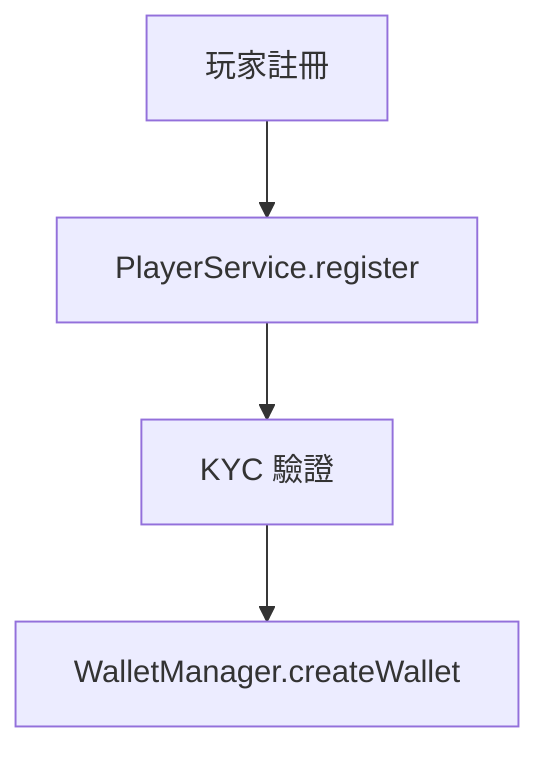

# iGaming 翻譯最佳實踐

> **日期**: 2026-02-12
> **來源**: 184 檔案翻譯經驗、17 個守護規則、135 次迭代教訓

---

## 5 條核心翻譯規則

### Rule 1: 技術術語永不翻譯

| 類別 | 保留英文 | ❌ 錯誤翻譯 |
|------|---------|------------|
| SmartAdmin 架構 | Controller, Service, Manager, Dao | 控制器類, 服務類, 管理類 |
| Spring 注解 | @Transactional, @RequiredArgsConstructor | 事務注解, 構造器注入 |
| 基礎設施 | API, PostgreSQL, Redis, Kafka | 應用程式介面, 緩存數據庫 |
| Vavr 類型 | Option, Try, Either | 可選類型, 異常處理 |
| 代碼元素 | PlayerService, t_player, player_id | 玩家服務, 玩家表 |

### Rule 2: 業務術語中文 + 首次標註英文

```markdown
✅ 首次: 有效投注額 (Valid Turnover) 是衡量玩家真實投注活動的關鍵指標
✅ 後續: 有效投注額超過閾值時觸發風控審查
❌ 錯誤: Valid Turnover 是衡量玩家真實投注活動的關鍵指標
```

### Rule 3: 代碼片段完全保留英文

```java
// ✅ 正確: 代碼完全保留英文
@Component
@RequiredArgsConstructor
public class WalletManager {
    @Transactional(rollbackFor = Throwable.class)
    public void processDeposit(DepositForm form) { ... }
}
```

### Rule 4: Mermaid 標籤中文，類名/方法名英文



### Rule 5: SQL 表名英文，COMMENT 中文

```sql
CREATE TABLE t_player (
    player_id BIGINT PRIMARY KEY,
    kyc_status VARCHAR(20)
);
COMMENT ON COLUMN t_player.kyc_status IS '身份驗證狀態';
```

---

## 常見陷阱與對策

### P1: source-archive 是 READ-ONLY
- **永不修改** `docs/iGaming/source-archive/` 下的檔案
- 這些是 Single Source of Truth (SSOT)
- 驗證腳本必須跳過此目錄

### P2: Mermaid 換行規則
- 所有圖表類型使用 `<br/>` 換行
- **例外**: `stateDiagram-v2` 不支持 `<br/>`，使用多行 note block

### P9: 檔案路徑驗證
- 添加交叉引用前**必須**驗證目標檔案存在
- 使用 `test -f <path>` 而非假設

### P14: "流水" 是合法複合術語
- "流水" 在以下複合詞中合法: 流水要求、流水進度、流水計算、流水對帳、流水操縱
- "流水" 獨立使用時應改為 "有效投注額"（如果指 Valid Turnover）
- "流水" 作為 Turnover（總投注額）的簡稱也可接受

### P18: 驗證腳本排除 source-archive
- 任何掃描 `docs/iGaming/` 的腳本必須排除 `source-archive/`
- 否則 191 個英文 READ-ONLY 檔案會污染統計

---

## 驗證工具鏈

### 4 個核心腳本

```bash
# 1. 術語一致性 (v2.0)
bash scripts/check-terminology-consistency-zh-tw.sh docs/iGaming/
# 檢查: 有效投注額/流水, 可下注餘額/可用餘額, 存款/充值, 提款/取款
# 智能排除: source-archive/, 複合術語, TEMPLATE 檔案

# 2. 技術術語保留
bash scripts/check-technical-terms.sh docs/iGaming/requirements/ docs/iGaming/architecture/
# 檢查: 88 個誤翻模式 (Controller→控制器類, API→應用程式介面 等)

# 3. 編碼驗證
bash scripts/validate-zh-tw-encoding.sh docs/iGaming/requirements/ docs/iGaming/architecture/
# 檢查: UTF-8 編碼, ~100 個簡體中文詞組偵測

# 4. Mermaid 語法
bash scripts/validate-mermaid.sh docs/iGaming/
# 檢查: <br/> 使用, stateDiagram-v2 例外
```

### 驗證時機

| 時機 | 建議腳本 |
|------|---------|
| 新增/修改 iGaming 文檔 | 全部 4 個 |
| 僅修改 Mermaid 圖表 | validate-mermaid.sh |
| 週期性回歸檢查 | 全部 4 個 |
| PR 合併前 | 全部 4 個 (建議整合至 CI) |

---

## 翻譯模板

新增 iGaming 文檔時，使用以下模板：

| 文檔類型 | 模板 |
|---------|------|
| Requirements | `docs/iGaming/TEMPLATE_REQUIREMENTS.md` |
| Architecture | `docs/iGaming/TEMPLATE_ARCHITECTURE.md` |
| ADR | `docs/iGaming/TEMPLATE_ADR.md` |

---

## 術語參考

完整的 500+ 術語映射表：[TRANSLATION_GLOSSARY.md](../../iGaming/TRANSLATION_GLOSSARY.md)

### 高頻易混淆術語

| 正確用法 | ❌ 常見錯誤 | 英文 |
|---------|-----------|------|
| 有效投注額 | 有效投注金額 | Valid Turnover |
| 可下注餘額 | 可用餘額 | Playable Balance |
| 存款 | 充值 | Deposit |
| 提款 | 取款 | Withdrawal |
| 自我排除 | 自我隔離 | Self-Exclusion |
| 身份驗證 | 實名認證 | KYC |
| 反洗錢 | 防洗錢 | AML |
