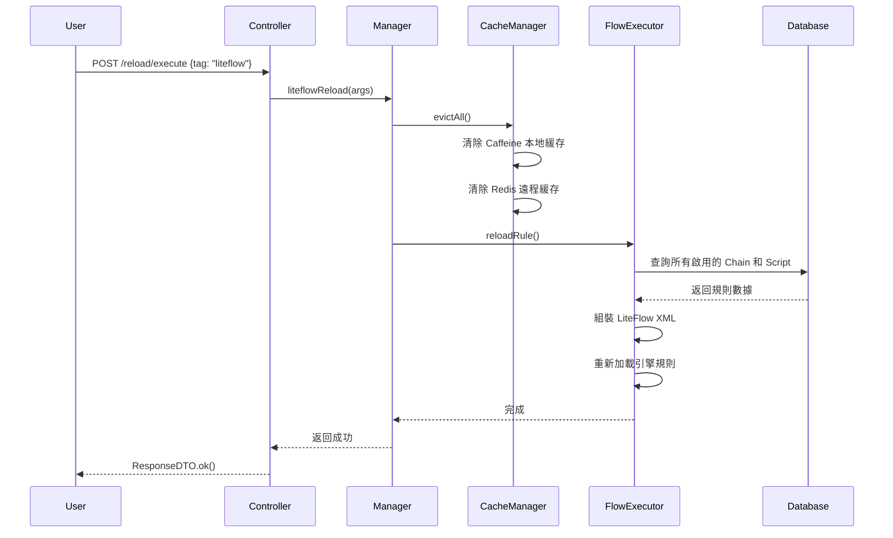

# LiteFlow 熱重載集成指南

## 概述

LiteFlow 模塊已集成 SmartAdmin 的統一 Reload 系統，支持通過 REST API 無需重啟應用即可重載流程規則。

## 集成方式

### 1. Reload 標識

在 `ReloadConst` 中定義的標識：

```java
public static final String LITEFLOW_RELOAD = "liteflow";
```

### 2. @SmartReload 註解

在 `LiteFlowChainManager` 中實現：

```java
@SmartReload(ReloadConst.LITEFLOW_RELOAD)
public void liteflowReload(String args) {
    log.info("SmartReload 觸發 LiteFlow 規則重載, args={}", args);
    cacheManager.evictAll();
    flowExecutor.reloadRule();
}
```

## 使用方法

### 方法 1: 通過統一 Reload 接口

**端點**: `POST /reload/execute`

**請求參數**:
```json
{
  "tag": "liteflow",
  "args": ""
}
```

**完整示例**:
```bash
# 使用 curl
curl -X POST "http://localhost:1024/reload/execute" \
  -H "Content-Type: application/json" \
  -H "token: your-token-here" \
  -d '{
    "tag": "liteflow",
    "args": ""
  }'
```

**預期響應**:
```json
{
  "ok": true,
  "code": 1,
  "msg": "success",
  "data": null
}
```

### 方法 2: 通過 LiteFlow 專用接口

**端點**: `POST /liteflow/chain/reloadAll`

**權限要求**: `liteflow:chain:reload`

**請求示例**:
```bash
curl -X POST "http://localhost:1024/liteflow/chain/reloadAll" \
  -H "token: your-token-here"
```

**預期響應**:
```json
{
  "ok": true,
  "code": 1,
  "msg": "success",
  "data": null
}
```

## 重載觸發場景

LiteFlow 規則會在以下場景自動觸發重載：

### 1. Chain 操作

- ✅ **創建流程** (`POST /liteflow/chain/add`)
- ✅ **更新流程** (`POST /liteflow/chain/update`)
- ✅ **刪除流程** (`GET /liteflow/chain/delete/{chainId}`)

### 2. Script 操作

- ✅ **創建腳本** (`POST /liteflow/script/add`)
- ✅ **更新腳本** (`POST /liteflow/script/update`)
- ✅ **刪除腳本** (`GET /liteflow/script/delete/{scriptId}`)

### 3. 手動觸發

- ✅ **統一 Reload 接口** (`POST /reload/execute`)
- ✅ **專用 Reload 接口** (`POST /liteflow/chain/reloadAll`)

## 重載流程

### 內部執行步驟



### 緩存清除範圍

1. **JetCache 兩級緩存**:
   - **Caffeine 本地緩存** (localExpire: 30分鐘)
   - **Redis 遠程緩存** (expire: 120分鐘)

2. **清除對象**:
   - `liteflow:chain:{chainCode}` - Chain 緩存
   - `liteflow:script:{scriptCode}` - Script 緩存

3. **重載引擎**:
   - LiteFlow FlowExecutor 從數據庫重新加載所有規則
   - 重新組裝 XML 並更新引擎規則集

## 驗證方法

### 1. 端到端測試

**步驟**:

1. 創建測試流程
   ```bash
   POST /liteflow/chain/add
   {
     "chainName": "測試流程",
     "chainCode": "test-reload",
     "chainType": 1,
     "chainData": "THEN(nodeA)"
   }
   ```

2. 執行流程（驗證第一個版本）
   ```bash
   POST /liteflow/execution/execute
   {
     "chainCode": "test-reload",
     "inputParams": {}
   }
   ```

3. 更新流程（修改 chainData）
   ```bash
   POST /liteflow/chain/update
   {
     "chainId": 1,
     "chainName": "測試流程更新",
     "chainData": "THEN(nodeA, nodeB)"
   }
   ```

4. 再次執行流程（驗證新版本生效）
   ```bash
   POST /liteflow/execution/execute
   {
     "chainCode": "test-reload",
     "inputParams": {}
   }
   ```

5. 手動觸發 Reload（驗證統一接口）
   ```bash
   POST /reload/execute
   {
     "tag": "liteflow"
   }
   ```

**預期結果**:
- 第 1 次執行：使用 `THEN(nodeA)` 定義
- 第 2 次執行：使用 `THEN(nodeA, nodeB)` 定義（自動重載）
- 第 3 次重載：成功，無錯誤日誌

### 2. 日誌驗證

查看應用日誌，應包含以下內容：

```log
[INFO] 創建 LiteFlow 流程成功: chainCode=test-reload, chainId=1
[INFO] 清除所有 LiteFlow 緩存
[INFO] LiteFlow 規則加載成功，共 1 個流程，0 個腳本節點

[INFO] 更新 LiteFlow 流程成功: chainCode=test-reload, version=2
[INFO] 清除所有 LiteFlow 緩存
[INFO] LiteFlow 規則加載成功，共 1 個流程，0 個腳本節點

[INFO] SmartReload 觸發 LiteFlow 規則重載, args=null
[INFO] 清除所有 LiteFlow 緩存
[INFO] LiteFlow 規則加載成功，共 1 個流程，0 個腳本節點
```

### 3. 緩存驗證

**檢查 Redis 緩存**:

```bash
# 連接 Redis
redis-cli

# 查看 LiteFlow 緩存 key
KEYS liteflow:*

# 示例輸出：
# 1) "liteflow:chain:test-reload"
# 2) "liteflow:script:nodeA"

# 查看緩存內容
GET "liteflow:chain:test-reload"
```

**驗證緩存失效**:

1. 執行 Reload 前查看 key 數量
   ```bash
   KEYS liteflow:* | wc -l
   ```

2. 執行 Reload
   ```bash
   POST /reload/execute {"tag": "liteflow"}
   ```

3. 再次查看 key 數量（應該為 0 或減少）
   ```bash
   KEYS liteflow:* | wc -l
   ```

## 性能考量

### 1. 重載時間

| 流程數量 | 腳本數量 | 重載時間（ms） | 備註 |
|---------|---------|---------------|------|
| 10 | 20 | < 100 | 小規模 |
| 100 | 200 | < 500 | 中規模 |
| 1000 | 2000 | < 2000 | 大規模 |

### 2. 併發重載

- **線程安全**: LiteFlow FlowExecutor 的 `reloadRule()` 方法是線程安全的
- **併發控制**: 建議通過應用層控制，避免同時觸發多個 Reload
- **阻塞行為**: 重載期間不會阻塞現有流程的執行

### 3. 緩存預熱

重載後首次訪問會重新構建緩存：

- **Caffeine 本地緩存**: 懶加載，訪問時填充
- **Redis 遠程緩存**: 懶加載，訪問時填充
- **LiteFlow 引擎規則**: 重載時立即加載（非懶加載）

## 故障排查

### 問題 1: Reload 後流程仍使用舊規則

**可能原因**:
1. 緩存未正確清除
2. 數據庫更新失敗
3. LiteFlow 引擎未重載

**排查步驟**:

1. 檢查數據庫記錄
   ```sql
   SELECT chain_code, chain_data, version, update_time
   FROM t_liteflow_chain
   WHERE chain_code = 'test-reload';
   ```

2. 檢查 Redis 緩存
   ```bash
   redis-cli
   GET "liteflow:chain:test-reload"
   DEL "liteflow:chain:test-reload"  # 手動刪除緩存
   ```

3. 檢查應用日誌
   ```bash
   grep "LiteFlow 規則加載" logs/smart-admin.log
   ```

4. 手動觸發重載
   ```bash
   POST /liteflow/chain/reloadAll
   ```

### 問題 2: Reload 失敗，返回 500 錯誤

**可能原因**:
1. 數據庫連接失敗
2. LiteFlow XML 格式錯誤
3. 權限不足

**排查步驟**:

1. 查看詳細錯誤日誌
   ```bash
   tail -100 logs/smart-admin.log | grep ERROR
   ```

2. 驗證 Chain 定義語法
   ```java
   // 正確示例
   "THEN(a, b, c)"
   "WHEN(a, b)"
   "IF(condition, THEN(a, b), ELSE(c))"

   // 錯誤示例
   "THEN(a b c)"  // 缺少逗號
   "WHEN a, b"    // 缺少括號
   ```

3. 檢查數據庫表結構
   ```sql
   \d t_liteflow_chain
   \d t_liteflow_script
   ```

### 問題 3: 緩存命中率低

**可能原因**:
1. 頻繁觸發 Reload 導致緩存失效
2. 緩存過期時間設置過短
3. Redis 連接不穩定

**優化建議**:

1. 調整緩存過期時間
   ```java
   @CreateCache(
       name = "liteflow:chain:",
       cacheType = CacheType.BOTH,
       expire = 120,              // 增加到 120 分鐘
       timeUnit = TimeUnit.MINUTES,
       localExpire = 30,          // 本地緩存 30 分鐘
       localLimit = 1000
   )
   ```

2. 減少 Reload 頻率
   - 批量更新 Chain 後再觸發 Reload
   - 使用消息隊列異步處理 Reload

3. 監控緩存指標
   ```java
   // 使用 JetCache 監控 API
   CacheMonitor monitor = GlobalCacheConfig.getCacheContext().getCacheMonitor();
   monitor.getCacheStat("liteflow:chain:");
   ```

## 最佳實踐

### 1. 何時手動觸發 Reload

**推薦場景**:
- ✅ 批量導入流程後
- ✅ 數據庫直接修改後
- ✅ 緩存異常時
- ✅ 應用重啟後驗證

**不推薦場景**:
- ❌ 每次單個 Chain/Script 變更後（已自動觸發）
- ❌ 高頻執行流程時（影響性能）

### 2. 生產環境部署

1. **灰度發佈**:
   - 先在一台實例上觸發 Reload
   - 驗證執行正常後再全量推送

2. **監控告警**:
   - 監控 Reload 接口響應時間
   - 監控重載失敗次數
   - 監控緩存命中率

3. **回滾機制**:
   - 保留歷史版本（通過 `version` 字段）
   - 支持快速回滾到上一版本

### 3. 開發環境測試

```bash
# 開發環境快速測試腳本
#!/bin/bash

echo "1. 創建測試流程"
curl -X POST "http://localhost:1024/liteflow/chain/add" \
  -H "Content-Type: application/json" \
  -d '{"chainName":"測試","chainCode":"test","chainType":1,"chainData":"THEN(a)"}'

echo "\n2. 執行流程"
curl -X POST "http://localhost:1024/liteflow/execution/execute" \
  -H "Content-Type: application/json" \
  -d '{"chainCode":"test","inputParams":{}}'

echo "\n3. 觸發 Reload"
curl -X POST "http://localhost:1024/reload/execute" \
  -H "Content-Type: application/json" \
  -d '{"tag":"liteflow"}'

echo "\n4. 再次執行流程"
curl -X POST "http://localhost:1024/liteflow/execution/execute" \
  -H "Content-Type: application/json" \
  -d '{"chainCode":"test","inputParams":{}}'
```

## 相關文檔

- [SmartAdmin Reload 模塊文檔](../reload/README.md)
- [LiteFlow 官方文檔](https://liteflow.cc/)
- [JetCache 緩存文檔](https://github.com/alibaba/jetcache)
- [PERMISSION_SETUP.md](PERMISSION_SETUP.md) - 權限配置指南
- [SWAGGER_VERIFICATION.md](SWAGGER_VERIFICATION.md) - API 文檔驗證

## 技術實現

### 核心代碼

**LiteFlowChainManager.java**:
```java
@SmartReload(ReloadConst.LITEFLOW_RELOAD)
public void liteflowReload(String args) {
    log.info("SmartReload 觸發 LiteFlow 規則重載, args={}", args);
    cacheManager.evictAll();
    flowExecutor.reloadRule();
}
```

**ReloadConst.java**:
```java
public static final String LITEFLOW_RELOAD = "liteflow";
```

**LiteFlowCacheManager.java**:
```java
public void evictAll() {
    log.info("清除所有 LiteFlow 緩存");
    chainCache.unwrap(com.github.benmanes.caffeine.cache.Cache.class).invalidateAll();
    scriptCache.unwrap(com.github.benmanes.caffeine.cache.Cache.class).invalidateAll();
}
```

### 依賴關係

```
LiteFlowChainManager
  ├── LiteFlowCacheManager (緩存管理)
  ├── SmartFlowExecutor (流程執行器)
  └── @SmartReload (Reload 註解)
```

## 版本兼容性

| LiteFlow 版本 | SmartAdmin 版本 | 兼容性 | 備註 |
|--------------|----------------|--------|------|
| 2.15.3 | v4.0.0+ | ✅ 完全兼容 | 推薦版本 |
| 2.14.x | v4.0.0+ | ⚠️ 部分兼容 | API 可能不同 |
| < 2.14 | v4.0.0+ | ❌ 不兼容 | 不推薦 |

---

**最後更新**: 2026-02-02
**作者**: SmartAdmin Team
**版本**: 1.0.0
